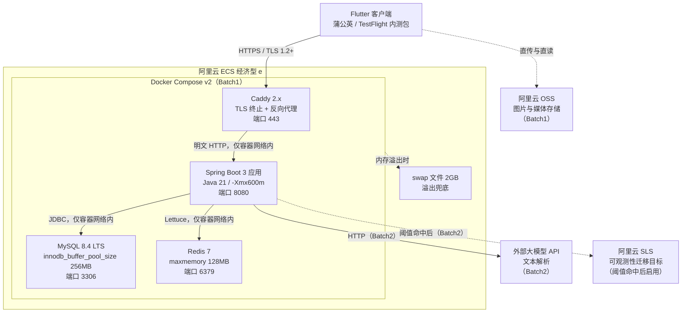

# 部署架构设计文档

> **版本**: v1.0 | **日期**: 2026-09-07 | **状态**: 定稿
>
> **依据源**：
> - 《系统总体架构设计文档》§4 部署形态（R6/R7/R8）
> - 《可观测性架构方案》§7 量级测算（40G 盘分配表、binlog 过期、日志轮转）
> - 《技术栈选型说明》§2（选型表）、§9（ECS 规格）、§10（编排选型）
> - 《系统安全设计方案》§2（传输安全）、§10（运行时与部署面安全）
> - 《DevSecOps 接入方案》§8（部署门禁）、§9（落地清单第 6 项）
> - `docs/plans/2026-09-03-1051-feat-server-architecture-baseline-plan.md`（R6/R7/R8）

---

## 目录

1. [部署拓扑概览](#1-部署拓扑概览)
2. [容器职责与编排](#2-容器职责与编排)
3. [内存预算落地](#3-内存预算落地)
4. [磁盘容量分配](#4-磁盘容量分配)
5. [网络暴露面与安全组](#5-网络暴露面与安全组)
6. [TLS 终止与证书](#6-tls-终止与证书)
7. [密钥注入链路](#7-密钥注入链路)
8. [备份与恢复](#8-备份与恢复)
9. [发版与回滚流程](#9-发版与回滚流程)
10. [部署面安全门禁与验收清单](#10-部署面安全门禁与验收清单)
11. [批次标注总表](#11-批次标注总表)
12. [决策依据索引](#12-决策依据索引)
13. [附录：冲突裁定与回写记录](#13-附录冲突裁定与回写记录)
14. [多环境与容器化环境搭建](#14-多环境与容器化环境搭建)

---

## 1. 部署拓扑概览

### 1.1 物理拓扑



### 1.2 部署约束一览

| 约束维度 | 规格 | 依据 |
|---|---|---|
| 计算 | 2 核（共享型，无性能 SLA），记录 CPU steal | R6、《技术栈选型说明》§9 |
| 内存 | 2GB，见 §3 内存预算 | R8 |
| 磁盘 | 40G ESSD，见 §4 分配表 | R6 |
| 带宽 | 3M，图片不走服务端仅走 OSS 直传 | R6 |
| 编排 | Docker Compose v2，否掉 Kubernetes | R7、《技术栈选型说明》§10 |
| 构建 | 宿主机 Maven 直接 `mvn -DskipTests package` | 《技术栈选型说明》§3.1 |
| 成本 | 约 8.25 元/月（ECS 99 元/年 + 域名 + OSS 按量） | BRD |

---

## 2. 容器职责与编排

### 2.1 四容器职责

| 容器 | 基础镜像 | 职责 | Batch |
|---|---|---|---|
| **Caddy** | `caddy:2-alpine` | TLS 终止（ACME 自动证书）、反向代理到 Spring Boot、301 跳转（HTTP→HTTPS）、access log 过滤 `Authorization` 头 | Batch1 |
| **Spring Boot** | 自构建（§2.2 `Dockerfile`） | REST API 服务、定时任务、埋点写入、审计日志 | Batch1 |
| **MySQL** | `mysql:8.4` | 业务数据、埋点事件、审计日志三大类持久化 | Batch1 |
| **Redis** | `redis:7-alpine` | 会话管理、限流计数、缓存聚合结果 | Batch1 |

### 2.2 Dockerfile 构建策略

> **前置条件（当前未满足）**：本节的构建流程依赖项目根目录存在 `pom.xml` 与 `src/` 目录，以及 `deploy/models/` 目录（GBDT 模型文件挂载点）。截至本文档定稿，服务端 Java 工程尚未创建（`说明文档.md:3922` 已登记该缺口，《DevSecOps 接入方案》§1 现状表同样记录为「零代码，无 pom.xml」）。
>
> 因此 `docker compose build app` 在编码阶段开工前必然失败，报错为 `COPY pom.xml` 找不到文件。这不是 IaC 的缺陷，而是交付顺序：本批次交付的是**环境定义**，Java 工程是编码阶段的交付物。`deploy/models/` 目录需在首次部署前手工创建（可为空目录）。

多阶段构建，分编译阶段与运行阶段，确保运行镜像最小化：

```
阶段一（builder）：maven:3-eclipse-temurin-21 → mvn -DskipTests package → 产出 JAR
阶段二（runtime）：eclipse-temurin:21-jre-alpine → COPY --from=builder JAR → java -Xmx600m -jar
```

**纪律**：
- 运行镜像**不**包含 Maven 等构建工具
- **不** `COPY .env`（见 §7 密钥纪律）
- 基础镜像使用明确 tag（如 `eclipse-temurin:21-jre-alpine`），不用 `latest`

**关于 curl 的例外**：`eclipse-temurin:21-jre-alpine` 基础镜像自带 `/usr/bin/curl`（不含 `wget`，已实测确认）。§2.3 的健康检查依赖它，因此不得为「精简镜像」而移除 —— 移除后 healthcheck 永久失败，`depends_on: condition: service_healthy` 会让 Caddy 一直等不到 app 就绪，表现为部署卡死。

### 2.3 健康检查策略

| 容器 | 检查方式 | 间隔 | 超时 | 重试 |
|---|---|---|---|---|
| Caddy | 无独立健康检查，依赖应用连通性 | — | — | — |
| Spring Boot | `curl -f http://localhost:8080/actuator/health` | 30s | 10s | 3 |
| MySQL | `mysqladmin ping -h localhost` | 30s | 10s | 3 |
| Redis | `redis-cli ping` | 30s | 10s | 3 |

MySQL 与 Redis 的 `depends_on` 使用 `condition: service_healthy`，确保 Spring Boot 在依赖可用后才启动。

### 2.4 重启策略

所有容器统一为 `restart: unless-stopped`，确保宿主机重启后自动恢复。

---

## 3. 内存预算落地

### 3.1 预算分配表

五项合计约 2000MB，已贴住 2GB 上限：

| 进程 | 预算 | 关键参数 | 落地文件 | Batch |
|---|---|---|---|---|
| MySQL | 450MB | `innodb_buffer_pool_size = 256M` | `deploy/config/my.cnf` | Batch1 |
| Redis | 150MB | `maxmemory 128mb` | `deploy/config/redis.conf` | Batch1 |
| JVM | 750MB | `-Xmx600m`（含 JVM 自身开销约 150MB） | `deploy/Dockerfile` | Batch1 |
| Caddy | 64MB | 静态二进制，无运行时依赖 | `deploy/docker-compose.yml`（`mem_limit: 64m`） | Batch1 |
| 操作系统与其他 | 约 634MB | 含内核、sshd、systemd、Docker 守护进程 | — | Batch1 |
| **合计** | **2048MB** | 四个容器 `mem_limit` 之和 = 1414MB | — | — |

**Caddy 取 64MB 而非 50MB 的理由**：`mem_limit` 是硬上限，进程一旦触顶会被 OOM Killer 杀掉而非降速。Caddy 常驻约 30–40MB，但 ACME 证书申请与续期期间会有短时峰值，50MB 余量过窄。64MB 是从 OS 预算里划出的，不挤占其他三个容器。

> 表中数字与 `docker-compose.yml` 的 `mem_limit` 必须逐项一致。改一处必须同步改另一处 —— 两处不一致时以本表为准，且视为门禁失败。

### 3.2 预算纪律

- 任何一项调大都必须同时调小另一项，总额不得突破 2GB
- `-Xmx600m` 是上限，不可按「Java 应用一般给 1G」的习惯设置
- swap 2GB 是硬要求（见 §4.2），作为内存溢出兜底

### 3.3 Compose 资源限制

`mem_limit` 由各环境 override 定义，**不写在 base** `docker-compose.yml` 中（base 是环境无关骨架，见 §14.2）。以下为 staging / prod 的值，两者完全一致：

```yaml
# deploy/compose/docker-compose.{staging,prod}.yml
services:
  mysql:
    mem_limit: 450m
  redis:
    mem_limit: 150m
  app:
    mem_limit: 750m
  caddy:
    mem_limit: 64m
# 合计 1414m，改任一值必须同步更新 §3.1 内存预算表
```

dev 环境的 `mem_limit` 显著放宽（合计 3164m），因为开发机不存在 2G 约束；差异明细见 §14.3。

---

## 4. 磁盘容量分配

### 4.1 40G ESSD 分配表

依据《可观测性架构方案》§7 的七项分配表，**以后者为唯一口径源**（见 §13 冲突裁定）：

| 用途 | 分配 | 说明 | 配置落地 |
|---|---|---|---|
| 操作系统与基础软件 | 6GB | 含 apt 缓存与内核 | — |
| Docker 镜像层 | 6GB | JDK 基础镜像+应用镜像，多版本并存留回滚余量 | — |
| swap 文件 | 2GB | 2G 内存贴满预算，swap 是硬要求 | `deploy/scripts/setup-swap.sh` |
| MySQL 业务数据与索引 | 6GB | 13 张业务表，内测量级远用不到，留给增长 | — |
| MySQL binlog | 3GB | **必须设 `binlog_expire_logs_seconds = 259200`**（MySQL 8.4 已移除 `expire_logs_days`，见 §4.2），否则无声吃满盘 | `deploy/config/my.cnf` |
| Redis AOF 文件 | 1GB | 128MB 内存对应的 AOF 加重写余量 | `deploy/config/redis.conf` |
| 应用日志落盘 | 3GB | JSON 单行，**必须配日志轮转与保留上限** | `deploy/config/logback-spring.xml` |
| 埋点数据可用余量 | 8GB | 这是 §9.1 T1 阈值取 8GB 的来源 | — |
| 未分配缓冲 | 5GB | 不可占用，留给临时文件与 `mysqldump` 备份中间产物 | — |
| **合计** | **40GB** | — | — |

### 4.2 两条硬性配置

**配置①：binlog 过期时间**

```ini
# my.cnf — 必须设置
# MySQL 8.4 已【移除】expire_logs_days，写它会导致
# unknown variable + mysqld abort（已实测确认，容器起不来）
binlog_expire_logs_seconds = 259200   # 3 天
```

同时不再显式配置 `binlog_format`：该参数在 8.4 中已 deprecated（实测产生 `[MY-011070]` warning），而其默认值本就是 `ROW`，写它只增加启动告警噪声。

**配置②：应用日志轮转**

```xml
<!-- logback-spring.xml — 必须设置 -->
<appender name="FILE" class="ch.qos.logback.core.rolling.RollingFileAppender">
  <rollingPolicy class="ch.qos.logback.core.rolling.SizeAndTimeBasedRollingPolicy">
    <maxFileSize>50MB</maxFileSize>
    <maxHistory>14</maxHistory>
    <totalSizeCap>3GB</totalSizeCap>
  </rollingPolicy>
</appender>
```

> **依赖前置**：`deploy/config/logback-spring.xml` 使用 `net.logstash.logback.encoder.LogstashEncoder` 输出 JSON 单行日志（《可观测性架构方案》§3 的格式要求）。该 encoder 不在 Spring Boot 默认依赖内，`pom.xml` 中必须显式引入：
>
> ```xml
> <dependency>
>   <groupId>net.logstash.logback</groupId>
>   <artifactId>logstash-logback-encoder</artifactId>
>   <version>8.0</version>
> </dependency>
> ```
>
> 缺失该依赖时应用启动即报 `ClassNotFoundException`。此项属编码阶段的前置条件，与 §2.2 的 `pom.xml` 缺口同源。

**风险说明**：这两项任一漏配，都会绕过分配表把盘吃满，而磁盘满的表现是 MySQL 直接拒写——全站不可用，不是性能下降。

### 4.3 swap 配置

```bash
# 创建 2GB swap 文件
fallocate -l 2G /swapfile
chmod 600 /swapfile
mkswap /swapfile
swapon /swapfile
echo '/swapfile none swap sw 0 0' >> /etc/fstab
# 设置 swappiness 降低主动换出
sysctl vm.swappiness=10
echo 'vm.swappiness=10' >> /etc/sysctl.conf
```

---

## 5. 网络暴露面与安全组

### 5.1 暴露面表

| 端口 | 暴露范围 | 监听者 | 说明 |
|---|---|---|---|
| 443 | 公网 | Caddy（唯一入口） | HTTPS，TLS 1.2+ |
| 80 | 公网（仅用于 301 跳转） | Caddy | HTTP→HTTPS 跳转，不承载业务 |
| 22 | 安全组白名单 IP | 宿主机 sshd | 运维入口，仅密钥登录，禁密码 |
| 8080 | 仅容器网络 | Spring Boot 应用 | **不写 `ports:` 映射** |
| 3306 | 仅容器网络 | MySQL | **不写 `ports:` 映射**，必须设强口令 |
| 6379 | 仅容器网络 | Redis | **不写 `ports:` 映射**，必须设 `requirepass` |

### 5.2 安全组规则

| 方向 | 协议 | 端口 | 授权对象 | 说明 |
|---|---|---|---|---|
| 入 | TCP | 443 | 0.0.0.0/0 | HTTPS 公网访问 |
| 入 | TCP | 80 | 0.0.0.0/0 | HTTP 301 跳转 |
| 入 | TCP | 22 | 管理员公网 IP（白名单） | SSH 运维 |

**安全组是第二道防线**，不能替代 docker-compose.yml 中不映射 `ports:` 的约束。

### 5.3 镜像内不暴露调试端口

- 生产镜像**不**开放 JPDA 调试端口（如 5005）
- 生产镜像**不**包含 Spring Boot DevTools
- 违反此规则即绕过安全组，使调试端口暴露在公网

---

## 6. TLS 终止与证书

### 6.1 证书方案

| 项 | 落法 |
|---|---|
| 终止点 | Compose 内的 Caddy 容器，唯一对公网开放 443 的进程 |
| 证书来源 | prod 走 Caddy 内置 ACME 自动申请与续期（零人工、零费用）；dev / staging 走 `tls internal` 自签 |
| 内存代价 | 64MB `mem_limit`（见 §3.1），已在 §3.1 中通过下调 `-Xmx` 让位 |
| 协议下限 | TLS 1.2，禁用更低版本 |
| 跳转 | HTTP 80 → HTTPS 443 301 跳转（dev 不启用） |
| 不用 Nginx 的理由 | Nginx 需要额外的 certbot 进程与定时续期任务；Caddy 单进程自带 ACME，在 2G 机器上少一个组件 |

dev / staging 用自签而非 ACME 的原因：ACME 无法为 `localhost` 或内网域名签发证书，强行启动会反复失败并可能触发 Let's Encrypt 的速率限流（失败次数一周内有上限）。三份 Caddyfile 的完整差异见 §14.3。

### 6.2 Caddyfile 核心配置

三份配置文件按环境命名为 `deploy/config/Caddyfile.{dev,staging,prod}`，由 base compose 用 `./config/Caddyfile.${S2S_ENV:-prod}` 一行按环境挂载（见 §14.2）。以下为 prod 版本：

```
# deploy/config/Caddyfile.prod
{$SITE_DOMAIN} {
    # TLS 1.2 下限，自动 ACME
    tls {$ACME_EMAIL} {
        protocols tls1.2 tls1.3
    }

    # 反向代理到 Spring Boot
    reverse_proxy app:8080 {
        # 透传真实客户端 IP
        header_up X-Real-IP {remote_host}
        header_up X-Forwarded-For {remote_host}
        header_up X-Forwarded-Proto {scheme}
    }

    # Access log 过滤 — 不记录 Authorization 头
    log {
        output file /var/log/caddy/access.log
        format json
    }
}

# HTTP 跳转
http://{$SITE_DOMAIN} {
    redir https://{host}{uri} permanent
}
```

dev / staging 版本仅将 `tls` 段替换为自签形式：

```
    tls internal {
        protocols tls1.2 tls1.3
    }
```

> **`tls internal` 不可写成 `tls { protocols ... }`**：后者是 ACME 语法，Caddy 会尝试为该域名走公网签发流程。
>
> **`{$SITE_DOMAIN}` / `{$ACME_EMAIL}` 由 Caddy 进程自身在运行时展开，不是 compose 插值** —— 因此必须作为容器环境变量注入（base compose 中 caddy 服务的 `env_file`），缺一即启动失败。
>
> 上游 `app:8080` 走容器网络内的明文 HTTP，与本站证书是 ACME 还是自签**无关**，`reverse_proxy` 无需任何 TLS 跳过配置。

### 6.3 安全补充

- Caddy access log **不得记 `Authorization` 头**（已在 `format json` 中默认不记，需确认）
- 明确不做证书固定（certificate pinning），内测阶段证书变更不应导致客户端无法访问

---

## 7. 密钥注入链路

### 7.1 密钥分类与存放

| 凭证 | 用途 | 存放与注入 | 轮换周期 | Batch |
|---|---|---|---|---|
| 加密列主密钥（AEAD） | `user.phone`、`user.real_name_enc`、`post.contact_value_enc` 加密/解密 | 宿主机 `deploy/env/.env.<env>` → Compose `env_file` → 容器环境变量 `AEAD_MASTER_KEYS_JSON` → `application-{profile}.yml` `${}` 占位 → `CryptoConfig` | Batch1 不做，仅登记流程 | Batch1 |
| HMAC pepper | 盲索引（`phone_hash`、`identity_hash`）生成 | 同上，环境变量 `HMAC_PEPPERS_JSON` | 保管强度须高于 AEAD，泄露需停写+全量重算 | Batch1 |
| JWT 签名密钥 | 登录态签发与校验 | 同上，环境变量 `JWT_SECRET` | 轮换即全员重登，内测期可接受 | Batch1 |
| MySQL 口令 | 数据面访问 | 同上，环境变量 `MYSQL_PASSWORD` | 随发版轮换 | Batch1 |
| Redis 口令 | 数据面访问 | 同上，环境变量 `REDIS_PASSWORD` | 随发版轮换 | Batch1 |
| OSS 凭证 | 签发直传凭证 | 同上，用**仅限该桶、仅限上传**的子账号，不用主账号 AccessKey | 季度 | Batch1 |
| 大模型 API Key | 文本解析 | 同上（Batch2） | 季度 | Batch2 |
| 高德地图 API Key | 客户端地图底图 | **不进服务端 `.env`**，走客户端 `--dart-define` 构建期注入 + 包名/签名指纹绑定 | 泄露即重设并重新出包 | Batch1 |

### 7.2 注入链路（唯一口径）

```
宿主机 deploy/env/.env.<env>（权限 600，不入 git）
  → Docker Compose env_file: <base 中声明>
    → 容器环境变量
      ├── AEAD_MASTER_KEYS_JSON
      ├── HMAC_PEPPERS_JSON
      ├── JWT_SECRET
      ├── MYSQL_PASSWORD
      ├── REDIS_PASSWORD
      └── OSS_ACCESS_KEY_ID / OSS_ACCESS_KEY_SECRET
        → application-{profile}.yml 中 ${AEAD_MASTER_KEYS_JSON} 等占位
          → CryptoConfig @ConfigurationProperties
```

### 7.3 三条纪律（不可违反）

1. **密钥文件与模板分离**：仓库只提交 `deploy/env/.env.{dev,staging,prod}.example`（含全部变量名与占位说明），真实密钥文件 `deploy/env/.env.<env>` 在 `.gitignore` 中（门禁 G3b 校验）
2. **镜像内不 `COPY .env`**：`docker history` 检查应确认无 `COPY .env` 层
3. **启动快速失败**：`application-{profile}.yml` 使用 `${VARIABLE_NAME:?Missing required env var}` 语法，缺失即无法启动，**不**用默认值继续跑

### 7.4 镜像内禁用的操作

```
❌ 禁止：COPY .env /app/.env
❌ 禁止：ENV HMAC_PEPPERS_JSON=xxx
❌ 禁止：docker-compose.yml 中直接写密码值
✅ 允许：docker-compose.yml 中 env_file: .env
```

---

## 8. 备份与恢复

### 8.1 备份方案

| 项 | 落法 | Batch |
|---|---|---|
| 逻辑备份 | 每日一次 `mysqldump --single-transaction` 全库导出，gzip 后上传 OSS | Batch1 |
| 备份保留 | OSS 上保留 7 份日备份，本地只留最近 1 份（40G 盘放不下更多） | Batch1 |
| 备份体积 | 内测期全库压缩后预计 10MB 级，OSS 成本可忽略 | — |
| 恢复演练 | 上线前必须完整跑一次「拉备份 → 新库导入 → 应用连通」，未演练的备份不算备份 | Batch1 |
| 快照 | 阿里云 ECS 系统盘手动快照，发版前打一次，用于整机回滚 | Batch1 |

### 8.2 备份脚本核心逻辑

脚本已改造为多环境版本，核心逻辑如下（`deploy/scripts/backup-mysql.sh`）：

```bash
# 解析环境参数：bash backup-mysql.sh <env>（省略时读 .current-env）
# 加载对应环境的密钥文件
ENV_NAME="$(resolve_env "${1:-}")"
source "${DEPLOY_DIR}/env/.env.${ENV_NAME}"

# 判定当前运行环境是否与目标环境一致（三环境互斥，见 §14.2）
# 不一致则拒绝备份，避免用 A 环境凭据 dump B 环境数据

# 备份目录：按环境分子目录
BACKUP_DIR="/var/backups/s2s/${ENV_NAME}"
mkdir -p "${BACKUP_DIR}" && chmod 700 "${BACKUP_DIR}"

# mysqldump 全库导出（不锁表）
mysqldump --single-transaction \
  --routines --triggers --events \
  -u s2s -p"${MYSQL_PASSWORD}" \
  --all-databases | gzip > "${BACKUP_DIR}/s2s-${ENV_NAME}-$(date +%Y%m%d-%H%M%S).sql.gz"
chmod 600 "${BACKUP_DIR}"/s2s-${ENV_NAME}-*.sql.gz

# 仅 prod 上传 OSS（dev/staging 不上传）
if [[ "${ENV_NAME}" == "prod" ]]; then
  ossutil cp "${BACKUP_FILE}" "oss://${OSS_BUCKET_NAME}/backup/" --force
fi

# 本地只保留最近 1 份（只匹配本环境文件，不误删别的环境）
find "${BACKUP_DIR}" -name "s2s-${ENV_NAME}-*.sql.gz" -type f ...

# OSS 保留 7 份（ossutil 无内置保留策略，建议用 lifecycle 规则自动清理）
# 或在 OSS 控制台设置：前缀 s2s-backup-，保留 7 天
```

### 8.3 备份安全要求

- 备份文件权限 600、备份目录权限 700（门禁 G8 校验）
- pepper 与备份必须**物理分离**（备份存 OSS，pepper 在宿主机 `deploy/env/.env.<env>`，OSS 生命周期不覆盖密钥文件）
- 演练后删除 OSS 上的测试备份
- `.gitignore` 覆盖备份目录与密钥文件防误提交（门禁 G3b 校验）

### 8.4 不做主从复制的理由

第二个 MySQL 实例在 2G 内存里放不下，且 §3 内存预算已无余量。单机单盘是唯一持久化（依据 R2），因此备份是唯一的数据安全保障。

---

## 9. 发版与回滚流程

### 9.1 发版形态

- **无灰度、无滚动发布**，发版就是重启（内测阶段可接受）
- 应用只有一个实例，不存在流量迁移问题

### 9.2 发版步骤

首次搭建环境见 §14.7；本节为已有环境上的常规发版。

```bash
# 0. 打 ECS 系统盘快照（回滚锚点，需人工在控制台操作）
# 阿里云控制台 → 云盘 → 创建快照，命名 s2s-pre-rollback-YYYYMMDD

# 1-5. 一键发版（git pull → mvn package → 构建镜像 → 备份数据库 → 滚动重启 app）
sudo bash deploy/scripts/deploy.sh prod

# 6. 门禁自检
bash deploy/scripts/gate-check.sh prod

# 7. 验证关键接口（等待 5 分钟预热期后）
curl -f https://example.com/actuator/health
curl -f https://example.com/api/v1/category/tree
```

`deploy.sh` 已支持多环境，接受 `dev|staging|prod` 位置参数（省略时读 `deploy/.current-env`），并在启动前拦截「当前运行环境 ≠ 目标环境」的误操作（见 §14.2）。它只滚动重启 app（`--no-deps`），不重启 mysql / redis / caddy —— 重启数据库不属于发版动作。dev 环境免 root 且跳过数据库备份。

发版镜像 tag 为发版时间戳（`APP_VERSION=YYYYmmdd-HHMMSS`），这是 §9.4 方案 B 能按 tag 回滚的前提。

### 9.3 重启窗口与 P95 处理

- 发版重启窗口 + 重启后 5 分钟预热期内的会话**不计入 P95 分母**
- 判定方式：`restart_window` 两列表 + `NOT EXISTS` SQL 排除（见《可观测性架构方案》§4.2）
- 否则上线第一周的实网复测会被重启样本污染

### 9.4 回滚流程

```bash
# 方案 A：整机回滚（优先）
# 使用发版前创建的系统盘快照回滚
# 阿里云控制台 → 云盘 → 回滚云盘 → 选择 s2s-pre-rollback-YYYYMMDD

# 方案 B：仅回滚应用（镜像仍在本机时最快）
# tag 即发版时间戳，可用列表：docker images s2s-app --format '{{.Tag}}'
APP_VERSION=<上一个时间戳> S2S_ENV=prod docker compose \
    -f deploy/docker-compose.yml -f deploy/compose/docker-compose.prod.yml \
    --env-file deploy/env/.env.prod up -d --no-deps app
# 注意：S2S_ENV 与 --env-file 必须同时给出且环境名一致，缺任一项都不会报错，
#       只会静默起出一套配置错配的实例（见 §14.2）

# 方案 C：数据回滚（仅限误操作数据需要恢复）
# 拉取 OSS 上的备份恢复到新实例，确认数据正确后切换
# 注意：此操作会导致该时间段内数据丢失
```

---

## 10. 部署面安全门禁与验收清单

### 10.1 门禁检查项

继承自《DevSecOps 接入方案》§8，每项均可通过命令执行验证。**脚本已支持多环境**，调用形式为 `bash deploy/scripts/gate-check.sh <dev|staging|prod>`（省略环境名时读 `deploy/.current-env`）；各项在三环境下的判定强度见 §14.5，下表为 staging/prod 的判据。

脚本对每项给出 **PASS / FAIL / SKIP / N/A** 四种结论，其中 SKIP 表示「本项应当判定但缺前置条件，结论是不知道」，**不等于通过**；退出码三档：`1` = 有 FAIL，`2` = 无 FAIL 但有 SKIP，`0` = 只有 PASS 与 N/A。四态语义、SKIP 为何必须阻塞、N/A 为何必须与 SKIP 分开，见 §14.5。

| # | 检查项 | 命令 | 预期结果 | 依据 |
|---|---|---|---|---|
| G1 | Compose 无数据面端口映射 | `gate-check.sh <env>`（G1 段：带 override 与 `S2S_ENV` 展开 `docker compose config` 后逐服务解析 `published` 键） | app / mysql / redis 均无 `published`，仅 Caddy 有 443 与 80 | 《系统安全设计方案》§10 |
| G1b | dev 端口映射绑定 127.0.0.1 | `gate-check.sh dev`（仅 dev 执行） | 无 `0.0.0.0` 或省略 host_ip 的映射 | §14.5（G1 降级的前提） |
| G2 | 镜像无 `COPY .env` | 文本层 `grep -nE '^\s*COPY\s+.*\.env' deploy/Dockerfile`；镜像层 `docker history <tag> \| grep 'COPY .env'` | 两层均无输出；**`deploy/Dockerfile` 不存在时记 SKIP 而非 PASS**；本机无 `s2s-app` 镜像时镜像层记 SKIP | §7.3 纪律② |
| G3 | 密钥文件权限正确 | `stat -c %a deploy/env/.env.<env>` | 600 | §7.3 纪律① |
| G3b | 密钥文件未被 git 跟踪 | `git ls-files 'deploy/env/.env.*' \| grep -v '\.example$'` | 无输出 | §14.1 |
| G4 | Redis 无口令被拒 | 在容器外执行 `redis-cli -h 127.0.0.1 ping` | `(error) NOAUTH` | 《系统安全设计方案》§10 |
| G5 | 删 pepper 后启动失败 | 临时移除 `HMAC_PEPPERS_JSON` 后 `compose run --rm app` | 容器退出，日志显示 `Missing required env var`；**人工项，验完须以 `GATE_MANUAL_CONFIRMED="G5"` 声明，否则记 SKIP** | §7.3 纪律③ |
| G6 | HTTP 跳转 301 | `curl -I http://example.com/` | `HTTP/1.1 301 Moved Permanently` | §6.2 |
| G7 | 安全组端口受限 | 从非白名单 IP 测试 22 端口 | 连接超时或被拒；**人工项，验完须以 `GATE_MANUAL_CONFIRMED="G7"` 声明，否则记 SKIP** | §5.2 |
| G8 | 备份文件权限 600 | `stat -c %a /var/backups/s2s/<env>/s2s-<env>-*.sql.gz` | 600 | §8.3 |
| G9 | 日志无明文手机号/身份证 | `grep -E '1[3-9]\d{9}' /var/log/app/*.log` | 无输出（或仅脱敏后）；**日志目录不存在、或目录下无 `.log` 文件（扫描面为空）时记 SKIP 而非 PASS** | 《可观测性架构方案》§10.1 |
| G10 | binlog 过期已配置 | `docker exec -e MYSQL_PWD=... s2s-mysql mysql -e "SHOW VARIABLES LIKE 'binlog_expire_logs_seconds'"` | `259200`（≤ 3 天，且不为 0） | §4.2 |
| G11 | 容器镜像基线一致 | `bash deploy/scripts/image-baseline.sh --verify` | tag 已锁定且本机 digest 与 `images.lock` 一致；台账仍为 `PENDING` 或镜像未拉取时该脚本退出码为 `2`，G11 记 SKIP | §14.6 |

> **G1 不用 grep 原始 yml 的原因**：原始 `docker-compose.yml` 中 `ports:` 那一行不含服务名，`grep -v caddy` 无法判断某个 `ports:` 归属哪个服务，会把合规配置误判成违规。必须用 `docker compose config` 展开后的规范化输出逐服务解析，且**展开时必须带上环境 override 与 `S2S_ENV`**，否则判的是与实际运行无关的半成品配置（见 §14.5）。
>
> **G10 的参数名不可写成 `expire_logs_days`**：该变量在 MySQL 8.4 中已被移除，查它永远返回空结果，会把「已正确配置」误判为 FAIL。

上述检查已全部脚本化于 `deploy/scripts/gate-check.sh`，发版前执行该脚本即可。退出码含义：

- `1`：存在 FAIL —— 有判据被判定为不合格，**必须修复后重跑**
- `2`：无 FAIL 但存在 SKIP —— 有判据未能判定（缺 docker、容器未起、域名未配、人工项未声明），**结论是「不知道」，不得据此发版**；需补齐前置条件重跑，或按 §14.5 声明人工确认项
- `0`：只有 PASS 与 N/A —— 全部应判定项均已判定合格

**该退出码由 `deploy.sh` 强制消费，门禁是发版流程的硬卡点，不是提示。** `deploy.sh` 在步骤 4（镜像构建后、备份与滚动重启前）调用 `gate-check.sh`，退出码 `1` 与 `2` 均中止发版；门禁脚本本身缺失也中止（**门禁缺失不等于门禁通过**）。放行机制与位置选择的理由见 §14.5。

> **为什么要专门写明「谁消费退出码」**：判据写得再准，没有调用方读它就不构成门禁——《核心概念》「可判定门禁」词条要求判据 + **卡点** + 失败后果三件套齐备。本项目曾长期只有判据：`deploy.sh` 从不调用 `gate-check.sh`，仅在发版成功后 `echo "建议执行门禁自检"`，于是四态与三档退出码全无接收方。**新增任何门禁前，先确认它的退出码会被谁读、读到之后会发生什么。**


调用方若以 `if bash gate-check.sh; then 发版` 形式使用，`2` 与 `1` 同样会阻塞，这是刻意设计：把「没查过」等同于「可以发」正是失效门禁的成因。脚本仅依赖 bash / awk / grep / stat / docker，**不依赖 python3**（ECS 精简镜像可能未预装）。

### 10.2 验收时机

- **G1–G4、G1b、G3b、G11**：每次发版前执行（`bash deploy/scripts/gate-check.sh <env>`）
- **G5**：首次部署后执行一次，验证快速失败机制；验完在后续发版时以 `GATE_MANUAL_CONFIRMED="G5" bash deploy/scripts/gate-check.sh <env>` 声明，否则该项恒为 SKIP
- **G6**：域名配置 DNS 后执行一次（需 `SITE_DOMAIN` 已在环境文件中配置，否则记 SKIP；dev 不启 Caddy，记 N/A）
- **G7**：安全组规则变更后执行；同 G5，需以 `GATE_MANUAL_CONFIRMED="G7"` 声明（dev 无云安全组，记 N/A）
- **G8–G10**：首次部署后执行一次，配置变更后重检

> 人工确认项之所以要求显式声明而非默认通过，是因为「打印一条命令然后记 PASS」等于把判定权交给了被判定者本人，与《DevSecOps 接入方案》§3.2 的四要素（执行者 / 工具与命令 / 失败判定 / **留证方式**）中的留证要求相违。`GATE_MANUAL_CONFIRMED` 就是这条留证：它出现在发版命令里，可被回溯。

---

## 11. 批次标注总表

| 组件 | Batch | 说明 |
|---|---|---|
| Caddy 2.x | Batch1 | TLS 终止+反向代理，ECS 唯一入口 |
| Spring Boot 3 应用 | Batch1 | REST API + 定时任务 |
| MySQL 8.4 LTS | Batch1 | 唯一持久化 |
| Redis 7 | Batch1 | 缓存+会话 |
| swap 2GB | Batch1 | 内存溢出兜底 |
| OSS 直传 | Batch1 | 图片存储 |
| 每日备份脚本 | Batch1 | mysqldump + OSS |
| 系统盘快照 | Batch1 | 发版前手动 |
| 外部大模型 API | Batch2 | 文本解析 |
| SLS 迁移 | Batch2 | 阈值命中后 |
| 恢复演练 | Batch1 | 上线前必须完成 |

---

## 12. 决策依据索引

| 本文章节 | 主题 | 依据 |
|---|---|---|
| §1 部署拓扑 | ECS + OSS + Docker Compose | R6（ECS 与 OSS）、R7（Docker Compose） |
| §3 内存预算 | 内存分配与 swap | R8（内存预算与 swap） |
| §4.1 盘分配表 | 40G 盘分配口径 | 《可观测性架构方案》§7 |
| §4.2 硬性配置 | binlog 过期与日志轮转 | 《可观测性架构方案》§7（两条硬性配置） |
| §5 网络暴露面 | 端口映射纪律 | 《系统安全设计方案》§10（暴露面表） |
| §6 TLS 终止 | Caddy ACME | 《系统总体架构设计文档》§4.2 |
| §7 密钥注入 | 唯一链路与三条纪律 | 《系统安全设计方案》§4.4/§11.3（G3 裁定） |
| §8 备份恢复 | mysqldump + OSS | 《系统总体架构设计文档》§4.5 |
| §9 发版回滚 | 重启窗口与 P95 排除 | 《系统总体架构设计文档》§4.6 |
| §10 部署门禁 | 七条检查命令 | 《DevSecOps 接入方案》§8 |
| §10 部署门禁 | 补充检查项 | 《系统安全设计方案》§10（S2/S4/S10） |
| §10.1 G9 | 日志脱敏 | 《可观测性架构方案》§10.1 |

---

## 13. 附录：冲突裁定与回写记录

### 13.1 盘分配口径冲突

**冲突描述**：`说明文档.md:3579` 的盘容量分配记录为「操作系统 8G / 日志 4G / 备份 6G / 余量 6G」，与《可观测性架构方案》§7 的七项分配表（OS 6G / 镜像 6G / swap 2G / MySQL 6G / binlog 3G / AOF 1G / 日志 3G / 埋点 8G / 缓冲 5G）不一致。

**裁定**：以《可观测性架构方案》§7 为唯一口径源，理由：
1. 后者的逐项分配是 T1 阈值 8GB 的直接来源（埋点占盘超 8GB 触发迁移），有可验证的数学推导
2. 后者显式标注了两条硬性配置（binlog 过期、日志轮转），前者未区分
3. `说明文档.md:3579` 标注「按运维常识划定，未经实机部署验证」，确认其精度不足

**回写记录**：`说明文档.md:3579` 已就地回写，原行保留作历史留痕并附口径作废理由与替代项；进度记录条目 [104] 登记本次裁定。本文档 §4.1 以《可观测性架构方案》§7 为准。

### 13.2 内存预算中的 TLS 让位

**冲突描述**：架构文档中最初 `-Xmx` 为 640MB，后因加入 Caddy 作为 TLS 终止点，需为其让出 40MB。

**裁定**：`-Xmx` 从 640MB 下调至 600MB，让位给 Caddy 的 50MB 预算。在 §3.1 中已反映。

---

## 14. 多环境与容器化环境搭建

> 本章是 IaC（基础设施即代码）交付物的口径源，四类产出全部落在 `deploy/` 目录下，无任何需要人工点击控制台的步骤（除阿里云快照与安全组）。

### 14.1 选型与文件布局

**多环境定义方式：Profile 切换**（Compose base + override 分层 + 环境目录隔离）。
排除 Terraform / Ansible 的理由：单机单节点、1 人维护，引入独立 IaC 工具带来的状态文件管理与学习成本大于收益；Compose 本身已经是声明式定义。

**配置中心：Profile 外部化**（Spring Boot 多 Profile + 外部化配置目录挂载）。
排除 Nacos / Apollo 的理由：任一配置中心自身进程至少吃 200–500MB 堆内存，2G 物理内存下等于挤掉应用 1/3 的预算（见 §3.1）。

**密钥库：手动静态管理**（分环境 `.env` 文件 + 权限 600 + 不入 git）。
排除 Vault 的理由同上（Vault server 常驻内存 + 需要解封流程），且当前密钥总量不足 20 项、轮换频率低于季度。

| 路径 | 作用 | 是否入 git |
|---|---|---|
| `deploy/docker-compose.yml` | base：环境无关骨架（服务、网络、卷、健康检查） | 是 |
| `deploy/compose/docker-compose.{dev,staging,prod}.yml` | 环境 override：ports / mem_limit / Profile / JAVA_OPTS | 是 |
| `deploy/config/Caddyfile.{dev,staging,prod}` | 各环境 TLS 与站点配置 | 是 |
| `deploy/config/app/application-{dev,staging,prod}.yml` | 配置中心：外部化应用配置（**禁含密钥**） | 是 |
| `deploy/env/.env.{dev,staging,prod}.example` | 密钥模板（占位值） | 是 |
| `deploy/env/.env.{dev,staging,prod}` | 密钥库：真实值，权限 600 | **否** |
| `deploy/images.lock` | 容器镜像基线台账（tag + digest） | 是 |
| `deploy/.current-env` | 当前运行环境记账文件（由 `env-up.sh` 写入） | **否** |
| `deploy/scripts/env-up.sh` | 三环境唯一启动入口 | 是 |
| `deploy/scripts/image-baseline.sh` | 镜像基线校验/刷新 | 是 |

`.gitignore` 中两条规则的顺序不可颠倒（先忽略 `deploy/env/.env*`，再用 `!deploy/env/.env*.example` 反选）；颠倒后模板文件也会被忽略。

### 14.2 环境切换

**唯一入口**：

```bash
bash deploy/scripts/env-up.sh dev                # 启动 dev
bash deploy/scripts/env-up.sh staging            # 启动 staging
bash deploy/scripts/env-up.sh prod               # 启动 prod
bash deploy/scripts/env-up.sh <env> --config-only # 只校验配置，不启动
bash deploy/scripts/env-up.sh <env> --down        # 停止（保留数据卷）
bash deploy/scripts/env-up.sh dev --profile tls   # dev 额外拉起 Caddy 验证 TLS 链路
```

脚本内部执行的等价原始命令（**禁止手写**）：

```bash
S2S_ENV=<env> docker compose \
    -f deploy/docker-compose.yml \
    -f deploy/compose/docker-compose.<env>.yml \
    --env-file deploy/env/.env.<env> up -d --wait
```

四件配套物必须同时正确，漏任一项都不会报错、只会静默起出一套配置错配的实例，这正是必须封装成脚本的原因：

| 配套物 | 漏掉后的后果 |
|---|---|
| `-f override` | 无 ports 映射（服务起来但不可达）、无 mem_limit（OOM 风险） |
| `--env-file` | compose 插值失败，`${MYSQL_PASSWORD}` 展开为空串 |
| `S2S_ENV` | 静默落到默认 `prod` 分支，挂上 prod 的密钥文件与 Caddyfile |
| 环境名一致性 | 用 A 环境凭据连 B 环境数据库 |

**`env_file:` 与 `--env-file` 的分工（两者都必需，作用域不同）**：

- `--env-file` → 仅供 compose 文件自身 `${VAR}` 插值，**不会**把变量注入容器
- `env_file:` → 把整份密钥文件注入容器进程环境（AEAD/HMAC/JWT/OSS/LLM 等十余项不可能逐个在 `environment:` 手抄）

`env_file:` 刻意声明在 base 而非各 override —— Compose 各版本对「override 中 env_file 相对路径的基准目录」行为不一致（相对 project 目录 vs 相对声明文件目录），写在 base 里两种解释结果相同，从根上消除歧义。同理，Caddyfile 挂载也收敛到 base 用 `./config/Caddyfile.${S2S_ENV:-prod}` 一行拼出：**override 中重复声明 `volumes:` 是整体覆盖而非逐项合并**，漏写一行命名卷就会导致证书或日志不落盘。

**三环境互斥运行（本方案的已知代价）**：容器名（`s2s-app` / `s2s-mysql` / …）与命名卷均**不带环境后缀**，因此同一宿主机上三套环境不能并存 —— 直接起 staging 会复用 dev 遗留的 MySQL 数据卷。由于无法从 docker 侧反查「现在跑的是哪套环境」，机制上靠 `deploy/.current-env` 记账文件识别，并在三处双向拦截：

- `env-up.sh` → 检测到别的环境在跑则拒绝启动，提示先 `--down`
- `deploy.sh` → 环境不匹配则拒绝发版（否则新 app 会接到上一套环境的库）
- `backup-mysql.sh` → 环境不匹配则拒绝备份（否则用 A 环境凭据 dump B 环境数据）

切换环境的标准动作：

```bash
bash deploy/scripts/env-up.sh <当前环境> --down    # 保留数据卷
bash deploy/scripts/env-up.sh <目标环境>
# 需要连数据一起清除时（不可恢复）：
docker compose -f deploy/docker-compose.yml down -v
```

2 核 2G 单机下 dev 通常在开发机、staging/prod 在 ECS，实际很少触发同机切换；该约束的成本远低于「给容器名与卷名加环境后缀」带来的全套脚本复杂度。

### 14.3 三环境差异矩阵

| 维度 | dev | staging | prod |
|---|---|---|---|
| Caddy | 默认不启动（`profiles: [tls]`） | 启动 | 启动 |
| Caddy 端口 | `127.0.0.1:8443:443` | `127.0.0.1:8443:443` + `127.0.0.1:8080:80` | `0.0.0.0:443:443` + `0.0.0.0:80:80` |
| 证书 | `tls internal` 自签 | `tls internal` 自签 | ACME 公网签发 |
| HTTP→HTTPS 301 | 无 | 有 | 有 |
| app 端口 | `127.0.0.1:8080:8080` | 无映射 | 无映射 |
| mysql 端口 | `127.0.0.1:3306:3306` | 无映射 | 无映射 |
| redis 端口 | `127.0.0.1:6379:6379` | 无映射 | 无映射 |
| `mem_limit` 合计 | 3164m（开发机无 2G 约束） | 1414m | 1414m |
| `JAVA_OPTS` | `-Xmx1200m` | `-Xmx600m` | `-Xmx600m` |
| Actuator 暴露 | `*`（全端点） | 仅 `health` | 仅 `health` |
| `health` 详情 | 全开 | `when-authorized` | `never` |
| 日志级别 | `com.s2s: DEBUG` + SQL 参数 TRACE | `WARN` | `WARN` |
| Hikari 池 | 5 / 2 | 10 / 5 | 10 / 5 |
| `ddl-auto` | `validate` | `validate` | `validate` |
| Redis `requirepass` | **必须设置**（同 prod） | 必须设置 | 必须设置 |
| OSS / LLM | `enabled: false` | `enabled: true` | `enabled: true` |
| 发版前数据库备份 | 跳过 | 执行 | 执行 |
| 备份上传 OSS | 不上传 | 不上传 | 上传 |
| 镜像基线 | 与 prod 完全一致 | 与 prod 完全一致 | — |

**staging 与 prod 仅两处差异**（端口绑定 + Caddyfile），这是 staging 作为发版前验证环境的价值前提：判据一旦按环境放水，staging 通过就不再能代表 prod 能过。

**dev 的三处刻意放宽**及其边界：

1. **数据面端口映射** —— 本地需 DataGrip / RedisInsight 连库调试。安全前提是**一律绑定 `127.0.0.1` 而非 `0.0.0.0`**，门禁 G1b 专门校验这一点（见 §14.5）。
2. **不启动 Caddy** —— ACME 无法为 localhost 签发证书，硬启会反复失败并可能触发 Let's Encrypt 速率限流。TLS 链路在 staging 验证，或用 `--profile tls` 临时拉起走一遍自签 HTTPS。
3. **`mem_limit` 放宽** —— 开发机内存通常 16G 以上；`-Xmx600m` 会让本地集成测试频繁 GC，拖慢反馈循环。

**dev 刻意不放宽的一项：Redis `requirepass`**。「本地不设密码」是最常见的配置漂移来源 —— 代码里写死无口令连接，到 staging 才发现连不上。dev 保留口令是为了让连接代码路径与 prod 完全一致。

### 14.4 配置中心（Profile 外部化）

**机制**：镜像 `WORKDIR=/opt/s2s`，compose 把 `./config/app` 挂载到 `/opt/s2s/config`，即容器内的 `./config/`。这是 Spring Boot 的标准外部化配置位置，优先级**高于** jar 内同名文件，无需任何额外启动参数。三份 `application-{profile}.yml` 全部挂载进去，由 `SPRING_PROFILES_ACTIVE` 决定实际生效哪一份。

**职责边界（不可越界）**：

| 内容 | 归属 | 理由 |
|---|---|---|
| 日志级别、连接池大小、Actuator 暴露面、`ddl-auto`、功能开关 | `config/app/*.yml`（入 git） | 需要可审计、可 diff、可 code review |
| 数据库连接串、各类口令、AEAD/HMAC 密钥、OSS/LLM 凭据 | `env/.env.*`（不入 git） | 泄露即安全事故 |

`config/app/*.yml` 中**禁止出现任何密钥字面量**，只允许 `${ENV_VAR}` 占位。

**数据源配置的单一来源**：连接串与口令**只由 compose 的 `environment:` 注入**，`application-*.yml` 中刻意**不重复定义** `spring.datasource.*`。若两处都写，Spring 的属性优先级会让人反复踩「改了配置文件但没生效」的坑。

**改配置的生效方式**：外部化配置不是热更新 —— Spring Boot 只在启动时读取。改完 `config/app/*.yml` 后需重启 app：

```bash
S2S_ENV=<env> docker compose \
    -f deploy/docker-compose.yml -f deploy/compose/docker-compose.<env>.yml \
    --env-file deploy/env/.env.<env> restart app
```

**dev 独有的一项危险配置**：`org.hibernate.orm.jdbc.bind: TRACE`（打印 SQL 绑定参数）。该级别会把手机号等个人信息完整打进日志，**staging/prod 绝不可开启** —— 直接违反门禁 G9 与《可观测性架构方案》§10.1。

### 14.5 门禁的环境分级判定

`gate-check.sh` 接受环境参数（省略时读 `.current-env`），共 13 项检查。

**判定采用四态，不是两态**：

| 态 | 含义 | 影响退出码 |
|---|---|---|
| PASS | 已执行判定，结果合格 | 否 |
| FAIL | 已执行判定，结果不合格 | **是（exit 1）** |
| SKIP | 本项应当判定，但缺前置条件而未能判定（docker 未装、容器未起、域名未配、人工项未声明）。既非通过也非不通过，是「不知道」 | **是（exit 2）** |
| N/A | 本项按环境设计就不存在可判定对象（dev 无云安全组、dev 不启 Caddy） | 否 |

**退出码**：`0` 全部判定且通过 / `1` 存在 FAIL / `2` 无 FAIL 但存在 SKIP。

> **SKIP 为什么必须阻塞**：调用方若写成 `if gate-check.sh; then 发版`，把 SKIP 归入 0 就等于「没查过 = 可以发」。分出 2 之后，是否容忍不完整判定仍可由调用方决定，但必须**显式**决定。
>
> **N/A 为什么必须与 SKIP 分开**：若「不适用」也计入 SKIP，prod 每次跑必然 SKIP≥1、退出码恒为 2，这条规则第一天就会被 `|| true` 绕过。分界线是**有没有可判定的对象**——dev 没有云安全组是 N/A；prod 上 docker 没装导致判不了是 SKIP。

**人工确认项（G5、G7）须显式声明才认账**：

```bash
GATE_MANUAL_CONFIRMED="G5,G7" bash deploy/scripts/gate-check.sh prod
```

未声明则记 SKIP。声明本身随 stdout 进入发版留证，事后可追溯哪一次发版声称做过人工验证——即《DevSecOps 接入方案》§3.2 四要素中的「留证方式」。

**门禁在发版流程中的卡点位置与放行机制（`deploy.sh`）**

`deploy.sh` 的步骤 4 调用 `gate-check.sh`，按三档退出码分别处置：

| 门禁退出码 | `deploy.sh` 行为 |
|---|---|
| `0` | 放行，继续备份与滚动重启 |
| `1`（有 FAIL） | **中止发版，无放行开关** |
| `2`（有 SKIP） | 默认中止；可用 `--gate-allow-skip="理由"` 显式放行 |
| 门禁脚本不存在 | **中止发版** |

```bash
# 补齐前置条件后重跑（首选）
sudo bash deploy/scripts/deploy.sh prod

# 人工确认项已验证时，声明后重跑
sudo GATE_MANUAL_CONFIRMED="G5,G7" bash deploy/scripts/deploy.sh prod

# 确有正当原因无法判定时，带理由放行（理由写入发版日志）
sudo bash deploy/scripts/deploy.sh prod \
  --gate-allow-skip="ECS 无公网出口，G11 无法拉取镜像校验 digest"
```

> **卡点为何必须在镜像构建之后、备份与重启之前**：放在构建前，G2 镜像层无从判定本次构建出的那个时间戳 tag（只能 SKIP），恰好放过「新镜像里打进了 `.env`」这类**本次发版新引入**的风险；放在滚动重启后，FAIL 也拦不住了，新版本已在线上运行，门禁退化为事后告知，且备份 IO 已白花。
>
> **放行开关为何强制附带理由、且不接受裸开关形式**：裸开关会退化成肌肉记忆——顺手一敲就过，与 `|| true` 无异；必须现场写一句「为什么这次可以不判定那几项」，才会让人回头看一眼 SKIP 的到底是哪几项。理由随后写入发版日志，构成《DevSecOps 接入方案》§3.2 四要素的留证方式。空理由同样被拒绝。
>
> **放行开关只对 SKIP 生效，对 FAIL 无效**：FAIL 表示判据已执行且结果不合格，不存在「不知道」的余地，没有任何开关可绕过。
>
> **`run_gate_check` 中的 `set +o pipefail` 不可改回 `|| true`**：`deploy.sh` 头部为 `set -euo pipefail`，直接 `bash gate-check.sh | tee` 会因管道非 0 触发 `-e` 无声终止，分档逻辑一次都跑不到；而改写成 `| tee ... || true` 会让 `PIPESTATUS` 被 `true` 覆盖成 `(0)`，`gate_rc` 恒为 0——**已实测复现：替身门禁返回 0/1/2 时四种情况全部打印「门禁全部通过」并继续发版**。故只能临时关闭 `pipefail`，使管道退出码取末位 `tee`（恒 0）以规避 `-e`，同时 `PIPESTATUS[0]` 仍保留门禁真实退出码。此坑的表征是「一切正常、发版成功」，不会有任何报错提示。


| # | 检查项 | dev | staging | prod |
|---|---|---|---|---|
| G1 | 数据面无端口映射 | PASS（判据降级，见下） | FAIL | FAIL |
| G1b | 端口映射绑定 127.0.0.1 | **FAIL** | N/A | N/A |
| G2 | 镜像无 `COPY .env` | FAIL | FAIL | FAIL |
| G3 | 密钥文件权限 600 | SKIP（WSL/NTFS 判不了） | FAIL | FAIL |
| G3b | 密钥文件未被 git 跟踪 | **FAIL** | FAIL | FAIL |
| G4 | Redis 无口令被拒 | FAIL | FAIL | FAIL |
| G5 | 密钥缺失时快速失败 | 声明则 PASS，否则 SKIP | 同 dev | 同 dev |
| G6 | HTTP 301 跳转 | N/A（无 Caddy） | FAIL | FAIL |
| G7 | 安全组端口受限 | N/A（无云安全组） | 声明则 PASS，否则 SKIP | 同 staging |
| G8 | 备份文件权限 600 | FAIL | FAIL | FAIL |
| G9 | 日志无明文手机号/身份证 | FAIL | FAIL | FAIL |
| G10 | binlog 过期已配置 | FAIL | FAIL | FAIL |
| G11 | 镜像基线一致 | FAIL；台账 PENDING 时 SKIP | 同 dev | 同 dev |

**仅 G1 与 G3 在 dev 降级，其余判据三环境完全一致**。分级原则是：只有「dev 刻意做了不同设计」的项才降级，安全类判据一律不降。

- **G1 降级的合法性完全依赖 G1b**：dev 映射数据面端口是刻意设计，但前提是绑在 `127.0.0.1`。若有人写成 `"3306:3306"`（省略 host_ip，等价 `0.0.0.0`），开发机在办公网/公网下数据库即直接可达。因此 G1 降级的同时新增 G1b 硬拦，两项是配套关系，不可单独修改。
- **G3 在 dev 是 SKIP 而非 PASS**：开发机常在 WSL/NTFS 挂载点上，`stat -c %a` 恒返回 777，权限位在文件系统层面无法表达，即**判定从未发生**。原实现在此记 PASS（「dev 环境权限检查降级」），等于把「判不了」写成「合格」，dev 的这一项门禁永远绿灯。现改为 SKIP：dev 下退出码为 2，如实反映「没查出结论」。
- **G3b 在 dev 也是 FAIL**：权限对了但文件被 `git add` 过，密钥照样随下次 push 泄露到远端，且 history 里删不干净。这比权限错误更严重，任何环境都不降级。命中后必须 `git rm --cached` 并**轮换密钥**（已 push 的密钥视为已泄露）。
- **G1b 在 staging/prod 是 N/A 且必须打印**：原实现用 `if [[ dev ]]` 把整段（含标题）包住，staging/prod 下这一项在输出里完全不出现，读日志的人无从分辨「这项不适用」与「这项被人删了」。

**G1 必须带环境上下文展开**：原实现只 `docker compose -f docker-compose.yml config`，不带 override 与 `S2S_ENV`，展开的是「无环境」的半成品配置，判出来的端口暴露面跟实际运行的那套毫无关系。正确形式：

```bash
S2S_ENV=<env> docker compose \
    -f deploy/docker-compose.yml -f deploy/compose/docker-compose.<env>.yml \
    --env-file deploy/env/.env.<env> config
```

其余易错点（已在脚本中修正，改动前请先理解）：

- **G8 的计数不能放在管道子 shell 里**：`echo | while read` 中的 `fail()` 自增发生在子进程，永远不影响退出码，权限错误会被无声放过。现改为 herestring（`<<< "$VAR"`，不起子 shell）内累积字符串、循环外统一判定。
- **G10 需注入口令**：`docker exec s2s-mysql mysql -u root -e ...` 无口令必然失败。现从 env 文件提取 `MYSQL_ROOT_PASSWORD` 并以 `docker exec -e MYSQL_PWD=` 注入（不落命令行，避免进 `ps` 输出）。
- **G1 的 config 失败分支曾同时记 FAIL 与 PASS**：`docker compose config` 返回空时记一次 FAIL，随后 `G1_VIOLATION` 为空串，一路落到「无违规」分支又记一次 PASS，`PASS_COUNT` 被污染。现用 `G1_DECIDED` 标记判据是否真正执行过。
- **G11 不能用 `if bash image-baseline.sh --verify` 判真假**：该脚本原本把 WARN（台账全 `PENDING`、digest 一个都没填、基线实质不存在）折进退出码 0，于是 G11 报「镜像基线校验通过」——又一处什么都没校验的通过。现 `image-baseline.sh` 增设退出码 2 表示「无不一致但基线尚未生效」，G11 按 0/1/2 三档分别判 PASS/FAIL/SKIP。非阻塞调用方 `env-up.sh` 本就写成 `|| echo WARN`，不受该档影响。
- **「查不到违规」不等于「查过了且没有违规」——待判对象缺失必须判 SKIP**。这是本门禁反复出现的同一个形态，凡是「用 `grep`/`find` 搜违规，搜不到就 PASS」的判据都会中：
  - **G2 文本层**：`deploy/Dockerfile` 不存在时 `grep` 返回非 0 → else → PASS「Dockerfile 中无 COPY .env 指令」。原先那个 `2>/dev/null` 还会把 `No such file or directory` 一并吞掉，连线索都不留。现先判 `[[ -f ]]`，缺文件即 SKIP。
  - **G2 镜像层**：`deploy.sh` 构建出的 tag 是时间戳（`s2s-app:20260907-1430`），从不生成 `latest`，早期写死 `s2s-app:latest` 时 `docker history` 必然失败 → 同样落到 PASS（曾实测到）。现先 `docker image inspect` 确认镜像存在。
  - **G9**：`/var/log/app` 存在但目录下一个 `.log` 都没有时，`HITS` 为空 → PASS「日志中无手机号明文」，可是根本没有日志被扫过。服务刚起还没落盘、日志被轮转搬走、挂载点没挂上，都会呈现为「目录在、文件没有」，而每一次都会得到一个绿色的 PASS。现先确认扫描面非空，为空即 SKIP。

  三者的共同点是：**判据的执行结果与判据的未执行，在 shell 里都表现为「非 0 退出码 / 空输出」**，写成 `if grep ...; then fail; else pass; fi` 就必然把后者归入前者的反面。改法固定为「先断言待判对象存在，再执行判据」，缺对象走 SKIP。新增任何 grep 类判据前请先自问：**这条 grep 搜不到，是因为真的干净，还是因为压根没东西可搜？**

### 14.6 容器镜像基线

**台账**：`deploy/images.lock`，格式为 `<镜像名>:<tag> <digest 或 PENDING>`，每行一条。

| 镜像 | 用途 |
|---|---|
| `caddy:2.8-alpine` | TLS 终止 + 反向代理（运行时） |
| `mysql:8.4` | 数据库（运行时） |
| `redis:7.4-alpine` | 缓存 / 会话（运行时） |
| `maven:3.9-eclipse-temurin-21` | 构建阶段（Dockerfile builder stage） |
| `eclipse-temurin:21-jre-alpine` | 运行阶段基础镜像 |

**为什么 tag 不够、还要记 digest**：tag 是**可变引用** —— 上游给 `mysql:8.4` 发一次补丁，同一个 tag 就指向了不同内容。digest（`sha256:...`）是内容哈希，是镜像的唯一不可变标识。只锁 tag 意味着「今天构建能过、下周同样命令构建出的是另一套二进制」，这类漂移排查成本极高。

**校验与刷新**：

```bash
bash deploy/scripts/image-baseline.sh            # 默认 --verify，校验本机镜像与台账一致
bash deploy/scripts/image-baseline.sh --pull     # 按台账 tag 拉取镜像
bash deploy/scripts/image-baseline.sh --refresh  # pull 后把实际 digest 就地回写台账
```

`--verify` 被两处调用：`env-up.sh` 启动前（非阻塞，仅告警）与 `gate-check.sh` G11（阻塞）。

**判定规则**：

- 镜像使用 `latest` 或缺 tag → 直接 FAIL（无法复现的构建等于没有基线）
- 台账为 `PENDING` 或本机尚未拉取该镜像 → WARN，不阻塞（首次使用时全是 PENDING）
- 本机 digest 与台账不一致 → FAIL

**digest 必须由 `--refresh` 实拉后填充，严禁凭空编造**。假 digest 比没有 digest 更危险：校验会永远报不一致，几次之后所有人都会习惯性无视这个告警，基线就彻底失效了。台账当前 6 条记录均为 `PENDING`，首次在有网络的目标机器上执行 `--refresh` 后提交。

**三环境共用同一镜像基线，不得按环境分叉** —— 这是「dev 能过 prod 也能过」的前提。

### 14.7 首次搭建步骤

```bash
# 1. 准备密钥文件（每个要用的环境各做一次）
cp deploy/env/.env.prod.example deploy/env/.env.prod
chmod 600 deploy/env/.env.prod
vim deploy/env/.env.prod        # 填入真实值，禁止留占位符

# 2. 填充镜像基线 digest（需网络，首次执行）
bash deploy/scripts/image-baseline.sh --refresh
git add deploy/images.lock && git commit -m "chore: 填充镜像基线 digest"

# 3. 校验配置（不启动任何容器，可在无 docker 网络时先做）
bash deploy/scripts/env-up.sh prod --config-only

# 4. 启动
bash deploy/scripts/env-up.sh prod

# 5. 门禁自检
bash deploy/scripts/gate-check.sh prod
```

后续发版走 §9 流程，命令为 `sudo bash deploy/scripts/deploy.sh prod`（只滚动重启 app，不动数据面）。

**`deploy.sh` 的健康校验必须用 `docker exec`**：staging/prod 的 app **没有** ports 映射（G1 强制），宿主机上 `curl localhost:8080` 那个端口根本不存在，用它判定会在一切正常的情况下也报失败。

**`JAVA_OPTS` 变量名是硬约束**：`deploy/Dockerfile` 的 `ENTRYPOINT` 为 `sh -c "java $JAVA_OPTS -jar app.jar"`，只展开 `JAVA_OPTS`。写成 `JVM_OPTS` 不会有任何报错，参数被静默丢弃 —— 表现为「明明设了 `-Xmx` 却还是 OOM」，属于最难发现的一类配置漂移。

### 14.8 本方案的已知局限

| 局限 | 影响 | 触发条件下的应对 |
|---|---|---|
| 三环境不能同机并存 | 同机切换需先 `--down` | 拆机器，或给容器名与卷名加环境后缀 |
| 配置改动需重启 app（无热更新） | 每次调日志级别都有一次重启窗口 | 引入 Nacos，需先满足内存预算 |
| 密钥手动管理，无自动轮换与审计日志 | 轮换依赖人工执行且无记录 | 密钥数量或合规要求上升时引入 Vault |
| 镜像 digest 需手动 `--refresh` | 忘记刷新时基线滞后于实际 | 接入 CI 后在流水线中自动执行 |

以上四项均为「当前规模下的合理取舍」，不是设计缺陷。判断是否该升级方案的信号是：机器数 > 1、环境数 > 3、参与者 > 2 人、或出现合规审计要求。

---

> **文档维护**：每次发版后更新 §9 流程、§10 门禁检查结果、§4 磁盘实际使用量；环境差异变更时同步 §14.3 差异矩阵与 §14.5 门禁分级表。
> **下一版本**：v1.1（Batch1 上线后，根据实机运行数据校准 §4.1 盘分配表与 §3.1 内存预算；补齐 §14.6 镜像 digest 实测值）