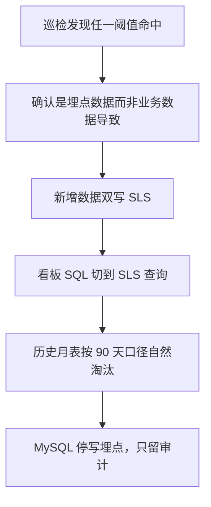

# 可观测性架构方案

- 版本：v1.0
- 日期：2026-09-03
- 依据源：`docs/plans/2026-09-03-1051-feat-server-architecture-baseline-plan.md`
- 前置阅读：`docs/architecture/系统总体架构设计文档.md`（分层与部署结论）、`docs/architecture/技术栈选型说明.md`（MySQL 承载埋点的选型理由）

---

## 1. 怎么读这份文档

可观测性在本项目里不是"锦上添花的监控"，而是**内测能否交出结论的前提**。`docs/PRD.md:2497` 把「埋点四事件全部可采集且口径正确」列为 🔴 阻塞北极星验收 —— 埋点少一个事件，9/30 内测收集的数据就无法计算北极星指标，等于内测白做。

同时这套方案跑在一台 40G 磁盘的 2 核 2G 机器上。所以文档分两半：

- 第 2 至 6 节：采什么、怎么存、怎么看（可观测性本体）。
- 第 7 至 9 节：会不会撑爆、什么时候搬走、搬到哪（这是本方案最容易被跳过、也最容易出事的部分）。

批次标注沿用前两份文档的口径：`Batch1` 为 9/30 内测包必须存在。

---

## 2. 三类数据，三套规则

「日志」在本项目里实际是三种驱动力完全不同的东西，必须分开对待。混成一套是后期出问题的根源。

| 数据类 | 承载 | 保留期 | 保留期由什么决定 | 批次 |
|---|---|---|---|---|
| 应用日志 | JSON 单行落盘文件 | 按文件滚动 | 磁盘容量 | Batch1 |
| 埋点事件 | MySQL 独立 database，按月分表 | 90 天 | 40G 盘容量 | Batch1 |
| 审计日志 | MySQL 业务库 `audit_log` 表 | 180 天 | `docs/BRD.md:268` 合规下限 | Batch1 |

埋点 90 天与审计 180 天不共用一个周期（依据 R14、R15），因为两者的约束来源不同：前者是运维决定的，可以按盘容量调；后者是合规决定的，不能调。这一点在实现时容易被"顺手统一成一个配置"，那样做会在合规上出问题。

`docs/PRD.md:2390` 的保留期表按 R15 新增埋点事件表一行，既有的中转脱敏日志 30 天与审计留痕 180 天两行不动 —— 这三者是三个不同对象，不是同一条的三种说法。

---

## 3. 应用日志

**结论**：JSON 单行格式落盘（依据 R13）。批次 Batch1。

选 JSON 单行而非人类可读格式的唯一理由是**为将来的迁移做准备**：SLS 及同类日志服务都按结构化字段索引，如果现在写成人读格式，迁移时要么丢字段要么写解析规则。今天多花的成本是几行 logback 配置，将来省的是一轮改造。

每条日志的必备字段：

| 字段 | 说明 |
|---|---|
| `ts` | RFC3339 UTC 带时区（对齐 `docs/PRD.md:2020-2036` 的时间口径） |
| `level` | 日志级别 |
| `request_id` | 服务端生成，与响应包中的同一个值 |
| `interaction_id` | 来自 `X-Interaction-Id` 请求头，可能为空 |
| `user_id` | 可能为空（未登录） |
| `path` | 接口路径 |
| `code` | 业务错误码（对齐 `docs/PRD.md:2233` 的五位码） |
| `rt_ms` | 服务端处理耗时 |

**一条硬禁令**：日志中不得出现完整手机号、完整身份证号、完整联系方式。这三类在库里都是加密列，日志是最容易泄露它们的地方。`docs/PRD.md:2491-2492` 的两条 🔴 阻塞审计（联系方式出口审计、身份证存储审计）原文针对的是库与接口响应，本方案在此基础上把**日志文件也纳入 grep 检查范围** —— 这是本方案的补充要求，不是 PRD 原文。

---

## 4. 埋点事件

### 4.1 四个必埋事件

`docs/PRD.md:2212-2229` 定义的四组事件，缺一则 §11 验收不通过。

| 事件 | 关键属性 | 服务的指标 | 批次 |
|---|---|---|---|
| `layer_switch` | 见下方 §4.1.1 的完整字段表 | 北极星轴② 分类图层加载成功率，兼性能日志 | Batch1 |
| `post_published` | `completeness_level`、`is_ai_assisted`、`leaf_category_id` | 北极星轴③ 🟢 完整发布率 | Batch1 |
| `demand_push_sent` 与 `resource_detail_click` | `post_id`、`rank`、`elapsed_sec` | 北极星轴① AI 匹配召回率 | **Batch2** |
| `contact_event` | `post_id`、`channel_type`、`elapsed_min` | 辅助指标首次联系触发率（30 分钟窗口） | Batch1 |

**为什么轴① 的两个事件只能到 Batch2**：它们由 AI 双向推送产生，而 `ai` 与 `notify` 两个域整体在 Batch2。Batch1 没有推送行为，也就没有这两个事件可埋。埋点表结构在 Batch1 就要建好（第 8 节的三条防线之一），但**数据到 Batch2 才会有**。

由此得出一条对验收口径的直接影响：**Batch1 阶段北极星轴① 无数据，因此 §6.1 的 ≥0.216 不能作为 Batch1 的验收线**（详见 §6.1）。

上报走 `POST /track/events`，客户端聚批，单次不超过 50 条（`docs/PRD.md:2216` 与 `lib/nfr_constants.dart:180` 的 `trackBatchMaxEvents = 50`，《系统总体架构设计文档》§9.1 已同步为同一数字）。该接口**要求携带有效登录态**，`user_id` 取自登录态而非请求体（限频规则见《系统总体架构设计文档》§9.1）。

### 4.1.1 `layer_switch` 的完整字段（唯一权威定义）

`lib/nfr_constants.dart:176-178` 已在 2026-09-02（缺陷评审第 9 条）定案：`layer_switch` 必须把四段耗时**分列上报**，并附结果与失败原因。上文表格只写 `duration_ms` 与 `net_rt_ms` 是不够的 —— 只有总耗时的话，P95 超标时无法知道是缓存、网络、聚合还是渲染慢，而这四段的优化手段完全不同（分别对应 TTL、索引、Dart 算法、绘制批次）。

| 字段 | 类型 | 含义 |
|---|---|---|
| `duration_ms` | int | 端到端总耗时，手指离开分类 Tab 到 Pin 首屏绘制完成 |
| `t_cache_ms` | int | 第一段：本地缓存判定（`docs/PRD.md:2061` 已出现此字段名） |
| `t_net_ms` | int | 第二段：`GET /map/pins` 网络往返，缓存命中时为 `0` |
| `t_agg_ms` | int | 第三段：Dart 侧聚合，服务端预聚合时为 `0` |
| `t_render_ms` | int | 第四段：Pin 首屏绘制 |
| `result` | enum | `success` / `fail`。**只表示这次交互有没有走完**，不含耗时判定。轴② 的成功判据是 `result = 'success' AND duration_ms <= 300` 两条并列（§6.1） |
| `fail_reason` | enum | `timeout` / `network` / `server_error` / `render_error` / `cancelled`，`result=success` 时为空。注意这里**没有**耗时相关值 —— 「走完了但超过 300ms」不是 `fail`，它在 §6.1 里靠 `duration_ms` 单独判掉 |
| `err_code` | int | 失败时服务端返回的业务错误码，网络层失败时为空 |
| `cache_hit` | bool | 是否命中本地缓存 |
| `fps` | double | 本次交互期间帧率 |
| `mem_peak_mb` | int | 本次交互期间内存峰值 |
| `network_type` | enum | `wifi` / `5g` / `4g` / `3g` / `2g` / `none` / `unknown`。`unknown` 是**必须存在的取值** —— 取不到网络类型时上报它而不是猜 `wifi`（§4.5）。`unknown` 的会话**计入**分母（不能因为采不到就免考核），只有明确是 `3g`/`2g`/`none` 才排除 |

单条事件体积因此比只报总耗时涨约 60%。已定案**全量上报不采样**（`lib/nfr_constants.dart:176-178`）：内测期日活量级下，60% 的体积增长在 40G 盘的埋点配额内（见 §7），而采样会让轴② 的样本量在内测期不足以算 P95。

`cancelled` 这个 `fail_reason` 值需要特别说明：用户快速连续切换分类时，先发起的交互会被后一次取代。这类会话**不计入轴② 的分母**（它不是失败，是用户改变了意图），但必须上报，否则无法区分「被取代」与「客户端崩了没上报」。

`result` 的判定必须在客户端完成，不能由服务端推断。服务端只看得到 `t_net_ms` 那一段，一次「网络成功但渲染崩了」的交互在服务端日志里是完美的 200。

但**判定权不能全交给客户端**：`result` 由被考核方自己写，如果轴② 只看 `result`，客户端把渲染超时也标成 `success` 就能让指标满分而服务端无从反驳。因此轴② 的成功判据必须由 `result` 与 `duration_ms` 两个字段并列构成（§6.1）—— `duration_ms` 是数值、可与服务端 `rt_ms` 交叉核对（`t_net_ms` 应与同 `interaction_id` 的服务端 `rt_ms` 相差在 50ms 内，超出即数据质量告警），比一个布尔标记难篡改得多。

### 4.2 四条容易实现错的口径

这四条都不是"建议"，实现偏了会导致指标算出来是错的但看不出来：

- **所有事件必须带 `interaction_id`**。它是客户端埋点与服务端访问日志的唯一 join 键。漏带的事件在分析时是孤岛。
- **`layer_switch` 的 `duration_ms` 计时起点是手指离开分类 Tab，终点是 Pin 首屏绘制完成**，必须包含缓存查找、网络、聚合、渲染四段。只测网络那一段会得到一个漂亮但无意义的数字。
- **四段之和必须等于 `duration_ms`（容差 ±1ms）**。这是一条可自动执行的数据质量校验：`ABS(t_cache_ms + t_net_ms + t_agg_ms + t_render_ms - duration_ms) > 1` 的事件说明客户端有一段没计时或计重了，这类事件必须从轴② 的分母中剔除并单独告警。没有这条校验的话，客户端漏计一段的 bug 会表现为「P95 突然变好了」，而这是最难被发现的一类指标错误。
  **但这条恒等式单独存在时是可以被绕过的**：如果客户端把最后一段写成 `t_render_ms = duration_ms - t_cache_ms - t_net_ms - t_agg_ms`，恒等式永远成立，而 `t_render_ms` 变成了一个没有任何测量意义的余数 —— 校验通过、数据全错。因此配套两条实现纪律，见 §4.2.1。
- **`network_type` 为 2G、3G、断网的会话不计入 P95 分母**。弱网会话拉高 P95 但不反映实现质量，混进分母会让优化方向跑偏。`unknown` **不在**排除之列（§4.1.1）。

#### 4.2.1 四段耗时的独立打点纪律

| 纪律 | 内容 |
|---|---|
| 四段必须各自独立计时 | 每段用自己的起止 `Stopwatch` 时间戳算出，**任何一段都不允许由 `duration_ms` 减去其他段得到**。代码评审时逐段确认，出现减法即打回 |
| `duration_ms` 也必须独立测 | 它由整段交互的起止时间戳算得，不是四段相加。这样两条路径互为校验，恒等式才有信息量 |
| 第二重校验 | 服务端侧再加一条：同一 `interaction_id` 的 `t_net_ms` 与服务端访问日志的 `rt_ms` 之差应 ≤50ms（客户端多出的是本地网络栈与解析开销）。超出即数据质量告警。这一条无法被客户端自证 —— 它用的是服务端自己的数据 |
| 恒等式的定位 | 它只是**必要条件**，不是充分条件。恒等式通过不等于四段可信，可信靠的是上面三条 |

#### 4.2.2 两条排除规则的可判定形式

上面的弱网排除与《系统总体架构设计文档》§4.6 的「发版重启窗口与重启后 5 分钟预热期不计入 P95 分母」都是口径承诺，但口径必须能被 SQL 判定，否则每次算 P95 都要靠人回忆当时有没有发版。

| 规则 | 判定字段 | 落法 |
|---|---|---|
| 弱网排除 | `layer_switch.network_type IN ('3g','2g','none')` | 客户端采集，直接在事件属性里，SQL 可直接过滤。注意 `unknown` **不属于**排除集 |
| 重启窗口排除 | 服务端侧新增 `restart_window` 表，两列 `start_at`、`end_at` | 应用启动时自身写入一行，`end_at = 启动完成时刻 + 5 分钟`。算 P95 时用 `NOT EXISTS (SELECT 1 FROM restart_window w WHERE e.ts BETWEEN w.start_at AND w.end_at)` 过滤 |

`restart_window` 表放在服务端业务 database 而不是埋点 database：它由应用自己写入，且需要与业务侧的发版记录对齐。批次 Batch1，一张两列表的成本可忽略，但没有它这条排除规则就只是一句无法执行的话。

### 4.3 缓存命中的会话没有 request_id

这是全套方案里最容易被当成 bug 上报的地方，单独说明（`docs/PRD.md:2477`）：

| 会话类型 | 客户端埋点 | 服务端日志 | 能否 join |
|---|---|---|---|
| 未命中缓存 | 有 `interaction_id` | 有 `interaction_id` 与 `request_id` | 能，双向关联 |
| 命中缓存 | 有 `interaction_id` | 无记录 | 不能，仅客户端侧可见 |

命中缓存时请求根本没发出去，服务端当然没有记录。**这是预期行为，不是数据缺失**。这也正是 `layer_switch` 的 `duration_ms` 必须由客户端测四段的原因 —— 服务端视角天生看不到缓存命中那一类交互，而那恰恰是性能最好的一类。

### 4.4 表结构与分表

- 存放位置：与业务数据**独立的 database**，同一个 MySQL 实例（依据 R14）。
- 命名：按月分表，如 `track_event_202609`。
- 结构：宽表，公共字段拆列（事件名、`interaction_id`、`user_id`、时间），事件专属属性存 JSON 列。
- **月表必须预建**：每月 25 日创建下个月的表，不能等到 1 日零点由写入触发。执行者是《系统总体架构设计文档》§8 定时任务表里的「埋点月表预建」任务。**预建须用 `CREATE TABLE ... LIKE`**，逐列拼 DDL 会漏掉下述唯一索引。
- **去重靠唯一索引，不靠幂等键**：`uk_event_dedup(interaction_id, event_name, user_id, ts)`，落库用 `INSERT ... ON DUPLICATE KEY UPDATE id = id`。原因是客户端埋点批次**每次组批换新 `Idempotency-Key`**（《前端详细设计文档》§17.4.1），幂等键挡不住「已落库、响应丢在回程 → 整批重传」。约束定义见《数据库设计文档》§3.16.1。

预建这一条容易被当成细节跳过，但它是有后果的：跨月零点那一刻若表还不存在，全部埋点写入会直接失败，而埋点是异步旁路，失败不会阻塞业务、也就不会有人立刻发现 —— 等到发现时数据已经缺了一段，且无法补回。

去重这一条的失效方式与之相反但同样隐蔽：索引在、写入不报错，**只是不再挡住任何重复**。它有三种触发路径 —— 预建任务漏建索引、落库改用 `INSERT IGNORE`、`ts` 被换成服务端到达时刻。三者都不产生任何错误信号，只表现为按次数计算的指标（含 P95 分母）逐渐偏高。

为什么第一天就分表而不是等表大了再说 —— 见第 8 节，这是三条防线之一。

### 4.5 客户端采集责任

本方案前四节写的是「要什么数据」，但有三项数据**服务端根本采不到**，必须由客户端采集，且客户端当前没有任何一项的实现位置。这三项各自都有一个卡点，不预先说明会在实现时才发现拿不到：

| 数据 | 卡点 | 落法 | 批次 |
|---|---|---|---|
| `network_type` | Flutter 标准库不提供网络类型，`lib/pubspec.yaml` 当前 6 个功能性依赖里没有任何一个能拿到它 | 已选定 `connectivity_plus`（见《技术栈选型说明》§12 客户端依赖选型表）。取不到时上报 `unknown` 而不是猜 `wifi`——猜错会把弱网会话混进 P95 分母，正好破坏 §4.2 的排除规则 | Batch1 |
| `mem_peak_mb` | 需要平台通道读取进程内存，Dart 侧无跨平台 API | Batch1 只在 Android 侧采集（`Debug.MemoryInfo`），iOS 侧上报空值。原因是内测包以 Android 为主，为 iOS 单独写一份平台通道不值得 | Batch1（Android）/ Batch2（iOS） |
| 设备指纹 | `docs/PRD.md:1695`、`:2173`、`:2181` 三处限频规则都依赖它，但 PRD **没有定义它怎么生成、怎么传** | 见下方定义 | Batch1 |

设备指纹的定义（**PRD 已于 2026-09-04 在 §12.1 与 §12.5 末尾同步登记**）：

| 项 | 规则 |
|---|---|
| 生成 | 客户端首次启动时生成一个 UUID v4，写入本地持久化存储，此后不再变 |
| 传输 | 请求头 `X-Device-Id`，全部请求携带 |
| 可信度 | **不可信**。用户重装应用即换新指纹，因此设备维度限频只能挡脚本与顺手刷，挡不住有决心的人。它与账号维度、IP 维度三者叠加才有意义（`docs/PRD.md:1695`） |
| 不做的事 | 不采集 IMEI、MAC、广告 ID 等真实硬件标识。合规风险远大于收益，且上架审核会因此被拒 |
| 落库 | 写入 `device` 表（《系统总体架构设计文档》§5.1 已有此表） |

三项都不采集会怎样：`network_type` 缺失让 §4.2 的弱网排除失效、`mem_peak_mb` 缺失让性能日志无法定位内存问题、设备指纹缺失让三维限频塌成两维。前两项是指标质量问题，第三项是安全问题。

### 4.6 客户端事件队列

「客户端聚批上报」这一句话背后是一个需要设计的组件。它不做设计的默认结果是「攒在内存里、切页面就丢」，那样内测期的埋点数据会缺一大块且缺得没有规律。

| 项 | 规则 |
|---|---|
| 介质 | 本地持久化存储，不能只在内存。应用被系统杀死、崩溃、用户强退时未上报的事件必须还在 |
| 容量 | 上限 2000 条 |
| 淘汰方向 | **丢最旧的**。理由：新事件更接近当前问题现场，且旧事件多半已在别的批次上报过 |
| 丢弃必须计数 | 每丢一条，本地累计计数器 `dropped_count` 加一，并随下一批上报（放在批次信封的元数据里，不占事件条目）。服务端落一张极小的 `track_drop_stat` 表或直接写日志。**没有这个计数，队列溢出是完全静默的** —— 轴② 的分母会凭空少掉一批数据，而少掉的恰好是溢出期（即卡顿最严重时）的事件，指标会因此系统性偏好 |
| 丢弃告警线 | 单个用户单日 `dropped_count > 200`，或全体用户单日丢弃总量 > 上报总量 5%，即写告警日志并在轴② 结论中标注「本期数据受队列溢出影响」 |
| `ts` 取值 | **采集时刻**，不是上报时刻。这两者在离线场景可能差几小时，取上报时刻会让「用户什么时候做了什么」完全错位 |
| 跨月归属 | 按 `ts` 归属月表，不按到达时刻。9 月 30 日 23:50 采集、10 月 1 日 00:10 上报的事件写入 `track_event_202609` |
| 上报触发 | 满 50 条、或距上次上报满 30 秒、或应用进入后台，三者任一即触发 |
| 失败退回 | 上报失败（含 `42906` 限频）的事件退回队列头部，按《系统总体架构设计文档》§6.6 的退避规则延后重试，不丢弃 |
| 回灌限速 | 离线积压恢复联网后，不允许一次性把 2000 条打出去。仍按 50 条一批、批间至少 1 秒，否则会自己触发 `42906` 限频 |
| 未登录事件 | 本地缓存，登录后补报（《系统总体架构设计文档》§9.1 已定该接口要求登录态） |

跨月归属这一条与 §4.4 的月表预建相互依赖：如果 10 月上报的 9 月事件要写 `track_event_202609`，那么老月表在保留期内不能提前 drop，`docs/PRD.md` 的 90 天保留期正好覆盖这个场景。

批次：Batch1。它是《系统总体架构设计文档》§9.2 客户端配套交付物表里的一行。

---

## 5. 审计日志

**结论**：`audit_log` 表，保留 180 天（依据 R15）。批次 Batch1。

`docs/PRD.md:2481` 规定的必留操作，一条不能少：

- 认证通过与驳回
- 内容下架与恢复
- 分类与模板变更
- 权重与开关变更
- 定向邀请
- 查看用户脱敏信息

最后一条值得注意：**"查看用户脱敏信息"本身就是审计对象**。也就是说 `/posts/{id}/contact` 每次调用成功都要落审计，这和它同时要写 `contact_event` 是两件事、两张表。

这里有一个命名陷阱必须消歧：**`contact_event` 这个名字在本方案里指的是埋点表里的事件，不是审计表里的记录**。同一次「查看联系方式」操作会产生两条数据，它们同名不同义：

| 落在哪 | 表 | 目的 | 保留期 | 能否用于合规举证 |
|---|---|---|---|---|
| 埋点 database | `track_event_YYYYMM` 中 `event_name = 'contact_event'` | 业务指标分析（首次联系触发率） | 90 天 | 不能 |
| 业务 database | `audit_log` | 合规留痕 | 180 天 | 能，这是唯一举证来源 |

两者不能合并，也不能互相替代 —— 埋点是异步旁路、允许丢，审计必须与业务操作同事务、不允许丢。写代码时**不要因为字段重复就复用同一张表**。

审计写入必须与业务操作在同一事务内，否则会出现"操作成功但没留痕"的合规缺口。

---

## 6. 看板与告警

### 6.1 北极星三轴

三轴各自独立采集并计算乘积，验收线是乘积 ≥0.216（`docs/PRD.md:2478`）。批次 Batch1。

| 轴 | 指标 | 数据来源 |
|---|---|---|
| 轴① | AI 匹配召回率（5 分钟内 Top20 有 ≥1 次点击） | `demand_push_sent` 与 `resource_detail_click` |
| 轴② | 分类图层加载成功率 | `layer_switch` |
| 轴③ | 🟢 完整发布率 | `post_published` |

三轴数据都在 MySQL 里，看板直接用 SQL 查，不引入 BI 工具。

**验收线按批次分档，不一刀切。** 这一条是纠正一个具体风险：把 `≥0.216` 当成 Batch1 的验收门槛，会用一个采不到数的指标去卡一个交付。

| 批次 | 轴① 有数据吗 | 验收口径 |
|---|---|---|
| Batch1 | 无（`demand_push_sent` 与 `resource_detail_click` 到 Batch2 才有，见 §4.1） | 只验轴② 与轴③，以及埋点表结构就位、上报链路通、看板 SQL 能跑 |
| Batch2 | 有，但处于冷启动观察期 | 只做趋势观察，记录基线，不设及格线（`docs/BRD.md:225` 的冷启动观察期） |
| 观察期后 | 有，且样本量足够 | 才用 `≥0.216`（`docs/PRD.md:2478`）作为正式门槛 |

也就是说 **`≥0.216` 是产品成熟期的目标值，不是 Batch1 的验收线**。Batch1 阶段对轴① 唯一要验的是「采集链路已就位」，而不是「数字达标」。这与 `docs/PRD.md:39-49` 分早期与后期设指标的口径一致。

#### 6.1.1 轴② 的阶梯目标与单次口径

轴② 是三轴中唯一 Batch1 就有完整数据的，因此它是 Batch1 唯一能真正卡数字的指标。它的目标值已在 `lib/nfr_constants.dart:195-217` 的 `layerLoadTargetByPhase` 定案，是**阶梯值而不是单一值**：

| 阶段 | 目标 |
|---|---|
| Batch1 | ≥0.60 |
| 挂牌窗口期 | ≥0.70 |
| Batch2 | ≥0.80 |
| M3 | ≥0.90 |

用一个 0.90 去卡 Batch1 的后果是第一个内测包必然「不达标」，而这个不达标传达不出任何信息 —— 首版本地缓存尚未预热、后端索引尚未按实测调优，0.60 才是有意义的门槛。

**「成功率」的分母与分子口径（单次布尔）**：

| 项 | 口径 |
|---|---|
| 统计单元 | 一次 `layer_switch` 事件（即一个 `interaction_id`），**不是**一次网络请求 |
| 分子 | `result = 'success' AND duration_ms <= 300` 的事件数。两个条件都必须满足 —— `result` 只说明这次交互没崩，`duration_ms <= 300` 才是 `lib/nfr_constants.dart:202` 定案的「单次布尔口径」本体 |
| 分母 | 全部 `layer_switch` 事件数，**排除** `fail_reason = 'cancelled'`（用户改变意图）与 `network_type IN ('3g','2g','none')`（§4.2 弱网排除，`unknown` 不排除）与四段和校验不过的事件（§4.2 数据质量），以及落在 `restart_window` 内的事件（§4.2.2） |
| 分母不得缩小的纪律 | 排除项只有上面四类，**不允许新增任何排除条件**。每加一条排除都会缩小分母、抬高成功率，是最容易被忽视的指标造假路径。若确需新增，须先在本节登记并说明缩小了多少比例的分母（附实测占比数字），未登记的排除条件在验收时视为无效 |
| 不做的事 | 不做「同一交互重试 3 次成功算成功」这类折算。一次交互就是一次布尔判定，重试本身已经意味着用户等了更久 |

### 6.2 轴① 的两项反向哨兵

这是本方案里唯一"防止指标本身骗人"的设计（`docs/PRD.md:2479`），必须与轴① 同时上看板：

| 哨兵 | 数据来源 |
|---|---|
| 联系后 7 天内该资源方被举报数 | `report` 表加 `contact_event` |
| 同一资源方被重复联系但无任何用户二次联系的占比 | `contact_event` |

判定规则：**若这两项随轴① 上升而同步上升，即判定模型朝「更易被点」而非「更易成交」跑偏**，触发标签体系复审。

这两项零新增采集 —— 全部从已有的 `report` 与 `contact_event` 推导。这一点符合 `docs/PRD.md:2329-2338` 的红线：不向用户索取主观反馈、不入库主观字段，但允许从已有客观字段离线推导行为标签。

### 6.3 性能告警

`docs/PRD.md:2476`：图层切换耗时、FPS、内存峰值三项实时上报，**P95 超过 300ms 自动告警**。批次 Batch1。

上线第一周必须复测实网 P95，不达标则启用降级开关（`docs/PRD.md:2480`）。注意降级开关本期只要求文档化、不要求实施（`docs/PRD.md:2498` 标为 ⚪ 不阻塞），但它的触发条件属于本方案范围。

告警通道在单机形态下就是日志扫描加通知，不引入 Prometheus 或 Grafana —— 那需要两个额外进程，2G 内存放不下（见《技术栈选型说明》第 9 节的内存预算）。

**「通知」这一段的具体承载组件本期不定，已登记为延后项**：单机内测阶段告警的唯一消费者就是开发者本人，看落盘日志即可，此时引入任何通知组件都是提前投入。这一项的定案时点与 SLS 迁移绑定 —— 第 9 节的阈值命中、迁移到 SLS 时，告警通道随之用 SLS 自带的告警能力，不需要另选组件。**在此之前，「有没有人真的去看那个日志」是靠 §9.1 的周巡检任务保证的，不是靠通知。**

---

## 7. 量级测算

这一节给出的是"它会长多快"，第 8、9 节给出"撑不住时怎么办"。

| 阶段 | DAU | 埋点写入量 | 40G 盘上的可持续性 |
|---|---|---|---|
| 内测 | 100 | 约 45MB/月 | 完全无压力 |
| 单城试点 | 1000 | 约 720MB/月 | 可撑，但已需要关注 |
| 上量 | 10000 | 约 7GB/月 | **无法长期承载** |

10000 DAU 一档每月 7GB，而整台机器只有 40G ESSD，还要装 MySQL 业务数据、Redis 持久化文件、应用日志与操作系统。所以第 9 节的阈值不是保守估计，而是**硬边界**。

40G 到底怎么分，必须先算清楚，否则 T1 的「占盘超 8GB」这个数字是凭空来的：

| 用途 | 分配 | 说明 |
|---|---|---|
| 操作系统与基础软件 | 6GB | 含 apt 缓存与内核 |
| Docker 镜像层 | 6GB | JDK 基础镜像加应用镜像，多版本并存时要留回滚余量 |
| swap 文件 | 2GB | 2G 内存贴满预算，swap 是硬要求（见《技术栈选型说明》第 9 节） |
| MySQL 业务数据与索引 | 6GB | 13 张业务表，内测量级远用不到，留给增长 |
| MySQL binlog | 3GB | 必须设 `binlog_expire_logs_seconds = 259200`（MySQL 8.4 已移除 `expire_logs_days`），否则会无声吃满盘 |
| Redis AOF 文件 | 1GB | 128MB 内存对应的 AOF 加重写余量 |
| 应用日志落盘 | 3GB | JSON 单行，必须配日志轮转与保留上限 |
| **埋点数据可用余量** | **8GB** | 这就是 §9.1 的 T1 阈值取 8GB 的来源 |
| 未分配缓冲 | 5GB | 不可占用，留给临时文件与 `mysqldump` 备份中间产物 |

两条由此而来的硬性配置要求：**binlog 必须设过期天数**、**应用日志必须配轮转**。这两项任一漏配，都会绕过上面的分配表把盘吃满，而磁盘满的表现是 MySQL 直接拒写 —— 那是全站不可用，不是性能下降。

必须说清的一点：撞到这条线时正确的动作**不是加大 ECS 规格**。把盘从 40G 加到 200G 只是把同一个问题往后推几个月，而单价上涨的幅度远超 SLS 的按量成本。

---

## 8. 第一天就做的三条防线

这三条不是"以后有空再加的优化"，而是必须在 Batch1 随第一版一起上线的东西。后补的代价高得多。

| 防线 | 做法 | 后补的代价 |
|---|---|---|
| 按月分表 | 表名带年月，如 `track_event_202609` | 单表长到千万行后再拆，要停机搬数据，2 核 2G 上搬不动 |
| 独立 database | 埋点库与业务库分开（同实例） | 埋点表的慢查询会拖累业务库的 buffer pool 命中率，混在一起后无法单独限制 |
| 90 天自动 drop | 定时任务整表 drop 过期月表 | 不分表就只能逐行 DELETE，千万行 DELETE 会把 buffer pool 与 binlog 一起打满，等于自己造一次故障 |

第三条要特别强调：**清理必须是整表 drop，不能是 DELETE**。这是前两条防线存在的直接目的 —— 分表的最大价值不是查询性能，而是让清理变成一个瞬间完成的 DDL。

---

## 9. 迁移条款

### 9.1 三条触发阈值

任一命中即启动迁移（依据 R16）。批次为阈值命中后。

| 编号 | 阈值 | 检查动作 |
|---|---|---|
| T1 | 埋点表超 2000 万行，或**埋点数据自身**占盘超 8GB | 行数：`SELECT SUM(TABLE_ROWS) FROM information_schema.TABLES WHERE TABLE_SCHEMA='track' AND TABLE_NAME LIKE 'track_event_%'`。占盘：**必须只量埋点库**，用 `SELECT SUM(DATA_LENGTH+INDEX_LENGTH)/1024/1024/1024 FROM information_schema.TABLES WHERE TABLE_SCHEMA='track'`，**不能用 `df`** —— `df` 量的是整盘 40G 的使用量，其中包含系统、镜像、MySQL 业务数据等七项（见第 7 节分配表），用它判定会在埋点只占 2GB 时就误报。8GB 的来源见第 7 节的盘分配表 |
| T2 | 埋点写入 QPS **持续**超 50 | 对当月埋点表按 `ts`（客户端采集时刻）分钟聚合，取近 7 天中**每分钟计数超过 3000（即 50 QPS）的分钟数**：`SELECT COUNT(*) FROM (SELECT COUNT(*) c FROM track_event_YYYYMM WHERE ts > NOW() - INTERVAL 7 DAY GROUP BY DATE_FORMAT(ts,'%Y%m%d%H%i') HAVING c > 3000) t`。**该计数 ≥ 60 才算命中**（即 7 天内累计至少 60 分钟处于高位），单分钟峰值不算 —— 取 `MAX` 会让一次运营活动或一次离线回灌就触发迁移。用 `ts` 而非 `created_at`：前者反映用户实际行为时刻，后者可能因跨月回灌或离线积压失真 |
| T3 | **主看板 SQL** 单次执行超 10 秒 | 依次执行 §9.1.1 登记的主看板 SQL 清单，逐条计时，**任一条超 10 秒即命中**。执行前先 `RESET QUERY CACHE` 等价操作或换参数，避免命中缓存得到假快结果 |

#### 9.1.1 主看板 SQL 清单（T3 的判定对象）

T3 说「主看板 SQL」，但全文原先没有一处登记它到底是哪几条。没有这张清单，T3 是一条无法执行的阈值 —— 每个人心里的「主看板 SQL」都不一样。清单如下，与 §6 的看板项一一对应：

| 编号 | 用途 | 对应看板项 |
|---|---|---|
| Q1 | 轴① 首次联系触发率 | §6.1 轴① |
| Q2 | 轴② 图层切换成功率（含 §6.1 的分子分母口径与全部排除条件） | §6.1 轴② |
| Q3 | 轴③ 完整发布率 | §6.1 轴③ |
| Q4 | 轴① 两项反向哨兵 | §6.2 |
| Q5 | `layer_switch` 的 P95 耗时（工程 SLA，与轴② 分开） | §6.3 |
| Q6 | 四段和校验不过的事件数与占比（数据质量） | §4.2 |
| Q7 | `dropped_count` 汇总（队列溢出监控） | §4.6 |

这七条 SQL 本身是 Batch1 交付物，落在 `docs/` 或 `scripts/` 下的单一文件内，**不允许散落在各人的查询历史里** —— 散落的直接后果是每次算轴② 用的口径都可能不同，而口径不同的两次结果不可比。

**这三条都有明确的执行者，不靠人记得去看**：《系统总体架构设计文档》§8 定时任务表里的「可观测性阈值巡检」每周执行一次，四项全查，命中即写告警日志。没有这个执行者，阈值写得再具体也只是文档里的字。

三条都是**可以立即执行的检查动作**，不是"当数据量很大时"这类无法判定的表述。这是刻意的：模糊的阈值在真正需要它的那天不会有人执行。

### 9.2 迁移目标已预先指定

目标是**阿里云 SLS**。今天不启用（内测 45MB/月完全没必要），但目标提前定死。

原因是历史上这类问题出事从来不是因为选了便宜方案，而是因为便宜方案撞墙时没人知道该往哪走，于是选了"加机器"这条在 40G 盘上走不通的路。把目标写进文档，撞墙那天就不需要重新做决策。

### 9.3 命中阈值时的动作次序

审计日志不参与迁移 —— 它 180 天且量级远小于埋点，留在 MySQL 里更利于与业务数据做事务性关联（见第 5 节）。

### 9.4 一个典型判定示例

假设巡检时发现：埋点表 900 万行、占盘 3GB，但看板 SQL 单次执行已达 12 秒。

**判定为已触发迁移**。T1 未命中（行数与占盘都未到线），但 T3 命中，三条阈值任一命中即成立。正确动作是启动向 SLS 的迁移，而不是"先加大 ECS 规格看看"。

---

## 10. 验收清单

`docs/PRD.md:2484-2499` 的 NFR 验收清单中属于本方案范围的项。**每一项都必须有执行者、工具与失败判定** —— 只写「通过条件」的验收清单在实际执行时会退化成自我确认：

| 项 | 通过条件 | 执行者与工具 | 失败判定 | 阻塞级别 |
|---|---|---|---|---|
| 埋点四事件 | §12.4 四组事件全部可采集且口径正确 | 开发者本人；对内测包做一次完整手工走查，逐事件在服务端库里 `SELECT` 出原始 JSON 核对字段 | 任一事件缺失、任一必填字段为空、四段和校验不过占比 >1%、`interaction_id` 缺失率 >0 | 🔴 阻塞北极星验收 |
| 接口 RT | 读接口 P95 ≤150ms 实测达标 | 按《系统总体架构设计文档》§10.3.1 的协议执行（`wrk` 外部发压、逐接口出数、§10.3.2 造数） | 任一 Batch1 读接口 P95 >150ms | 🔴 阻塞 |
| 联系方式出口审计 | 完整联系方式仅 `/contact` 一处返回 | 见 §10.1 的可执行定义 | 见 §10.1 | 🔴 阻塞（隐私红线） |
| 身份证存储审计 | 库内无完整身份证明文 | 见 §10.1 | 见 §10.1 | 🔴 阻塞（合规红线），但 Batch1 为**真空通过**，见下文 |
| 数据保留任务 | OCR 7 天 / 日志 30 天 / 记忆 180 天定时任务实测执行 | 手工把系统时间或数据 `created_at` 前推越过保留期，触发任务后核对行数 | 任务未执行、或执行后过期数据仍在 | 🟠 内测期可观察 |
| 降级开关 | 文档化即可，本期不实施 | — | — | ⚪ 不阻塞 |

「埋点四事件」是唯一一条**只靠代码写完不算过**的验收项：四个事件都发出去了，但如果 `interaction_id` 漏带、或 `duration_ms` 只测了网络那一段、或弱网会话混进了 P95 分母，验收依然不通过。口径正确与可采集是两个独立条件。

它与 §4.5 的分档需要对齐说明，否则会被当成矛盾：`mem_peak_mb` 在 iOS 侧是 Batch2（Batch1 上报空值），`network_type` 与设备指纹是 Batch1 全平台。因此**「四事件全部可采集」在 Batch1 的准确含义是：Android 内测包上四事件全字段可采集；iOS 上除 `mem_peak_mb` 外全字段可采集**。`mem_peak_mb` 在 iOS 为空不算验收失败，其余任何字段为空都算。

**「身份证存储审计」在 Batch1 是真空通过**，这一点必须写明否则会造成虚假安全感：`cert` 域整体在 Batch2（《系统总体架构设计文档》§3），Batch1 根本不存在身份证数据，「库内无完整身份证明文」自然成立。它在 Batch1 的通过**不构成任何合规保证**，真正的验收时点是 Batch2 `cert` 域交付时。建议在验收记录中标注为「Batch1 不适用 / Batch2 验收」而不是「已通过」。

### 10.1 两条红线审计的可执行定义

「全库 grep」这四个字无法执行：grep 什么模式、grep 哪些文件、命中几次算失败，全部未定义。补齐：

| 审计项 | 搜索范围 | 搜索模式 | 通过判据 |
|---|---|---|---|
| 联系方式出口 | 服务端全部 `*.java`（含 controller、service、VO/DTO、MyBatis XML mapper），以及 `resources/` 下全部 `*.xml`、`*.yml` | 字段名维度：`phone`、`mobile`、`wechat`、`contact`、`tel`（大小写不敏感、含驼峰变体）；**重点是响应对象**：任何被 controller 返回的类型中出现上述字段名即为一处出口 | 逐处人工确认，**完整值**（未脱敏）出口只允许存在于 `/posts/{id}/contact` 的响应对象。其余出口必须是脱敏形式（如 `138****5678`）或不含该字段。发现任何一处非 `/contact` 的完整值出口即失败 |
| 身份证存储 | MySQL 全库；以及服务端全部 `*.java` 与 mapper XML | DDL 维度：`SHOW CREATE TABLE` 全表，查找 `id_card`、`idcard`、`id_no`、`identity` 等列名；数据维度：对上述列执行 `WHERE col REGEXP '^[0-9]{17}[0-9Xx]$'`；代码维度：grep 上述字段名的写入路径 | 不存在能容纳 18 位明文的列；若存在该类列，其内容必须全部为哈希或加密串（正则匹配数 0）。匹配到任何一条 18 位明文即失败 |

两项审计的**执行者是开发者本人，判定必须留证**：把每次 grep 的完整输出（含命中行号）与逐处结论写入验收记录。只写「已确认通过」而无输出留存的，视为未执行 —— 这两条是红线，红线验收不接受口头结论。

审计时点：`/contact` 出口审计在 Batch1 发内测包前；身份证审计在 Batch2 `cert` 域交付时（Batch1 见上文真空通过说明）。

---

## 11. 决策依据索引

| 本文档小节 | 需求 ID | 定案类型 |
|---|---|---|
| 2. 三类数据、3. 应用日志、4. 埋点事件 | R13 | user-directed |
| 4.4 分表与独立库、第 8 节三条防线 | R14 | user-approved |
| 5. 审计日志、2. 保留期区分 | R15 | user-approved |
| 7. 量级测算、9. 迁移条款 | R16 | user-directed |
| 8. 清理任务落点 | R12（Spring 调度承载） | 既定事实 |
| 全文批次标注 | R17 | user-approved |
| 4.1.1 `layer_switch` 完整字段、4.5 客户端采集责任、4.6 客户端事件队列 | R22（埋点采集与队列） | 架构评审补充定案 |
| 4.2.2 排除规则可判定形式、6.1.1 轴② 阶梯目标 | R22 | 架构评审补充定案 |
| 4.2.1 四段独立打点纪律、6.1 分子双条件与分母不得缩小、9.1.1 主看板 SQL 清单、10 验收清单三列化、10.1 两条红线审计可执行定义 | R23（验收可执行化） | QA 视角评审补充定案 |

R22 于 2026-09-03 前端视角评审后回补：本方案原先只写了服务端如何接收与存储埋点，`network_type`、`mem_peak_mb`、设备指纹这三项**只有客户端能采**的数据没有任何落点，四段耗时的分列口径也未落档。

R23 于 2026-09-04 QA 视角评审后回补：本方案原先写清了「要采什么数据、怎么存」，但「做完之后怎么证明它对」几乎全是空的 —— 三个 🔴 阻塞级验收项无一可被第二个人独立执行，且轴② 的分子定义与 `lib/nfr_constants.dart:202` 的代码真源冲突、判定权完全在被考核方手里。本轮补的全部是**判定协议与防自证条款**，不新增任何采集项。

**已登记的延后项**：本方案引入的迁移阈值与内存相关参数均为服务端运维参数，客户端不消费，是否仍按 `lib/nfr_constants.dart` 的双改纪律登记，由规划阶段判定。
