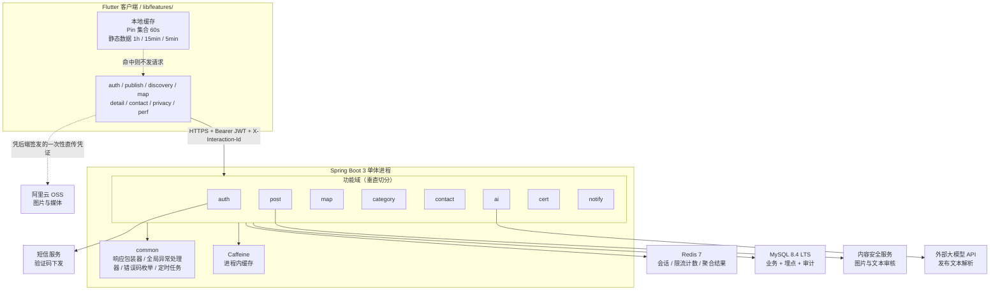
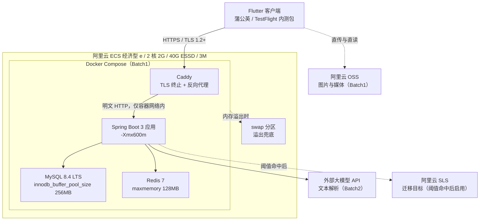

# 系统总体架构设计文档

- 版本：v1.0
- 日期：2026-09-03
- 依据源：`docs/plans/2026-09-03-1051-feat-server-architecture-baseline-plan.md`（架构决策唯一依据）
- 口径源：`docs/PRD.md`（功能与 NFR 数字）、`docs/BRD.md`（人力/预算/批次/红线）、`说明文档.md`（里程碑）

---

## 1. 怎么读这份文档

这份文档写的是**目标态架构**，也就是三个批次全部交付后系统长什么样。为了让它不会在 Batch2 立刻过期，文档里出现的每一个组件都带一个批次标签：

- `Batch1` —— 2026-09-30 内测包必须存在。
- `Batch2` —— 内测之后交付，本文档里已经画好位置但当期不实现。
- `Batch3` —— 更后期，当期连位置都不预留（例如向量检索）。

看到一个组件标了 `Batch2`，就意味着 9/30 的包里没有它，不需要再翻别的文档确认。

文档里不使用「接入层」「服务层」这类抽象层名。除了第 2 节的一张分层图，正文出现的每个组件都写出产品名和版本号。

三份架构文档的分工：

| 文档 | 回答的问题 |
|---|---|
| 本文档《系统总体架构设计文档》 | 系统由哪些部分组成、它们怎么摆、数据怎么流 |
| 《技术栈选型说明》 | 每个部分为什么选它、否掉了什么、什么时候换掉 |
| 《可观测性架构方案》 | 跑起来之后怎么看见它、日志涨爆了怎么办 |

---

## 2. 架构总览

系统是一个 Flutter 客户端加一个 Java 单体服务端。服务端的全部功能域跑在同一个 JVM 进程里，不拆微服务（依据 R1）。

三条需要单独指出的走向：

- 图片不经服务端**传输**，但必须经服务端**登记与审核**。客户端直接与 OSS 交互，服务端只保管 `media_id` 与审核状态。原因是生产环境只有 3M 带宽（依据 R6），图片过一遍服务端会直接把带宽吃光。
- `common` 只被依赖，不反向依赖任何功能域。
- 功能域互相调用走对方的 service 接口，不允许跨域直接访问对方的 mapper。

### 2.1 图片链路的两条阻塞红线怎么落

`docs/PRD.md:2556`（§14 上线前验收清单）的 EXIF 剥离与 `docs/PRD.md:1855`（§9.6 敏感词与内容审核）的图片内容审核都是 🔴 阻塞项，而直传路径上客户端不可信、服务端又拿不到图片字节。落法是**服务端在带外补做这两件事**，不把图片拉回服务端主链路：

| 环节 | 谁做 | 动作 | 批次 |
|---|---|---|---|
| 申请上传 | 服务端 `post` 域 | 校验登录态与配额，签发单文件、限时、限大小的一次性直传凭证，落一条 `media` 记录，`audit_status=pending` | Batch1 |
| 上传 | 客户端 | 凭凭证直传 OSS，不接触任何长期密钥 | Batch1 |
| 元数据剥离 | OSS 图片处理 | 落桶后按处理规则输出去除 GPS/设备/拍摄时间的副本，**在同一次 commit 事务内同步删除原图**，业务侧只引用副本 | Batch1 |
| 内容审核 | 服务端 `post` 域 | 用副本地址调内容安全服务，回写 `audit_status` 为 `pass` 或 `reject`（拒绝时回错误码 `40902`） | Batch1 |
| 可见性 | 服务端全部读接口 | `audit_status != pass` 的 `media_id` 不出现在任何**非本人**可见的响应里；本人在编辑态与「我的发布」中必须能看到 `pending` / `reject` 图位及拒绝原因，精确规则见 §2.1.1 | Batch1 |

#### 2.1.0 直传的安全约束（依据 R24）

直传把「谁上传」这一步交给了不可信的客户端，安全性不取决于流程图画得对不对，而取决于下面七条是否逐条落到配置里。前两条是凭证边界，后五条是 2026-09-04 直传安全复核补充 —— 复核起因是核实发现阿里云 OSS 的 `x-oss-process=image/info` 能直接读出 `GPSLatitude` / `GPSLongitude` / `GPSMapDatum` 等字段，也就是说**原图落桶那一刻 GPS 是完整可读的**，上表「元数据剥离」这一行如果实现得含糊，泄露就是真实发生的。

| # | 约束 | 不落会怎样 |
|---|---|---|
| 1 | **客户端不持有 OSS 长期凭证。** 凭证由服务端每次签发、单文件、限时、限大小 | 把长期 AccessKey 打进安装包等同于把整个存储桶交给任何反编译者 |
| 2 | **存储桶不开公共读。** 图片一律通过限时签名地址访问，签名有效期不超过帖子会话时长 | `hidden` 与 `archived` 帖子的图片仍能凭旧链接访问，与 `docs/PRD.md:2399` 的可追溯但不可见口径冲突 |
| 3 | **原图删除必须与 `commit` 同步完成，不得做成异步任务或定时清理。** `commit` 的返回条件是「副本已生成 且 原图已删除」，任一步失败则整体回滚、`media` 记录不置为可用 | 异步窗口期内任何拿到对象名的人都能用 `x-oss-process=image/info` 读出发帖人的家庭住址坐标。这是本节唯一一条会造成**人身安全**风险的漏洞 |
| 4 | **图片域不挂 CDN；若后续必须挂，禁止开启「过滤参数」。** | 阿里云文档明确：CDN 开启过滤参数后，URL 中问号之后的参数被全部去除，请求**直接命中原图**，`x-oss-process` 处理规则被整体绕过 |
| 5 | **`media_id` 与对象名一律由服务端生成，客户端不可指定；凭证的资源路径精确到单个对象名。** | 客户端可传入他人的 `media_id`，用自己的合法凭证覆盖别人已过审的图片，等于用直传做了一次越权写 |
| 6 | **直传 Policy 必须同时带 `content-length-range` 与 `content-type` 白名单，由 OSS 侧强制。** 服务端在 `commit` 时二次校验副本的真实格式与尺寸，不信任客户端声明的 `size` / `content_type` | 只在签发接口做入参校验等于没校验 —— 客户端可以声明 2MB 实传 200MB 刷存储费，或声明 `image/jpeg` 实传可执行文件 |
| 7 | **以 OSS 上传回调（callback）作为 `commit` 的触发源，客户端主动调 `commit` 只作为回调失败时的补偿。** 同时对创建超过 24 小时仍为 `pending` 的 `media` 记录，连同 OSS 对象一并清理 | 客户端传完就退出、不调 `commit`，图片已在桶里却没有任何审核记录，成为既不可见也不会被回收的孤儿对象，长期累积撑爆 40GB 存储配额 |

第 6 条与第 7 条合起来还堵住了一类审核绕过：先传一张合规图过审、再用同一个签名 URL 在有效期内 PUT 一张违规图覆盖。约束是**凭证一次性作废** —— `commit` 成功后服务端立即将该对象设为不可覆写，签名有效期本身不作为唯一防线。

#### 2.1.1 与 PRD 两处旧口径的消歧

上表的直传方案与 `docs/PRD.md` 现有两处写法不一致，此处给出裁定，PRD 需按此更新：

| PRD 处 | 原写法 | 裁定 |
|---|---|---|
| `docs/PRD.md:2096` | `POST /media/upload` 入参 `in: file`，出参 `media_id`、`url`、`audit_status` | **改为两步**：`POST /media/upload/ticket` 入参 `filename`、`size`、`content_type`，出参 `media_id`、`upload_url`、`expire_at`；客户端直传完成后调 `POST /media/{media_id}/commit` 出参 `audit_status`。入参 `file` 的写法与 3M 带宽约束直接冲突，必须废弃 |
| `docs/PRD.md:2247` | `40902` 图片未通过审核 → 客户端处置「该图位显示『该图未通过审核，无法发布』」 | `audit_status != pass` 不出现在任何响应里的规则**只约束他人可见的读接口**。发布者本人在自己的编辑态与「我的发布」里必须能看到 `reject` 图位与拒绝原因，否则他无法知道要换哪张图。因此可见性规则精确表述为：`audit_status != pass` 的 `media_id` 不出现在任何**非本人**可见的响应中 |

`audit_status` 三态的客户端展示规则由此确定：

| 状态 | 本人视角 | 他人视角 |
|---|---|---|
| `pending` | 图位显示占位加「审核中」，可继续提交发布 | 该图位不下发 |
| `pass` | 正常显示 | 正常显示 |
| `reject` | 图位显示「该图未通过审核，无法发布」并可替换 | 该图位不下发 |

`pending` 允许提交发布，是因为审核是带外异步的，要求用户等审核完再提交会直接毁掉发布转化率；帖子在审核完成前对他人隐藏该图位即可。

---

## 3. 功能域切分

服务端按功能域垂直切，不按技术层横切。每个功能域目录内自带自己的 controller、service、mapper、entity（依据 R9）。这样做的直接收益是一个功能改动只碰一个目录，且前后端能用同一套名词对话 —— 域名与 `lib/features/` 基本同名。

| 功能域 | 职责 | 对应客户端目录 | 主要接口 | 批次 |
|---|---|---|---|---|
| `auth` | 短信验证码登录、Token 续期、账号档案、注销冷静期、登录身份映射 | `lib/features/auth/` | `/auth/*`、`/users/me` | Batch1（密码登录与注销 Batch2；第三方登录 Batch2，本期只建 `user_identity` 表见 §5.1.1） |
| `post` | 发布、编辑、续期、重发、上下架、我的发布、发布记忆 | `lib/features/publish/` | `/posts/*`、`/media/upload/ticket`、`/media/{media_id}/commit`、`/templates/*` | Batch1（记忆/续期/重发 Batch2） |
| `map` | 网格取 Pin、远景预聚合、列表搜索与三排序 | `lib/features/map/`、`lib/features/discovery/` | `/map/pins`、`/posts/search` | Batch1 |
| `category` | 三级分类树下发与版本号、叶子类目模板 Schema | `lib/features/discovery/` | `/categories/tree` | Batch1 |
| `contact` | 联系方式解密下发、三维限频与熔断、联系事件落库、举报、收藏 | `lib/features/contact/`、`lib/features/detail/` | `/posts/{id}/contact`、`/report`、`/favorite` | Batch1（收藏 Batch2） |
| `ai` | 图加一句话解析成四件套、配额扣减、GBDT 推理排序 | `lib/features/publish/` | `/ai/publish/*` | Batch2 |
| `cert` | 实名二要素核验、资质 OCR、认证状态 | — | `/certs/*` | Batch2 |
| `notify` | 通知中心、已读标记、推送 token、双向推送下发 | — | `/notifications/*`、`/devices/token` | Batch1（推送下发 Batch2） |
| `common` | 响应包装器、全局异常处理器、错误码枚举、定时任务、加解密工具 | — | 无对外接口 | Batch1 |

`common` 里的加解密工具是硬需求而非便利封装：`user.phone`、`user.real_name_enc`、`post.contact_value_enc` 三处都是加密列（`docs/PRD.md:2286-2327`），解密入口必须收敛到一处才能满足 `docs/PRD.md:2492-2493` 的安全审计要求（联系方式出口审计 + 身份证存储审计）。

---

## 4. 部署形态

生产环境是一台阿里云 ECS 经济型 e 实例：2 核 2G、40G ESSD、3M 带宽（依据 R6）。MySQL、Redis、应用三个进程由 Docker Compose 编排，不引入 Kubernetes（依据 R7）。

### 4.1 内存预算

五项合计已贴住 2G 上限，这就是 swap 必须存在的原因（依据 R8）：

| 进程 | 预算 | 关键参数 | 批次 |
|---|---|---|---|
| MySQL | 450MB | `innodb_buffer_pool_size` 256MB | Batch1 |
| Redis | 150MB | `maxmemory` 128MB | Batch1 |
| JVM | 750MB | `-Xmx600m` | Batch1 |
| Caddy | 50MB | 静态二进制，无运行时依赖 | Batch1 |
| 操作系统与其他 | 600MB | — | Batch1 |
| 合计 | 约 2000MB | 无余量，须配 swap | — |

这份预算是配置纪律而不是估算：任何一项调大都必须同时调小另一项。特别是 `-Xmx` 不能按「Java 应用一般给 1G」的习惯设置，600MB 是上限 —— 相比未含 TLS 终止时的 640MB 下调了 40MB，让位给 Caddy。

### 4.2 TLS 终止与证书

`docs/PRD.md:2446` 要求全链路 HTTPS，而客户端与服务端之间只有一跳，所以终止点只能在服务端入口：

| 项 | 落法 |
|---|---|
| 终止点 | Compose 内的 Caddy 容器，是唯一对公网开放 443 的进程 |
| 证书来源 | Caddy 内置 ACME 自动申请与续期，零人工操作、零费用 |
| 内存代价 | 约 50MB，已在 4.1 中通过下调 `-Xmx` 让位 |
| 协议下限 | TLS 1.2，禁用更低版本 |
| 为什么不用 Nginx | Nginx 需要额外的 certbot 进程与定时续期任务；Caddy 单进程自带 ACME，在 2G 机器上少一个组件 |

### 4.3 网络暴露面

单机 Compose 最常见的事故是把数据面端口映射到公网。硬约束如下：

| 端口 | 暴露范围 | 说明 |
|---|---|---|
| 443 | 公网 | 仅 Caddy 监听，唯一入口 |
| 22 | 安全组白名单 IP | 运维入口，不对全网开放 |
| 应用 HTTP 端口 | 仅容器网络 | **不写 `ports:` 映射**，只在 Compose 网络内被 Caddy 访问 |
| MySQL 3306 | 仅容器网络 | 同上，且必须设强口令 |
| Redis 6379 | 仅容器网络 | 同上，且必须设 `requirepass`。无口令 Redis 暴露 = 全量登录会话可被取走 |

安全组只放行 443 与白名单 22，其余端口一律拒绝 —— 这是第二道防线，不能替代上面的不映射约束。

### 4.4 密钥与凭证

以下凭证一条都不能进代码仓库、不能进镜像层：

| 凭证 | 用途 | 存放与注入 | 轮换 |
|---|---|---|---|
| 加密列主密钥 | `user.phone`、`user.real_name_enc`、`post.contact_value_enc` | 宿主机 `.env` 文件（权限 600，不入 git），Compose 以环境变量注入 | 轮换需先双读双写再重加密，Batch1 不做，仅登记流程 |
| JWT 签名密钥 | 登录态签发与校验 | 同上 | 轮换即全员重登，内测期可接受 |
| MySQL / Redis 口令 | 数据面访问 | 同上 | 随发版轮换 |
| OSS 凭证 | 签发直传凭证 | 同上，且用**仅限该桶、仅限上传**的子账号，不用主账号 AccessKey | 季度 |
| 大模型 API Key | 文本解析（Batch2） | 同上 | 季度 |
| 高德地图 API Key | 客户端地图底图与 SDK 鉴权（Android 与 iOS 各一个，绑定包名与签名指纹） | **不进服务端 `.env`**，走客户端构建期注入：Android 由 `--dart-define` 传入并在 Gradle 侧写入 manifest 占位，iOS 同法写入 `Info.plist` 占位；仓库只提交占位符 | 泄露即在高德控制台重置并重新出包 |

高德 Key 与上面五项的性质不同，它必然随包分发、不可能保密，因此防护手段不是保密而是**绑定**（包名 + 签名指纹 + 域名白名单）。Key 缺失或非法时的行为已在代码里定死：地图恒走 `FallbackMapCanvas`（`lib/features/map/map_screen.dart:209-215`），不崩不白屏，但 Batch1 内测包必须确认 Key 已正确注入，否则内测拿不到任何真实地图数据，轴② 的分类图层切换指标全部作废。

三条纪律：`.env` 与 `.env.example` 分离，仓库只提交后者；镜像内不 `COPY .env`；应用启动时校验必需环境变量存在，缺失即快速失败而不是用默认值继续跑。

### 4.5 备份与恢复

单机单盘是唯一持久化（依据 R2），磁盘损坏或误删表等于全量数据永久丢失。Batch1 的最低配置：

| 项 | 落法 | 批次 |
|---|---|---|
| 逻辑备份 | 每日一次 `mysqldump --single-transaction` 全库导出，gzip 后上传 OSS | Batch1 |
| 备份保留 | OSS 上保留 7 份日备份，本地只留最近 1 份（40G 盘放不下更多） | Batch1 |
| 备份体积 | 内测期全库压缩后预计 10MB 级，OSS 成本可忽略 | — |
| 恢复演练 | 上线前必须完整跑一次「拉备份 → 新库导入 → 应用连通」，未演练的备份不算备份 | Batch1 |
| 快照 | 阿里云 ECS 系统盘手动快照，发版前打一次，用于整机回滚 | Batch1 |

不做主从复制：第二个 MySQL 实例在 2G 内存里放不下，且 4.1 已无余量。

### 4.6 单机形态带来的已知限制

- 应用只有一个实例，Caffeine 不存在跨实例失效问题；反过来说，一旦将来上第二个实例，两层缓存的一致性策略必须先补上。
- 定时任务不需要分布式锁（依据 R12），同理也依赖单实例前提。
- 无灰度、无滚动发布，发版就是重启。内测阶段可接受，`说明文档.md:72-73` 的 M5/M6 排期也是按这个前提排的。
- 发版重启窗口与重启后 5 分钟预热期内的会话**不计入 P95 分母**，与《可观测性架构方案》§4.2 的弱网排除规则并列。否则上线第一周的实网复测会被重启样本污染。

---

## 5. 数据架构

### 5.1 表清单

MySQL 8.4 LTS 是唯一持久化存储，同时承载业务数据、埋点事件、审计日志三类（依据 R2）。业务实体共 14 张表（`docs/PRD.md` §13.1）：

| 表 | 承载 | 所属功能域 | 批次 |
|---|---|---|---|
| `user` | 账号、加密手机号、实名结果、默认范围 | `auth` | Batch1 |
| `user_identity` | 登录身份归一化（手机号/微信/Apple 等外部身份到 `user_id` 的映射） | `auth` | Batch1 |
| `cert` | 实名与资质认证记录 | `cert` | Batch2 |
| `category` | 三级分类树与版本号 | `category` | Batch1 |
| `template` | 叶子类目字段模板 Schema | `category` | Batch1 |
| `post` | 资源/需求正文、完整度、有效期、状态 | `post` | Batch1 |
| `post_media` | 帖子图片与 OSS 引用 | `post` | Batch1 |
| `publish_memory` | 发布记忆值（180 天保留） | `post` | Batch2 |
| `contact_event` | 联系事件（北极星辅助指标唯一统计点） | `contact` | Batch1 |
| `favorite` | 收藏 | `contact` | Batch2 |
| `report` | 举报与凭证 | `contact` | Batch1 |
| `notification` | 站内通知 | `notify` | Batch1 |
| `device` | 推送 token 与设备指纹 | `notify` | Batch1 |
| `audit_log` | 审计留痕（180 天保留） | `common` | Batch1 |

埋点事件表不在这 14 张里，它按月分表并放在独立 database 中，详见《可观测性架构方案》（依据 R13、R14）。

**`user_identity` 表的设计背景与边界**：`user` 表不再直接持有手机号作为唯一主标识，而是通过 `user_identity` 实现多身份映射。一个 `user_id` 可以挂多个 `identity_type`（如 `phone`、`wechat`、`apple`），其中 `phone` 类型有一条且仅一条。Batch1 仅写入 `phone` 类型，`wechat` / `apple` 等外部身份的数据模型 Batch1 完成预留，客户端入口和接口逻辑在 Batch2 打开。此种设计与 `user_identity` 表结构与接口说明的完整细节见 `docs/PRD.md` §3.4.1「登录身份归一化」段落。

#### 5.1.1 第三方登录的预留边界（依据 R25）

2026-09-04 核实微信快捷登录，结论是**技术可行但整项延到 Batch2，Batch1 只落数据模型**。延后的理由不在接入难度（标准 OAuth 2.0，Spring Boot 3 有成熟支持），而在两处：微信开放平台移动应用需企业主体且需提供**已上架**的包名与签名后再等审核，这段等待期不可压缩，而排期是 38 自然日无缓冲（`docs/BRD.md:298`）；以及微信用户天然没有手机号，而实名（§3.7）、联系方式展示（§7.4.2）、注销清理（§9.6）三条既有流程全部围绕手机号建模，上线时必须同步重解，不是可分批的优化。

本期做数据模型预留而不是「什么都不做」，是因为两者的代价不对称：

| 做法 | Batch1 成本 | Batch2 成本 |
|---|---|---|
| 建 `user_identity`，只写 `phone` 行 | 一张表 + 登录查表改一处 | 插一行 `wechat`，无迁移 |
| 保持 `user.phone` 唯一主标识 | 零 | 在**有真实用户数据**的库上改主标识约束、补历史数据、跑一致性校验，且不可回滚 |

**Batch1 实际交付的部分**（本期就要做完，不留到 Batch2）：

| 项 | 内容 |
|---|---|
| 建表 | `user_identity`，双唯一索引 `uk_type_hash (identity_type, identity_hash)` 与 `uk_user_type (user_id, identity_type)`（索引名与列名以 `docs/database/ddl/V1__init_schema.sql` 为准；本行原写 `uk_type_value (identity_type, identity_value)`，是盲索引改造前的旧口径，2026-09-06 更正） |
| 登录查表路径 | 由查 `user.phone` 改为查 `user_identity` 的 `phone` 行拿 `user_id`；注册在同一事务内先建 `user`、再写身份行、并回填 `user.phone`。**出入参不变，对客户端透明** |
| 风控键分流 | 账号级计数改 `user_id`，渠道级短信限频保留手机号维（§9.1） |
| 注销清理 | 按 `user_id` 删全部身份行（§8） |

**Batch2 才做的部分**（本期不写任何代码，仅登记）：微信开放平台接入与 unionid 换取、`wechat` 身份行写入、已有手机号账号的绑定与冲突裁定、微信用户的实名与联系方式补录路径、客户端第三方登录入口解除灰禁。

**Batch2 上线前置检查项（硬门禁，2026-09-06 G4 裁定新增）**

《系统安全设计方案》§6.4 已成文一条纪律：「任何新增的注册/登录通道，上线前必须同步评估其批量注册成本，且不得低于短信通道」，并登记为其缺口 G4。该纪律原本只有「必须评估」四个字，**没有判据、没有卡点、没有责任落点，等于不可执行**。此处将其转为四条可逐项打勾的门禁，微信登录任一项不满足即**不得上线**：

| # | 检查项 | 判定方式 | 不满足的后果 |
| --- | --- | --- | --- |
| ① | 微信登录**注册**接口有独立的**设备维 + IP 维**限频，阈值不高于短信通道的 IP 维 20/h | 用同一设备连续走微信注册流程，超阈值须返 `42905`（沿用短信频控码，**不新造码**） | 一台设备可无限量注册，账号成本趋零 |
| ② | 微信首次注册（非绑定既有账号）**必须完成手机号绑定**才具备发布与联系权限 | 新微信账号未绑手机号时调 `POST /posts` 与 `/contact`，须被拒 | 绕过短信这道唯一的成本墙 |
| ③ | 一切账号级风控与配额计数在微信会话下仍以 `user_id` 为键 | 同一 `user_id` 分别用手机号会话与微信会话调 `/contact`，两次须**共用同一计数** | 一个账号两条会话通道各有一份额度，配额翻倍 |
| ④ | 注销按 `user_id` 删**全部** `user_identity` 行（含 `wechat` 行） | 绑定微信后注销，再用同一微信登录，须走**全新注册**流程而非复活旧账号 | 已注销账号被微信身份残留复活，注销承诺失效 |

**②是这四项里唯一容易被"体验优化"掉的一项，也是成本墙的实际承载者。** ①只提高了单位时间注册速率的上限，攻击者仍可用时间换量；只有②让每一个具备发布能力的账号都必须对应一个真实手机号，从而把成本从"零"抬到"一条短信资费 + 一个可接码的号"。若为了转化率把②改成"微信登录即可发布、绑定手机号改为可选"，则①③④全部形同虚设 —— 因为攻击者要的从来不是账号本身，而是账号附带的发布与联系能力。

这四项与 §5.1.1「Batch1 实际交付的部分」中的「风控键分流」「注销清理」两行**是同一件事的两端**：Batch1 把键改成 `user_id`、把注销改成按 `user_id` 删全部身份行，其全部收益都在 Batch2 微信上线这一刻兑现；③④正是对这份收益是否真的到账的验收。

一条排期上必须记住的连带约束：**Apple 登录不能与微信拆两批**。`docs/PRD.md` §3.4.1 把「微信/QQ/Apple」并列灰禁，读起来像三项独立功能，但 App Store 审核指引 4.8 规定 iOS 端上线任一第三方社交登录就必须同时提供 Sign in with Apple。Batch2 若只上微信、Apple 继续灰禁，iOS 版会被拒审。因此 Batch2 排期须按「微信 + Apple 两项一起估」，QQ 可继续无限期灰禁。**上表四项检查对 Apple 登录同样适用**（Apple 用户同样天然没有手机号），不得因"Apple 是审核硬性要求"而豁免。

### 5.2 两个冗余列

`post` 表上有两个刻意保留的冗余列，它们不是设计疏漏：

- `post.grid_id` —— 约 500m 的坐标网格 ID，类型 `varchar(24)`（存 `"{gx}_{gy}"` 字符串，见 §7.1.1）。地图取 Pin 是最高频读路径，如果每次都按经纬度做范围计算就无法走索引。`grid_id` 让 `/map/pins` 变成 `grid_id IN (...)` 的等值集合查询，这是 `docs/PRD.md:2432`（§13.3 索引与查询要求）候选索引首列的前提。批次：Batch1。
- `post.l2_category_id` —— 二级类目 ID。Hard Filter 的粒度已定为二级类目（2026-09-02 缺陷评审第 14 条），如果只存 `leaf_category_id`，每次筛选都要 join `category` 表回溯父级。冗余这一列让读路径完全不需要 join。批次：Batch1。

两列都由写入路径负责维护一致性，读路径只信任它们。

`post` 表还需要第三个非业务列：`version`，MyBatis-Plus 的 `@Version` 乐观锁字段。它不是可选优化，因为 `post.status` 至少有三条并发写路径 —— 用户手动下架、定时任务到期自动下架（§8）、审核结论回写。三者同时改一行 `post` 时，后写覆盖前写会让「已下架」被改回「在架」，而这个错误在日志里不留痕迹。落法：`post` 表加 `version BIGINT NOT NULL DEFAULT 0`，所有状态流转走 `UPDATE ... WHERE id = ? AND version = ?`，影响行数为 0 时返回 `40903`。批次：Batch1。

#### 5.2.1 `version` 的接口契约（否则 `40903` 无法实现也无法测）

**先纠一处编号占用**：本节此前把版本冲突写作 `40901`，但 `docs/PRD.md:2246` 早已把 `40901` 定义为「命中敏感词」、`40902` 为「图片未通过内容审核」。按 §6.4 确立的「PRD §12.5 是错误码唯一口径源」，是本文档写错而非 PRD 写错，故版本冲突改用 `409` 段下一个空位 **`40903`**，错误码总数由 21 变为 22。PRD §12.5 已于 2026-09-04 同步新增此行。

乐观锁只加在表上是不够的：客户端必须能拿到 `version` 才能回传，否则 `WHERE version = ?` 无从填值、`40903` 是一条永不触发的死码。故在此把它写入接口契约，PRD §12.3 已于 2026-09-04 同步：

| 接口 | `version` 的位置 | 缺失时 |
|---|---|---|
| `GET /posts/{id}` | 响应体顶层字段 `version`（int64） | — |
| `GET /posts/mine` | 列表每项均带 `version` | — |
| `PATCH /posts/{id}/status` | **请求体必带** `version`（int64） | 返回 `40001`（参数缺失），不做「按当前值兜底」—— 兜底等于关掉乐观锁 |

`40903` 的语义与处置：**它不是确定性失败**。它表示「这一行在你读取之后被别人改过」，客户端的正确动作是重新 `GET` 一次拿到新的 `version` 与新 `status`，把最新状态展示给用户，由用户决定是否再次提交。因此它**不允许自动重试**（自动重试等于用旧意图覆盖新事实），但也**不是「重试结果必然相同」**（重取后再提交通常会成功）。这一条与 §6.6 的分类表对齐，见该表 `40903` 单独一行。

`version` 在 Batch1 的可测形式见 §10.3 的并发写测试项。

### 5.3 索引验收口径

`docs/PRD.md:2367-2387` 给的是**验收标准而不是执行计划**：文档规定候选索引组合、要求无全表扫描、要求读接口 RT P95 不超过 150ms，具体列序由 `EXPLAIN` 实测确定。

| 场景 | 候选索引 | 验收线 | 批次 |
|---|---|---|---|
| 地图取 Pin | `(grid_id, leaf_category_id, type, status, expire_at)` | 无全表扫描，P95 ≤150ms | Batch1 |
| 我的发布 | `(user_id, status, created_at)` | 同上 | Batch1 |
| 到期自动下架扫描 | `(status, expire_at)` | 扫描行数与到期量同阶 | Batch1 |
| Hard Filter 候选召回 | `(city_id, l2_category_id, type, status, expire_at)` | 同上 | Batch2（随 `ai` 域交付） |

Hard Filter 索引到 Batch2 才建：它只服务 AI 匹配，而 `ai` 域整体在 Batch2。其首列 `city_id` 也需随 `ai` 域一并确定归属表 —— §5.1 的 14 张表目前没有这一列，Batch1 不要提前建这个索引。

联系限频的 IP 维度计数走 Redis 不落库（`docs/PRD.md:2377`），因此不在索引清单内。

上表的「无全表扫描」与「P95 ≤150ms」两个验收线不是自解释的：多少数据量下验、`EXPLAIN` 输出满足什么条件才算无全表扫描、造数怎么分布，全部在 §10.3.2 定义。在空库上跑 `EXPLAIN` 得到的结论没有意义。

### 5.4 数据保留

保留期由 `docs/PRD.md:2389-2401` 规定，三类数据各自独立配置，不共用一个周期：

| 数据 | 保留期 | 清理方式 | 批次 |
|---|---|---|---|
| 埋点事件表 | 90 天 | 按月整表 drop | Batch1 |
| `audit_log` | 180 天 | 定时删除 | Batch1 |
| 中转脱敏日志 | 30 天 | 定时删除 | Batch1 |
| 取消收藏记录 | 30 天 | 软删满 30 天后物理删除 | Batch1 |
| 注销账号个人数据 | 7 天冷静期 | 满 7 天未撤回则删除 | Batch1 |
| OCR 原始数据 | 7 天 | 定时删除 | Batch2 |
| `publish_memory` | 180 天 | 定时删除 | Batch2 |
| 已下架 `post` | 不物理删除 | 仅状态流转 | Batch1 |

每一行都必须在 §8 定时任务表里有对应的执行者，否则保留期只是文档承诺而不是系统行为。

埋点 90 天与审计 180 天的差异有明确驱动力：前者由 40G 盘容量决定，后者由 `docs/BRD.md:268` 的合规下限决定（依据 R14、R15）。

---

## 6. 接口契约落地

### 6.1 三个共享组件

`docs/PRD.md:2038` 的统一响应包与 `docs/PRD.md:2233` 的五位错误码由 `common` 里的三个组件落地，业务代码不自行拼装响应体（依据 R11）：

- 响应包装器 —— 把 controller 的返回值统一裹成 `{code, message, data, request_id}`。业务方法直接返回业务对象。
- 全局异常处理器 —— 捕获业务异常与未预期异常。`4xxxx` 回具体文案，`5xxxx` 回统一文案加 `request_id`，任何情况都不透传堆栈（`docs/PRD.md:2255`）。
- 错误码枚举 —— PRD §12.5 统一错误码表的 code 集中在一处定义，前三位对齐 HTTP 语义（`400` 参数 / `401` 鉴权 / `403` 权限 / `409` 内容冲突 / `410` 已失效 / `429` 限流 / `500` 内部 / `503` 依赖不可用）。总数为 **25 个 code**，含成功码 `0`、§9.1.1 新增的 `42905`/`42906`、§5.2.1 新增的 `40903`，以及 **2026-09-06 G1/G2 裁定新增的 `40305`（后台 RBAC 越权）与 `42907`（未登录详情浏览超限）**，即 **24 个错误码**。新增错误码必须先进枚举再被使用，且**只能由需求侧在 PRD §12.5 定案**。

批次：三者均为 Batch1，且必须在第一个业务接口之前落地 —— 否则后补时要回改全部 controller。

### 6.2 两个 ID 的分工

这是最容易实现错的一处，单独说明（`docs/PRD.md:2038-2061`）：

| ID | 谁生成 | 覆盖范围 | 边界 |
|---|---|---|---|
| `interaction_id` | 客户端 | 一次用户交互的四段：缓存判定、网络、聚合、渲染 | 经 `X-Interaction-Id` 透传给服务端，服务端**只用于日志串联**，禁止用于鉴权、限流、幂等 |
| `request_id` | 服务端 | 一次服务端请求 | UI 报错时唯一回显给用户的值 |

由此推出一条容易被当成 bug 的预期行为：**缓存命中的交互没有 `request_id`**，因为请求根本没发出去。埋点侧靠 `interaction_id` 把这一段也统计进去，所以所有埋点事件都必须带 `interaction_id`（`docs/PRD.md:2212-2229`）。

### 6.3 幂等与压缩

- 所有写接口带 `Idempotency-Key`，服务端 24h 内对重复键返回首次结果。落地位置在 `common`，用 Redis 存键与首次响应。批次：Batch1。
- 所有响应强制 gzip（`docs/PRD.md:2020-2036`）。这不是可选优化：`/map/pins` 原始约 22KB、gzip 后 4-5KB，不开 gzip 就直接违反 10KB 上限。

`Idempotency-Key` 与 `X-Interaction-Id` 的格式在此定死（`docs/PRD.md:2028`、`:2056` 都只写了「客户端 UUID」，没定版本与大小写）：均为 **UUID v4 的 36 字符小写带连字符形式**，服务端按 `^[0-9a-f]{8}-[0-9a-f]{4}-4[0-9a-f]{3}-[89ab][0-9a-f]{3}-[0-9a-f]{12}$` 校验，不符合返回 `40001`。不这样定死的后果是服务端拿大小写不同的同一 UUID 当两个键，幂等直接失效。

#### 6.3.1 幂等的必测输入（否则「实现了幂等」无法验证）

「24h 内对重复键返回首次结果」只覆盖了正常路径。以下四类输入是幂等实现最容易漏的，必须各有一个测试用例：

| 输入类型 | 构造 | 期望 |
|---|---|---|
| 缺失 | 写接口不带 `Idempotency-Key` 头 | 返回 `40001`，**不得放行** —— 放行等于该接口没有幂等保护，而这是最常见的实现漏洞（往往写成「有则校验、无则跳过」） |
| 格式非法 | 带 `Idempotency-Key: ABC-123`、或大写形式的合法 UUID、或 UUID v1 | 均返回 `40001`。大写用例是关键：它验证服务端做的是正则校验而不是「能解析成 UUID 就行」 |
| 重复但请求体不同 | 同一 `Idempotency-Key` 先发请求体 A、再发请求体 B | **返回首次（A 的）结果**，不执行 B、不报错。这是幂等的定义。若实现成「体不同就当新请求」，则客户端重试时任何字段的微小差异都会造成重复发布 |
| 首次请求失败后重放 | 同一 Key 首次返回 `50001`，随后原样重发 | **必须重新执行**，不能返回缓存的失败结果。只有成功响应才进幂等缓存 —— 缓存失败结果会让一次偶发 5xx 变成 24 小时内永久失败 |

第三、四条常被实现成相反的行为，且两者都不会在正常使用中暴露。

### 6.4 客户端侧的错误码映射

`docs/PRD.md:2235-2257` 的错误码表本身就带「客户端处置」一列，也就是说这张表是一份**双边契约**，服务端实现只是它的一半。另一半必须在客户端有对称落点，否则出现的现象是：服务端老老实实回 `42902`，客户端弹一句「网络异常」，用户既不知道自己被限频了也不知道多久能恢复。

约束如下：

| 项 | 要求 |
|---|---|
| 唯一枚举 | 客户端也必须有一份集中定义的错误码枚举，24 个错误码逐一到位，不允许在 UI 层写 `if (code == 42902)` 这类散落判断 |
| 唯一口径源 | `docs/PRD.md` §12.5 那张表是**唯一**口径源。客户端枚举与服务端枚举都从它派生，任一侧新增码必须先改 PRD |
| 未知码兜底 | 收到枚举外的 code，按 `5xxxx` 同等处置：展示统一文案加 `request_id`，不裸露 code 数字，不静默吞掉 |
| `5xxxx` 文案 | 统一文案加 `request_id`，禁止透传任何服务端返回的 `message` 之外的内容（对齐 `docs/PRD.md:2258`） |
| 交付形态 | 一份「错误码 → 客户端行为」映射表，行为限定在四种：整页错误态、局部 toast、跳登录、静默重试。批次：Batch1 |

### 6.5 登录态失效（`40101`）的客户端时序

`docs/PRD.md:2070` 的 `/auth/token/refresh` 出参只有 `token`，是**单 Token 模型**（不是 access/refresh 双 Token）。当前客户端 `lib/features/auth/auth_repository.dart:286` 给的有效期是 30 天，`:155` 有 `isExpired` 判定但没有任何续期调用，`:382` 的 logout 还是 TODO。这意味着「Token 过期」这条路径在客户端目前完全没有实现，而它是内测期必然被触发的路径。

时序在此定死：

1. 任一请求收到 `40101`，**立刻暂停该客户端所有 in-flight 与新发请求**，进入待续期状态。
2. 发起 `/auth/token/refresh`，且必须是**单飞（single-flight）**——同一时刻只允许一个续期请求在途，其余请求挂起等待它的结果。并发发起多个续期是这一块最常见的实现错误，后果是互相把对方刚签发的 Token 顶掉，表现为随机掉登录。
3. 续期成功：用新 Token 重放被挂起的请求，**沿用原有的 `X-Interaction-Id` 与 `Idempotency-Key`**，不重新生成。重新生成会让这次交互在埋点侧变成两条 `interaction_id`，直接污染轴② 分母。
4. 续期失败（含 `40101` 再次返回）：清空本地会话、清空挂起队列、跳登录页，不再重试。
5. 续期时机不依赖本地过期时间判断，只依赖服务端回 `40101`。本地时间不可信（见 §6.7）。

> **编码落地定案注记（2026-09-12，U5 `AuthRefreshInterceptor`，对第 4 步的细化）**：
> 「续期失败」并非全部清会话——弱网/服务端暂不可用时踢用户下线是不可接受的，
> 编码期按错误类别定案为 **R10 三分流**（判定只用客户端既有错误码枚举与
> 「码对齐 HTTP」不变量，不新增错误码）：
>
> | 类别 | refresh 自身返回 | 会话 | 挂起请求 |
> |---|---|---|---|
> | 认证类失败 | 再回 `40101` 或 403 段（旧 Token 确已不可续期） | leader 清会话**恰好 1 次** | 不重放，各自保留**原始业务请求**的 40101（由 UI 按既有行为跳登录） |
> | 限流类失败 | 429 段 | 不清会话 | 不重放，透传带 `Retry-After` 秒数的异常，由用户稍后显式操作 |
> | 瞬时失败 | 网络失败（连接拒绝/超时）/ 5xx / 响应解析失败 | 不清会话 | 不重放，异常透传（5xx 与传输错误归一为本地 `networkFailure(-1)`）；自动重试属 §6.6 重试拦截器职责，续期链路自身不重试、不退避 |
>
> 另补两类竞态的定案：
> - **会话代次变更（stale）**：续期在途期间用户登出或换号（会话单调代次：
>   signIn/signOut 各 +1，仅换 Token 不增），发起续期时取样一次、写回新
>   Token 前再取样比对，不一致即丢弃新 Token、不写回、不重放挂起请求。
> - **取消**：业务请求的 `CancelToken` 取消裸穿透，不触发续期；挂起 follower
>   在续期结论落定前被取消，不影响共享续期（leader 不因子请求取消而中断），
>   仅该请求不重放。
>
> 实现形态（契约不变）：续期走**独立 dio**（仅请求头注入 + 信封拆包两个
> 拦截器，物理上不可能递归续期或嵌套 §6.6 的重试预算），旧 Token 经
> `Authorization` 头携带、无请求体；挂起请求的重放经业务 dio 的 `fetch`
> 重走全链，`X-Interaction-Id`/`Idempotency-Key` 逐字沿用，`Authorization`
> 是唯一换新的头；重放仍回 40101 时直接失败、不二次续期（防循环）。
> 上述每个分支均有基于真实 HTTP mock 的测试断言（19 个拦截器用例）。

批次：Batch1。

#### 6.5.1 单飞的三个断言点

「单飞」是一句正确但不可测的描述 —— 实现错了在正常使用中看起来完全正常，只在并发时随机掉登录。因此规定三个必须被断言的观测点，缺任一条则该测试无效：

| 断言点 | 构造 | 断言 |
|---|---|---|
| 续期请求只发一次 | 用 mock HTTP 层同时触发 5 个请求全部返回 `40101` | 对 `/auth/token/refresh` 的实际调用次数 **== 1**。这是单飞的核心，只能靠计数断言，不能靠「看起来没掉登录」 |
| 挂起请求全部被重放且不丢 | 同上 5 个请求 | 续期成功后 5 个请求全部被重发且全部拿到结果，**一个不少**。常见错误是只重放第一个、其余静默丢弃 |
| 重放沿用原 ID | 同上 | 每个重放请求的 `X-Interaction-Id` 与 `Idempotency-Key` 与其首次发送时**逐字相同**。这一条必须逐请求比对，因为换 ID 不会造成任何功能异常，只会污染埋点分母与失去幂等保护，是不测就发现不了的一类错误 |

第三条与 §6.6 的「重试必须沿用同一 Key」是同一约束在两条路径上的体现，两处都要测。

### 6.6 客户端重试与退避

服务端的限流、熔断、依赖不可用三类错误码目前只有服务端一侧的定义，客户端拿到之后怎么办完全空白。没有约定的默认结果是「立刻原样重试」，而它会把 `50302` 这类依赖不可用直接放大成雪崩。

| 错误码 | 可否自动重试 | 退避 |
|---|---|---|
| `50001` `50301` `50302` `50303` | 可，最多 2 次 | 首次 1s，第二次 2s，加 ±20% 抖动 |
| `42901` `42902` `42903` `42904` `42905` | **不可自动重试** | 必须由用户显式触发；界面展示服务端返回的剩余秒数 |
| `42906` | 可，静默 | 事件退回本地队列，按 `Retry-After` 延后，不打扰用户（§9.1.1） |
| `40903` | **不可自动重试，但需强制重取** | 客户端必须先 `GET /posts/{id}` 拿新 `version` 与新 `status`，展示最新状态后由用户决定是否再提交（§5.2.1）。它与下一行的区别是：重取后再提交通常会成功，而下一行那些码重试结果必然相同 |
| `40001` `40002` `40105` `40301`-`40304` `40901` `40902` `41001` | 不可 | 属确定性失败，重试结果必然相同 |
| `40101` | 走 §6.5 的续期流程，不走本表 | — |
| 网络层超时与连接失败 | 可，最多 2 次 | 同 `5xxxx` 一档 |

四条配套约束：

- **限流锁定类响应必须带剩余秒数。** `40105`（登录锁定 15 分钟）、`42902`（联系限频）、`42903`（熔断冻结）、`42904`（推送频控）、`42905`（验证码频控）、`42906`（埋点频控）六个码，服务端必须在响应中回可读的剩余秒数，客户端才能显示「还需等待 x 分钟」而不是「请稍后再试」。落法：统一放 HTTP `Retry-After` 响应头（秒），`docs/PRD.md` 当前未定义此头，本节即为其定义处。
- **重试必须沿用同一 `Idempotency-Key` 与 `X-Interaction-Id`。** 换 Key 等于放弃幂等保护，换 `interaction_id` 等于伪造埋点分母。
- 超时时长：连接 5s、读取 10s；`/map/pins` 读取超时收紧到 3s（它承诺 P95 ≤300ms，10s 才超时意味着用户已经离开这个页面了）。
- 重试次数上限是**总共 2 次**而不是每层 2 次。禁止在网络层与业务层各做一次重试，那会变成 4 到 9 次。

批次：Batch1。

### 6.7 时钟不一致的处理

客户端本地时间可被用户任意修改，也会因时区、系统休眠而漂移。三处受影响，处理口径在此定死：

| 场景 | 口径 |
|---|---|
| 登录态是否过期 | **以服务端为准**，客户端不做本地过期判断，只按收到 `40101` 触发续期（§6.5） |
| 幂等 24h 窗口 | **以服务端收到请求的时间为准**，客户端时间不参与 |
| 帖子有效期倒计时（7 天 / 14 天） | 服务端在 `GET /posts/{id}` 响应中回 `expire_at` 绝对时间，客户端展示时用它与本地时间做差值——这一处允许用本地时间，因为它只影响文案展示，不影响任何业务判定；真正的到期由服务端定时任务执行（§8） |
| 埋点事件 `ts` | 取客户端采集时刻（不取上报时刻），见《可观测性架构方案》§4 |

有效期天数（7 天有效、14 天自动归档）的唯一真源是 `lib/nfr_constants.dart:301` 的 `NfrPostLifecycle.validDays` 与 `:304` 的 `autoArchiveDays`，服务端与客户端都不得另写字面量。

---

## 7. 关键链路

### 7.1 地图分类图层切换（P95 ≤300ms）

这是全系统性能压力最大的链路。计时起点是手指离开分类 Tab，终点是 Pin 首屏绘制完成，中间四段（`docs/PRD.md:1333-1361`）：

服务端在这条链路上的责任边界：

- 缓存键五要素必须由客户端完整传入（分类 ID、供需态、半径档、约 500m 坐标网格、数据版本号），任一缺失返回 `40001`。这是硬校验而不是容错 —— 缺了要素客户端就无法正确判定命中。
- 聚合归属按 `zoom` 决定而不是按点数：远景返回 `mode=clusters` 由服务端预聚合，近景返回 `mode=pins` 交客户端 Dart 侧聚合。
- `pins[]` 用紧凑数组格式，配 `schema` 字段序字典，不逐条重复字段名。`type` 与 `completeness_level` 转 int，坐标 5 位小数。
- 单次最多 500 条 Pin，单响应 gzip 后 ≤10KB、原始 ≤24KB。

批次：Batch1。metersPerPixel 的具体阈值由 Batch1 的 POC 实测确定。

#### 7.1.1 `grid_id` 的计算规则（服务端与客户端必须逐位一致）

`docs/PRD.md:2372`（§13.2 字段字典）只写了「约 500m 网格 ID，由 `(lng,lat)` 写入时计算」和「类型为 `varchar(24)`」，没有给算法。而这个 ID 同时被三方计算：服务端写入 `post.grid_id`、服务端解析 `/map/pins` 入参、客户端拼本地缓存键。三方算得不一致的后果是缓存永不命中且地图取不到 Pin，且这个错误不会报任何异常。因此算法在此定死：

| 项 | 规则 |
|---|---|
| 步长 | 纬度方向 `0.0045°`，经度方向 `0.0045°`（约 500m，为避免高纬度收缩造成的经向变形，本期不做纬度补偿，误差在杭州纬度约 12%，可接受） |
| 原点 | `(lng=0, lat=0)`，不使用城市中心等浮动原点 |
| 取整 | `floor`（向负无穷取整），不用四舍五入，不用 `int` 截断 |
| 计算 | `gx = floor(lng / 0.0045)`、`gy = floor(lat / 0.0045)` |
| 编码 | 字符串 `"{gx}_{gy}"`，负数保留 `-` 号，例如 `"26700_6727"` |
| 精度基准 | 入参经纬度先按 5 位小数处理后再参与计算，与 §7.1 的坐标 5 位小数口径一致。**处理方式必须是向下取整到 5 位小数（`floor(x * 100000) / 100000`），不是「截断」也不是四舍五入** —— 见下方说明 |

「截断」这个词在负坐标下有歧义，必须消除：多数语言的 `toInt()` / `(int)` 截断是**向零取整**，`-0.000015` 截断得 `-0.00001`；而 `floor` 是向负无穷，得 `-0.00002`。两者在南半球或西半球（经纬度为负）会得到不同的 5 位小数值，进而可能落进不同网格。既然取整规则已定为 `floor`，精度处理也必须统一用向下取整，全程只用一种方向。虽然本期业务范围内经纬度均为正值，但算法不能依赖「碰巧不会出现负数」这个前提 —— 一旦出现就是无异常的静默错误。

两条配套约束：

- 服务端必须提供 `GET /map/pins` 的入参校验，`grid_id` 不符合 `^-?\d+_-?\d+$` 直接返回 `40001`，不做容错解析。
- 客户端与服务端各实现一份，但必须共用同一组测试向量。这组向量是 Batch1 的交付物之一，**且必须带期望值** —— 只写「覆盖三种情况」的测试要求无法判定对错，两端各自算出的结果依然可能不一致。向量表如下：

| # | 输入 `(lng, lat)` | 期望 `gx` | 期望 `gy` | 期望 `grid_id` | 覆盖点 |
|---|---|---|---|---|---|
| 1 | `(120.15000, 30.28000)` | `26700` | `6728` | `"26700_6728"` | 常规正值（杭州） |
| 2 | `(0.00000, 0.00000)` | `0` | `0` | `"0_0"` | 原点 |
| 3 | `(0.00450, 0.00450)` | `1` | `1` | `"1_1"` | 恰好落在下一格边界，验证 `floor` 而非四舍五入 |
| 4 | `(0.00449, 0.00449)` | `0` | `0` | `"0_0"` | 边界前一档，仍在原格 |
| 5 | `(-0.00001, -0.00001)` | `-1` | `-1` | `"-1_-1"` | 负值跨零，验证 `floor` 向负无穷而非向零 |
| 6 | `(-0.00450, -0.00450)` | `-1` | `-1` | `"-1_-1"` | 负边界恰好值 |
| 7 | `(-0.00451, -0.00451)` | `-2` | `-2` | `"-2_-2"` | 负边界跨格 |
| 8 | `(0.004500049, 0.004500049)` | `1` | `1` | `"1_1"` | 5 位小数处理后为 `0.00450`，仍在第 1 格，验证精度处理先于取整 |
| 9 | `(-0.000015, -0.000015)` | `-1` | `-1` | `"-1_-1"` | **关键用例**：向零截断会得 `-0.00001`、向下取整得 `-0.00002`，两者 `gx` 都是 `-1` 所以此格相同，但它是暴露两端精度处理方向不一致的探针 —— 两端中间值（5 位小数处理结果）也必须断言相等，不能只断言最终 `grid_id` |
| 10 | `(120.15000, -30.28000)` | `26700` | `-6729` | `"26700_-6729"` | 混合正负，验证编码格式的负号位置 |

第 9 条的断言方式需特别说明：测试不能只比对最终 `grid_id`，还要比对中间值。原因是网格步长 0.0045° 相对 5 位小数（0.00001°）粗 450 倍，绝大多数精度处理差异会被网格吸收，等到某个恰好落在边界的坐标才暴露 —— 而那时是线上问题。

### 7.2 联系出口（唯一敏感出口）

`/posts/{id}/contact` 是全系统唯一返回完整联系方式的接口，完整号码禁止出现在 `/posts/{id}` 等任何其他响应中（`docs/PRD.md:2172`）。它的防护是叠加的，任一命中即拒绝：

| 防护 | 阈值 | 错误码 | 存放位置 |
|---|---|---|---|
| 账号维度限频 | ≤30 次/日 | `42902` | Redis |
| 设备指纹限频 | ≤30 次/日 | `42902` | Redis |
| IP 限频 | ≤100 次/日 | `42902` | Redis |
| 熔断 | 单账号 1 分钟内 ≥10 次 → 当日冻结并进风控待审 | `42903` | Redis |
| 未登录 | 一律拒绝 | `40101` | — |

调用成功即写 `contact_event`，这是北极星辅助指标的唯一统计点，也是审计留痕对象。批次：Batch1。

### 7.3 AI 辅助发布

四步管线由 `ai` 域承载，解析调用外部大模型 API（依据 R5）。两条红线在服务端强制：

- `unresolved_fields[]` 中的字段必须留空返回，服务端不得填猜测值。
- 配额按实名状态与完整度档二维分层（实名加 🟢 20 次/日、实名加 🟡 10 次、未实名或 🔴 3 次、高敏类目额外 +10），超限返回 `42901`。
- 解析失败返回 `50301`，客户端保留已输入内容。

批次：Batch2。

### 7.4 匹配排序

GBDT 在本地用 LightGBM 离线训练，模型文件随应用发布，线上只推理不训练（依据 R4）。启用是分阶段的，与 `docs/PRD.md:1474-1476` 的冷启动三阶段一致：

| 线上累计样本量 | 排序方式 | 批次 |
|---|---|---|
| 不足 1 万条 | 只跑规则排序，不加载模型 | Batch1 |
| 达 1 万条 | 启用 LR | Batch2 |
| 达 10 万条且单类目不少于 2000 条 | 启用 GBDT | Batch2/Batch3（取决于真实行为量） |

启用时点取决于真实用户行为积累而不是排期 —— `docs/BRD.md:289` 已记录样本量不足的风险。

---

## 8. 定时任务

定时任务由应用进程内的 Spring 调度承载，不引入独立调度中间件（依据 R12）。单实例前提下不需要分布式锁。

| 任务 | 动作 | 依据 | 批次 |
|---|---|---|---|
| 到期自动下架 | 扫 `(status, expire_at)`，过期帖子转 `archived` | `docs/PRD.md:2376` | Batch1 |
| 埋点月表**预建** | 每月 25 日建下一个月的 `track_event_YYYYMM` 表 | R14 | Batch1 |
| 埋点月表清理 | 整表 drop 超过 90 天的月表 | R14 | Batch1 |
| 审计日志清理 | 删除超过 180 天的 `audit_log` | R15 | Batch1 |
| 中转脱敏日志清理 | 删除超过 30 天的记录 | `docs/PRD.md:2395` | Batch1 |
| 取消收藏记录清理 | 物理删除软删超过 30 天的收藏记录 | `docs/PRD.md:2396` | Batch1 |
| 注销冷静期到期清理 | 删除注销满 7 天用户的个人数据（该 `user_id` 名下**全部** `user_identity` 行、实名结果、联系方式） | `docs/PRD.md:2398` | Batch1 |
| OCR 数据清理 | 删除超过 7 天的 OCR 原始数据 | `docs/PRD.md:2394` | Batch2（随 `cert` 域交付） |
| 发布记忆清理 | 删除超过 180 天的 `publish_memory` | `docs/PRD.md:2397` | Batch2（随发布记忆功能交付） |
| 可观测性阈值巡检 | 每周检查埋点表行数、占盘、写入 QPS、看板 SQL 耗时四项，任一命中阈值即写告警日志 | R16 | Batch1 |
| 双向推送下发 | 需求发布后 1 分钟内推 5km 内 Top20 认证活跃资源方 | `docs/PRD.md:1500-1509` | Batch2 |

三条口径说明：

- **埋点月表必须预建。** 按月分表意味着跨月的第一次写入会找不到表，`INSERT` 直接报错、当天埋点全丢。预建任务提前 5 天跑，留出失败重试余量。
- **注销清理是合规义务，不是清理优化。** 冷静期内可撤回、撤回后数据原封不动（`docs/PRD.md:2398`）；满 7 天未撤回则必须删除个人数据，否则加密手机号与实名结果会永久留存。清理的粒度必须是 `user_id` 而不是手机号 —— `user_identity` 落地后一个账号可能挂多条身份（Batch2 起有 `wechat`），只删 `phone` 那一行会让微信身份残留、下次微信登录直接复活一个本该已注销的账号。
- **本表就是 R12 的完整口径**：R12 原先只列了三项任务，已按 `docs/PRD.md:2394-2400` 的保留期义务回改为与本表一致 —— 审计、中转日志、收藏、注销四项一并纳入 Batch1，OCR 清理与发布记忆清理因所属功能域整体在 Batch2 而随域交付。两处不再有差异。

埋点清理必须是整表 drop 而不是逐行 DELETE。2 核 2G 的实例上对千万行表做 DELETE 会把 buffer pool 和 binlog 一起打满。

---

## 9. 接口批次矩阵

`docs/PRD.md` §12.2 与 §12.3 原为 38 个接口，保持在同一张表内不拆分，用批次列区分当期范围（依据 R18）。§2.1.1 把 `POST /media/upload` 裁定拆为 `/media/upload/ticket` 与 `/media/{media_id}/commit` 两步，故**总数由 38 变为 39、Batch1 由 19 变为 20**，`/track/events`（§12.4）另计且为 Batch1。**PRD 已于 2026-09-04 完成同步**（§12.1 编码行、§12.3 发布表与两段说明），两份文档不再有差异。

| 分组 | 接口数 | Batch1 接口 | 延后接口与批次 |
|---|---|---|---|
| 鉴权与账号 | 9 | `/auth/sms/send`、`/auth/sms/login`、`/auth/token/refresh`、`/auth/logout`、`GET /users/me`、`PATCH /users/me` | 密码登录、注销与撤回 → Batch2 |
| 分类与模板 | 2 | `/categories/tree`、`/templates/{leaf_category_id}` | — |
| 发布 | 11 | `/media/upload/ticket`、`/media/{media_id}/commit`、`/posts/precheck`、`POST /posts`、`GET /posts/{id}`、`PATCH /posts/{id}/status`、`GET /posts/mine` | 发布记忆、编辑、续期、重发 → Batch2 |
| T2 AI | 2 | 无 | 解析与配额查询 → Batch2 |
| 首页地图与列表 | 2 | `/map/pins`、`/posts/search` | — |
| 详情与联系 | 4 | `/posts/{id}/contact`、`/posts/{id}/report` | 收藏、收藏列表 → Batch2 |
| 认证 | 3 | 无 | 实名、资质、状态 → Batch2 |
| 通知与推送 | 3 | `GET /notifications` | 已读标记、推送 token → Batch2 |
| 设置与合规 | 3 | 无 | 设置、法律文档、申诉 → Batch2 |
| 埋点（§12.4，另计） | 1 | `/track/events` | — |

Batch1 的 20 个接口恰好覆盖 `docs/PRD.md:2440` 定义的五大 P0 闭环：登录、发布、地图、详情、联系。埋点接口必须同批交付，否则 `docs/PRD.md` §11 的北极星三轴无法采集，内测数据全部作废。

**第三方登录接口不在这 39 个里。** §5.1.1 裁定微信与 Apple 登录整项延到 Batch2，届时「鉴权与账号」分组会新增第三方登录与账号绑定相关接口，总数随之变化。本期只建 `user_identity` 表、不新增任何接口，故 39 这个数字在 Batch1 范围内是完整的。

### 9.0 「39」的口径，以及与 `openapi.yaml` 的实测差异（2026-09-07 取证）

**先固定口径，否则这个数字每次点算都会得出不同结果：**

| 口径 | 值 | 点算方式 |
| --- | --- | --- |
| 本表「39」 | 39 | 业务接口，**不含**埋点。上表 9 个分组求和即 39，埋点单占第 10 行 |
| PRD §12.3 表格行数 | 39 行 | 其中 `POST /posts/{id}/favorite / DELETE`（`docs/PRD.md:2199`）**一行含两个 operation**，且末行为埋点 |
| PRD 真实 operations | 40 | 39 行 + favorite 的 DELETE = 40，含埋点 → **业务 39，与本表精确对齐** |
| `openapi.yaml` operations | 41 | 含埋点 → 业务 40 |

**曾被误判为「计数偏差」的那一处**：拿「含埋点的 openapi 41」比「不含埋点的本表 39」得出差 2，是比错了口径 —— 本表数字无误。**真实问题不是计数，是两份文档的接口集合分歧**：以规范化路径求交集为 25（含埋点），差异分三类。

> **点算注意**：脚本按行提取 PRD 表格会漏掉 `POST /posts/{id}/favorite / DELETE` 一行里的 `DELETE`，从而把它误报为「openapi 独有」、交集少算 1。下表已扣除此项。凡再次点算，须先处理这一行的双 operation。
>
> **验算**（B 类单列、不计入交集）：PRD 侧 = 交集 25 + A 7 + B 1 + C 7 = **40**，与实测 PRD 40 operations 吻合；openapi 侧 = 25 + 7 + 1 + 8 = **41**，与实测吻合。三类差异已穷举，无遗漏项。

| 类 | 内容 | 状态 |
| --- | --- | --- |
| **A 命名不一致**（7 对，同一接口两种写法） | `/certs/*` ↔ `/cert/*`（三个）、`POST /ai/publish/parse` ↔ `POST /ai/parse`、`GET /favorites` ↔ `GET /posts/favorites`、`GET /legal/{doc}` ↔ `GET /legal/documents`、`POST /devices/token` ↔ `POST /users/me/devices` | **登记，未处理**。以 PRD 为准统一，落点在 `openapi.yaml` 路径重命名，须同步检查别处引用 |
| **B 方法冲突**（1 处） | `/posts/{id}/contact`：PRD 原写 `POST`，openapi 与安全方案、详设共 9 处写 `GET` | ✅ **已于 2026-09-07 裁定以 openapi 为准**（方法动词属契约细节，口径源在 openapi；PRD 的权威性覆盖需求内容而非动词），PRD `docs/PRD.md:2197` 已改为 `GET`，并在该处注明它是**有副作用的 `GET`**、不可缓存预取重试 |
| **C 一方独有**（PRD 7 / openapi 8） | PRD 有 openapi 无：`DELETE /users/me/deactivate`、`GET /ai/publish/quota`、`GET /posts/memory`、`POST /appeals`、`POST /auth/password/login`、`POST /posts/{id}/renew`、`POST /posts/{id}/repost`（均有需求出处，属契约不全）。openapi 有 PRD 无：`GET /posts/{id}/similar`、`POST /posts/{id}/view`、`POST /ai/ocr`、`GET /posts/draft`、`GET /users/{id}`、`GET /settings/privacy`、`POST /feedback`、`PATCH /notifications/settings`（**是否有需求支撑须逐个裁定，不能默认保留**） | **登记，未处理** |

**为何 A/C 本轮不动**：A 是纯文字层面、改动可机械完成但须核引用；C 需要逐个需求裁定，其中 openapi 独有的 8 个若无需求支撑则属臆造接口，而这只能由需求侧定。**唯独 B 必须当场定**，因为它是唯一的真规格分歧且落在全系统唯一敏感出口上 —— 留着它，编码期写代码的人会照某一份实现，另一份的门禁规格随即失效。

**A/C 的处理时点：编码期 Day 0 之前**，因为契约不全会直接导致客户端按 PRD 生成的调用打不通。

### 9.1 三个高风险接口的限频与防刷

Batch1 有三个高风险接口必须在架构层面限住，否则一个会烧钱、一个会被暴力猜码、一个会撑爆磁盘。其中前两个不要求登录态，第三个已改为要求登录态（见本节口径）：

| 接口 | 风险 | 限制 | 存放 | 批次 |
|---|---|---|---|---|
| `/auth/sms/send` | 每次调用真实扣费，可被脚本刷到欠费停服 | 同手机号 1 分钟 1 条、1 小时 5 条、1 天 10 条；同 IP 1 小时 20 条 | Redis 计数键，TTL 与窗口一致 | Batch1 |
| `/auth/sms/login` | 暴力猜验证码 | `docs/PRD.md:2077` 的连续 5 次失败锁定 15 分钟 | Redis 失败计数键，键名含手机号，锁定标记 TTL 15 分钟 | Batch1 |
| `/track/events` | 可刷满 40G 磁盘、可伪造事件污染北极星 | 必须携带有效登录态；同用户 1 分钟 60 个请求、单请求最多 50 个事件（`docs/PRD.md:2216` 与 `lib/nfr_constants.dart:180` 的 `trackBatchMaxEvents`）；`user_id` 一律取登录态而不取请求体 | Redis 计数键 | Batch1 |

四条口径：

- **风控的账号维统一为 `user_id`，手机号只是渠道维。** 上表 `/auth/sms/send` 的「同手机号」与 `/auth/sms/login` 的「键名含手机号」是**渠道级**限频，它们限的是短信通道本身，与账号无关，保持不变。但所有**账号级**的风控计数（登录失败锁定之外的联系次数、AI 配额、举报频次、熔断冻结）一律以 `user_id` 为键，不得以手机号为键。理由：`user_identity` 落地后手机号只是该账号的其中一种身份，Batch2 微信登录进来的会话可能压根没走过手机号，用手机号做键会让这些会话绕开全部账号级风控。
- **埋点接口改为要求登录态。** 原设计免鉴权是为了少一层依赖，但代价是任何人都能伪造事件，让 9/30 内测的北极星数字失去意义。未登录场景（如首屏加载）的埋点在客户端本地缓存，登录后补报。
- **限频计数键放 Redis 但允许丢失。** 计数键属可重建数据，Redis 重启后从零开始计数，最坏情况是攻击者多打一个窗口，可接受。
- **超限统一回 HTTP `429`**，但对应的业务码需按下面的裁定新增两个，不能复用。

#### 9.1.1 两个 429 业务码的归属裁定

`docs/PRD.md:2249-2252` 已有的四个 `429` 码语义全被占满：`42901` AI 配额、`42902` 联系超限、`42903` 熔断冻结、`42904` 推送频控。上表的短信限频与埋点限频**没有一个能对上**。硬塞进 `42902` 的后果是客户端按「联系超限」的文案提示用户「今日联系次数已用完」，而用户实际只是短信发太快了。

因此新增两个码，`docs/PRD.md` §12.5 需同步登记：

| 码 | 语义 | 客户端处置 | `Retry-After` |
|---|---|---|---|
| `42905` | 验证码下发频率超限 | 按钮置灰并倒计时，展示剩余秒数 | 必须回 |
| `42906` | 埋点上报频率超限 | **静默处置**，事件退回本地队列稍后重试，不打扰用户 | 必须回 |

`42906` 是唯一一个不向用户呈现的错误码，因为埋点失败不是用户的问题也不是用户能解决的问题。这条例外必须写进 §6.4 的客户端映射表，否则默认兜底逻辑会把它弹成 toast。

同时更新错误码总数：PRD §12.5 的 20 个 code（含成功码 `0`）变为 23 个（即 22 个错误码）—— 本节新增 `42905`、`42906` 两个，§5.2.1 新增 `40903` 一个，§6.1 与 §6.4 的枚举描述随之更新。

> **本段记录的是本节当次的增量，不是当前总数。** 2026-09-06 G1/G2 裁定又新增 `40305`、`42907` 两个码，**当前总数为 25 个 code / 24 个错误码**（以 PRD §12.5 表为准，§6.1 与 §6.4 已同步）。

### 9.2 客户端配套交付物

Batch1 的 20 个服务端接口每一个都有客户端对侧，但客户端侧的基础设施目前是零。`lib/pubspec.yaml` 只有 6 个功能性运行时依赖（不计 `cupertino_icons` 图标字体），其中**没有任何 HTTP 客户端**；`lib/features/` 下 18 个 Provider 全部是同步 `Provider`，没有一个 `FutureProvider` 或 `AsyncNotifier`。也就是说客户端现在完全跑在本地假数据上，接服务端不是「加几个请求」，而是要先建一层不存在的网络层，再把整条数据链从同步改成异步。

这不是实现细节，它是排期风险：如果按「服务端做完客户端接上就行」估工，会在 M6 内测包前才发现客户端状态层要整体改写。因此在此显式登记为交付物：

| 交付物 | 内容 | 依赖的本文档小节 | 批次 |
|---|---|---|---|
| 网络层 | HTTP 客户端封装、统一请求头注入（`Authorization`、`X-Interaction-Id`、`Idempotency-Key`）、统一响应解包、gzip 协商 | §6.1、§6.2、§6.3 | Batch1 |
| 错误码映射 | 24 个错误码的集中枚举与「码 → 行为」映射 | §6.4、§9.1.1 | Batch1 |
| 登录态续期 | 单飞 refresh、请求挂起与重放队列 | §6.5 | Batch1 |
| 重试与退避 | 可重试码白名单、指数退避加抖动、`Retry-After` 解析 | §6.6 | Batch1 |
| 本地缓存 | Pin 集合 60s 与静态数据三档 TTL 的实际存储与失效，缓存键五要素拼装（含 `grid_id` 计算） | §7.1、§7.1.1 | Batch1 |
| 埋点采集与队列 | 事件采集、本地队列、聚批上报、失败退回 | 《可观测性架构方案》§4 | Batch1 |
| **同步 Provider 异步化** | `allListingsProvider` → `filteredListingsProvider` → `sortedListingsProvider` → `listingDetailProvider` 整条链改为异步；配套处理加载态、错误态与**请求竞态**（快速连续切换分类时先发的响应可能后到，必须丢弃过期响应） | §7.1 | Batch1 |
| 分类树版本协商 | `lib/domain/category_tree.dart` 现在是 484 行编译期常量（`:23` 版本号 `2026-08-31.1`，`:21` 已有 `TODO(M5)`），需改为可持久化并接 `GET /categories/tree` | §3 `category` 域、§9.2.1 | Batch1 |
| 平台配置 | Android 四项权限的运行时请求；iOS `Info.plist` 的定位用途描述与 `LSApplicationQueriesSchemes`（当前三项全缺）；高德 Key 注入 | §4.4 | Batch1 |
| 调试残留清理 | `lib/features/auth/auth_repository.dart:338` 的硬编码验证码 `_debugCode = '888888'`（并由 `:339` 的 `debugCode` getter 暴露、`login_screen.dart:230` 在 UI 直接展示），禁止随包发布。**不能用 `assert` 兜底** —— Dart 语言规范规定 release 模式下 `assert` 语句整体不参与编译，写 `assert(!kReleaseMode)` 会编译通过、CI 通过、后门照旧生效。正确落法见 §9.2.2 | — | Batch1，**发内测包前的阻塞项** |

`docs/plans/2026-09-03-1051-feat-server-architecture-baseline-plan.md` 的原 18 条 R-ID（现为 25 条，R19-R22 是客户端侧回补、R23 是验收可执行化回补、R24 是 OSS 直传安全约束回补、R25 是登录身份归一化回补）中的服务端条款，本表是它在客户端侧的对侧清单。

#### 9.2.2 调试后门的出包门禁（可执行形式）

三层，缺任何一层都能让后门漏出去：

| 层 | 落法 | 失败表现 |
|---|---|---|
| 编译期剔除 | `_debugCode` 与 `debugCode` getter 及 `login_screen.dart:230` 的展示分支，全部包进 `if (kDebugMode) { ... }`。`kDebugMode` 是编译期常量，release 构建时 Dart 的 tree-shaking 会真正移除分支内代码（与 `assert` 不同，这一条在 release 下有效） | 无 |
| 产物扫描 | 出包脚本在 `flutter build apk --release` 之后，对产物执行 `strings build/app/outputs/**/*.apk \| grep -c '888888'` 与 `grep -c 'debugCode'`，**两者都必须为 0**，非 0 则脚本 `exit 1` | 出包中止，不产出可分发文件 |
| 源码门禁 | CI 对 `lib/` 执行 `grep -rn "888888" lib/`，命中且不在 `kDebugMode` 块内即失败 | CI 红 |

判定者：出包脚本本身（非人工目检）。留存：扫描输出写入 `build/release-gate.log` 并随内测包归档，作为「发包前阻塞项已过」的唯一证据。

#### 9.2.1 分类树版本协商协议

分类树是缓存键五要素之一（`category_version`），它一旦客户端与服务端不一致，地图缓存会大面积错命中。协议：

| 项 | 规则 |
|---|---|
| 版本号格式 | `YYYY-MM-DD.N` 字符串，`N` 为当日序号，字符串比较即可判断新旧（对齐 `lib/domain/category_tree.dart:23` 的现有格式） |
| 携带方式 | 客户端在 `/map/pins`、`/posts/search` 入参携带本地 `category_version` |
| 服务端行为 | 版本与服务端当前不一致时，**不报错**，正常返回数据并在响应中附 `category_version_stale: true` |
| 客户端行为 | 收到 `category_version_stale` 后异步拉取 `GET /categories/tree`，成功后**清空全部本地 Pin 缓存**（旧版本的缓存键已不可信），下次交互重新取数 |
| 不做的事 | 不阻塞当前交互、不强制升级、不返回 `40001`。分类树变更是低频运营动作，不能让它变成一次前台失败 |

---

## 10. 性能与降级

### 10.1 服务端承诺的数字

全部来自 `docs/PRD.md:2415-2426` 与 §12.1，此处只做归集不做改写：

| 项 | 值 |
|---|---|
| 读接口 RT | P95 ≤150ms |
| 分类图层切换端到端 | P95 ≤300ms（四段之和） |
| 地图取数单响应 | gzip 后 ≤10KB，原始 ≤24KB |
| 单次 Pin 上限 | 500 条 |
| 分页 | `page` 从 1 起，`page_size` 默认 20、上限 50 |
| 传输 | HTTPS only，TLS 1.2+，响应强制 gzip |

POC 实测纪律：不得下调本批次 SLA、不得按实测结果改写 SLA、不得下调 Pin 上限。实测跑不过就改实现，不改标准。

上表每个数字**怎么测、在什么数据上测、谁判定、留什么证据**，全部在 §10.3 定义。没有 §10.3 的话本表只是一组无法验收的数字。

### 10.2 降级次序

`docs/PRD.md:2428-2439` 规定的逐级触发次序，服务端用开关控制。触发条件为连续 3 次帧渲染超 16ms 或 P95 超 800ms，逐级触发不打包同时降（`docs/PRD.md:2426`）：

前四级都不影响五大 P0 闭环可用。这个次序本身是架构约束：`ai` 与 `notify` 两个域必须能被独立关闭而不影响 `map`、`post`、`contact`，因此它们之间不能有同步强依赖。

第 4 级的降 Pin 数量指的是**降到 500 以下**。`docs/PRD.md:2426` 已明确删去「上限降 500 Pin」这个动作 —— 500 就是常态上限，降到 500 等于什么都没做。

降级开关本期只要求文档化、不要求实施（`docs/PRD.md:2498` 标为 ⚪ 不阻塞）。

**Batch1 阶段前两级是空动作**，这一点必须写明，否则会误以为有五级缓冲可用：

| 级别 | Batch1 是否有实际效果 | 原因 |
|---|---|---|
| 1. 关 AI 发布 | 无 | `ai` 域整体在 Batch2，Batch1 没有这个功能可关 |
| 2. 关双向推送 | 无 | `notify` 域整体在 Batch2，同上 |
| 3. 关聚合动画 | 有 | 客户端侧动作 |
| 4. 降 Pin 数量 | 见上文，降到 500 以下才算动作 | — |
| 5. 动 P0 闭环 | 有，但是最后手段 | — |

也就是说 **Batch1 阶段一旦 P95 超 800ms，服务端侧没有任何可降级项**。唯一可做的动作是按 §10.1 的实测纪律改实现，并评估升配 —— 不能靠降级次序兜底。

### 10.3 验收执行协议

§10.1 给的是数字，但数字本身不构成验收：同一个「P95 ≤150ms」在不同并发、不同数据量、不同测量点下能差出一个数量级。没有本节的话，验收会退化成「跑一下感觉挺快」这种无法复核的结论。本节把 §10.1 的每个数字补成可被第二个人照做并得到相同结论的协议。

#### 10.3.1 读接口 P95 的测量协议

| 项 | 规定 |
|---|---|
| 测量对象 | 服务端 `rt_ms`，取自访问日志（§9 的统一日志字段），**不用**客户端 `duration_ms` —— 后者含缓存判定与渲染，属于轴② 的口径，两者不可互相顶替 |
| 被测接口 | Batch1 全部读接口：`GET /map/pins`、`GET /posts/search`、`GET /posts/{id}`、`GET /posts/mine`、`GET /categories/tree`、`GET /notifications`。**逐接口单独出数**，不合并成一个总 P95（合并会让低频快接口稀释掉 `/map/pins`） |
| 压测工具 | `wrk`（或 `k6`），在**另一台机器**上发压，不在被测 ECS 本机跑 —— 本机发压会与被测进程抢那 2 核 |
| 并发与时长 | 并发 20、持续 5 分钟、前 30 秒结果丢弃（JIT 预热与连接池建立期）。选 20 的依据：内测期日活量级下这已远超真实峰值，跑不过说明实现有问题而非机器不够 |
| 数据量前提 | 见 §10.3.2 的造数规格。**空库或百行库的实测结果无效** |
| 判定 | 每个接口的 P95 都 ≤150ms 才算通过。任一接口不过即整项不过，不做平均、不做「主要接口过了就算过」 |
| 留存 | 压测原始输出、`EXPLAIN` 结果、CPU steal 记录三份，一并存档。**没有留存的通过结论视为未验收** |

#### 10.3.2 索引验收的造数规格与判据

§5.3 的验收表只给了候选索引与验收线，没有说在多少数据上验、怎么判定「无全表扫描」。补齐：

| 项 | 规定 |
|---|---|
| 数据量 | `post` 表 10 万行有效帖（`status='active'` 且未过期），另 5 万行已过期或已下架行用于验证过滤有效性 |
| 数据分布 | `grid_id` 覆盖 200 个网格（约等于一个中等城市的主城区），单网格帖数呈长尾：最热网格 3000 行、中位网格约 300 行。**均匀分布的造数会让索引看起来比实际好** |
| `leaf_category_id` 分布 | 覆盖分类树全部叶子类目，最热类目占 15% |
| 「无全表扫描」的判据 | `EXPLAIN` 输出中 `type` 不为 `ALL`，且 `key` 列命中预期索引名，且 `rows` 估算值 < 表总行数的 5% |
| 判定者 | 执行 `EXPLAIN` 并逐条比对上述三条，任一条不满足即该场景不通过 |
| 造数脚本 | 作为 Batch1 交付物之一（`scripts/seed-perf.sql` 或等价工具），必须可重复执行且结果确定（固定随机种子），否则两次验收跑在不同数据上，结论不可比 |

#### 10.3.3 并发写与 `version` 的验收（对应 §5.2.1）

`40903` 若不专门构造并发就永远测不到。规定最小测试形式：

| 用例 | 构造方式 | 期望 |
|---|---|---|
| 乐观锁生效 | 两个线程用**同一个** `version` 值并发 `PATCH /posts/{id}/status` | 一个返回 `0`（成功），另一个返回 `40903`，且 DB 中 `version` 只加 1 |
| `version` 缺失 | 请求体不带 `version` | 返回 `40001`，不得成功 |
| `version` 过期后重取 | 收到 `40903` 后 `GET /posts/{id}` 取新 `version` 再提交 | 成功 |
| 定时任务与手动下架相撞 | 手动构造一条 `expire_at` 刚到期的帖，同时触发定时下架与用户手动下架 | 不出现「已下架被改回在架」，最终状态确定 |

#### 10.3.4 CPU steal 免责的终止规则

《技术栈选型说明》§10 规定 steal 持续超 10% 时实测结果不算有效数据、要换时段重跑。但「换时段重跑」若无上限，就等于一条可以无限次刷新的免责条款 —— 跑十次取最好那次也符合字面规定。因此补齐终止规则：

| 项 | 规定 |
|---|---|
| 重跑上限 | 最多 3 次。3 次全部因 steal 超 10% 作废时，**不得再重跑**，直接判定为「机型不满足 SLA」并进入升配评估，不得记作「待复测」 |
| steal 采样 | 压测全程每 10 秒采一次（`vmstat 10`），取全程均值与峰值两个数 |
| 有效性判据 | 全程均值 ≤10% 才算有效数据。用峰值判定会让任何一次瞬时抖动都能作废整轮 |
| 留存 | 每一次重跑（含作废的）的 steal 记录与时间戳都必须留存。只留下通过那次的记录，等于允许挑数据 |
| 结论表述 | 通过结论必须写成「在 steal 均值 X% 的条件下 P95 为 Y ms」，不得只写「P95 达标」。脱离 steal 条件的 P95 数字在共享型机器上没有意义 |

#### 10.3.5 响应体积验收

`gzip 后 ≤10KB、原始 ≤24KB`（§10.1）的测量点与前提：

| 项 | 规定 |
|---|---|
| 测量点 | `GET /map/pins` 响应，在客户端侧或 `curl -H "Accept-Encoding: gzip"` 处量 |
| 前提 | 必须构造**返回条数达上限 500 条**的请求（用 §10.3.2 中最热网格）。返回 20 条时体积当然达标，那不构成验收 |
| 判定 | `Content-Length`（gzip 后）≤10240 字节，解压后 ≤24576 字节。超出即不通过，处置是精简字段而不是下调上限（§10.1 纪律） |

---

## 11. 决策依据索引

本文档中的每一处技术选择都可对回依据源的一条需求 ID：

| 本文档小节 | 依据 |
|---|---|
| 2. 架构总览 | R1（单体，Java 21） |
| 2.1.0 直传安全约束 | R24（OSS 直传七条安全约束） |
| 3. 功能域切分 | R9（垂直切分，与 `lib/features/` 同构） |
| 4. 部署形态 | R6（ECS 与 OSS）、R7（Docker Compose）、R8（内存预算与 swap） |
| 5.1 表清单、5.1.1 第三方登录预留边界 | R2（MySQL 唯一持久化）、R25（`user_identity` 登录身份归一化） |
| 5.2 冗余列、5.3 索引 | R10（MyBatis-Plus 与 `EXPLAIN` 验收） |
| 5.4 数据保留 | R14（埋点 90 天）、R15（审计 180 天） |
| 6. 接口契约落地 | R11（三个共享组件） |
| 7.3 AI 辅助发布 | R5（调外部 API） |
| 7.4 匹配排序 | R4（GBDT 本地训练、线上只推理） |
| 8. 定时任务 | R12（Spring 调度）、R25（注销清理按 `user_id` 删全部身份行） |
| 9. 接口批次矩阵 | R17（组件标注批次）、R18（接口加批次列，因上传拆两步总数 39、Batch1 20） |
| 9.1 限频与防刷 | R25（账号级风控以 `user_id` 为键，渠道级保留手机号维） |
| 3. 缓存相关、6.3 幂等 | R3（Caffeine 与 Redis 两层） |
| 可观测性相关（§5.4、§8、§10） | R13（日志 JSON 落盘，埋点与审计落 MySQL）、R14（埋点 90 天）、R15（审计 180 天）、R16（SLS 迁移条款） |
| 6.4 至 6.7 客户端契约、9.2 客户端配套交付物 | R19（客户端依赖）、R20（统一网络封装）、R21（Provider 异步化）、R22（埋点队列） |
| 6.3.1 幂等必测输入、6.5.1 单飞断言点、7.1.1 测试向量、9.2.2 出包门禁、10.3 验收执行协议 | R23（验收可执行化） |

R19 至 R22 是 2026-09-03 前端视角评审后回补进依据源的四条：原 18 条 R-ID 全部是服务端条款，导致服务端接口的客户端对侧在任何文档中都没有落点。R23 是 2026-09-04 QA 视角评审后回补的一条：前 22 条规定了「要做什么」，但「做完怎么证明它对」没有落点，本文档 §6.3.1、§6.5.1、§7.1.1、§9.2.2、§10.3 都是这一条的展开，它们只补判定协议不新增功能。R24 是 2026-09-04 直传安全复核后回补的一条：三轮 persona 评审均未发现 OSS 直传的安全风险，但用户一句质疑就暴露了三个真实漏洞（GPS 泄露窗口、CDN 绕过处理规则、孤儿对象撑爆配额），本文档 §2.1.0 是这一条的展开。R25 是 2026-09-04 微信快捷登录可行性核实后回补的一条：微信登录本身延到 Batch2，但如果 Batch1 继续把手机号当账号唯一标识，Batch2 就要做一次账号数据迁移；本期只落 `user_identity` 数据模型即可把迁移成本降到零，本文档 §5.1、§8、§9.1 是这一条的展开。

未在本文档回答的问题（已在依据源登记为延后项）：minSdk 口径冲突（`docs/PRD.md:1275` 与 `docs/PRD.md:2465`）、M3 里程碑同名不同义、两层缓存多实例失效协同、服务端运维参数是否入 `lib/nfr_constants.dart`。
