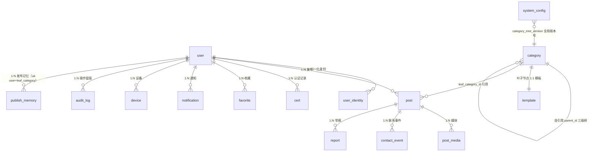
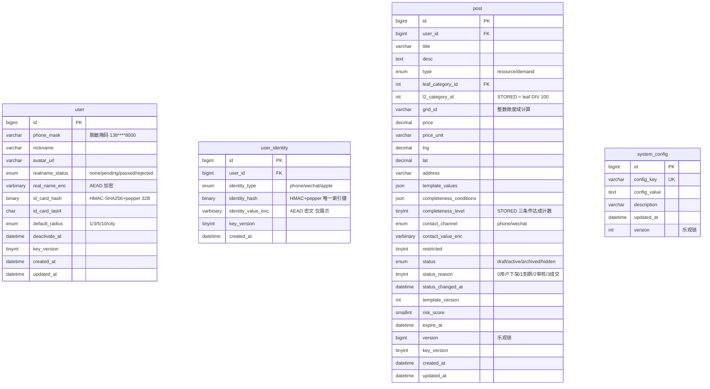

# s2s 二手交易 App — 数据库设计文档

- 版本：v1.1（2026-09-06 全文一致性复核：`idx_pins_cover` 补 `lng`/`lat` 至 10 列、`user` 补 `uk_id_card_hash`、新增 §3.16/§3.17 埋点表字典、§6 容量数字按新索引重测）
- 日期：2026-09-04（初版）／2026-09-06（复核）
- 依据：`docs/PRD.md` §13（数据需求）、`docs/architecture/系统总体架构设计文档.md` §5（数据架构）、`docs/plans/2026-09-04-1630-refactor-batch1-data-model-corrections-plan.md`（结构性修正契约）
- DDL 脚本（与本文档同目录，见下方「交付物清单」）：
  - 业务库 `docs/database/ddl/V1__init_schema.sql`（Flyway 命名 `V1`，15 张业务表）
  - 埋点库 `docs/database/ddl/V1__init_track_schema.sql`（架构 R14 独立 database，2 张埋点表）
- 共 15 张表：11 Batch1 + 3 Batch2 + 1 新建 `system_config`

## 0. 交付物清单

数据库设计阶段的全部产物集中在 `docs/database/` 下：

```
docs/database/
├── 数据库设计文档.md          本文档（ER 图 §2、数据字典 §3、索引 §4、容量 §6）
├── ddl/
│   ├── V1__init_schema.sql        业务库 s2s，15 张表
│   └── V1__init_track_schema.sql  埋点库 s2s_track，2 张表
└── scripts/                    实测验证脚本，非交付件，用于复现 §4.4 的结论
    ├── verify_schema.sh           建库 + 执行 DDL + 结构断言
    ├── assert_behavior.sh         8 项行为断言（A1–A8 全部实测通过）
    ├── explain_pins_real.sh       R15 覆盖索引实测（长尾分布造数）
    ├── explain_pins_hot.sh        热点组合 EXPLAIN
    └── measure_row_size.sh        行宽实测，供 §6 容量估算
```

**两份 DDL 沿用 Flyway 的 `V<版本>__<描述>.sql` 命名**，但当前不在任何工程的扫描路径下——后端工程尚未搭建。工程搭建时按 §1.4 的库名配置双 datasource，将两份脚本分别放入 `classpath:db/migration` 与 `classpath:db/migration_track` 即可直接使用，无需改写。

`scripts/` 下的 shell 脚本依赖 WSL Docker 环境（容器名与密码写在脚本首部），是产出 §4.4 与 §6 数字的过程工具，不属于交付件。

---

## 1. 概述

### 1.1 技术栈

- 持久化：MySQL 8.4 LTS（唯一持久化存储，承载业务 + 埋点 + 审计三类）
- 字符集：`utf8mb4` + `utf8mb4_0900_ai_ci`
- 引擎：InnoDB
- 迁移：Flyway，脚本路径 `classpath:db/migration`，首版 `V1__init_schema.sql`
- 客户端：Flutter（不直连 MySQL，经 Spring Boot 3 服务端）
- ORM：MyBatis-Plus

### 1.2 设计原则

1. **不写外键约束**：读路径信任冗余列、写路径由 service 层同事务维护一致性；FK 在分库分表演进时是负担（架构 §5.1.1）。
2. **生成列用 STORED**：可建索引、可被 `WHERE` 命中、读路径不需重算、列值由 DDL 保证不漂移。
3. **敏感字段盲索引双列范式**：HMAC-SHA256+pepper 列承载唯一索引与等值查询，AEAD 密文列仅用于解密展示；MySQL 无内置 HMAC，由 Java `javax.crypto.Mac` 计算后存 `BINARY(32)`。
4. **写守卫按写入来源分流**：用户意图写守 `version`，冲突返 `40903`；系统派生写守 `status IN (合法前驱集)`，非法流转表现为 0 行受影响。
5. **每张表带 COMMENT、每个字段带 COMMENT**（中文，符合用户规则 5.2）。

### 1.3 15 张表清单

| # | 表 | 域 | 批次 | 关键修正 |
|---|---|---|---|---|
| 1 | `user` | auth | Batch1 | R2：phone→phone_mask，原文落 user_identity |
| 2 | `user_identity` | auth | Batch1 | R1：盲索引双列 identity_hash + identity_value_enc |
| 3 | `category` | category | Batch1 | R12：version 列移出至 system_config |
| 4 | `template` | category | Batch1 | R19：新造字段字典 |
| 5 | `post` | post | Batch1 | R6/R7/R9/R10/R11：状态归因 + 两个生成列 + 模板版本 |
| 6 | `post_media` | post | Batch1 | R20：表名沿用 PRD 不用架构 §5.1 的 media |
| 7 | `publish_memory` | post | Batch2 | — |
| 8 | `contact_event` | contact | Batch1 | 红线：禁增 contacted_success/deal_done |
| 9 | `report` | contact | Batch1 | R26：补齐 5 列 |
| 10 | `favorite` | contact | Batch2 | R24：新造字段字典 |
| 11 | `cert` | cert | Batch2 | R25：新造字段字典 |
| 12 | `notification` | notify | Batch1 | R22：新造字段字典 |
| 13 | `device` | notify | Batch1 | R21：新造字段字典 |
| 14 | `audit_log` | common | Batch1 | R23：新造字段字典 |
| 15 | `system_config` | common | Batch1 | R12/R27：新建 key-value 配置表 |

埋点事件表按月分表（`track_event_YYYYMM`）放独立 database，不在 15 张内，详见《可观测性架构方案》。两张**运维基础设施表**（同样不计入 15 张口径）由埋点库的独立迁移脚本建立：首月表 `track_event_202609`（含 `leaf_category_id`/`completeness_level`/`is_ai_assisted`/`grid_id` 四个发布时维度快照列，R8 落点）与跨月兜底表 `track_event_fallback`（KTD4/R18 落点，**不分区、除主键外无业务二级索引**，常态为空）。

> 本表「批次」列指**表所属功能的上线批次**，与 §5 保留策略矩阵的「批次」列（指**清理任务的落地批次**）语义不同：标 Batch2 的表在 Batch1 一并建出（空表不占成本、避免后续加表迁移），但其功能与配套定时任务随功能批次上线。

### 1.4 database 命名与物理部署

上游文档（架构 §5、《可观测性架构方案》§4.4）只规定「两个 database、同一 MySQL 实例」的拓扑，未规定名称。本节定名。

| database | 承载内容 | 迁移脚本 | 依据 |
|---|---|---|---|
| `s2s` | 15 张业务表（含 `audit_log`） | `V1__init_schema.sql` | 架构 §5.1 |
| `s2s_track` | `track_event_YYYYMM` 月表 + `track_event_fallback` 兜底表 | `V1__init_track_schema.sql` | 架构 R14、《可观测性架构方案》:151 |

**库级字符集与排序规则**（两库一致）

```sql
CREATE DATABASE `s2s`       DEFAULT CHARACTER SET utf8mb4 COLLATE utf8mb4_0900_ai_ci;
CREATE DATABASE `s2s_track` DEFAULT CHARACTER SET utf8mb4 COLLATE utf8mb4_0900_ai_ci;
```

**三条约束**

1. **同实例、不同 database**：两库跑在同一个 MySQL 进程内（架构 §4.1 的 2 核 2G ECS 放不下第二个实例），靠 database 边界隔离而非物理隔离。分库的目的是「埋点表的慢查询不拖累业务库的 buffer pool 命中率」（《可观测性架构方案》:345），不是容灾。
2. **`audit_log` 归业务库不归埋点库**：它是合规举证的唯一来源、保留 180 天，而埋点数据保留 90 天且不可用于举证（《可观测性架构方案》:225-226）。两者保留期与用途都不同，混库会让 180 天的合规下限被 90 天的清理任务误伤。
3. **禁止跨库 JOIN**：埋点分析需要业务维度时，走发布时写入的维度快照列（`leaf_category_id`/`completeness_level`/`is_ai_assisted`/`grid_id`），不回查业务库。这是 R8 设置快照列的原因——跨库 JOIN 一旦写进代码，将来埋点库迁走（架构 §10 的 SLS 迁移条款）就会全部失效。

**库名不写进 DDL 脚本**：两份 `V1__*.sql` 均不含 `CREATE DATABASE` 与 `USE` 语句，database 由部署环境预先创建、迁移工具通过连接串指定。这样同一份 DDL 可用于开发/测试/生产的不同库名，不需要改脚本。

---

## 2. ER 图



**核心实体字段速览**：



---

## 3. 数据字典

### 3.1 `user` — 用户账号

| 字段 | 类型 | 约束 | 说明 |
|---|---|---|---|
| `id` | bigint | PK, AUTO_INCREMENT | 用户 ID |
| `phone_mask` | varchar(20) | NOT NULL | 手机号脱敏掩码（如 `138****8000`），仅展示；原文落 `user_identity` 走盲索引 |
| `nickname` | varchar(32) | NOT NULL | 昵称 |
| `avatar_url` | varchar(256) | NULL | 头像 OSS URL |
| `realname_status` | enum | NOT NULL DEFAULT 'none' | 实名状态：none/pending/passed/rejected |
| `real_name_enc` | varbinary(255) | NULL | 姓名 AEAD 密文（仅解密展示） |
| `id_card_hash` | binary(32) | NULL, UNIQUE | 身份证号 HMAC-SHA256+pepper 32 字节，不可逆；唯一索引实现「一证一号」 |
| `id_card_last4` | char(4) | NULL | 身份证后 4 位明文（用户自查与客服核对） |
| `default_radius` | enum | NOT NULL DEFAULT '3' | 默认搜索半径档：1/3/5/10/city |
| `deactivate_at` | datetime | NULL | 注销发起时间，+7 天冷静期 |
| `key_version` | tinyint | NOT NULL DEFAULT 0 | 加解密密钥版本号（支持灰度轮换） |
| `created_at` | datetime | NOT NULL DEFAULT CURRENT_TIMESTAMP | 创建时间 |
| `updated_at` | datetime | NOT NULL DEFAULT CURRENT_TIMESTAMP ON UPDATE CURRENT_TIMESTAMP | 更新时间 |

**索引**：
- `PRIMARY(id)`
- `uk_id_card_hash(id_card_hash)` — 实名去重「一证一号」，同时承载 HMAC 确定性列的等值查询（盲索引范式，见 §7.1）。**未实名用户该列为 NULL，MySQL 唯一索引允许多个 NULL，故不与「大多数用户未实名」冲突**
- `idx_realname_status(realname_status)`
- `idx_deactivate_at(deactivate_at)`

**对外视图白名单**：`id`/`nickname`/`avatar_url`/`realname_status`/`qualification_badges[]`；`phone_mask`/`real_name_enc`/`id_card_hash` 禁止出现在任何 API 响应中（§9.6 数据最小化）。

### 3.2 `user_identity` — 登录身份归一化映射

| 字段 | 类型 | 约束 | 说明 |
|---|---|---|---|
| `id` | bigint | PK, AUTO_INCREMENT | 身份行 ID |
| `user_id` | bigint | NOT NULL | 指向 `user.id`；多条身份共用同一 user_id 即同一自然人 |
| `identity_type` | enum | NOT NULL | phone/wechat/apple；Batch1 只写 phone，wechat/apple 于 Batch2 打开 |
| `identity_hash` | binary(32) | NOT NULL | HMAC-SHA256+pepper 32 字节，承载唯一索引与等值查询 |
| `identity_value_enc` | varbinary(255) | NOT NULL | AEAD 密文（随机 IV），仅用于解密展示 |
| `key_version` | tinyint | NOT NULL | 加解密密钥版本号 |
| `created_at` | datetime | NOT NULL DEFAULT CURRENT_TIMESTAMP | 绑定时间 |

**索引**：
- `PRIMARY(id)`
- `uk_type_hash(identity_type, identity_hash)` — 同一身份值不可绑两个账号
- `uk_user_type(user_id, identity_type)` — 一个账号在每种身份上至多一条
- `idx_user_id(user_id)`

**禁出现在 API 响应中**，与 `user.phone_mask` 同级处置。注销清理按 `user_id` 删除本表**全部**行，不得只删 `phone` 行（§3.4.1 约束 3）。

### 3.3 `category` — 三级分类树

| 字段 | 类型 | 约束 | 说明 |
|---|---|---|---|
| `id` | int | PK | 分类 ID（三级编号即不变量，已发布不得重排） |
| `parent_id` | int | NULL | 父分类 ID；顶级为 NULL |
| `level` | tinyint | NOT NULL | 层级 1=大类/2=二级/3=叶子 |
| `name` | varchar(32) | NOT NULL | 分类名 |
| `color` | varchar(32) | NULL | 大类色，按 PRD §1.4.3 Token 键取值（如 `cat-vehicle`） |
| `icon` | varchar(64) | NULL | Material Symbols 图标名 |
| `need_cert` | varchar(32) | NULL | 非空即高敏类目，发布前强制认证类型 |
| `forbidden` | tinyint | NOT NULL DEFAULT 0 | 禁发类目标记（运营可配） |
| `cluster_threshold` | tinyint | NOT NULL DEFAULT 8 | 差异化聚合阈值（工作 3 / 房屋 5 / 生活 8 / 车辆·服务 8） |
| `sort_order` | int | NOT NULL DEFAULT 0 | 同级排序 |

**索引**：`PRIMARY(id)`、`idx_parent_id(parent_id)`、`idx_level_sort(level, sort_order)`

**R12 修正**：原 PRD §13.2 `category.version` 列已移出，全局版本号存 `system_config` 表的 `category_tree_version` 配置项。

### 3.4 `template` — 叶子类目发布模板 Schema

| 字段 | 类型 | 约束 | 说明 |
|---|---|---|---|
| `id` | bigint | PK, AUTO_INCREMENT | 模板 ID |
| `leaf_category_id` | int | NOT NULL | 叶子类目 ID（与 category 表 1:1） |
| `fields` | json | NOT NULL | 动态表单 Schema（字段定义、校验规则、价格单位等） |
| `template_version` | int | NOT NULL | 模板版本号，与 `post.template_version` 对齐 |
| `updated_at` | datetime | NOT NULL DEFAULT CURRENT_TIMESTAMP ON UPDATE CURRENT_TIMESTAMP | 模板更新时间 |

**索引**：`PRIMARY(id)`、`uk_leaf_category_id(leaf_category_id)` — 叶子类目 1:1 模板

### 3.5 `post` — 发布信息（资源/需求同表）

| 字段 | 类型 | 约束 | 说明 |
|---|---|---|---|
| `id` | bigint | PK, AUTO_INCREMENT | 帖子 ID |
| `user_id` | bigint | NOT NULL | 发布者 user_id |
| `type` | enum | NOT NULL | resource/demand |
| `leaf_category_id` | int | NOT NULL | 叶子类目 ID |
| `l2_category_id` | int | GENERATED STORED | 二级类目 ID = `leaf_category_id DIV 100`，不可写 |
| `title` | varchar(64) | NOT NULL | 标题（过敏感词双重校验） |
| `desc` | text | NOT NULL | 描述正文 |
| `grid_id` | varchar(24) | NOT NULL | 约 500m 网格 ID 字符串 `gx_gy`，整数微度域计算 |
| `price` | decimal(12,2) | NULL | 价格（NULL 表示面议） |
| `price_unit` | varchar(16) | NULL | 价格单位 |
| `lng` | decimal(10,6) | NOT NULL | GCJ-02 经度（仅发布点） |
| `lat` | decimal(10,6) | NOT NULL | GCJ-02 纬度（仅发布点） |
| `address` | varchar(128) | NULL | 门牌号地址 |
| `template_values` | json | NULL | 模板字段实际值 |
| `contact_channel` | enum | NOT NULL | phone/wechat（二选一单轨） |
| `contact_value_enc` | varbinary(255) | NOT NULL | 联系方式 AEAD 密文 |
| `completeness_conditions` | json | NOT NULL | 三条件达成态 `{required_full, address_precise, leaf_matched}` |
| `completeness_level` | tinyint | GENERATED STORED | 完整度档位 0=红/1=黄/2=绿，由三条件达成计数派生 |
| `restricted` | tinyint | NOT NULL DEFAULT 0 | 未实名先发后审受限态 |
| `status` | enum | NOT NULL DEFAULT 'draft' | draft/active/archived/hidden |
| `status_reason` | tinyint | NULL | 进入非 active 路径：0=用户主动下架/1=到期自动下架/2=审核下架/3=成交 |
| `status_changed_at` | datetime | NOT NULL DEFAULT CURRENT_TIMESTAMP | status 变更时刻 |
| `template_version` | int | NOT NULL | 发布时模板版本号 |
| `risk_score` | smallint | NOT NULL DEFAULT 0 | 风险分累计，≥60 自动下架 |
| `expire_at` | datetime | NOT NULL | 到期时间（默认 +7 天；14 天未刷新自动 archived） |
| `version` | bigint | NOT NULL DEFAULT 0 | 乐观锁版本号 |
| `key_version` | tinyint | NOT NULL | 联系方式 AEAD 密钥版本号 |
| `created_at` | datetime | NOT NULL DEFAULT CURRENT_TIMESTAMP | 创建时间 |
| `updated_at` | datetime | NOT NULL DEFAULT CURRENT_TIMESTAMP ON UPDATE CURRENT_TIMESTAMP | 更新时间 |

**生成列表达式**：

```sql
-- l2_category_id
GENERATED ALWAYS AS (`leaf_category_id` DIV 100) STORED

-- completeness_level（下方为可读缩写；完整表达式以 ddl/V1__init_schema.sql 为真源）
GENERATED ALWAYS AS (
  CASE
    WHEN (三条件达成计数) = 3 THEN 2
    WHEN (三条件达成计数) = 2 THEN 1
    ELSE 0
  END
) STORED
```

其中「三条件达成计数」为下式，DDL 中三个分支各完整书写一次（MySQL 生成列不支持子表达式复用）：

```sql
  IF(JSON_UNQUOTE(JSON_EXTRACT(`completeness_conditions`, '$.required_full'))   = 'true', 1, 0)
+ IF(JSON_UNQUOTE(JSON_EXTRACT(`completeness_conditions`, '$.address_precise')) = 'true', 1, 0)
+ IF(JSON_UNQUOTE(JSON_EXTRACT(`completeness_conditions`, '$.leaf_matched'))    = 'true', 1, 0)
```

**索引**：
- `PRIMARY(id)`
- `idx_pins_cover(grid_id, leaf_category_id, type, status, expire_at, id, lng, lat, completeness_level, user_id)` — `/map/pins` 覆盖索引：前 5 列为过滤条件，后 5 列为响应字段（PRD §6.10 `pins[]` schema 的 `id`/`lng`/`lat`/`category_id`/`type`/`completeness_level` 六项已全在索引内），达成 index-only scan 不回表；`user_id` 供归属判定。列序由 EXPLAIN 实测定，见 §4.2
- `idx_user_status_created(user_id, status, created_at)` — 我的发布筛选
- `idx_status_expire(status, expire_at)` — 到期自动下架扫描
- `idx_l2_type_status(l2_category_id, type, status, expire_at)` — Hard Filter 候选（Batch2 启用）
- `idx_status_completeness(status, completeness_level, created_at)` — 列表完整度排序

### 3.6 `post_media` — 帖子媒体

| 字段 | 类型 | 约束 | 说明 |
|---|---|---|---|
| `id` | bigint | PK, AUTO_INCREMENT | 媒体 ID |
| `post_id` | bigint | NULL | 关联 post.id；未关联时为孤儿 media（编辑态） |
| `object_key` | varchar(128) | NOT NULL | OSS 对象键 |
| `audit_status` | enum | NOT NULL DEFAULT 'pending' | pending/pass/reject |
| `reject_reason` | varchar(64) | NULL | 审核拒绝原因 |
| `content_type` | varchar(32) | NOT NULL | MIME 类型 |
| `size_bytes` | int | NOT NULL | 文件字节数 |
| `created_at` | datetime | NOT NULL DEFAULT CURRENT_TIMESTAMP | 创建时间 |

**索引**：`PRIMARY(id)`、`idx_post_id_audit(post_id, audit_status)`、`idx_audit_status_created(audit_status, created_at)`

**可见性**：`audit_status != pass` 的 `media_id` 不出现在任何**非本人**可见的响应里；本人在编辑态与"我的发布"中必须能看到 `pending`/`reject` 图位及拒绝原因（架构 §2.1）。

### 3.7 `publish_memory` — 发布记忆

| 字段 | 类型 | 约束 | 说明 |
|---|---|---|---|
| `id` | bigint | PK, AUTO_INCREMENT | 记忆 ID |
| `user_id` | bigint | NOT NULL | 用户 ID |
| `leaf_category_id` | int | NOT NULL | 叶子类目 ID |
| `values` | json | NOT NULL | 最近一次填写值 |
| `saved_at` | datetime | NOT NULL DEFAULT CURRENT_TIMESTAMP | 保存时间 |

**索引**：`PRIMARY(id)`、`uk_user_leaf(user_id, leaf_category_id)`

**保留策略**：>30 天加"建议检查"提示，>180 天清空（架构 §8）。

### 3.8 `contact_event` — 联系事件

| 字段 | 类型 | 约束 | 说明 |
|---|---|---|---|
| `id` | bigint | PK, AUTO_INCREMENT | 事件 ID |
| `post_id` | bigint | NOT NULL | 帖子 ID |
| `from_user_id` | bigint | NOT NULL | 发起联系者 user_id |
| `to_user_id` | bigint | NOT NULL | 被联系发布者 user_id |
| `channel_type` | enum | NOT NULL | phone/wechat |
| `created_at` | datetime | NOT NULL DEFAULT CURRENT_TIMESTAMP | 联系时刻 |

**索引**：`PRIMARY(id)`、`idx_from_user_created(from_user_id, created_at)`、`idx_post_id_created(post_id, created_at)`

**红线**：表中只记录"联系动作是否发生"，**禁止增加 `contacted_success`/`deal_done` 等成交反馈字段**。不禁止从本表已有三字段离线推导客观行为标签（如"联系后 24h 内发布者主动下架"），合规的代理标签体系见 PRD §6.12。

### 3.9 `report` — 举报

| 字段 | 类型 | 约束 | 说明 |
|---|---|---|---|
| `id` | bigint | PK, AUTO_INCREMENT | 举报 ID |
| `post_id` | bigint | NOT NULL | 被举报帖子 ID |
| `reporter_id` | bigint | NOT NULL | 举报者 user_id |
| `reported_user_id` | bigint | NOT NULL | 被举报发布者 user_id |
| `reason` | enum | NOT NULL | false_info/fraud/wrong_category/harassment/other |
| `description` | varchar(512) | NULL | 举报描述 |
| `evidence` | json | NULL | 举报凭证 media_ids 数组 |
| `weight` | tinyint | NOT NULL DEFAULT 0 | 风险分权重（运营可配） |
| `is_false_report` | tinyint | NOT NULL DEFAULT 0 | 运营打标误报，不计入累计风险分 |
| `status` | enum | NOT NULL DEFAULT 'pending' | pending/handled/dismissed |
| `handler_id` | bigint | NULL | 处理人 user_id |
| `handled_at` | datetime | NULL | 处理时间 |
| `created_at` | datetime | NOT NULL DEFAULT CURRENT_TIMESTAMP | 举报时间 |

**索引**：`PRIMARY(id)`、`idx_post_status_created(post_id, status, created_at)`、`idx_reported_user_status(reported_user_id, status, created_at)`、`idx_reporter_created(reporter_id, created_at)`

### 3.10 `favorite` — 收藏

| 字段 | 类型 | 约束 | 说明 |
|---|---|---|---|
| `id` | bigint | PK, AUTO_INCREMENT | 收藏 ID |
| `user_id` | bigint | NOT NULL | 收藏者 user_id |
| `post_id` | bigint | NOT NULL | 被收藏帖子 ID |
| `created_at` | datetime | NOT NULL DEFAULT CURRENT_TIMESTAMP | 收藏时间 |
| `deleted_at` | datetime | NULL | 软删时间（30 天后物删） |

**索引**：`PRIMARY(id)`、`uk_user_post(user_id, post_id)` UNIQUE、`idx_user_deleted(user_id, deleted_at)`、`idx_deleted_at(deleted_at)`

**唯一性**：由**物理唯一索引 `uk_user_post(user_id, post_id)`** 保证，而非 service 层查重。索引不含 `deleted_at`，故一对 user-post 全生命周期只有一行：取消收藏置 `deleted_at`、重新收藏置回 `NULL`。service 层用 `INSERT INTO favorite(user_id, post_id) VALUES(?,?) ON DUPLICATE KEY UPDATE deleted_at = NULL` 一条语句完成「插入或复活」，由数据库保证幂等。

> 原方案「service 层显式查重」在两请求同时查不到时会双插，已于 2026-09-04 评审改为物理唯一索引。

### 3.11 `cert` — 实名与资质认证记录

| 字段 | 类型 | 约束 | 说明 |
|---|---|---|---|
| `id` | bigint | PK, AUTO_INCREMENT | 认证 ID |
| `user_id` | bigint | NOT NULL | 申请人 user_id |
| `cert_type` | enum | NOT NULL | personal_realname/personal_qualification/enterprise/vehicle |
| `status` | enum | NOT NULL DEFAULT 'pending' | pending/approved/rejected/expired |
| `submitted_at` | datetime | NOT NULL DEFAULT CURRENT_TIMESTAMP | 提交时间 |
| `approved_at` | datetime | NULL | 审核通过时间 |
| `expire_at` | datetime | NULL | 认证到期时间 |
| `reject_reason` | varchar(256) | NULL | 审核拒绝原因 |
| `ocr_image_ref` | varchar(128) | NULL | OCR 原始证照图 OSS 引用（7 天后清理） |
| `fail_count` | tinyint | NOT NULL DEFAULT 0 | 该用户该类型认证失败次数 |
| `lock_until` | datetime | NULL | 锁定到（防刷） |

**索引**：`PRIMARY(id)`、`idx_user_type_status(user_id, cert_type, status)`、`idx_status_submitted(status, submitted_at)`

**与 `user` 表职责边界**：`user.realname_status` 存最新聚合态（决定 §3.7 两档权限），`cert` 存每次申请记录（含拒绝历史）。

### 3.12 `notification` — 站内通知

| 字段 | 类型 | 约束 | 说明 |
|---|---|---|---|
| `id` | bigint | PK, AUTO_INCREMENT | 通知 ID |
| `user_id` | bigint | NOT NULL | 接收者 user_id |
| `type` | enum | NOT NULL | system/interaction/cert（对应三 Tab） |
| `title` | varchar(64) | NOT NULL | 通知标题 |
| `summary` | varchar(256) | NULL | 通知摘要 |
| `target_id` | bigint | NULL | 关联对象 ID（post/report/cert 等） |
| `created_at` | datetime | NOT NULL DEFAULT CURRENT_TIMESTAMP | 创建时间 |
| `read_at` | datetime | NULL | 已读时间 |
| `deleted_at` | datetime | NULL | 软删时间 |

**索引**：`PRIMARY(id)`、`idx_user_type_deleted_created(user_id, type, deleted_at, created_at)`

### 3.13 `device` — 推送 token 与设备指纹

| 字段 | 类型 | 约束 | 说明 |
|---|---|---|---|
| `id` | bigint | PK, AUTO_INCREMENT | 设备 ID |
| `user_id` | bigint | NOT NULL | 所属 user_id |
| `fingerprint` | varchar(64) | NOT NULL, UNIQUE | 设备指纹（UUID，限频键，重装即变） |
| `platform` | enum | NOT NULL | android/ios |
| `push_token` | varchar(128) | NULL | 推送 token（FCM/APNs） |
| `last_active_at` | datetime | NOT NULL DEFAULT CURRENT_TIMESTAMP | 最后活跃时间 |

**索引**：`PRIMARY(id)`、`uk_fingerprint(fingerprint)`、`idx_user_id(user_id)`、`idx_last_active_at(last_active_at)`

**双重职责**：`fingerprint` 做联系限频的设备维（§7.7），`push_token` 做推送下发。设备指纹**明确标注为不可信**——用户重装应用或清数据即得到新指纹，只提高刷量成本，不构成安全边界。

### 3.14 `audit_log` — 运营操作留痕

| 字段 | 类型 | 约束 | 说明 |
|---|---|---|---|
| `id` | bigint | PK, AUTO_INCREMENT | 审计 ID |
| `operator_id` | bigint | NOT NULL | 操作人 user_id |
| `operator_role` | enum | NOT NULL | super_admin/admin/auditor/system |
| `action` | varchar(64) | NOT NULL | 动作（如 `post.archive`、`user.deactivate`） |
| `target_type` | varchar(32) | NOT NULL | 目标对象类型（post/user/cert 等） |
| `target_id` | bigint | NOT NULL | 目标对象 ID |
| `before_value` | json | NULL | 变更前值 |
| `after_value` | json | NULL | 变更后值 |
| `reason` | varchar(256) | NULL | 操作理由 |
| `created_at` | datetime | NOT NULL DEFAULT CURRENT_TIMESTAMP | 操作时间 |

**索引**：`PRIMARY(id)`、`idx_operator_created(operator_id, created_at)`、`idx_target_created(target_type, target_id, created_at)`

**保留策略**：≥180 天保留，仅超级管理员可查，导出需二次确认（§9.10.1）。

### 3.15 `system_config` — 系统级 key-value 配置

| 字段 | 类型 | 约束 | 说明 |
|---|---|---|---|
| `id` | bigint | PK, AUTO_INCREMENT | 配置项 ID |
| `config_key` | varchar(64) | NOT NULL, UNIQUE | 配置键（如 `category_tree_version`） |
| `config_value` | text | NOT NULL | 配置值 |
| `description` | varchar(256) | NULL | 配置说明 |
| `updated_at` | datetime | NOT NULL DEFAULT CURRENT_TIMESTAMP ON UPDATE CURRENT_TIMESTAMP | 更新时间 |
| `version` | int | NOT NULL DEFAULT 0 | 乐观锁版本号 |

**索引**：`PRIMARY(id)`、`uk_config_key(config_key)`

**初始数据**：

| config_key | config_value | description |
|---|---|---|
| `category_tree_version` | `2026-08-31.1` | 分类树全局版本号，格式 `YYYY-MM-DD.N`；运营改配置时同日递增 `N`、跨日重置为当日 `.1` |
| `detail_quota_enabled` | `off` | 未实名详情浏览额度开关 `on`/`off`；Batch1 为 `off`，随 Batch2 实名上线置 `on` |

### 3.16 `track_event_YYYYMM` — 埋点事件月表（埋点库）

**属埋点库 `s2s_track`，不计入「15 张业务表」口径**。首月表为 `track_event_202609`；按月分表，每月 25 日由「埋点月表预建」定时任务建下月表（架构 §8）。结构真源：《可观测性架构方案》§4.4（宽表范式：公共字段拆列 + JSON 属性列）。

| 字段 | 类型 | 约束 | 说明 |
|---|---|---|---|
| `id` | bigint | PK, AUTO_INCREMENT | 事件 ID |
| `event_name` | varchar(64) | NOT NULL | 事件名（`layer_switch`/`post_published`/`contact_event` 等） |
| `interaction_id` | char(36) | NOT NULL | 交互标识，客户端埋点与服务端访问日志的唯一 join 键（PRD §12.1） |
| `user_id` | bigint | NULL | 触发用户；未登录事件补报前为 NULL |
| `device_id` | char(36) | NULL | 设备指纹（`X-Device-Id`），**不可信**，仅做限频与去重辅助 |
| `ts` | datetime(3) | NOT NULL | 采集时刻（非上报时刻），月表归属以此列为准 |
| `props` | json | NULL | 事件专属属性（`duration_ms`/`cache_hit`/`rank`/`channel_type` 等） |
| `leaf_category_id` | int | NULL | 维度快照：发布时叶子类目 ID |
| `completeness_level` | tinyint | NULL | 维度快照：完整度档位 0=红/1=黄/2=绿 |
| `is_ai_assisted` | tinyint(1) | NULL | 维度快照：是否 AI 辅助发布 0/1 |
| `grid_id` | varchar(24) | NULL | 维度快照：**发布点**网格 ID；只能是发布点，严禁写入用户位置 |
| `created_at` | datetime | NOT NULL DEFAULT CURRENT_TIMESTAMP | 入库时间 |

**索引**：
- `PRIMARY(id)`
- `uk_event_dedup(interaction_id, event_name, user_id, ts)` — **唯一**，事件维度去重（详见下方边界 5）
- `idx_event_ts(event_name, ts)` — 按事件名 + 时间窗算指标
- `idx_user_ts(user_id, ts)` — 按用户回溯行为序列

> 原 `idx_interaction(interaction_id)` **已删除**：`uk_event_dedup` 的最左前缀即 `interaction_id`，完全覆盖「与服务端访问日志双向关联」的等值查询。保留两者等于同一列建两遍索引，只增写放大不增查询能力。

**五条边界**：
1. **维度快照不是冗余**：四个快照列（`leaf_category_id`/`completeness_level`/`is_ai_assisted`/`grid_id`）记录**发布时刻的事实**，使分析无需跨库 join、且不受后续改帖影响（PRD:2253）。
2. **`grid_id` 宽度与业务库 `post.grid_id` 严格一致（`VARCHAR(24)`）**：同一列语义须同宽，否则跨库比对易踩截断。`device_id` 为 `CHAR(36)` 而业务库 `device.fingerprint` 为 `VARCHAR(64)`——两者语义不同（前者是客户端 UUID，后者是服务端计算的指纹），差异保留。
3. **异步旁路写入，允许丢**：本表数据不可用于合规举证，合规留痕走业务库 `audit_log`。
4. **保留 90 天，清理必须 drop 整表**：见 §5 与 §6.5。
5. **去重靠 `uk_event_dedup`，不靠幂等键**：见 §3.16.1。

#### 3.16.1 `uk_event_dedup` — 为何必须存在，以及为何是这四列

**为何必须存在。** 客户端埋点上报器**每次组批都换新 `Idempotency-Key`**（《前后端详细设计文档》§17.4.1）。这条规则本身是为了防止更坏的事故：失败批次退回队列头部后会与新采集事件重新组批，内容已变却沿用旧 Key，会命中服务端幂等缓存直接返回首次的 `code=0`，客户端误判成功并出队 —— **整批事件静默丢失且无任何错误日志**。代价是幂等键不再能拦住「请求已落库、响应丢在回程 → 客户端重传整批」这一种重复。于是防线**只能**建在数据库层。缺这个索引，则 §17.4.1 的客户端规则一上线就会持续产生重复行，污染所有按次数计算的指标（含 P95 的分母）。

**为何这四列足以唯一标识一个事件。**

| 列 | 承担的区分度 |
|---|---|
| `interaction_id` | 区分不同交互。每次交互一个 UUID，基数最高 |
| `event_name` | 同一交互内可能埋多个不同事件 |
| `user_id` | 防止跨用户碰撞（`interaction_id` 由客户端生成，不可信） |
| `ts` | 同一交互内同名事件的多次触发（毫秒精度） |

**这个约束能成立，前提是 `ts` 取客户端采集时刻。** 这一点容易被当成无关细节而在实现时改掉。若 `ts` 改为服务端到达时刻，则同一批事件重传时会拿到**不同的 `ts`**，唯一键当场失效、去重能力归零，而**表面上一切正常**（索引还在、没有报错、只是不再挡住任何东西）。因此 §3.16 字段表里 `ts` 的「采集时刻（非上报时刻）」不只是月表归属口径，同时是本约束的**成立条件**。

**落库语句必须是 `INSERT ... ON DUPLICATE KEY UPDATE id = id`。**

```sql
-- 正确：命中唯一键时执行一个无副作用的自赋值，等效于「忽略」但不掩盖其他错误
INSERT INTO track_event_202609
  (event_name, interaction_id, user_id, device_id, ts, props, ...)
VALUES (?, ?, ?, ?, ?, ?, ...)
ON DUPLICATE KEY UPDATE id = id;
```

**严禁用 `INSERT IGNORE`。** 它不只忽略唯一键冲突，还会把**数据截断、非空列插入 NULL、类型转换失败**等一并降级为 warning。埋点写入路径上用它，等于关掉了这张表全部的数据质量报错 —— 而埋点本就是「异步旁路、允许丢」的低关注度链路，一旦静默容错，脏数据可以积累很久无人察觉。两者写起来只差几个字符，行为差别却是「只忽略重复」与「忽略一切」。

**它引入的反向风险，以及为什么可接受。** 唯一索引会让**合法的**同键重复事件被丢弃 —— 即同一用户、同一交互、同一事件名、同一毫秒内的两次真实触发。这与项目既定方向「宁可重一条，不可丢一条」相反，因此需要一条准入纪律：**新增事件类型时，必须先核验它在同一交互内是否可能合法地在同一毫秒重复触发**。当前四必埋事件均不满足该条件（`layer_switch` 为图层切换、`post_published` 为发布成功、`contact_event` 为联系动作，都是用户级离散动作，不存在同毫秒双触发），故约束安全。此纪律已写入 §4.4 断言与《前后端详细设计文档》§19 自检清单。

**`user_id` 允许 NULL 带来的缺口，用断言而非改列来守护。** MySQL 唯一索引**不对 NULL 去重**（多行 NULL 可共存），所以 `user_id IS NULL` 的行完全不受本约束保护。这里不把列改成 `NOT NULL`，理由是：契约已规定 `POST /track/events` **必须登录态**（未登录回 `40101`）且 `user_id` **一律取登录态**、不取请求体，因此入库路径上该列恒非 NULL；字段表中「未登录事件补报前为 NULL」描述的是**客户端本地队列**的状态，不是数据库行的状态。这个判断是一个**假设**，所以用 `assert_behavior.sh` 的 A8 把它变成可执行检查（断言 `user_id IS NULL` 的行数恒为 0），而不是靠记忆维持。

**月表预建任务必须一并创建本索引。** 每月 25 日预建下月表的任务（架构 §8）若只复制列结构而漏掉 `uk_event_dedup`，则**下个月的去重会静默失效**，且因为「上个月一直是好的」而极难归因。预建任务应以 `CREATE TABLE ... LIKE track_event_YYYYMM` 实现 —— `LIKE` 会连索引一起复制，而逐列拼 DDL 不会。


### 3.17 `track_event_fallback` — 埋点跨月写入兜底表（埋点库）

**属埋点库 `s2s_track`，不计入「15 张业务表」口径**。与月表同结构，**不分区、除主键外无业务二级索引**。仅当写月表返回 `1146`（表不存在）时降级写入；后台 `@Scheduled` 任务每分钟按 `ts` 搬运到正确月表并删除本表对应行。缺此表则 KTD4 的兜底路径首次触发即失败，跨月零点的数据静默丢失。

| 字段 | 类型 | 约束 | 说明 |
|---|---|---|---|
| `id` | bigint | PK, AUTO_INCREMENT | 兜底行 ID |
| `event_name` | varchar(64) | NOT NULL | 事件名 |
| `interaction_id` | char(36) | NOT NULL | 交互标识 |
| `user_id` | bigint | NULL | 触发用户 |
| `device_id` | char(36) | NULL | 设备指纹 |
| `ts` | datetime(3) | NOT NULL | 采集时刻，搬运任务据此判定目标月表 |
| `props` | json | NULL | 事件专属属性 |
| `leaf_category_id` | int | NULL | 维度快照：叶子类目 ID |
| `completeness_level` | tinyint | NULL | 维度快照：完整度档位 |
| `is_ai_assisted` | tinyint(1) | NULL | 维度快照：是否 AI 辅助发布 |
| `grid_id` | varchar(24) | NULL | 维度快照：发布点网格 ID |
| `created_at` | datetime | NOT NULL DEFAULT CURRENT_TIMESTAMP | 入库时间 |

**索引**：`PRIMARY(id)` —— 刻意不建二级索引，**也刻意不建月表上的 `uk_event_dedup`**。本表是缓冲而非查询对象，搬运任务按主键顺序扫全表即可；建索引只会拖慢降级路径的写入，而降级路径恰是最需要写得快的时刻。去重只需在数据抵达**终点**时发生一次：搬运任务以 `INSERT ... ON DUPLICATE KEY UPDATE id = id` 写入月表，兜底期间积累的重复会被月表的唯一索引一并消化。**因此 A7 断言只比对列结构差集，不比对索引** —— 两表索引本就应当不同。

**常态应为空表**：非空且持续增长即说明月表预建任务失效，应作为告警项（架构 §8）。列结构与月表的差集为空由 `assert_behavior.sh` 的 A7 断言守护，见 §4.4。

---

## 4. 索引设计

### 4.1 PRD §13.3 七场景对照

| 查询场景 | 候选索引 | 验收线 | 落地状态 |
|---|---|---|---|
| 地图按半径取 Pin | `(grid_id, leaf_category_id, type, status, expire_at)` | 无全表扫描 + RT P95 ≤150ms | ✅ 覆盖索引 `idx_pins_cover`，含 `id`/`lng`/`lat`/`completeness_level`/`user_id` 响应字段列 |
| AI 匹配 Hard Filter | `(city_id, l2_category_id, type, status, expire_at)` | 同上 | ⏸ Batch2 随 `ai` 域交付，Batch1 不建（架构 §5.3）；`city_id` 列归属待 Batch2 定 |
| 列表三种排序 | 距离＝`grid_id` 集合过滤后应用层计算（见 §4.2 末）；时效＝`(status,created_at)`；完整度＝`(status,completeness_level,created_at)` | 无全表扫描 | ✅ `idx_status_completeness`；距离排序复用 `idx_pins_cover` 前缀，时效索引视查询模式补建 |
| 我的发布筛选 | `(user_id, status, created_at)` | 同上 | ✅ `idx_user_status_created` |
| 到期自动下架扫描 | `(status, expire_at)` | 扫描行数与到期量同阶 | ✅ `idx_status_expire` |
| 联系限频判定 | `contact_event(from_user_id, created_at)` + `device(fingerprint)` + IP 计数走 Redis | 不落库计数 | ✅ `idx_from_user_created` + `uk_fingerprint`；IP 维走 Redis |
| 北极星轴①统计 | 埋点表按 `post_id` 关联，5min 窗口 | — | 埋点表独立 database，见《可观测性架构方案》 |

### 4.2 覆盖索引设计

`/map/pins` 是最高频读路径，候选索引扩展为覆盖索引：

```sql
KEY `idx_pins_cover` (`grid_id`, `leaf_category_id`, `type`, `status`, `expire_at`,
                      `id`, `lng`, `lat`, `completeness_level`, `user_id`)
```

- 前 5 列是 PRD §13.3 候选索引，承担过滤；
- 后 5 列覆盖 `/map/pins` 响应 schema——PRD §6.10 `pins[]` 的六项 `id`/`lng`/`lat`/`category_id`/`type`/`completeness_level` 已全在索引内（`category_id`/`type` 在前缀段），达成 index-only scan 无回表；`user_id` 供归属判定；
- 列序由 EXPLAIN 实测定，见 §4.4。

**为什么 `lng`/`lat` 必须进索引**：覆盖索引的判定标准不是「WHERE 条件都在索引里」，而是「**SELECT 列表也都在索引里**」。`/map/pins` 的响应契约必须返回坐标，若 `lng`/`lat` 不在索引中，EXPLAIN 用 `SELECT id, user_id, completeness_level` 测出的 `Using index` 是假象——真实查询必回表，而 100 万行的数据页达 824MB，远超 256MB buffer_pool，直接违背 §6.4 的生存条件。代价是该索引由 5.5MB 升至 9.5MB/10 万行（详见 §6.2），远低于回表代价。

**距离排序不依赖空间索引**：`lng`/`lat` 为 `DECIMAL(10,6)`，MySQL 的 `SPATIAL` 索引只作用于 `GEOMETRY` 系列类型且要求列 `NOT NULL` + 显式 SRID，`DECIMAL` 无法承载；且 SPATIAL 索引只对 `MBRContains()`/`MBRWithin()` 这类空间谓词有效，对「按距离排序」这种 ORDER BY 场景本就不提供加速。落地方案：用 `grid_id` 集合（视野内 9 格）经 `idx_pins_cover` 前缀过滤出候选集，再在应用层对候选集做 Haversine 距离计算与排序。§4.4 实测 9 格聚合 8294 行、索引扫描 2.44ms，候选集规模完全在应用层可排序范围内，PRD §13.3 的「无全表扫描 + P95 ≤150ms」验收线不受影响。

### 4.3 验收口径

PRD §13.3 与架构 §5.3 共同确立：
- **只规定验收标准，不规定执行计划**：候选索引给出，最终列序由 `EXPLAIN` 实测确定。
- **若实测不达标**：按 §14.1 尾注纪律处理——不得下调本批次 SLA，只能调整下一批次目标。
- **EXPLAIN 验收**：`Extra` 含 `Using index` 即 index-only scan；`Using where; Using index condition` 仍需回表。

### 4.4 实测验证结果（2026-09-05）

验证环境：WSL Docker `mysql:8.0.46`，业务库 `s2s`、埋点库 `s2s_track`。

**结构验证**（`docs/database/scripts/verify_schema.sh`）

| 项 | 结果 |
|---|---|
| 业务库表数量 | 15 张业务表 |
| 埋点库表数量 | 2 张埋点表 |
| 引擎与字符集 | 全部 InnoDB + `utf8mb4_0900_ai_ci` |
| 列注释完整性 | 无缺失、无乱码、无截断 |
| STORED 生成列 | 2 个（`post.l2_category_id`、`post.completeness_level`） |

> 曾另建最小 Maven 工程实测 `mvn flyway:migrate`，两库均迁移成功且与手工执行 DDL 的结果列定义、索引差集为空。该工程属工程搭建阶段产物，已在数据库设计阶段收尾时删除，故上表口径改回手工执行。**Flyway 可执行性已获验证这一结论仍然成立**，后端工程搭建时按 §1.4 的路径与库名配置双 datasource 即可。

**行为断言**（`docs/database/scripts/assert_behavior.sh`，A1–A8 共 8 项**全部实测通过**；A8 于 2026-09-06 补测，环境为 WSL2 Ubuntu-22.04 内的 `mysql:8.0` 容器）

| 编号 | 断言 | 实测输出 |
|---|---|---|
| A1 | 生成列不可写 | `ERROR 3105 (HY000)` — 拒绝对 `l2_category_id` 显式赋值 |
| A2 | 生成列计算正确 | 三条件全真 → `2`；两条件 → `1`；一条件 → `0`；`10101 DIV 100 = 101` |
| A3 | 盲索引唯一约束 | `ERROR 1062 (23000)` on `user_identity.uk_type_hash` |
| A4 | 收藏并发幂等 | 重复 `INSERT ... ON DUPLICATE KEY UPDATE` 恒 1 行；软删后重收藏 `deleted_at` 复位 `NULL` |
| A5 | 写守卫分流 | 非法前驱 `Rows matched: 0`（静默跳过）；合法前驱 `Rows matched: 1`（`active → archived`） |
| A6 | 埋点维度快照列 | 四列均可写入 |
| A7 | 兜底表与月表结构一致 | 列结构差集为空（**只比列，不比索引**——两表索引本应不同，见 §3.17） |
| A8 | 埋点事件去重 `uk_event_dedup` | ✅ **5 个子断言全部通过**，实测输出见下 |

**A8 的 5 个子断言：预期与实测**（新增于 2026-09-06，随缺口 #7 收口一同落地；同日补测）：

| 子项 | 验什么 | 预期 | 实测 |
|---|---|---|---|
| A8.1 | 同键重复 `INSERT ... ON DUPLICATE KEY UPDATE id=id` | 表内仍 **1 行**，不报错、不新增；`props` 保持**首次**值（证明 `id=id` 确实无副作用，没有把后到的覆盖上去） | ✅ `rows=1`、`props_n=1`（写入顺序为 `n:1` 后 `n:2`，实测保持 `1`） |
| A8.2 | `ts` 相差 1 毫秒 | **2 行** — 证明去重键的时间精度是毫秒而非秒 | ✅ `2` |
| A8.3 | 同 `interaction_id`、同 `ts`、不同 `user_id` | **2 行** — 证明跨用户不碰撞（`interaction_id` 客户端生成、不可信） | ✅ `2` |
| A8.4 | `user_id IS NULL` 的行数 | **0** — 把「入库路径上该列恒非 NULL」这个假设变成可执行检查（唯一索引不对 NULL 去重，见 §3.16.1） | ✅ `0` |
| A8.5 | `EXPLAIN` 按 `interaction_id` 等值查询 | `key = uk_event_dedup` — 证明删掉 `idx_interaction` 后，与访问日志关联的查询仍然走索引 | ✅ `type=ref`、`key=uk_event_dedup`、`key_len=144`、`Extra=Using where; Using index`（覆盖索引，无回表） |

> **A8.1 是这五条里最不可省的一条。** 它是唯一能区分 `ON DUPLICATE KEY UPDATE id=id`（正确）与 `ON DUPLICATE KEY UPDATE props = VALUES(props)`（一个看起来更"合理"的错误写法）的断言：后者行数断言**依然通过**，但事件属性会被后到的重复批次覆盖，而这不会在任何行数校验中暴露。实测 `props_n=1` 证明当前 DDL + 落库语句组合无此副作用。
>
> **索引结构另做了一次静态复核**（`information_schema.statistics`）：`uk_event_dedup` 四列顺序为 `interaction_id → event_name → user_id → ts` 与设计一致，`idx_interaction` 确认已不存在，月表索引清单为 `PRIMARY + uk_event_dedup + idx_event_ts + idx_user_ts` 共 4 项，兜底表仅 `PRIMARY`、无任何 UNIQUE（与 §3.17「刻意不建」一致）。
>
> **实测方法留档（后端工程搭建阶段照此复跑）**：`bash docs/database/scripts/assert_behavior.sh mysql8 <业务库> <埋点库>`。两个库名参数**必须传独立的空库**，脚本内 A1–A5 会插入测试数据并 `UPDATE post WHERE id=1`，指向任何含数据的库都会造成污染。


**R15 覆盖索引实测**（`docs/database/scripts/explain_pins_real.sh`，2026-09-06 复测）

造数 50 万行，按真实长尾分布（70% 帖子集中在 5 个热点网格，30% 散落 45 个长尾网格）。**SELECT 列表用 `/map/pins` 响应契约的真实六列**（`id, lng, lat, leaf_category_id, type, completeness_level`）——此为本次复测的关键：首轮用 `id, user_id, completeness_level` 测出的 index-only scan 不含坐标，不代表真实查询。

```
-> Covering index range scan on post using idx_pins_cover
   over (grid_id='0_0' AND leaf_category_id=10102 AND type='demand'
         AND status='active' AND '2026-09-06 07:46:14' < expire_at)
   (cost=475 rows=2322) (actual time=0.0526..0.831 rows=2322 loops=1)
```

| 指标 | 实测 |
|---|---|
| `EXPLAIN` key / Extra | `idx_pins_cover` / `Using where; Using index` ✅ |
| 单网格命中 2322 行 | 引擎内耗时 p50 = 1.17ms，**p95 = 1.37ms**，max = 1.50ms |
| 9 网格 IN 聚合 8294 行 | 索引扫描 2.44ms，总 4.93ms |
| 反例 `SELECT *` | `Using index condition`（回表），对照成立 |
| 表规模 | 493857 行，data 95.6MB，**index 98.8MB** |

结论：`idx_pins_cover` 在**含坐标的真实 SELECT 列表**下仍达成 index-only scan，p95 = 1.37ms 远优于 PRD §13.3 的 150ms 验收线（此为引擎内部耗时，不含网络与序列化）。

> ⚠️ 上表「index 98.8MB ≈ data 95.6MB」**不可用于容量估算**。这批数据的 `desc` 字段只有 4 字节，行宽约 190 字节，把数据体积的分母压小了，造成「索引与数据等大」的假象。按真实行宽实测，二级索引占数据体积 30%，见 §6.2。

**已修复的实测缺陷**

| 缺陷 | 现象 | 修复 |
|---|---|---|
| `post.completeness_level` 注释含 emoji | 迁移报 `Error 1300: Cannot convert string from utf8mb4 to utf8mb3`，注释落库为 `0=?/1=?/2=?` | 改为文字 `0=红/1=黄/2=绿`（`information_schema` 元数据列为 utf8mb3，无法承载 4 字节字符） |

**未覆盖项**：全部证据取自 MySQL 8.0.46；MySQL 8.4 LTS 兼容性因镜像拉取失败尚未验证。

---

## 5. 保留策略矩阵

PRD §13.4 的 9 条数据保留策略，每条对应定时任务执行者（架构 §8）：

| # | 数据 | 保留策略键 | 保留期 | 处置 | 执行者 | 批次 |
|---|---|---|---|---|---|---|
| 1 | OCR 原始证照图 | `ocr_image_7d` | 7 天 | 加密存储，到期自动删除 | `cert` 域定时任务（删 OSS + 清 `cert.ocr_image_ref`） | Batch2 |
| 2 | 中转脱敏日志 | `transit_log_30d` | 30 天 | 自动清理 | `contact` 域定时任务 | Batch1 |
| 3 | 取消收藏记录 | `favorite_deleted_30d` | 30 天 | 软删满 30 天物删 | `favorite` 域定时任务 | Batch1 |
| 4 | 发布记忆 | `publish_memory_180d` | 180 天 | >30 天提示、>180 天清空 | `post` 域定时任务 | Batch2 |
| 5 | 注销账号 | `deactivate_7d` | 7 天冷静期 | 满 7 天未撤回则删除 | `auth` 域定时任务（按 user_id 删 user_identity 全部行 + 实名结果 + 联系方式 + 清空 `user.phone_mask`） | Batch1 |
| 6 | 已下架 post | `post_archived_keep` | 保留 | 状态流转，不物理删除 | — （仅状态变更，无清理任务） | Batch1 |
| 7 | audit_log | `audit_log_180d` | ≥180 天 | 定时删除 | `common` 域定时任务 | Batch1 |
| 8 | 图片 EXIF | `exif_strip` | 不保留 | 上传时服务端强制剥离 GPS/设备/拍摄时间 | `post` 域 `MediaUploadService.stripExif`（OSS 图片处理） | Batch1 |
| 9 | 用户位置轨迹 | `location_no_collect` | 不采集 | 只存发布点经纬度 | `post` 域 `PostService.assertNoTrajectory`（写入前断言） | Batch1 |

**CI 断言**（R17）：`RetentionRuleRegistry` 注册表 + `RetentionRuleCoverageTest` CI 断言落地，9 条 key 全覆盖；缺失任一即构建失败。**「保留策略键」列是双向比对键**——它同时落在 PRD §13.4 表格第 2 列与本表第 3 列，注册表 key 集合须与之逐值相等，任何一侧改动都需另一侧回应。

---

## 6. 容量估算

### 6.1 估算口径：反推上限，不预测规模

BRD、PRD、架构三份文档**均未给出 DAU、注册用户数、日发帖量等规模输入**。BRD §7.1 明确 Batch1 为「冷启动观察期不考核」，没有可用的业务量预期。

因此本节不做「预计多少用户 → 需要多少容量」的正向估算（那需要编造输入数字），而是反过来：**给定架构已锁死的硬约束，反推系统能承载多少数据、以及在哪个量级触发瓶颈**。

三条硬约束（均来自架构，非本文档设定）：

| 约束 | 值 | 来源 |
|---|---|---|
| 磁盘 | 40G ESSD（含操作系统、Docker 镜像、日志、本地备份 1 份） | 架构 §4「2 核 2G、40G ESSD」 |
| MySQL 内存 | 进程 450MB，其中 `innodb_buffer_pool_size` 256MB | 架构 §4.1 内存预算表 |
| 保留期 | 埋点 90 天、审计 180 天 | 架构 §5.4（埋点 90 天由 40G 盘容量倒推，审计 180 天由 BRD:268 合规下限决定） |

### 6.2 实测行宽

行宽为实测值，非估算。测法：按 PRD §13.2 字段语义填接近真实的内容长度（`title` 20 汉字、`desc` 100 汉字、`address` 15 汉字、`template_values` 5 个键值对、`contact_value_enc` 40 字节 AEAD 密文、`props` 4 个键值对），各造 10 万行后读 `information_schema.tables`。

| 表 | 数据字节/行 | 索引字节/行 | 合计字节/行 |
|---|---|---|---|
| `post` | 824 | 248 | **1072** |
| `track_event_YYYYMM` | 215 | 163 | **379** |

> 上一轮 `/map/pins` EXPLAIN 造数测得的 95.6MB/50 万行不可用于容量估算——那批数据 `desc` 只有 4 字节，行宽严重偏小。本节数据来自 `docs/database/scripts/measure_row_size.sh` 的独立测算库，用完即删。

**`post` 索引体积构成**（10 万行）

| 索引 | 体积 | 说明 |
|---|---|---|
| `PRIMARY`（聚簇索引，即数据本身） | 78.6MB | — |
| `idx_pins_cover` | 9.5MB | 10 列覆盖索引，`/map/pins` 用（含 `lng`/`lat` 才能真正 index-only，见 §4.2） |
| `idx_user_status_created` | 5.5MB | 我的发布筛选 |
| `idx_l2_type_status` | 3.5MB | Hard Filter，Batch2 才启用 |
| `idx_status_completeness` | 2.5MB | 完整度排序 |
| `idx_status_expire` | 2.5MB | 到期扫描 |
| 二级索引小计 | 23.5MB | 占数据体积 **30%** |

这修正了 §4.4 的一处观察偏差：此前记录「索引体积 96.8MB ≈ 数据体积 95.6MB」，看似索引与数据等大。真实原因是那批数据行宽只有约 190 字节（`desc` 仅 4 字节），把分母压小了。**按真实行宽，二级索引占数据体积 30%，`idx_pins_cover` 单独占 12%** —— 这是坐标进覆盖索引后的真实代价（补 `lng`/`lat` 前为 5.5MB，补后 9.5MB），仍远低于回表碰 824MB 数据页的代价。

### 6.3 40G 盘的承载上限

盘容量分配（架构 §4 未细分，本节按运维常识划定并留足余量）：

| 用途 | 分配 | 依据 |
|---|---|---|
| 操作系统 + Docker 镜像 | 8G | Ubuntu + 4 个镜像（MySQL/Redis/JVM/Caddy） |
| 应用日志（JSON 落盘） | 4G | 架构 R13 日志落盘，需配 logrotate |
| 本地备份 1 份 | 6G | 架构 §4「本地只留最近 1 份」 |
| 系统余量（binlog、临时表、DDL 重建） | 6G | InnoDB 在线 DDL 需要与表等大的临时空间 |
| **MySQL 数据目录可用** | **16G** | 40 − 8 − 4 − 6 − 6 |

在 16G 内，两个库的承载上限：

| 场景 | 计算 | 上限 |
|---|---|---|
| 仅 `post`（假设占满） | 16G ÷ 1072 B | 约 **1600 万行** |
| 埋点 90 天滚动（假设占满） | 16G ÷ 379 B | 约 **4500 万行** |
| **实际按 6:4 分配业务库与埋点库** | 9.6G ÷ 1072 B ／ 6.4G ÷ 379 B | `post` 约 **960 万行**；埋点约 **1800 万行**（即 90 天内日均 20 万事件） |

结论：**40G 盘不是 Batch1 的瓶颈**。即使日发帖 1000 条，`post` 达到 960 万行需要 26 年；埋点日均 20 万事件对应的用户规模也远超冷启动期。

### 6.4 256MB buffer_pool 才是真正的约束

这是比磁盘更早触达的瓶颈。`innodb_buffer_pool_size` 只有 256MB，意味着**能常驻内存的热数据只有约 256MB**（还要扣除自适应哈希与锁结构，实际可用更少）。

| 数据 | 体积 | 是否能常驻 |
|---|---|---|
| `post` 全部二级索引（10 万行时） | 23.5MB | 能 |
| `post` 全部二级索引（100 万行时） | 235MB | **勉强，已占 buffer_pool 的 92%** |
| `post` 数据页（100 万行时） | 824MB | **不能**，只能缓存热点部分 |

推论出三条设计约束：

1. **`/map/pins` 必须走覆盖索引，这不是优化而是生存条件**。走覆盖索引时只需读 `idx_pins_cover` 的 9.5MB/10 万行；一旦回表就要碰 824MB 的数据页，在 256MB buffer_pool 下必然引发大量磁盘随机读。§4.4 实测的 `Covering index range scan` 与 p95=1.37ms，前提正是索引全部命中内存。这也是必须把 `lng`/`lat` 放进索引的原因——它们是 `/map/pins` 响应契约的必需字段，不在索引里则「覆盖」名存实亡。
2. **`post` 逼近 100 万行时必须重新评估索引集**。届时二级索引总量约 235MB，已占 buffer_pool 的 92%，`idx_l2_type_status`（Batch2 才启用）等低频索引需要重新审视是否值得常驻。补 `lng`/`lat` 使这一时点提前（原 196MB → 现 235MB），须在 Batch2 容量复核中列为首项。
3. **禁止在 `post` 上新增索引，除非同时删掉一个**。当前 5 个二级索引占数据体积 30%，每加一个都在挤压 buffer_pool 命中率并放大写入成本。

### 6.5 埋点库的清理必须是 drop 不是 delete

按实测行宽，单月埋点表在日均 20 万事件下约为 600 万行 / 2.3G。架构 §8 已明确「整表 drop 而不是逐行 DELETE」，本节给出量化依据：对 2.3G 的表做 `DELETE` 会产生等量的 undo log 与 binlog，在 256MB buffer_pool 上会把缓存全部冲刷掉，同时 40G 盘上的 binlog 增长可能触发磁盘告警。`DROP TABLE` 是元数据操作，代价与表大小无关。

### 6.6 未验证项

- 行宽实测取自 MySQL 8.0.46 的默认页大小（16KB）与 `DYNAMIC` 行格式，未在 8.4 LTS 复核；
- 盘容量分配中操作系统、日志、备份三项为按运维常识划定，未经实机部署验证；架构文档未细分这部分，正式部署时应以实测为准；
- `buffer_pool` 命中率无实测——需要真实流量才能测，冷启动期无数据。

---

## 7. 关键设计决策

### 7.1 敏感字段盲索引双列范式

5 个敏感字段（手机号、姓名、身份证号、联系方式、外部身份值）全部按盲索引双列范式落地：

| 字段 | 不可逆列（HMAC+pepper） | 可解密列（AEAD） | key_version |
|---|---|---|---|
| 手机号 | `user_identity.identity_hash` BINARY(32) | `user_identity.identity_value_enc` VARBINARY | `user_identity.key_version` |
| 姓名 | — | `user.real_name_enc` VARBINARY | `user.key_version` |
| 身份证号 | `user.id_card_hash` BINARY(32) | — | `user.key_version` |
| 联系方式 | — | `post.contact_value_enc` VARBINARY | `post.key_version` |
| 外部身份值 | `user_identity.identity_hash` BINARY(32) | `user_identity.identity_value_enc` VARBINARY | `user_identity.key_version` |

**密码学约束**：
- HMAC-SHA256 + pepper：确定性，同明文同密文，可建唯一索引、可等值查询。
- AEAD（AES-GCM-256）+ 随机 IV：非确定性，同明文异密文，仅用于解密展示。
- `key_version` 支持灰度轮换：新写入用新版本、旧行保持旧版本解密。**版本语义只支持前向新增**，已发布版本号的密钥不可改绑其他密钥值。
- **AEAD 关联数据（AAD）绑定**：`encrypt`/`decrypt` 必须传入归属标识作为 AAD，堵住「密文整列搬到另一行仍能解开」的攻击面。绑定关系：`user_identity.identity_value_enc` → `user_id + identity_type`；`user.real_name_enc` → `user_id`；`post.contact_value_enc` → `post_id`。AAD 不匹配时 AEAD 解密直接失败，不产生明文。

**密钥泄露的重算预案**（两类密钥的代价不对称，须分别预案）：

| 泄露对象 | 影响面 | 处置 | 是否需停写 |
|---|---|---|---|
| AEAD 主密钥 | 仅密文可解，索引不受影响 | 新增 `key_version`，后台任务逐批读旧版本行 → 用新密钥重加密 → 更新 `key_version`，业务无感 | 否 |
| HMAC pepper | 全部盲索引列失效（攻击者可离线撞库反推手机号/身份证号） | 须**全量重算** `identity_hash`、`id_card_hash`，并重建 `uk_type_hash` 唯一索引 | **是**，需停写窗口 |

pepper 重算须停写的原因：重算期间新旧 hash 并存，唯一索引无法同时约束两套值；若不停写，会出现「同一手机号在新旧 pepper 下各存一行」的重复账号。

**Batch1 不提供在线吊销能力**：无 KMS、无密钥吊销接口，上述预案均为人工触发的运维流程。在线吊销留待 Batch2 引入 KMS 时评估。

**轮换的触发判据**（2026-09-06 G3 裁定补齐，见《系统安全设计方案》§11.3；原文只写了「怀疑泄露时怎么做」，未写「什么算怀疑泄露」，导致预案实际不可触发）：

| 触发条件 | 处置 | 是否可延后 |
|---|---|---|
| `.env` 曾被提交到 git（哪怕已 `git rm`） | 两类密钥全换 | **不可延后**（git 历史层与远端克隆留有副本，删提交不等于删密钥） |
| 数据库备份与 pepper 曾同介质存放或同时外传 | 两类密钥全换 | 不可延后 |
| 宿主机被判定失陷（未授权登录、可疑进程） | 两类密钥全换 | 不可延后 |
| 接触过生产 `.env` 的人员离场 | 两类密钥全换 | 可排期，须离场后 30 日内完成 |
| 无泄露迹象的定期轮换 | — | **Batch1 不做**（单人运维下停写窗口与重算出错的操作风险高于所防风险） |

第四行最容易被漏掉：前三行都是「出事了」，只有人员离场是**没有任何异常信号的常规事件**，因而不触发任何人的警觉，而它恰是密钥泄露最常见的现实路径。

**`key_version` 三张表 `DEFAULT` 不一致是刻意的，不是遗漏**（同为 G3 裁定明确）：

| 表 | 定义 | 语义 |
|---|---|---|
| `user` | `TINYINT NOT NULL DEFAULT 0` | `user` 行可能在尚无任何加密列值时先建（注册事务内先建 `user` 再写身份行），需兜底值 |
| `user_identity` | `TINYINT NOT NULL`（**无 DEFAULT**） | 该表每行必带密文（`identity_hash`、`identity_value_enc` 均 `NOT NULL`），写入方必须显式声明密钥版本 |
| `post` | `TINYINT NOT NULL`（**无 DEFAULT**） | 同理（`contact_value_enc` 随发布必写） |

无 DEFAULT 的作用是：对必然携带密文的行，「忘写 `key_version`」必须在**插入时**就失败。否则密文用 v1 密钥加密而 `key_version` 记为 0，解密时取错密钥 → AEAD 抛异常 → 且无法从数据本身反推真实版本，这行密文**永久损坏**。用数据库约束把「忘记声明密钥版本」变成插入失败，比任何代码 review 都可靠。

### 7.2 写守卫分流

| 写入来源 | 守卫形式 | 冲突行为 |
|---|---|---|
| 用户意图（PATCH /posts/{id}/status） | `WHERE id=? AND version=?` | 影响 0 行返 `40903`，客户端重取后由用户决定 |
| 系统派生（定时任务、审核流转） | `WHERE id=? AND status IN (合法前驱集)` | 影响 0 行静默跳过 |

**成功标准口径**：**系统派生写路径**产生的 `40903` 计数须为 0；用户意图写路径的乐观锁冲突返 `40903` 属预期行为，不计入该标准。

**五条系统派生写路径与其前驱集**（`PostStatusTransition` 定义）：

| # | 路径 | 前驱集 | 触发者 |
|---|---|---|---|
| 1 | `user_archive` | active | 用户主动下架（走用户意图守卫） |
| 2 | `expire` | active | `post` 域过期扫描定时任务 |
| 3 | `audit_takedown` | active / **hidden** | 审核流转 |
| 4 | `deal_done` | active | 成交标记 |
| 5 | `auto_hide` → `hidden` | active | 发布满 24h 仍未实名的自动隐藏（PRD:2392 的 `hidden` 语义） |

第 5 条是本轮评审补入的系统派生写路径。`hidden` 同时是 `audit_takedown` 的合法前驱，故自动隐藏后的帖子仍可被审核下架，两条路径不冲突。

### 7.3 `post` 表两个 STORED 生成列

| 生成列 | 表达式 | 用途 |
|---|---|---|
| `l2_category_id` | `leaf_category_id DIV 100` | Hard Filter 二级过滤，避免读路径 join category 树 |
| `completeness_level` | 三条件达成计数 CASE 映射 | 列表完整度排序，API 返回 `0=红/1=黄/2=绿` |

**前提不变量**：三级类目编号即不变量，已发布编号不得重排（Key Decision 第 3 条）。

**退路**：类目调整只允许**新增编号** + 旧编号置 `forbidden` 状态并存过渡，不做重排。若确需重排，代价为：`l2_category_id` 生成列退回普通列 → 有数据表上 `ALTER` 会重建整表 → 回刷任务批量改写 → 重建 `idx_pins_cover` 覆盖索引，全程需停写窗口。

**`completeness_level` 的演进代价**：三条件（`required_full` / `address_precise` / `leaf_matched`）在生成列表达式中硬编码。若未来新增第四条件，须在有数据的表上 `ALTER` 生成列（MySQL 会重建整表），并同步修改 PRD §9.8 的判定口径。这是「用 STORED 生成列换取可索引 + 单点真源」所付的代价，Batch1 判定三条件已冻结，不预留扩展位。

### 7.4 `grid_id` 整数微度域计算

PRD §13.2 要求服务端与客户端逐位一致，故 `grid_id` 不用 DDL 生成列（避免 SQL 与 Dart 两套实现），改由应用层计算后写入。

**算法**（架构 §7.1.1）：
- 步长：纬度 0.0045°、经度 0.0045°（约 500m）
- 原点：(0,0)
- 取整：floor（向负无穷）
- 计算：`gx = floor(lng / 0.0045)`、`gy = floor(lat / 0.0045)`
- 编码：`"{gx}_{gy}"`，负数保留 `-` 号

**整数微度域实现**（R16）：先将度值转为整数微度（`floor(x * 100000)`），再整除网格步长对应的整数（450），全程整数运算，不使用浮点除法。

### 7.5 `system_config` 表设计

承载分类树全局版本号与其他系统级 key-value 配置：

- `category_tree_version`：分类树全局版本号，格式为 `YYYY-MM-DD.N` **字符串**（架构 §9.2.1 唯一口径，对齐 `lib/domain/category_tree.dart:23` 现有值 `2026-08-31.1`）。运营改配置时：同日再改递增 `N`，跨日则重置为当日日期 `.1`；字符串比较即可判断新旧。客户端 `GET /categories/tree` 响应中的 `version` 字段与 `/map/pins`、`/posts/search` 入参 `category_version` 均从此查询。
  - **2026-09-06 详细设计阶段裁定**：本文档原写整数 `1` 并描述「运营改配置即 +1」，与架构 §9.2.1 的字符串格式冲突。以架构为准改为字符串，DDL 初始数据与 `docs/api/openapi.yaml` 中该字段类型（`string`，正则 `^\d{4}-\d{2}-\d{2}\.\d+$`）三处已同步。
- `detail_quota_enabled`：未实名详情浏览额度开关（`on`/`off`）。PRD §12.3 规定 `GET /posts/{id}` 对已登录未实名用户每日放行 3 条、第 4 条回 `40301`。**Batch1 置 `off`**：`cert` 域整体延后使全员 `realname_status='none'`，额度生效会把「地图→详情→联系」五大 P0 闭环卡死。服务端代码路径完整实现、只由本开关短路，Batch2 实名上线时置 `on`。
- 未来扩展：风控阈值、推送策略、AI 配额等系统级配置。

`category` 表的 `version` 列已移除（R12），不再以 74 行各存一份的形式存在。

---

## 8. 与原 PRD/架构的修正项对照

| 修正项 | PRD 原口径 | 修正后口径 | 落地位置 |
|---|---|---|---|
| `user.phone` 加密存储 | `phone varchar(20) UNIQUE 加密存储` | `phone_mask varchar(20)` 存脱敏掩码，原文落 `user_identity` 走盲索引 | §13.2 user 表 |
| `user_identity.identity_value` | `varbinary 加密存储` | 拆为 `identity_hash` BINARY(32) + `identity_value_enc` VARBINARY + `key_version` | §13.2 user_identity 表 |
| `id_card_hash` 裸摘要 | `char(64) 索引` | `binary(32) HMAC-SHA256+pepper` + `key_version` | §13.2 user 表 |
| `post.l2_category_id` 冗余列 | 写入时回填 | STORED 生成列 `leaf_category_id DIV 100` | §13.2 post 表 |
| `post.completeness_level` enum | `enum green/yellow/red` | STORED 生成列产出 `tinyint`（0=红/1=黄/2=绿） | §13.2 post 表 |
| `post` 状态归因 | 仅 `status` + `created_at`/`updated_at` | 增 `status_reason`/`status_changed_at` | §13.2 post 表 |
| `post.version` | 未定义 | `bigint NOT NULL DEFAULT 0`（架构 §5.2 已定义，回写 PRD） | §13.2 post 表 |
| `category.version` | 全局版本号 | 移出至 `system_config` 表 | §13.2 category + 新建 system_config |
| `report` 字段 | 仅 4 列 | 补 `reported_user_id`/`evidence`/`status`/`handled_at`/`handler_id` | §13.2 report 表 |
| 7 张零字段表 | 无字段字典 | 本轮新造并回写 PRD §13.2 | template/post_media/device/notification/audit_log/favorite/cert |

---

## 9. 待办（PRD 回写）

本设计文档定稿后，需回写 `docs/PRD.md` §13.2 的以下表字段字典：

- [x] `user` 表：`phone` → `phone_mask`，增 `key_version`（PRD:2339, 2347）
- [x] `user_identity` 表：`identity_value` 拆为 `identity_hash` + `identity_value_enc` + `key_version`（PRD:2352-2362）
- [x] `post` 表：增 `status_reason`/`status_changed_at`/`template_version`/`version`/`key_version`，`l2_category_id`/`completeness_level` 改 STORED 生成列（PRD:2379, 2390, 2393-2397）
- [x] `category` 表：删除 `version` 列（PRD:2434）
- [x] `report` 表：补 `reported_user_id`/`evidence`/`status`/`handled_at`/`handler_id`（PRD:2441-2449）
- [x] `template`/`post_media`/`device`/`notification`/`audit_log`/`favorite`/`cert` 7 张表字段字典新造（PRD:2452-2570）
- [x] §13.1 实体清单增 `system_config` 表（PRD:2328）
- [x] §13.2 新建 `system_config` 表字段字典（PRD:2572-2586）

全部回写完成，本设计文档与 PRD §13.2 全 15 张表字段字典已完全对齐。详见说明文档条目 [78]。
