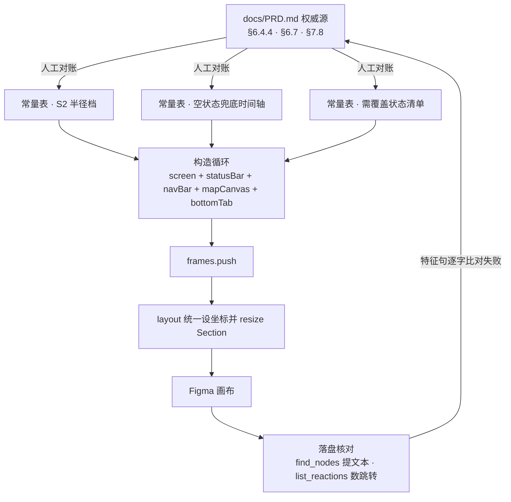

# PRD 单一真源表与三处口径冲突修正 - Plan

## Goal Capsule

**目标**：原型里出现的每一处规格值都能在 PRD 中找到唯一出处，且照着原型实现不会做出与 PRD 不一致的行为。

**手段**：把已出错的三类规格从散落的行内字面量抽成常量表，并补齐 PRD 已定义但原型缺失的状态画框。

**产品权威**：`docs/PRD.md` v2.1 是唯一规格源。冲突处以 PRD 为准；若 PRD 自身不自洽（本轮 §6.4.4 定位权限一处），先消除 PRD 的不自洽再落笔。

**当前范围**：仅上述三类规格与两类缺失状态。阴影 Token 化、动效表驱动、全文案 fixtures、鸭子 IP 素材均不在本计划内。

**执行画像**：Standard 深度，5 个实施单元，改 2 个文件。仓库无自动化测试框架，验证靠重跑生成器后在 Figma 内提取实际内容比对。

**停止条件**：Definition of Done 全部通过即停。发现 PRD 另有不自洽处时不就地扩权修改，记入 Outstanding Questions 并回报。

**尾部归属**：本计划不含提交、推送与 PR；实施者完成后按 Definition of Done 更新 `说明文档.md` 进度记录即交还。

**Product Contract preservation**：changed: R2 —— 标注卡三行文案本身也是范围条口径（不只取值错位），纠正范围随之从「取值 + 表内注明」扩到「取值 + 标注卡文案」；AE1 同步加严。本轮已向用户确认。其余 R/F/AE 与 Key Decisions 未变。

---

## Product Contract

### Summary

把原型生成器里出错的三类规格（S2 半径档、空状态兜底过程态、状态清单）抽成常量表并按 PRD 原文纠正，补齐位置权限与已下架两类缺失状态画框，同时消除 PRD §6.4.4 中定位权限降级的表述不自洽。实施顺序为 PRD 先行、常量表次之、画框最后，全部改动落在 `docs/PRD.md` 与 `prototype-figma/code.js` 两个文件。

### Problem Frame

原型骨架已具备 Token 网表、20 个组件 master 与 21 条实证通过的跳转，但规格值是逐处写死的字面量。这带来两类已发生的错误。

一类是抄录串线。PRD 里「半径」本有两套口径：§6.4.4 的 S2 蜂窝自动响应是四档 `3/5/10/全城`，§6.7 实现逻辑中的范围条是用户手动选的五档 `1/3/5/10/全城`。生成器的画框标题写着「S2 动态蜂窝半径档」，取值却是从范围条那套里挑的四个，标注卡文案也照抄了范围条的五档口径；而该处注释标注的 `§6.7` 恰好如实指向了这个错误来源——注释没有失准，错在标题、取值与文案三者不配对。四档密度描述（≥30 / 10–29 / 3–9 / ≤2 条）反而与 §6.4.4 完全对齐。单看代码无法发现，因为每一个数字单独看都在 PRD 里出现过。

另一类更隐蔽：注释写对了、实现却违反了它。六个「过程态」画框上方的注释明确写着「这是空状态兜底时间轴，不是性能降级规范，两者不可叉乘」，而紧接的前两行画的正是性能加载态。PRD 自己是分开的——§6.4.4 管空圈兜底，§6.10 管三层性能 SLA，且 §6.10 明确写「2G/3G 与断网会话改为走 §6.4.4 的过程态与降级 UI」。评审时读者看到注释就会默认下方合规，这类错误极易漏过。

代价落在时间上。8/28 要冻结 14 页视觉稿，此后规格偏差会随视觉稿流向实现。改三个数组的成本远低于返工。

### Key Decisions

- **六个过程态画框全部重画为 §6.4.4 空状态兜底，性能加载态本轮不画**（session-settled: user-directed — 在「拆成两组各画一边」与「只重画空状态」之间选定；画框数不变，性能态留待后续评估是否真需要）。Governs R4。
- **定位权限拒绝是「先引导页、仍拒绝才进基站兜底」的两段行为**（session-settled: user-directed — PRD §6.4.4 现将两者并列陈述，未写先后关系；用户选定两段并存并同步改 PRD）。Governs R5, R8。
- **真源表只覆盖已出错的三类，不扩到全文案 fixtures**（session-settled: user-directed — 在「扩到五大 P0 页文案 fixtures」与「就地修值不建表」之间选定中间档；改动面可控，8/28 前可完成）。Governs R1。
- **冲突一律以 PRD 为准，本轮三处均判定 code.js 错**。已逐条回读原文核实，非默认 PRD 永远正确。Governs R2, R3, R4。

### Requirements

**真源表**

R1. 生成器中新增三张常量表，分别承载 S2 半径档、空状态兜底时间轴、需覆盖的状态清单；这三类规格的所有取值只从表中读取，不再在构造函数内写字面量。

R2. S2 半径档取 PRD §6.4.4 的四档 `3km / 5km / 10km / 全城`，每档保留其现有密度描述（≥30 条 / 10–29 条 / 3–9 条 / ≤2 条）。表内与画框标注卡均须注明它与 §6.7 范围条五档 `1/3/5/10/全城` 是两套不同口径，前者为系统自动响应、后者为用户手动选择；标注卡现有的「半径档统一口径：1/3/5/10/全城」一句属范围条口径，须改写。

R3. 半径档处的注释改为标注 §6.4.4。现标注的 §6.7 是被误抄来源的真实位置，纠正取值后该出处不再成立。

**状态覆盖**

R4. 六个过程态画框改为承载 PRD §6.4.4 兜底过程态的六个时点（0–1 秒 / 1 秒返回 / 1–10 秒 / 10 秒返回 / 10–30 秒 / 30 秒仍无），界面表现文案取 PRD 原句而非概括。原有性能加载态内容移除。

R5. 新增位置权限未开的全屏引导页画框：突出「就近」价值，主按钮「开启位置权限」，次按钮「手动选择城市」。

R6. 新增基站+商圈兜底的地图态画框：不使用城市中心假值。

R7. 新增已下架详情态画框：整页 Opacity 60%，顶部红条「该信息已下架/过期」，联系按钮禁用，收藏保留。

**PRD 同步**

R8. PRD §6.4.4 中定位权限降级的两句合并为一条带先后关系的规格：先弹全屏引导页，用户仍拒绝则进基站+商圈兜底态。

### Key Flows

F1. 定位权限拒绝后的两段降级。
- **触发**：用户在系统权限弹窗中拒绝定位。
- **步骤**：进入全屏引导页（主按钮「开启位置权限」/ 次按钮「手动选择城市」）→ 用户点主按钮则重新拉起系统弹窗，授权后进正常地图态 → 用户点次按钮或再次拒绝则进基站+商圈兜底地图态。
- **Covers R5, R6, R8.**

F2. 空圈兜底的六时点递进。
- **触发**：当前范围内结果为空圈（≤2 条）。
- **步骤**：按 PRD §6.4.4 六个时点依次推进，全程不留空白页；用户可在 1–10 秒段点「我自己调范围」退出等待，10–30 秒段点「先去别处看看」离开。
- **Covers R4.**

### Acceptance Examples

AE1. 半径档画框取值与文案。
- **Covers R2, R3.** 打开任一「S2 动态蜂窝半径档」画框，其半径值属于 `3km / 5km / 10km / 全城`，不出现 `1km`；标注卡内不出现「统一口径：1/3/5/10/全城」一句，改为两套口径的区分说明；引用的章节号为 §6.4.4。

AE2. 过程态与性能态不混。
- **Covers R4.** 六个过程态画框中，无任何一框以「骨架屏：地图底图先出」或「首屏 Pin 上屏」作为界面表现；六框文案可在 PRD §6.4.4 兜底过程态表中逐字找到出处。

AE3. 新增画框不引入死链。
- **Covers R5, R6, R7.** 三个新增画框均带变体后缀，不进跳转索引；生成后跳转条数与新增前一致。

AE4. 真源表是唯一取值来源。
- **Covers R1.** 修改常量表中任一半径值后重跑生成器，所有相关画框同步变化，不存在仍显示旧值的画框。

### Scope Boundaries

不在本计划内：

- 阴影 Token 化（9 处内联 `effects` 集中为常量表）
- PRD §1.4.8 动效规范五行的表驱动落地
- 五大 P0 页的文案与数据 fixtures
- 鸭子 IP Logo / 空状态图 / 缺省图三件素材
- 卡片阴影恢复、按钮 pressed 态、暗色模式双 mode
- 性能加载态（§6.10）的画框
- 新建独立高保真 Page
- 过程态六框按 PRD 的「骨架卡 3 条 / 10 秒进度条 / 主按钮」重构版式（KTD2）
- 基站兜底态的差异化底图处理（KTD3）

导航搜索框高 32px 不改：进度记录 [33] 已立判据（导航栏总高 48 为 PRD 定死，输入框横向命中区 250px 远超 44×44 等效面积）。

### Dependencies / Assumptions

- 依赖 `docs/PRD.md` v2.1 为唯一规格源。R8 会修改 PRD，须先于 R5、R6 落地，否则画框无明文依据。
- 假设新增画框不会打乱 Section 布局：`resetSection` 每次删除整个 Section 后按本次实际画框数重建，`layout` 按实际行列数调用 `resizeWithoutConstraints` 撑开 Section，故画框增减不需要手工重排纵向起点常量。此假设已回代码核实。
- 三个新增画框带变体后缀即不进跳转索引，此机制已在 `indexMainFrames` 的变体过滤中生效。
- 生成器改动后须整体重跑：关 MCP → Reload 插件 → 清空 → 按批次顺序重跑 → 重开 MCP。Figma 同时只能开一个插件弹窗，此约束见进度记录 [33]。

### Outstanding Questions

**Deferred to Implementation**

- 已下架详情态的「整页 Opacity 60%」在 Figma 中落在哪一层：画框根节点整体降透明度会连带压低顶部红条，需在实现时择一（红条置于降透明度容器之外，或红条单独提亮）。选择在实现时按实际观感定，两种做法都满足 R7。

### Sources / Research

- `docs/PRD.md` §6.4.4（S2 蜂窝半径档 / 30 秒分层兜底 / 兜底过程态六时点 / 定位权限与地图降级）
- `docs/PRD.md` §6.7 实现逻辑（范围条五档，与 S2 四档区分的依据）
- `docs/PRD.md` §6.10（三层性能 SLA 与四段计时口径；其中弱网会话转走 §6.4.4 的表述是「两者应分开」的直接证据）
- `docs/PRD.md` §7.8 功能细节描述（详情页边界表中的已下架详情态规格）
- `prototype-figma/code.js`（半径档数组、过程态数组、`resetSection` 的整体重建逻辑、`indexMainFrames` 中变体后缀排除跳转索引的实现）
- `CONCEPTS.md`（权威源 / 派生交付件 / 生成脚本两型 / 落盘核对 四个名词，本计划的验证方式据此定）
- `docs/solutions/workflow-issues/cross-document-reference-verification.md`（被引章节须核实存在且语义对得上；只引章节号不引行号）
- `说明文档.md` 进度记录 [27]（跨 Page 跳转硬限制）、[30]（`list_reactions` 是唯一可信验证手段；禁止兜底写法）、[33]（导航栏高度判据；重跑操作约束）
- `docs/ideation/2026-08-24-hifi-prototype-upgrade-ideation.html`（本计划源自其中想法 1）

---

## Planning Contract

### Key Technical Decisions

KTD1. **三张常量表各自独立，沿用现有扁平 `var` 对象字面量形态，不引入命名空间聚合也不加冻结包装**（session-settled: user-approved — chosen over 单一命名空间聚合：与 `SPACING`、`RADIUS`、`HOME_NAV` 同形态，读者无需学新访问路径，改动面最小）。表放在文件顶部常量区，与既有 Token 表相邻。Governs R1。

KTD2. **过程态六框沿用现有 `screen` + `mapCanvas` + `annotation` 五件套版式，只换数组内容**（session-settled: user-approved — chosen over 逐框重构版式：按 PRD 的骨架卡与进度条重构等于把六个垫图位升级成准视觉稿，超出 8/28 冻结前的容量）。六框仍是规格垫图位，不是视觉稿。Cites R4。

KTD3. **基站+商圈兜底态复用现有内嵌底图，用地图说明文案与摘要胶囊表达「非城市中心假值」**（session-settled: user-approved — chosen over 差异化底图处理：差异化底图需新素材，素材项本轮已排除）。Cites R6。

KTD4. **三个新增画框一律经 `screen(pageId, title, prdRef, true)` 建立**。变体后缀是 `indexMainFrames` 排除跳转索引的唯一机制，手工命名会绕开它并触发重名告警。Cites R5, R6, R7 与 AE3。

KTD5. **已下架详情态作为 `batchCore` 的第 13 个页面级构造器落地，与 `buildDetail` 并列，不改 `buildDetail` 本体**。两态需并存对照，且 `batchCore` 用的是无参构造器字面量数组，追加一项即可。Cites R7。

KTD6. **半径档与过程态两处改造均不新增构造器，只改数组与循环体内的取值来源**。这两段现有形态是「数组表 + `for` + 五件套 + `frames.push`」，与常量表驱动天然同构。Cites R2, R4。

### High-Level Technical Design

生成器是硬编码型脚本：规格文案写在脚本内，改规格必须改脚本。本计划把三类规格从循环体内提到常量区，循环体只做取值与拼装，落盘证据只认 Figma 内的实际内容。

两条硬约束在图上是隐含的，实施时不可违反：画框只 `frames.push`，坐标一律由 `layout` 设置，构造阶段不得自行 `appendChild` 到 Section 或预设 `x`/`y`；`layout` 内部必须先 `appendChild` 再设坐标，否则坐标按 `currentPage` 绝对系解释。

### Sequencing

PRD 先行，常量表次之，画框最后。R8 不落地，R5 与 R6 的画框就没有明文依据；常量表不落地，半径档与过程态的取值无处可读。

U1 → U2 → （U3、U4、U5 可并行） → 整体重跑与落盘核对。

### Implementation Constraints

- 改画框数量后不要手工调整 Section 纵向起点常量：`resetSection` 整体重建、`layout` 自动 resize。
- 生成器与 MCP 桥接插件不能同时开（Figma 单弹窗约束），故「改代码 → 重跑」与「MCP 验证」必须串行，不可交替。
- 严禁任何「找不到就兜底」的写法。取值缺失时应报错可见，不得静默降级为默认值。

---

## Implementation Units

### U1. PRD §6.4.4 定位权限降级改为两段规格

- **Goal**：消除 PRD 自身的表述不自洽，为 U4 的两个画框提供明文依据。
- **Requirements**：R8。Covers F1。
- **Dependencies**：无。
- **Files**：`docs/PRD.md`（§6.4.4 空状态末尾，现「定位权限拒绝改为基站+商圈兜底」独立段与「位置权限未开」列表项两处）。
- **Approach**：
  1. 将两处并列陈述合并为一条带先后关系的规格：权限未授予先出全屏引导页；用户仍拒绝或选「手动选择城市」则进基站+商圈兜底态。
  2. 保留原有两个限定语——「非城市中心假值，避免误导」与引导页的主/次按钮文案，不做改写。
  3. 「地图加载失败降级为模拟地图」是另一条独立降级路径，不并入本条。
  4. 检索 PRD 全文其余提及定位权限或位置权限的位置，确认无第二处并列陈述残留。
- **Patterns to follow**：§6.4.4 内既有的「加粗小标题 + 冒号 + 规格」写法；§6.4.4 兜底过程态用表格承载时序，本条为两段分支，用列表即可。
- **Test scenarios**：
  - Covers F1. 探针检索 §6.4.4，「全屏引导页」与「基站」出现在同一条规格内，且文本中存在明确的先后关系词；单独出现在两条并列陈述中即为失败。
  - 反向探针：PRD 全文不再存在「定位权限拒绝改为基站+商圈兜底」这一独立成段的原句。
  - 「开启位置权限」与「手动选择城市」两句按钮文案在修改后仍逐字存在。
  - 「降级为模拟地图」仍是独立条目，未被并入定位权限条。
- **Verification**：PRD §6.4.4 读下来，定位权限降级只有一条规格且含先后关系；U4 的两个画框能逐句引到它。

---

### U2. 抽出三张常量表并接通半径档

- **Goal**：把三类出错规格提到常量区，并让半径档从表中取值、取 PRD §6.4.4 四档。
- **Requirements**：R1, R2, R3。Covers AE1, AE4。KTD1, KTD6。
- **Dependencies**：U1。
- **Files**：`prototype-figma/code.js`（顶部常量区，紧邻 `SPACING`/`RADIUS`/`CANVAS`；`batchMap` 内半径档循环段）。
- **Approach**：
  1. 在常量区新增三张独立表：S2 半径档表（档位 + 密度描述）、空状态兜底时间轴表（时点 + 界面表现）、需覆盖状态清单表。三表形态与 `HOME_NAV` 一致（KTD1）。
  2. 每张表加函数级注释块，写明权威源章节号与「本表是唯一取值来源」。
  3. S2 半径档表按 R2 取值，并在注释中写明与 §6.7 范围条五档的区分。
  4. 半径档循环体改为遍历新表，画框内文案与标注卡三行全部从表中读取。
  5. 标注卡内原「半径档统一口径：1/3/5/10/全城（已消除 8km 冲突）」一句删除，改为两套口径的区分说明（R2）。第三行的缓存键说明保留但须点明其「半径档」指范围条五档，非本框的 S2 四档。
  6. 段落注释的章节标注由 §6.7 改为 §6.4.4（R3），并移除其中的行号引用。画框名的 `prdRef` 已是 §6.4.4，无需改动。
- **Patterns to follow**：`SPACING`/`RADIUS`/`HOME_NAV` 的扁平 `var` 对象字面量形态与其上的注释块写法；`HOME_NAV` 注释里「为什么抽成常量」的说明句式。
- **Test scenarios**：
  - Covers AE1. 重跑批次 2 后提取四个半径档画框的全部文本，档位集合等于 `{3km, 5km, 10km, 全城}`；出现 `1km` 即失败。
  - Covers AE1. 四个画框的标注卡文本中不含子串 `1/3/5/10/全城`，且含两套口径的区分说明。
  - Covers AE1. 四个画框的标注卡与画框名中引用的章节号为 §6.4.4；出现 §6.7 即失败。
  - Covers AE4. 把表内 `5km` 临时改为一个哨兵值并重跑，四个画框中出现该哨兵值且无一框仍显示 `5km`；改回后复跑恢复。
  - 四档的密度描述与改动前逐字一致（≥30 条 / 10–29 条 / 3–9 条 / ≤2 条）。
  - 缺失取值时报错可见：临时删掉表中一档并重跑，批次结果应报错或画框数减少，不得静默出现空白画框。
- **Verification**：半径档四框的取值、密度描述、标注卡文案与章节号全部能在 PRD §6.4.4 中逐字对上；表是唯一取值来源，哨兵值实验通过。

---

### U3. 六个过程态画框重画为空状态兜底

- **Goal**：让六个过程态画框承载 §6.4.4 兜底过程态六时点，移除混入的性能加载态。
- **Requirements**：R4。Covers AE2, F2。KTD2, KTD6。
- **Dependencies**：U2。
- **Files**：`prototype-figma/code.js`（`batchMap` 内过程态循环段）。
- **Approach**：
  1. 过程态循环改为遍历 U2 建立的空状态兜底时间轴表。
  2. 六个时点的界面表现文案取 PRD §6.4.4 兜底过程态表的原句，含引号内的用户可见文案，不做概括改写。
  3. 沿用现有五件套版式，只换文案（KTD2）。
  4. 标注卡第二、三行保留「依据 §6.4.4」与「与性能降级态互不叉乘」两句，第一行改为取自表的界面表现。
  5. 段落上方那句自我警示注释保留，并在其下补一句说明它约束的是哪张表。
  6. 检查该段之后的三个性能降级态画框未被本次改动波及，其 §6.10.1 标注保持原样。
- **Patterns to follow**：现有过程态循环的五件套顺序（`screen` → `statusBar` → `navBar` → `mapCanvas` + `annotation` → `bottomTab` → `frames.push`）；`screen` 第四参传 `true` 标变体。
- **Test scenarios**：
  - Covers AE2. 提取六个过程态画框全部文本，不含「骨架屏」「首屏 Pin 上屏」「Loading 指示」任一子串。
  - Covers AE2. 六框文案逐句在 PRD §6.4.4 兜底过程态表中能找到逐字出处，含中文引号等行内标记。
  - Covers F2. 「我自己调范围」出现在 1–10 秒那一框；「先去别处看看」出现在 10–30 秒那一框；「发一条需求，让别人来找你」出现在 30 秒那一框。
  - 六框时点标签为 `0–1 秒 / 1 秒返回 / 1–10 秒 / 10 秒返回 / 10–30 秒 / 30 秒仍无`，与 PRD 表首列一致。
  - 六框画框名均带变体后缀，未进跳转索引。
  - 三个性能降级态画框文本与改动前一致，其标注仍指向 §6.10。
- **Verification**：六框文案与 PRD §6.4.4 表逐行对账通过；性能态相关词汇在这六框中为零命中；降级态三框未受影响。

---

### U4. 新增位置权限引导页与基站兜底地图态两框

- **Goal**：补齐 PRD §6.4.4 已定义但原型缺失的两个权限降级状态。
- **Requirements**：R5, R6。Covers F1, AE3。KTD3, KTD4。
- **Dependencies**：U1, U2。
- **Files**：`prototype-figma/code.js`（`batchMap` 内，紧随过程态段之后；引导页复用 `box`/`text`/`button`，兜底态复用 `mapCanvas`）。
- **Approach**：
  1. 引导页画框：`screen('home-screen', …, true)` + `statusBar`，主体为纵向 `box`，含价值文案、主按钮「开启位置权限」（`primary`）、次按钮「手动选择城市」（`secondary`），底部挂 `annotation` 标注 §6.4.4 依据与两段降级关系。该框不出地图，也不出底部 Tab——权限未授予前进不到首页主态。
  2. 兜底态画框：五件套齐全，`mapCanvas` 的说明文案表达「基站+商圈定位，非城市中心假值」，摘要胶囊覆写为商圈级范围（KTD3）。
  3. 两框均从 U2 的状态清单表读取标题与说明文案。
  4. 两框都传 `isVariant=true`（KTD4）。
  5. 只 `frames.push`，不自行设坐标；`layout` 的 `perRow` 保持 5 不变。
- **Patterns to follow**：`buildLogin` 的「`screen` + `statusBar` + 纵向 `box` 主体 + `annotation`」无地图页形态；`mapCanvas` 的 `opt.summary` 覆写摘要胶囊用法。
- **Test scenarios**：
  - Covers F1. 引导页画框文本含「开启位置权限」与「手动选择城市」两句，且两句能在 PRD §6.4.4 中找到逐字出处。
  - Covers F1. 兜底态画框文本含「基站」与「商圈」，且不含「城市中心」。
  - Covers AE3. 两个新增画框名均带变体后缀；重跑后跳转条数与新增前一致（21 条）。
  - 引导页画框内不存在地图画布节点与底部 Tab 节点。
  - 引导页主按钮为 `primary` 变体、次按钮为 `secondary` 变体，与 PRD 的主/次层级一致。
  - 两框在 Section 内可见且未与既有画框重叠——`layout` 自动扩行后行列数符合预期。
- **Verification**：批次 2 摘要中的画框数比改动前多 2；两框内容能逐句引到 PRD §6.4.4；跳转条数未变。

---

### U5. 新增已下架详情态画框

- **Goal**：补齐 PRD §7.8 定义的已下架详情态。
- **Requirements**：R7。Covers AE3。KTD4, KTD5。
- **Dependencies**：U2。
- **Files**：`prototype-figma/code.js`（新增页面级构造器，追加进 `batchCore` 的 frames 数组）。
- **Approach**：
  1. 新增一个无参构造器，形态对照 `buildDetail`，不改 `buildDetail` 本体（KTD5）。
  2. 顶部加红条「该信息已下架/过期」，联系按钮改 `disabled` 变体，收藏入口保留。
  3. 整页 Opacity 60% 的落层方式按 Outstanding Questions 中的两种做法择一，红条须保持可读。
  4. 标题与红条文案从 U2 的状态清单表读取。
  5. `screen` 传 `isVariant=true`（KTD4），追加进 `batchCore` 的构造器数组，`perRow` 保持 6 不变。
- **Patterns to follow**：`buildDetail` 的模板字段 + 信任卡 + 联系主按钮结构；`buttonRaw` 的 `disabled` 变体；`batchCore` 的无参构造器字面量数组。
- **Test scenarios**：
  - 画框文本含「该信息已下架/过期」，且该句能在 PRD §7.8 中找到逐字出处。
  - 联系按钮为 `disabled` 变体；收藏入口节点存在。
  - Covers AE3. 画框名带变体后缀；重跑批次 3 后跳转条数与新增前一致。
  - 红条在整页降透明度处理后仍可辨识——提取红条文本节点，其有效不透明度不低于正常态文本。
  - `buildDetail` 生成的正常态详情页文本与改动前逐字一致。
  - 批次 3 摘要画框数为 13，`layout` 按 3 行铺开无重叠。
- **Verification**：正常态与已下架态两框在画布上并列可对照；已下架态四项规格（红条 / 降透明度 / 联系禁用 / 收藏保留）逐项可见。

---

## Verification Contract

仓库无自动化测试框架，也无构建命令。生成器是硬编码型脚本，唯一可信证据是 Figma 内的实际节点内容。时间戳、文件大小、脚本退出码都不算落盘证据。

**重跑流程**（Figma 同时只能开一个插件弹窗，故必须串行）：

1. 关闭 MCP 桥接插件弹窗。
2. 在 Figma 内 Reload 生成器插件（`prototype-figma/manifest.json`）。
3. 执行批次 5 清空。
4. 按批次 1 → 2 → 3 → 4 顺序重跑，逐批记录返回摘要中的画框数与清扫数。
5. 关闭生成器弹窗，重开 MCP 桥接插件，进入验证。

**验证门**：

| 门 | 手段 | 通过判据 |
|---|---|---|
| 半径档取值 | `find_nodes` 提取四个半径档画框文本 | 档位集合 `{3km, 5km, 10km, 全城}`；无 `1km`；无 `1/3/5/10/全城`；章节号为 §6.4.4 |
| 过程态文案 | `find_nodes` 提取六个过程态画框文本，与 PRD §6.4.4 表逐句比对 | 六句逐字命中，含行内标记；性能态词汇零命中 |
| 新增三框存在 | `get_canvas_overview` 核对批次 2 与批次 3 的画框数 | 批次 2 增 2、批次 3 增 1 |
| 跳转无死链 | 逐节点 `list_reactions` | 连线数 22 条（`FLOW_LINKS` 全长）；无指向新增变体框的连线 |
| 原型整体 | `validate_prototype` | 无新增告警；`indexMainFrames` 无重名告警 |
| PRD 自洽 | 探针检索 `docs/PRD.md` §6.4.4 | 定位权限降级为单条带先后关系的规格；旧独立段原句不存在 |

**探针纪律**：探针正反成对——正向查特征句存在，反向查旧句已消失。特征句逐字复制含中文引号等行内标记。探针 FAIL 时先怀疑探针写法，再怀疑实现。

**禁止**：以 `get_prototype_flow` 或 `export_interactions` 的输出代替 `list_reactions` 判定连线。进度记录 [30] 已立此判据。

---

## Definition of Done

**全局**：

| 项 | 判据 |
|---|---|
| PRD 自洽 | R8 落地；§6.4.4 定位权限降级为单条带先后关系的规格 |
| 真源表 | 三张表在常量区，三类规格无行内字面量残留；哨兵值实验通过（AE4） |
| 状态覆盖 | 六框重画完成（AE2）；三个新增框存在且内容可逐句引到 PRD（R5, R6, R7） |
| 无回归 | 跳转条数不变（AE3）；正常态详情页、性能降级态三框、其余画框文本与改动前一致 |
| 全部验证门 | Verification Contract 六道门全部通过，逐门留下提取到的实际文本作为证据 |
| 清理 | 哨兵值、临时探针代码、试错中未采用的写法全部移除，不留在 diff 里 |
| 文档 | `说明文档.md` 进度记录新增本次条目，写明三处冲突的修正结论与验证证据 |

**逐单元**：

| 单元 | 完成判据 |
|---|---|
| U1 | PRD 探针正反双向通过；两句按钮文案与「降级为模拟地图」条目未被改坏 |
| U2 | 半径档门通过；密度描述逐字未变；缺值报错可见 |
| U3 | 过程态门通过；降级态三框未受影响 |
| U4 | 两框内容门通过；引导页无地图与底部 Tab；跳转条数未变 |
| U5 | 已下架态四项规格逐项可见；红条可辨识；正常态详情页未变 |

---

## Risks

- **PRD 改动波及其他章节**。§6.11 仅一句转指 §6.4.4，§6.7 讲范围条，两处均不承载定位权限规格，理论上不受影响。U1 第 4 步的全文检索是这条风险的兜底。
- **重跑覆盖手工调整**。生成器是画布的唯一来源，画布上不应存在手工调整；若重跑后发现内容缺失，先查是否有人在 Figma 内直接改过节点，而不是先改脚本。
- **探针假通过**。特征句若漏了中文引号或破折号，探针会以子串方式命中一个并不存在的句子。逐字复制含行内标记是唯一防线。
- **单弹窗约束导致返工**。改代码与 MCP 验证必须串行，一轮往返成本不低。建议 U2–U5 全部改完再重跑一次，而非每单元重跑。
