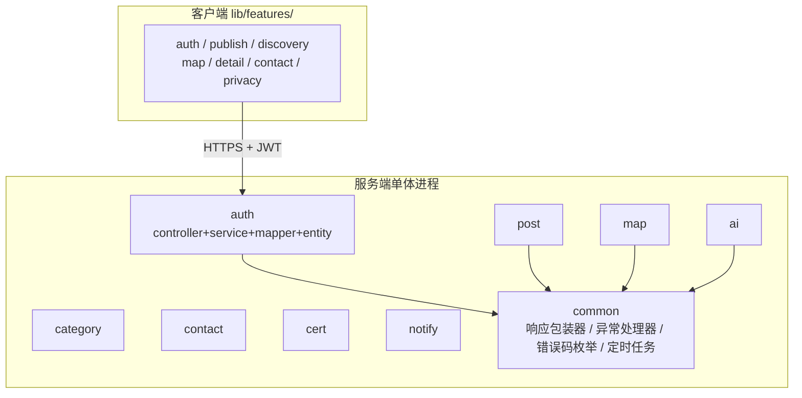
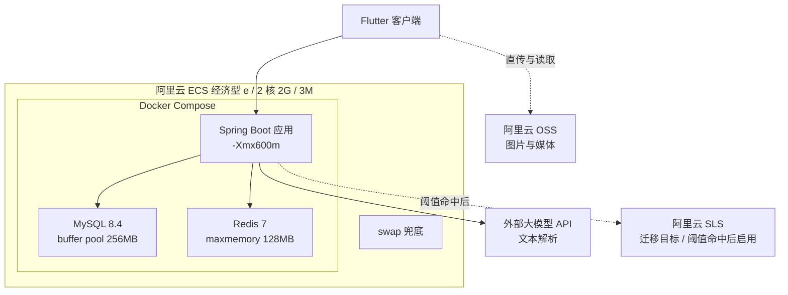

# Server Architecture Baseline - Plan

## Goal Capsule

- **目标**：服务端的技术选型与架构组织方式从全部悬空变为逐项有据可依，使《系统总体架构设计文档》《技术栈选型说明》《可观测性架构方案》三份文档能在不再发明任何技术决策的前提下写出，且读者能对任一组件回答"它属于哪个批次、为什么选它、什么时候换掉它"。
- **产品权威源**：`docs/PRD.md`（功能口径与 NFR 数字）、`docs/BRD.md`（人力、预算、批次、红线）、`说明文档.md`（里程碑与排期约束）。本计划不新增产品口径，只把架构决策绑定到这三处已有条目。
- **实现权威源**：`pubspec.yaml` 与 `lib/` 目录结构 —— 客户端栈已定案且已成型，服务端不得提出与之冲突的假设。
- **开放阻塞项**：无。三处文档内部冲突已判定为不阻塞本轮落笔（见 Outstanding Questions）。

---

## Product Contract

### Summary

把服务端定为 Java 21 + Spring Boot 3 单体，跑在阿里云 2 核 2G ECS 上，用 MySQL 8.4 做唯一持久化、Redis 加 Caffeine 做两层缓存、Docker Compose 做单机编排。代码按功能域垂直切分并与客户端 `lib/features/` 同构。可观测性先用 MySQL 宽表承载，同时预置分表、独立库、90 天自动清理三条防线和一组迁移触发阈值。

### Problem Frame

上一轮 ce-ideate 交付的架构工件被判为"比较难理解"，根因不在表达而在依据：当时 11 项服务端选型全部悬空，文档只能用抽象层名（"接入层""服务层"）填充，读者无法把任何一句话对回一个可验证的事实。

同期排查 PRD 时发现了 14 处口径缺陷，说明架构文档一旦先于口径落笔，就会把缺陷固化成图。14 条已逐条定案落地，但架构侧的空白仍在。

约束把选择空间压得很窄，而这一点在上一轮没有被写进文档。`docs/BRD.md:298` 记录 Batch1 实际人力为 1 人加 AI 辅助；`说明文档.md:202` 明示排期"仍属高强度满负荷，无缓冲"；`docs/上架前置工作指导手册.md:94` 给出域名加服务器合计约 131 元/年的成本量级。一个 2 核 2G 的单机、一个人、38 个自然日 —— 任何需要独立中间件进程、需要 GPU、或需要按技术层横向拆多个模块的方案，都不是"更重一点"，而是根本跑不完。

### Key Decisions

- **三份文档写目标态，每个组件标注 Batch1/2/3**（session-settled: user-approved — 相对"只写本期"：只写本期会让文档在 Batch2 立刻过期，标注批次能让同一份文档跨批次继续有效）。Governs R17, R18
- **后端 Java 21 加 Spring Boot 3 单体**（session-settled: user-directed — 最初用户在 Java、Go、Node 之间直接指定 Java；2026-09-04 用户指令升级 JDK 17→21，虚拟线程另作待验项不开）。Governs R1
- **MySQL 8.4 LTS 作为唯一持久化，向量检索推到 Batch3**（session-settled: user-approved — 相对"现在就上向量库"：MySQL 9.x 的 `VECTOR` 类型无 ANN 索引，社区插件不支持 Windows 构建，云厂商增强版需要买托管 RDS，三条路径都不匹配当期成本）。Governs R2
- **Redis 7 加 Caffeine 两层缓存**（session-settled: user-directed — 用户在"只用 Redis""只用 Caffeine""两层"之间选择两层）。Governs R3
- **GBDT 自训、文本解析调外部 API**（session-settled: user-approved — 相对"统一自训 3B 小模型"：GBDT 自训成本几乎为零，而 3B 微调既缺语料又需 GPU，两头都输）。Governs R4, R5
- **阿里云 ECS 经济型 e 加 OSS 加 Docker Compose**（session-settled: user-approved — 相对"轻量应用服务器"或"K8s"：99 元档续费同价且 2 核 2G 是内存预算能贴住的下限，轻量的带宽与磁盘弹性不足，K8s 在单机上是纯开销）。Governs R6, R7, R8
- **可观测性先落 MySQL，预置迁移条款**（session-settled: user-directed — 用户明确"可以选择 mysql，但是需要做好后期日志暴涨迁移的准备"）。Governs R13, R14, R16
- **埋点留 90 天、审计日志另留 180 天**（session-settled: user-approved — 两类数据的驱动力不同：埋点由盘容量决定，审计由 `docs/BRD.md:268` 的合规下限决定，因此不能共用一个保留期）。Governs R14, R15
- **服务端按功能域垂直切，与客户端 `lib/features/` 同构**（session-settled: user-approved — 相对"按技术层横切"：同构后一个功能改动只碰一个目录，且前后端能用同一套功能域名词对话）。Governs R9
- **数据访问用 MyBatis-Plus**（session-settled: user-approved — 相对 JPA：`docs/PRD.md:2376` 要求手写网格 `IN` 查询并用 `EXPLAIN` 验收，JPA 自动生成的 SQL 不好控）。Governs R10

### Requirements

**技术栈选型**

- R1. 服务端是单个 Java 21 加 Spring Boot 3 应用进程，全部功能域跑在同一个 JVM 内，不拆微服务。虚拟线程不开通，留作 Batch1 后压测待验项。
- R2. MySQL 8.4 LTS 是唯一持久化存储，承载业务数据、埋点事件与审计日志三类数据。
- R3. 缓存分两层：进程内 Caffeine 承载分类树等极少变更的热数据，Redis 7 承载跨请求共享状态（会话、限流计数、聚合结果）。
- R4. 匹配排序模型 GBDT 在本地用 LightGBM 离线训练，产出模型文件随应用发布，线上只做推理不做训练。
- R5. 发布文本的结构化解析调用外部大模型 API，不自建或自训语言模型。
- R6. 生产环境是一台阿里云 ECS 经济型 e 实例（2 核 2G、40G ESSD、3M 带宽），用户上传的图片与媒体文件存 OSS 而不占用 ECS 带宽与磁盘。
- R7. ECS 上的 MySQL、Redis、应用三个进程由 Docker Compose 编排，不引入 Kubernetes 或其他集群调度。
- R8. 单机内存有一份显式分配预算，且系统配置 swap 作为溢出兜底。

**架构组织**

- R9. 服务端源码按功能域垂直切分为 `auth`、`post`、`map`、`category`、`contact`、`ai`、`cert`、`notify` 与一个 `common`，每个功能域目录内自带自己的 controller、service、mapper、entity。
- R10. 数据访问统一走 MyBatis-Plus，简单 CRUD 用其自动能力，涉及网格集合查询等性能敏感语句写在 XML 里并附 `EXPLAIN` 验收结论。
- R11. `docs/PRD.md:2038` 的统一响应包与 `docs/PRD.md:2233` 的五位错误码由一组共享组件落地：响应包装器、全局异常处理器、错误码枚举，业务代码不自行拼装响应体。
- R12. 定时任务由应用进程内的 Spring 调度承载，不引入独立调度中间件；Batch1 任务为到期自动下架、埋点月表预建与清理、取消收藏记录清理、注销冷静期到期清理、中转脱敏日志清理、可观测性阈值巡检，Batch2 追加 OCR 数据清理与发布记忆清理。

**可观测性**

- R13. 应用日志以 JSON 单行格式落盘，埋点事件与审计事件另写入 MySQL 宽表以支撑看板 SQL 查询。
- R14. 埋点表按月分表命名，存放在与业务数据独立的 database 中（同实例），超过 90 天的月表由定时任务自动删除。
- R15. 审计日志保留期为 180 天，与埋点表的 90 天各自独立配置。`docs/PRD.md:2390` 的保留期表新增埋点事件表一行，不改动既有的中转脱敏日志 30 天与审计留痕 180 天两行。
- R16. 可观测性方案写明迁移触发阈值与预先指定的迁移目标（阿里云 SLS），任一阈值命中即启动迁移而不是继续加机器。

**交付范围与批次**

- R17. 三份架构文档中出现的每一个组件都标注它进入哪个批次，读者不需要跨文档查证就能知道某组件当期是否存在。
- R18. `docs/PRD.md:2067-2216` 的接口保持在同一张表内不拆分，新增一列标注批次；PRD 原为 38 个，因图片上传拆为 `/media/upload/ticket` 与 `/media/{media_id}/commit` 两步（见《系统总体架构设计文档》§2.1.1），总数为 **39 个，其中 20 个属于 Batch1**，AI 相关两个接口与实名认证相关接口延至 Batch2。

**客户端配套（2026-09-03 前端视角评审补充）**

前 18 条全部是服务端条款，评审发现服务端接口的客户端对侧一条都没登记，而客户端当前连 HTTP 客户端都没有。以下四条补齐这个缺口：

- R19. 客户端 Batch1 必需依赖在《技术栈选型说明》第 12 节定死：`dio`、`uuid`、`connectivity_plus`、`image_picker`、`cached_network_image` 五项新增，JSON 序列化维持手写不引代码生成，定位复用 `amap_map` 自带能力，不引 `device_info_plus`。
- R20. 客户端必须交付一层统一网络封装，承载请求头注入（`Authorization`、`X-Interaction-Id`、`Idempotency-Key`、`X-Device-Id`）、错误码集中枚举与「码 → 行为」映射、单飞 Token 续期、可重试码白名单与指数退避、`Retry-After` 解析。禁止任何模块绕过它直接发请求。
- R21. `allListingsProvider` 至 `listingDetailProvider` 的整条同步 Provider 链改为异步，并处理加载态、错误态与请求竞态（过期响应必须丢弃）。这项改写是 Batch1 的工作量而不是 Batch2 的优化。
- R22. 客户端埋点采集与队列作为独立组件交付：本地持久化、上限 2000 条、丢最旧、`ts` 取采集时刻、按 `ts` 归属月表、失败退回、回灌限速。口径见《可观测性架构方案》§4.5 与 §4.6。

**验收可执行化（2026-09-04 QA 视角评审补充）**

前 22 条规定了「要做什么」，评审发现「做完怎么证明它对」几乎是空的：三个阻塞级验收项都没有可被第二人独立复现的执行方式，且轴② 的判定权完全在被考核方进程内。以下一条补齐这个缺口，它只补判定协议与防自证条款，不新增任何采集项或功能：

- R23. 每一项验收标准都必须写明执行者、工具、判定数据源与失败判定，并留存可复核的原始输出；无留存视为未验收。具体协议：读接口 P95 取服务端 `rt_ms`、逐接口出数、压测机与被测机分离、CPU steal 重跑上限 3 次（见《系统总体架构设计文档》§10.3）；埋点四段耗时各自独立计时禁用减法反推、服务端 `rt_ms` 作为第二重校验、轴② 分子为 `result = 'success' AND duration_ms <= 300` 双条件、分母排除项封闭为四类不得新增（见《可观测性架构方案》§4.2.1、§6.1）；两条隐私红线以可执行 grep 与 SQL 定义并留存完整输出（见《可观测性架构方案》§10.1）；`grid_id`、幂等、单飞 Token 续期三处「正确但不可测」的描述改为带期望值的测试向量与断言点（见《系统总体架构设计文档》§7.1.1、§6.3.1、§6.5.1）；调试后门以 `kDebugMode` 编译期剔除加产物 `strings` 扫描加 CI grep 三层门禁替代 Dart 中无效的 release 断言（见《系统总体架构设计文档》§9.2.2）。
- R24. OSS 直传链路必须落实七条安全约束：①客户端不持长期凭证；②存储桶不开公共读；③原图删除与 commit 同步完成不得异步；④图片域不挂 CDN 或禁止过滤参数；⑤media_id 与对象名由服务端生成、凭证路径精确到单个对象；⑥直传 Policy 强制要求 content-length-range 与 content-type 白名单；⑦以 OSS 回调作为 commit 触发源、未 commit 的 pending 记录 24 小时后连同 OSS 对象一并清理。详见《系统总体架构设计文档》§2.1.0。依据：2026-09-04 直传安全复核发现 `x-oss-process=image/info` 可读出完整 GPS 坐标，原图若未同步删除则存在真实泄露风险。
- R25. 登录身份在 Batch1 归一化为 `user_identity` 表（`user_id` + `identity_type` + `identity_value`，双唯一索引 `uk_type_value` 与 `uk_user_type`），Batch1 只写 `phone` 一种类型，微信与 Apple 登录整体延到 Batch2。三条连带纪律：登录查表改走 `user_identity` 而非 `user.phone`（对客户端透明，出入参不变）；账号级风控与配额一律以 `user_id` 为键、渠道级短信限频保留手机号维；注销清理按 `user_id` 删除全部身份行。Batch2 打开微信登录时 Apple 登录必须同批交付（App Store 审核指引 4.8），不可拆两批。详见《系统总体架构设计文档》§5.1/§8/§9.1 与 `docs/PRD.md` §3.4.1。依据：2026-09-04 微信快捷登录可行性核实——技术可行但资质与账号合并工作量不在 38 日预算内，本期只预留数据模型以避免 Batch2 做账号迁移。

### 分层结构

功能域垂直切分后的目录形态，与 `lib/features/` 一一对应（对应 R9）：

`common` 是被依赖方，不反向依赖任何功能域；功能域之间的调用走 service 接口而不是直接跨域访问 mapper。

### 部署形态

单台 ECS 上的进程与外部依赖关系（对应 R6、R7、R8）：

图片走客户端与 OSS 直连而不经 ECS，是 3M 带宽下的必要条件而非优化。

### 内存预算

R8 的分配依据。四项合计已贴近 2G 上限，这是 swap 必须存在的原因：

| 进程 | 预算 | 关键参数 |
|---|---|---|
| MySQL | 450MB | `innodb_buffer_pool_size` 256MB |
| Redis | 150MB | `maxmemory` 128MB |
| JVM | 750MB | `-Xmx600m` |
| Caddy | 50MB | TLS 终止 + 反向代理 |
| 操作系统与其他 | 600MB | — |
| 合计 | 约 2000MB | 贴顶，须配 swap |

### 可观测性量级与迁移阈值

R16 的判据。左侧是增长测算，右侧是任一命中即迁移的三条线：

| 阶段 | 埋点写入量 | 迁移触发条件（任一命中） |
|---|---|---|
| 内测 100 DAU | 约 45MB/月 | 埋点表超 2000 万行，或占盘超 8GB |
| 试点 1000 DAU | 约 720MB/月 | 埋点写入 QPS 持续超 50 |
| 上量 10000 DAU | 约 7GB/月 | 看板 SQL 单次执行超 10 秒 |

ECS 仅 40G ESSD，因此 10000 DAU 一档在盘容量上无法长期承载 —— 阈值不是保守估计而是硬边界。

### Acceptance Examples

- AE1. GBDT 分阶段启用
  - **Covers R4.**
  - **Given** 线上累计样本量不足 1 万条。
  - **When** 匹配请求到达。
  - **Then** 只跑规则排序，不加载 GBDT 模型；样本达 1 万条开 LR，达 10 万条且单类目样本不少于 2000 条才启用 GBDT，与 `docs/PRD.md:1474-1476` 的冷启动三阶段一致。

- AE2. 缓存两层各自承担
  - **Covers R3.**
  - **Given** 客户端请求分类树。
  - **When** Caffeine 中已有该数据。
  - **Then** 不访问 Redis 也不访问 MySQL；而限流计数这类跨请求共享状态无论何时都只读写 Redis，不进 Caffeine。

- AE3. 埋点月表自动清理
  - **Covers R14.**
  - **Given** 当前为 2026 年 12 月，独立 database 中存在 2026 年 8 月的埋点月表。
  - **When** 清理定时任务执行。
  - **Then** 该月表被整表删除而不是逐行 DELETE，且业务库不受影响。

- AE4. 审计与埋点保留期互不牵连
  - **Covers R15.**
  - **Given** 某次操作同时产生了一条埋点事件和一条审计记录。
  - **When** 时间推进到第 100 天。
  - **Then** 埋点事件已被清理，审计记录仍然可查，直到第 180 天。

- AE5. 迁移阈值命中
  - **Covers R16.**
  - **Given** 埋点表当前 900 万行、占盘 3GB，但看板 SQL 单次执行已达 12 秒。
  - **When** 例行巡检发现该情况。
  - **Then** 判定为已触发迁移（三条阈值任一命中即成立），启动向 SLS 的迁移，而不是先加大 ECS 规格。

- AE6. 接口批次标注的读法
  - **Covers R18.**
  - **Given** 读者在接口表中查到某个 AI 相关接口。
  - **When** 阅读其批次列。
  - **Then** 该列显示 Batch2，读者据此知道 9/30 内测包不含此接口，且无需翻阅其他文档确认。

### Success Criteria

- 三份架构文档中的每一处技术选择都能对回本计划的一条 R-ID 或一条 Key Decision，不存在只有文档写了、计划里没有依据的选型。
- 一个没参与本轮讨论的读者，读完《技术栈选型说明》能复述出每项选择被否掉的替代方案及理由，而不只是知道结论。
- 《可观测性架构方案》给出的迁移判据是可执行的检查动作（可以写成一条 SQL 或一次 `df`），不是"当数据量很大时"这类无法判定的表述。
- 上一轮"比较难理解"的反馈被消解：文档中的抽象层名不超过分层图本身，正文里出现的每个组件都有产品名与版本号。

### Scope Boundaries

**本期不做，后续批次再议**

- 向量检索与语义召回：Batch3 再定产品，当期匹配只有规则与 GBDT 两条路。
- AI 两接口与实名认证接口：Batch2 交付，当期在文档中标注但不实现。
- 端侧离线 3B 小模型：`docs/BRD.md:374` 列为黄清单待验证项，本计划不为其预留架构位置。
- 多城分片与动态蜂窝半径引擎：`docs/PRD.md:2433` 与 `说明文档.md:200` 已分别排除。

**不属于本架构的关注点**

- 支付与计费域：`docs/BRD.md:337` 列为红线，且 `说明文档.md:321` 指出排除它恰好规避 ICP 经营许可证，架构不留扩展点。
- 客户端技术选型：已由 `pubspec.yaml` 定案，本计划只保证服务端不与之冲突。
- 微服务拆分与集群化演进路径：单机单体是当期唯一形态，演进路径不在本轮文档范围内。

### Dependencies / Assumptions

- **假设 99 元档续费同价长期有效**。阿里云 99 计划标注新老同享，但这是厂商促销政策而非合同承诺；若续费涨价，`docs/上架前置工作指导手册.md:94` 的 131 元/年成本量级需要重算。
- **假设外部大模型 API 月度成本落在 10 到 30 元区间**。测算基于 `docs/PRD.md:958` 的配额分层（实名加绿标 20 次/日为上限档）与 100 用户规模，用户量或配额上调会线性放大。
- **假设 GBDT 训练语料能自然积累**。`docs/BRD.md:289` 已记录 R10 行为标签样本量不足的风险，`docs/BRD.md:280` 的 18 条种子供给不足以训练模型，因此 GBDT 实际启用时点取决于真实用户行为量而非排期。
- **依赖 OSS 与 ECS 同厂内网**。图片直传与 SLS 上报都按同厂内网不计流量测算，跨厂部署会使带宽假设失效。
- **依赖 `docs/PRD.md` 已定案的 14 条修改保持稳定**。三份文档以其为唯一真源，PRD 再改需回改文档。

### Outstanding Questions

**Deferred to Planning**

- minSdk 冲突。`docs/PRD.md:1275` 写 24，`docs/PRD.md:2465` 写 21。属客户端口径，不影响服务端架构落笔，但需在动工前裁定。
- M3 里程碑同名不同义。`docs/BRD.md` 的 M3 指 2027-04 三轴联动，`说明文档.md` 的 M3 指 2026-08-31 视觉稿冻结。命名冲突需消解，但不阻塞本轮文档。
- Redis 与 Caffeine 的失效协同细节。两层缓存的一致性策略（Caffeine 是否需要跨实例失效通知）在单机单实例下不构成问题，多实例时再定。
- 新增数值参数是否入 `lib/nfr_constants.dart`。R3、R8、R16 引入的内存预算与迁移阈值均为服务端运维参数，客户端不消费，是否仍按双改纪律登记由规划阶段判定。

### Sources / Research

- `docs/PRD.md:2067-2216` — 38 接口完整清单，R18 的批次标注直接落在这张表上。
- `docs/PRD.md:1414-1479` — T1 两阶段模型定义与冷启动三阶段，AE1 的判据来源。
- `docs/PRD.md:958` — AI 配额二维分层，外部 API 成本测算的基数。
- `docs/PRD.md:2376-2377` — 到期下架扫描索引与 IP 计数走缓存，R10 与 R3 的产品侧依据。
- `docs/PRD.md:2038`、`docs/PRD.md:2233` — 统一响应包与五位错误码分段规则，R11 落地对象。
- `docs/BRD.md:59`、`docs/BRD.md:243` — 绿清单允许 3B 小模型与 LR 加 GBDT、红清单禁 70B 端到端，R4 与 R5 的合规边界。
- `docs/BRD.md:298`、`说明文档.md:185-202` — 1 人加 AI 辅助的人力与 38 自然日无缓冲排期，压缩选型空间的根本约束。
- `docs/PRD.md:2390` — 数据保留与删除策略表，R15 的落点与既有 30 天/180 天两行的区分依据。
- `pubspec.yaml`、`lib/` 目录树 — 客户端已定案栈与 `features/` 垂直切分形态，R9 同构结论的来源。
- MySQL 向量能力查证 — 9.x 有 `VECTOR` 类型与 `DISTANCE()` 但无 ANN 索引；MyVector 社区插件需自编译且不支持 Windows 构建；云厂商增强版需买托管 RDS。三条路径构成 R2 推迟的理由。
- 2026 年云服务器实价查证 — 阿里云 ECS 经济型 e 2 核 2G 3M 40G ESSD 为 99 元/年且 99 计划新老同享续费同价，轻量档 38 至 68 元，腾讯云轻量 68 至 99 元。R6 的成本依据。
