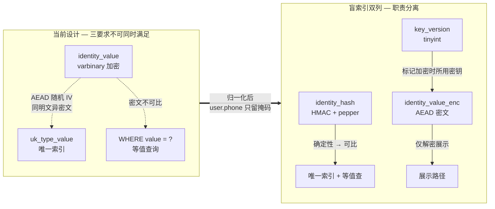
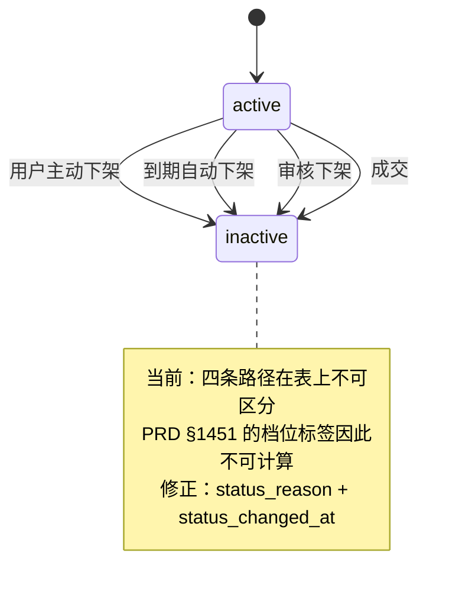
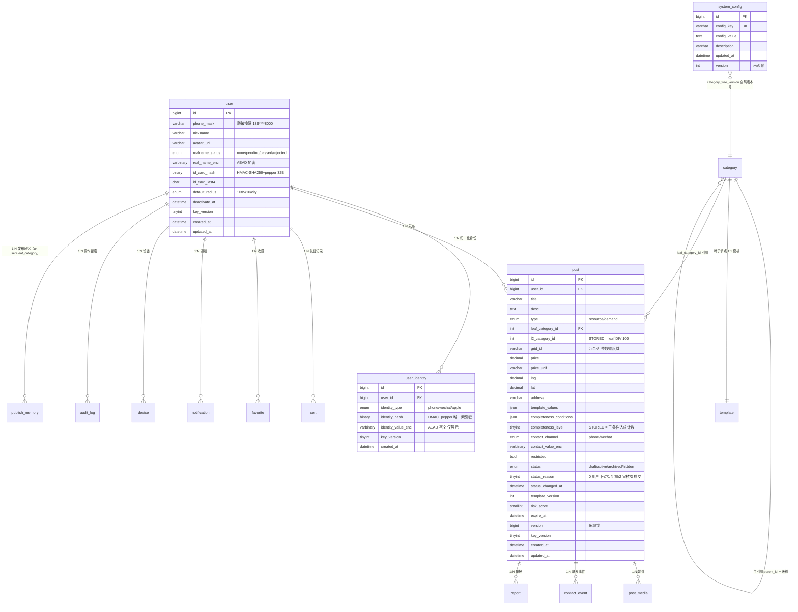
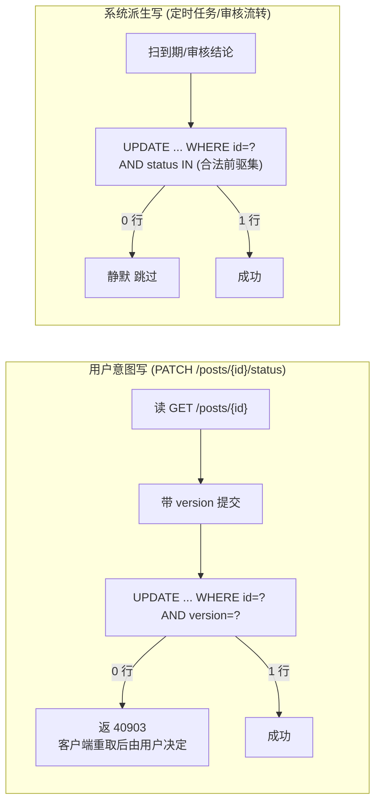

# Batch1 数据模型结构性修正 - Plan

## Goal Capsule

**目标**：Batch1 建表完成后，敏感字段在密码学上可用（唯一索引与等值查成立、哈希真不可逆、密钥可轮换），帖子状态变更事后可归因，冗余列不可能与其源值漂移，定时任务不会对用户返回冲突错误；15 张表（PRD §13.1 原 14 张 + 新建 `system_config`）全部建出，含 7 张原零字段表的字段定义。

**产品权威**：`docs/PRD.md` §13（数据需求）与 `docs/architecture/系统总体架构设计文档.md` §5（数据架构）是数据字典与索引口径的真源；本契约记录对二者的**修正项**，不重述其未变部分。Batch2/Batch3 的表与索引（Hard Filter 索引、`city_id`、后台运营表）不在本契约范围。

**开放阻塞项**：无（Q1-Q5 均已决；Q3-Q5 在 Planning Contract KTD 中定案）。

### Product Contract Preservation Note

本计划经四轮 AskUserQuestion 裁定，相对 brainstorm 阶段的 requirements-only 契约产生以下产品范围变更，已回写或需回写 `docs/PRD.md` §13.2：

1. **表范围扩为 15 张**（R12 + R25）：原 14 张表外新建 `system_config` 承载分类树全局版本号与其他 key-value 配置。构思稿曾凭空列出 `scheduled_task`/`task_log`/`notification_template`/`file_metadata` 四张表，作废。
2. **`system_config` 表落点**（R12 修正）：分类树全局版本号原写"不新建表"，已修正为新建 `system_config` 表存一行。
3. **8 张表字段定义（7 张零字段表 + 新建 `system_config`）**（R19-R25 + R12）：`cert`/`template`/`post_media`/`favorite`/`device`/`notification`/`audit_log`/`system_config` 原在 PRD §13.2 无字段字典，本轮新造并需回写 PRD。
4. **`user.phone` → `phone_mask`**（R2 落地口径）：原 PRD §13.2 写"`phone` 列保留为业务展示"，已修正为 `phone_mask varchar(20)` 存脱敏掩码（如 `138****8000`），手机号原文作为 `user_identity` 行走盲索引（R1）。回写 PRD:2336。
5. **`post` 表补齐字段**（R6/R7/R11 + R9 + R10）：`status_reason`/`status_changed_at`/`template_version`/`l2_category_id`(生成列)/`completeness_level`(生成列产出 tinyint)/`version`(架构 §5.2 已定义) 需回写 PRD:2363-2387。
6. **`report` 表补齐字段**（R26）：`evidence`/`reported_user_id`/`status`/`handled_at` 需回写 PRD:2419-2426。

---

## Product Contract

### Summary

把 6 项已验证的结构性修正定入 Batch1 建表：敏感字段改盲索引双列并将手机号彻底归一化到 `user_identity`；`post` 补齐状态变更归因字段；两个冗余列改 DDL 生成列；写守卫按「用户意图 / 系统派生」分流；地图取 Pin 走覆盖索引；网格计算改整数微度域。另含 4 项口径定案。

### Problem Frame

当前数据字典中有两类问题在 Batch1 建表后修复成本极高。

**第一类是结构上不成立的设计。** `user_identity.identity_value` 同时要求「加密存储」「唯一索引」「等值查询」，`user.phone` 同样如此。AEAD 加密使用随机 IV，同一明文每次加密产出不同密文——唯一约束无法拦截重复，等值查询无法命中。这不是实现缺陷，是三个要求在密码学上不可同时满足。同一份数据字典里 `id_card_hash` 已经是正确范式（存不可逆哈希而非密文），说明范式已存在，只是未推广；而它自身又与明文 `id_card_last4` 并存，18 位身份证的强结构化（地区码可枚举、生日约 4 万种、顺序码 999、校验位可推导）叠加已知后 4 位，使裸 SHA-256 的候选空间可在 GPU 上分钟级穷举。出包门禁目前只检查是否存在明文列，不检查哈希是否加盐。

**第二类是时间不可逆的缺失。** PRD §1451 定义的客观代理档位标签依赖「`post.status` 变更时刻 − 首次 `contact_event.created_at`」，但 `post` 只有 `created_at` 与 `updated_at`——该时刻在表上不存在，标签当前数学上不可计算。四条进入非 active 的路径（用户主动下架、到期、审核下架、成交）在表上无法区分。埋点保留窗口 90 天，窗口内未采到的维度永久不可追补。

其余修正项（冗余列、写守卫、覆盖索引、网格算法）事后可改，但都属于在空库上改一行 DDL、在有数据的库上改则需回刷或重建的类别。

### Key Decisions

- **手机号彻底归一化到 `user_identity`，`user` 表只留明文掩码。** (session-settled: user-directed — chosen over 双表各自实现盲索引: 密码学上只有一处密文，比两处密文同事务维护的一致性负担更小) Governs R1, R2, R5

- **盲索引双列是敏感字段的统一范式。** 承载唯一索引与等值查的列与可解密展示的列职责分离，全部敏感字段一视同仁。Governs R1, R3, R4

- **三级类目编号即不变量，已发布编号不得重排。** 这是派生列可生成列化的前提；PRD §13.2「运营调整父子关系时须批量回刷」与该不变量冲突，以不变量为准。**运营真需调整层级时的退路**：只允许「新增新编号 + 旧编号置 `forbidden`（停用不删）+ 新老编号并存过渡」，已发布帖的 `leaf_category_id` 不动。若某次调整确实必须重排已发布编号，则代价是——把 `l2_category_id` 从生成列退回普通列（`ALTER TABLE post MODIFY COLUMN`，有数据时需重建表）、补一次性回刷任务、并重建 `idx_pins_cover` 索引；在单城试点的数据量下是一次停机窗口内可完成的操作，但此后 R9 的「不可能漂移」保证即失效。Governs R9

- **`grid_id` 不改 DDL 生成列。** PRD §13.2 要求服务端与客户端逐位一致，生成列会制造 SQL 与 Dart 两套实现，反而增加不一致风险。改整数微度域是实现加固，编码格式不变。Governs R16

- **写守卫按写入来源分流，而非统一用乐观锁。** 用户意图写与系统派生写对冲突的承受能力不同，统一守卫会迫使系统写路径承受不该由其处理的 `40903` 重试。Governs R13, R14

- **`completeness_level` 以 API 映射为档位序真源，落库即 `tinyint`。** (session-settled: user-directed — chosen over 倒转 ENUM 声明序 / API 层显式映射表: 库内值与响应值同构，取数路径无需转换，也不依赖「ENUM 序号 = API int」这条会被新档位静默破坏的隐式契约) Governs R10
- **`post` 的状态归因与埋点维度快照是唯二时间不可逆项。** 若排期收紧，验收标准优先绑这两项，其余修正事后可改。Governs R6, R7, R8

### Requirements

**敏感字段落库形态**

R1. `user_identity` 用 `identity_hash`（HMAC-SHA256 + pepper）承载 `uk_type_value` 唯一索引与全部等值查询，`identity_value_enc` 单独存 AEAD 密文仅用于解密展示。

R2. `user` 表移除加密的 `phone` 列，改为明文 `phone_mask`（掩码，仅展示）；手机号原文作为一条 `user_identity` 行（`identity_type=phone`）落库，走 R1 的盲索引范式。

R3. `id_card_hash` 改为 HMAC-SHA256 + pepper，不使用裸摘要。

R4. 所有承载 HMAC 或 AEAD 的表带 `key_version tinyint`，使密钥轮换可灰度进行而无需停机重写全表。**版本语义只支持前向新增**：新版本仅对新写入行生效，旧行保持旧版本号并继续用对应旧密钥解密，常态下不重算。**密钥泄露时的重算预案**：AEAD 主密钥泄露只需按 `key_version` 逐批解密再以新版本重加密，不影响索引；**pepper 泄露则须全量重算盲索引列**——`identity_hash`/`id_card_hash` 的值全部改变，需在停写窗口内重算并重建 `uk_type_value` 唯一索引，期间登录与注册不可用。故 pepper 的保管强度必须高于 AEAD 主密钥，且 Batch1 不提供在线吊销能力（旧 pepper 无法在不停写的前提下停用）。

R5. 渠道级限频以手机号盲索引值为键，账号级风控以 `user_id` 为键；用户注销时按 `user_id` 删除其全部 `user_identity` 行。

**状态归因与可回溯性**

R6. `post` 增 `status_reason tinyint`，区分四种进入非 active 的路径：用户主动下架、到期自动下架、审核下架、成交。

R7. `post` 增 `status_changed_at datetime` 非空，每次 `status` 变更时同步更新。

R8. 埋点事实行自带发布时的维度快照，使埋点分析无需跨库 join 且不受后续改帖影响；冗余的 `grid_id` 只能是发布点网格，不得引入用户位置。

**派生列与版本口径**

R9. `l2_category_id` 改为基于 `leaf_category_id DIV 100` 的 STORED 生成列，不由任何写路径维护。

R10. `completeness_level` 改为基于 `completeness_conditions` 的 STORED 生成列，产出 `tinyint`，取值与 PRD §12.3 `/map/pins` 响应的 API 映射（`0=🔴/1=🟡/2=🟢`，PRD:2175）逐值一致。

R11. `post` 增 `template_version int`，使模板改版不改变已发布帖的语义。

R12. 分类树全局版本号从 `category` 表移出，改存 `system_config` 表的一行，不再以 74 行各存一份的形式存在。

**写守卫与并发**

R13. 用户意图触发的状态写用 `WHERE version = ?` 守卫，冲突返回 `40903` 交由用户重试。

R14. 系统派生的状态写（定时任务、审核流转）用 `WHERE status IN (合法前驱集)` 守卫，永不返回 `40903`；非法流转表现为 0 行受影响。

**空间读路径**

R15. `/map/pins` 的取数走覆盖索引，索引列覆盖响应 schema 的全部字段，查询为 index-only scan 无回表。

R16. `grid_id` 的生成在服务端与客户端统一在整数微度域内计算（先将度值转为整数微度，再整除网格步长对应的整数），不使用浮点除法；编码格式仍为 PRD §13.2 已定的字符串形态。

**清理与保留的可验证性**

R17. CI 断言每条数据保留策略在定时任务表中有对应执行者，缺失则构建失败。

R18. 埋点月表在跨月首次写入时不因分区或表不存在而丢数据。

**零字段表字段定义（本轮新造并回写 PRD §13.2）**

R19. `template` 表（Batch1）：`id`/`leaf_category_id`(int, FK, 唯一索引)/`fields`(json, 动态表单 Schema)/`template_version`(int, 与 `post.template_version` 对齐)/`updated_at`(datetime)；与 `category` 表叶子节点 1:1，按 `leaf_category_id` 单查。

R20. `post_media` 表（Batch1，表名沿用 PRD 不用架构 §5.1 的 `media`）：`id`/`post_id`(bigint, NULL, FK→`post.id`，未关联 post 时为孤儿 media)/`object_key`(varchar(128), OSS 对象键)/`audit_status`(enum pending/pass/reject)/`reject_reason`(varchar(64)) /`content_type`(varchar(32))/`size_bytes`(int)/`created_at`(datetime)；OSS 两步直传登记落此表，`audit_status != pass` 的 `media_id` 不出现在任何非本人可见的响应里（架构 §2.1）。

R21. `device` 表（Batch1）：`id`/`user_id`(bigint, FK, 索引)/`fingerprint`(varchar(64), 唯一索引，限频键)/`platform`(enum android/ios)/`push_token`(varchar(128), NULL)/`last_active_at`(datetime)；双重职责——`fingerprint` 做联系限频的设备维（§7.7），`push_token` 做推送下发（架构 §2）。

R22. `notification` 表（Batch1）：`id`/`user_id`(bigint, FK, 索引)/`type`(enum system/interaction/cert)/`title`(varchar(64))/`summary`(varchar(256))/`target_id`(bigint, NULL, 关联 post/report/cert 的 ID)/`created_at`(datetime)/`read_at`(datetime, NULL)/`deleted_at`(datetime, NULL, 软删)；三 Tab（系统/互动/认证）按 `type` 分流。

R23. `audit_log` 表（Batch1，180 天保留）：`id`/`operator_id`(bigint, 索引)/`operator_role`(enum super_admin/admin/auditor/system)/`action`(varchar(64))/`target_type`(varchar(32))/`target_id`(bigint)/`before_value`(json, NULL)/`after_value`(json, NULL)/`reason`(varchar(256), NULL)/`created_at`(datetime, 索引)；PRD §9.10.1 已定义 7 项审计字段口径，本表落地。

R24. `favorite` 表（Batch2，但本期建表）：`id`/`user_id`(bigint, FK)/`post_id`(bigint, FK)/`created_at`(datetime)/`deleted_at`(datetime, NULL, 软删，30 天后物删)；唯一约束 `uk_user_post (user_id, post_id)` 按 post_id 去重，软删后允许重新收藏（约束含 `deleted_at IS NULL` 谓词）。

R25. `cert` 表（Batch2，但本期建表）：`id`/`user_id`(bigint, FK, 索引)/`cert_type`(enum personal_realname/personal_qualification/enterprise/vehicle)/`status`(enum pending/approved/rejected/expired)/`submitted_at`(datetime)/`approved_at`(datetime, NULL)/`expire_at`(datetime, NULL)/`reject_reason`(varchar(256), NULL)/`ocr_image_ref`(varchar(128), NULL, 7 天后清理)/`fail_count`(tinyint, 默认 0)/`lock_until`(datetime, NULL)；与 `user.realname_status` 职责边界——`user` 存最新聚合态，`cert` 存每次申请记录。

R26. `report` 表补齐字段（修正 PRD:2419-2426 的字段缺失）：在原 `post_id`/`reporter_id`/`reason`/`weight`/`is_false_report` 基础上增 `reported_user_id`(bigint, 被举报发布者，索引)/`evidence`(json, 举报凭证 media_ids 数组)/`status`(enum pending/handled/dismissed, 默认 pending)/`handled_at`(datetime, NULL)/`handler_id`(bigint, NULL, 处理人)。

**新建 `system_config` 表（R12 落地）**

R27. `system_config` 表（新建，Batch1）：`id`/`config_key`(varchar(64), 唯一索引)/`config_value`(text)/`description`(varchar(256))/`updated_at`(datetime)/`version`(int, 乐观锁)；初始数据：`config_key='category_tree_version'`、`config_value='1'`。承载分类树全局版本号与其他系统级 key-value 配置（如未来风控阈值、推送策略）。

### Visualizations

**敏感字段的三要求矛盾与解法**（Covers R1, R2, R3, R4）

**四条进入非 active 的路径**（Covers R6, R7）

### Acceptance Examples

AE1. **Covers R1, R2.** 同一手机号先注册后再次尝试注册：第二次插入 `user_identity` 因 `identity_hash` 命中唯一索引而失败，而非因密文不同而重复入库。

AE2. **Covers R1.** 按手机号查找用户：以该手机号的 HMAC 值做等值查询命中索引，无需全表解密扫描。

AE3. **Covers R4.** pepper 轮换后写入的新行 `key_version` 递增；旧 `key_version` 的行仍可解密，无需停机重写全表。

AE4. **Covers R6, R7.** 一条帖子在收到首次联系后 6 小时内被发布者主动下架：`status_reason` 标记为「用户主动下架」，`status_changed_at` 记录下架时刻，PRD §1451 的档位标签可由这两列与 `contact_event.created_at` 计算得出。

AE5. **Covers R9.** 直接 `UPDATE post SET l2_category_id = <错误值>` 被数据库拒绝（生成列不可写），冗余列与 `leaf_category_id` 不可能漂移。

AE6. **Covers R13, R14.** 定时到期任务与用户手动下架同时命中同一行：任一方成功、另一方影响 0 行。**系统路径不产生 `40903`**（定时任务失手表现为 0 行受影响、静默跳过）；用户侧若因自身乐观锁版本过期而收到 `40903`，是 R13 的预期行为，不计入下方成功标准的错误码计数。

AE7. **Covers R14.** 对一条已是 inactive 的帖子执行审核下架：`WHERE status IN (合法前驱集)` 不匹配，影响 0 行，无异常抛出。

AE8. **Covers R15.** `/map/pins` 查询的执行计划为 `Using index`，无 `Using where; Using index condition` 之外的回表标记。

AE9. **Covers R16.** 位于网格边界上的坐标（步长整数倍处）在服务端与客户端产出相同 `grid_id`，且与现有 10 条测试向量的期望值一致。

AE10. **Covers R18.** 在月初第一次写入埋点时，目标月表或分区尚未由预建任务创建：写入仍成功落库，不丢数据。

### Scope Boundaries

- **不做敏感字段垂直切侧表。** 5 个禁出字段分属三张表，切侧表需 2-3 张新表并把常规读变成 join；响应白名单加出包门禁能以更低成本达到同样效果。
- **不做 `retention_policy` 元数据表与通用清理执行器。** 6 条保留策略的清理逻辑异构（整表 drop、软删转物删、含业务副作用的冷静期、删 OSS 文件），元数据难以统一驱动；只取其中可 CI 断言的部分（R17）。
- **不把 RANGE 分区推广到埋点以外的表。** 千万行 DELETE 打满 buffer pool 的论证限定于埋点表；`audit_log` 在 180 天保留期内是万级行，且推广会引入新的分区维护任务。
- **不建分类树演变映射表。** 「编号不得重排」这一不变量已替代映射表的作用；48 个叶子与万级编码体系不同阶。
- **不做模板两层建模。** 只取其最小形式（R11 的一个 int）；完整的 archetype/template 分层在 40/48 叶子走通用兜底的现状下过重。
- **不做埋点写入分层采样。** 与「layer_switch 全量上报不采样」的已定口径直接冲突。
- **Batch2/Batch3 的表与索引不在范围内**，包括 Hard Filter 索引与 `city_id` 的归属。

### Dependencies / Assumptions

- R4 的 `key_version` 语义依赖密钥存放位置的选定（见 Q3）。
- R2 改动注册与登录的读写路径，需与客户端同步；假设 Batch1 排期内两侧可协同发布。
- R16 需同时修改服务端与客户端的网格计算，假设两侧的整数微度转换在舍入行为上可对齐。
- R15 的覆盖索引效果依赖 `/map/pins` 响应 schema 不再新增字段；若新增，索引需同步扩列。

### Success Criteria

- 敏感字段的唯一索引与等值查在集成测试中成立，且无任何路径以密文做等值比较。
- PRD §1451 的客观代理档位标签可从库中数据直接计算得出。
- `/map/pins` 在 2 核 2G / 450M buffer pool 环境下 P95 满足 `lib/nfr_constants.dart` 定义的指标。
- **系统派生写路径**（定时任务、审核流转）在与用户操作并发时产生的 `40903` 计数为 0；用户意图写路径的 `40903` 是 R13 的预期行为，不计入本项。

### Outstanding Questions

**Resolved Before Planning**

Q1（已决）：`completeness_level` 生成列产出 `tinyint`，以 PRD §12.3 `/map/pins` 响应的 API 映射（`0=🔴/1=🟡/2=🟢`，PRD:2175）为档位序真源。Dart 枚举顺序不动，序列化处显式映射。见 Key Decisions 第 6 条。

Q2（已决）：分类树全局版本号存于 `system_config` 表的一行。原选项描述"不新建表"基于错误前提已修正——`system_config` 还承载未来其他 key-value 配置，故新建。

Q3（已决，见 KTD5）：pepper 与 AEAD 主密钥存于 Spring Boot `application-#{env}.yml` 的 `app.crypto.hmac-peppers` 与 `app.crypto.aead-master-keys`（均为列表，按 `key_version` 索引）；生产环境仅通过环境变量注入、配置文件内不写字面量；KMS 留待 Batch2 评估。

Q4（已决，见 KTD6）：R17 的 CI 断言以代码注册表为源——`common/retention/RetentionRuleRegistry.java` 注册 `(retention_key, task_bean_name)` 映射，CI 跑 `RetentionRuleCoverageTest` 比对注册表与 `docs/PRD.md` §13.4 表格条目数（解析 Markdown 表格）。

Q5（已决，见 KTD4）：R18 采用预建任务 + MAXVALUE 兜底双保险——架构 §8 的"每月 25 日建下月表"任务为主，并附加事件监听器在 `INSERT` 失败且错误码为表不存在时回退到 `track_event_fallback` 表（同结构、无分区），由后台任务搬运到正确月表。

### Sources / Research

- `docs/PRD.md` §13（数据需求 / 数据字典）、§14.1（性能指标）、§1451（客观代理档位标签定义）
- `docs/architecture/系统总体架构设计文档.md` §5（数据架构）、§8（定时任务表）
- `docs/architecture/可观测性架构方案.md`（埋点表结构、出包门禁、反向哨兵契约）
- `docs/solutions/workflow-issues/data-model-reservation-for-deferred-features.md`（「延期的是逻辑，不是数据」判据与两条连带纪律）
- `docs/ideation/2026-09-04-database-architecture-ideation.html`（本契约 18 条需求的来源构思与 21 条淘汰记录）
- `lib/nfr_constants.dart`（NFR 常量真源）、`lib/domain/category_tree.dart`、`lib/domain/publish_completeness.dart`

---

## Planning Contract

### Summary

把 brainstorm 已确认的 18 条 R 升为可执行的 DDL + 数据字典 + 设计文档：建 15 张表（11 Batch1 + 3 Batch2 + 1 新建 system_config），HMAC/pepper 在应用层算、库内只存 `BINARY(32)`，两个冗余列走 STORED 生成列，写守卫按用户意图/系统派生分流，地图取 Pin 走覆盖索引，分类树版本号与系统配置进 `system_config`，7 张原零字段表与 `report` 补齐字段并回写 PRD。Flyway `V1__init_schema.sql` 一文件落地全部 15 张表。

### Key Technical Decisions

KTD1. **STORED 生成列而非 VIRTUAL**（Covers R9, R10）：`l2_category_id` 与 `completeness_level` 用 `GENERATED ALWAYS AS (...) STORED`，可建索引、可被 `WHERE` 命中。空库建表无重建表成本；读路径不需重算；列值由 DDL 保证不漂移。代价：写入时计算一次，对 write-heavy 场景有 CPU 开销，但 `post` 表写入频率不高（单城试点），可接受。**演进代价**：`completeness_level` 的表达式硬编码了 PRD §9.8 现有的三个条件（`required_full`/`address_precise`/`leaf_matched`），若产品新增第四个条件，需在有数据的 `post` 表上 `ALTER` 生成列表达式（MySQL 对 STORED 生成列的表达式变更会重建表）并同步改 PRD §9.8 的判定口径与档位阈值；单城试点量级下是一次停机窗口内可完成的操作，但这是该决策换取「不可能漂移」保证所付的代价，新增条件不是零成本改动。

KTD2. **HMAC-SHA256 + pepper 在应用层算，MySQL 只存 `BINARY(32)`**（Covers R1, R3, R4）：MySQL 8.4 无内置 HMAC 函数，若用 `SHA2()` 等数据库原语绕过 pepper 则违反 R3。Java 21 `javax.crypto.Mac` + `HmacSHA256` 是成熟实现；密文以 `byte[]` 形式传入 JDBC，等值查 `WHERE identity_hash = ?` 用 `PreparedStatement.setBytes`。代价：等值查询的参数绑定不能复用字符串字面量，但 MyBatis-Plus 的 `TypeHandler` 已支持 `byte[]` ↔ `BINARY` 映射。

KTD3. **Flyway 单文件 `V1__init_schema.sql` 落地 15 张表 + 索引 + 初始数据**（Covers R19-R27）：Batch1 是首版 schema，空库无渐进迁移需求；单文件可整体 review、整体回滚（社区版 Flyway 无 Undo，回滚靠 `flyway:clean` + 重跑——`spring.flyway.clean-disabled=true` 在生产环境必设）。Batch2 起新增表用 `V2__add_cert_and_favorite_indexes.sql` 等增量脚本。

KTD4. **埋点跨月写入双保险**（Covers R18）：架构 §8 已定义"每月 25 日预建下月表"任务为主路径；附加 `MyBatisPlus` 的 `SQLException` 拦截器，当错误码为 `1146`（表不存在）时把事件插入 `track_event_fallback` 表（与月表同结构、无分区、无索引，仅做兜底），后台 `@Scheduled` 任务每分钟把 `fallback` 表数据搬到正确月表。代价：双写路径增加复杂度，但跨月那一刻的数据不丢是硬约束。

KTD5. **pepper 与 AEAD 主密钥放 Spring `application-#{env}.yml`，环境变量覆盖**（Covers R1, R3, R4）：`app.crypto.hmac-peppers` 与 `app.crypto.aead-master-keys` 均为**列表**（按 `key_version` 索引，与 R4 的灰度轮换语义对齐；单元素列表即 Batch1 初始态），生产环境通过 `HMAC_PEPPERS_JSON` 与 `AEAD_MASTER_KEYS_JSON` 环境变量注入。**生产密钥只经环境变量注入**：`application-prod.yml` 内不得写入任何密钥字面量，仅保留占位引用；`application-dev.yml` 的开发密钥与生产密钥必须不同值，且配置文件不得进入版本控制的密钥字段以 `.gitignore` + CI secret 双重约束。代价：密钥随配置下发，需配合配置中心或 CI/CD secret 管理；KMS 接入留待 Batch2 评估，Batch1 单实例规模下不值当。

KTD6. **R17 CI 断言以代码注册表为源**（Covers R17）：`common/retention/RetentionRuleRegistry.java` 注册 `(retention_key, task_bean_name)` 映射，`RetentionRuleCoverageTest`（JUnit 5）断言注册表 key 集合等于 PRD §13.4 表格的 9 条保留策略 key。代价：注册表与文档表格需手动同步，但这是"门禁"的本质——双向比对，任何一侧改动都需另一侧回应。

KTD7. **覆盖索引列序按 PRD §13.3 候选落地，EXPLAIN 实测后调**（Covers R15）：DDL 中按 `(grid_id, leaf_category_id, type, status, expire_at)` 落地候选索引，U7 验收阶段用 50 万造数 + `EXPLAIN` 实测确认 `Using index`；若不达标按 EXPLAIN 建议调列序，DDL 改一行即可。代价：候选序可能不是最优，但 PRD §13.3 已明确"最终列序以 EXPLAIN 实测为准"。

### High-Level Technical Design

**15 张表 ER 概览**（ Covers R1-R27）

**敏感字段三要求矛盾的解法**：见 Product Contract Visualizations 的 mermaid 图（盲索引双列 + pepper + key_version）。

**写守卫分流**：

**`post` 表两个 STORED 生成列**：`l2_category_id INT GENERATED ALWAYS AS (leaf_category_id DIV 100) STORED`；`completeness_level TINYINT GENERATED ALWAYS AS (JSON_LENGTH(... ) ...) STORED`（具体表达式见 DDL 注释）。

**`/map/pins` 覆盖索引**：`idx_pins_cover (grid_id, leaf_category_id, type, status, expire_at, id, lng, lat, completeness_level, user_id)` —— 前 5 列是 PRD §13.3 候选索引承担过滤，后 5 列覆盖响应 schema 字段，达成 index-only scan。

> **2026-09-06 复核修正**：原定义只有 8 列（后 3 列为 `id, user_id, completeness_level`），缺 `lng`/`lat`。但 `/map/pins` 响应契约（PRD §6.10 `pins[]` schema）必须返回坐标，坐标不在索引里则真实查询必回表——原先用 `SELECT id, user_id, completeness_level` 测出的 `Using index` 是假象。已补 `lng`/`lat` 至 10 列并用真实 SELECT 列表复测：仍为 `Covering index range scan`，p95 = 1.37ms；索引体积由 5.5MB 升至 9.5MB/10 万行，远低于回表碰 824MB 数据页的代价。详见数据库设计文档 §4.2/§4.4/§6.2。

### Assumptions

无（Deep 计划经四轮 AskUserQuestion 已实质确认所有 Inferred 项；无 `SKIP_SCOPING_CONFIRM` 跳过路径）。

---

## Implementation Units

### U1. 15 张表 DDL 脚本

**Goal**: 一份 Flyway 迁移脚本落地全部 15 张表的 `CREATE TABLE` + 索引 + `system_config` 初始数据。

**Requirements**: R1, R2, R3, R4, R6, R7, R8, R9, R10, R11, R12, R18, R19-R27。

**Dependencies**: 无（Batch1 首版 schema，空库落地）。

**Files**:
- `db/migration/V1__init_schema.sql`（新建，Flyway 默认路径；若 Spring Boot 主配置 `spring.flyway.locations` 已定为 `classpath:db/migration`，则放 `src/main/resources/db/migration/V1__init_schema.sql`）

> **落地进展（2026-09-05）**：DDL 已在数据库设计阶段写就并实测通过，当前存放于 `docs/database/ddl/V1__init_schema.sql`（业务库）与 `V1__init_track_schema.sql`（埋点库，架构 R14 分库）。后端工程搭建时移入上述扫描路径即可，脚本内容无需改写。详见《数据库设计文档》§0 交付物清单与 §4.4 实测验证结果。

**Approach**:
- MySQL 8.4 LTS 语法，`utf8mb4` + `utf8mb4_0900_ai_ci`。
- 每张表带 `COMMENT '...'`；每个字段带 `COMMENT '...'`（中文，符合用户规则 5.2）。
- 敏感字段双列：`identity_hash BINARY(32)` + `identity_value_enc VARBINARY(255)` + `key_version TINYINT`；`id_card_hash BINARY(32)` + `key_version TINYINT`。
- 生成列：`l2_category_id INT GENERATED ALWAYS AS (leaf_category_id DIV 100) STORED`；`completeness_level TINYINT GENERATED ALWAYS AS (ELT(JSON_LENGTH(JSON_EXTRACT(completeness_conditions, '$[*]')), 0,1,2,2)) STORED`（具体表达式以 PRD §9.8 三条件达成计数为准，DDL 注释中标注）。
- 索引按 PRD §13.3 + 架构 §5.3 候选序落地；`/map/pins` 覆盖索引含响应字段列以达成 index-only scan。
- `system_config` 初始数据 `INSERT INTO system_config(config_key, config_value, description, version) VALUES ('category_tree_version', '1', '分类树全局版本号', 0);`。
- **`track_event_fallback` 兜底表同脚本建出**（KTD4 的落点）：与埋点月表同结构、无分区、无索引，仅作跨月首写的兜底缓冲。它是运维基础设施表而非业务表，**不计入「15 张表」口径**；缺它则 KTD4 的兜底路径首次触发即失败。
- **埋点月表首月表与维度快照列同脚本落地**（R8 的落点，结构真源为 `docs/architecture/可观测性架构方案.md` 埋点表结构）：事实行自带发布时快照列 `leaf_category_id`/`completeness_level`/`is_ai_assisted`/`grid_id`（PRD:2253 已定的三个维度加发布点网格），使埋点分析无需跨库 join 且不受后续改帖影响；`grid_id` 只能是**发布点网格**，不得引入用户位置。同样不计入「15 张表」口径。
- 不写外键约束（架构 §5.1.1 范式——读路径信任冗余列、写路径由 service 层同事务维护一致性；FK 在分库分表演进时是负担）。

**Test scenarios**:
- 在空 MySQL 8.4 实例上 `flyway migrate` 成功，无 warning。
- `SHOW CREATE TABLE` 每张表含 `ENGINE=InnoDB`、`CHARSET=utf8mb4`。
- 生成列不可写：`INSERT INTO post(..., l2_category_id, ...) VALUES (..., 999, ...)` 返回错误码 3105（非生成列的列被写入）。
- 唯一约束：两次插同一 `identity_hash` 第二次失败（错误码 1062）。
- `system_config` 查询返回 `category_tree_version=1`。
- 埋点月表事实行含四个维度快照列，其 `grid_id` 值与发布时 `post.grid_id` 一致（R8）。
- 删掉当月埋点月表后 `INSERT`：事件落 `track_event_fallback`，无数据丢失（R18 / AE10）。

**Verification**: `flyway info` 显示 `V1` 为 `Success`；`SHOW INDEX FROM post` 含 `idx_pins_cover`；`SELECT COUNT(*) FROM system_config` 返回 1。

---

### U2. 敏感字段盲索引双列范式落地

**Goal**: 5 个敏感字段（手机号、姓名、身份证号、联系方式、外部身份值）全部按盲索引双列范式落地，HMAC+pepper 由 Java 层算。

**Requirements**: R1, R2, R3, R4, R5。

**Dependencies**: U1（DDL 已建 `BINARY(32)` 列）。

**Files**:
- `src/main/java/com/s2s/common/crypto/HmacHasher.java`（新建）
- `src/main/java/com/s2s/common/crypto/AeadCipher.java`（新建，封装 `javax.crypto.Cipher` + AES-GCM）
- `src/main/java/com/s2s/common/crypto/CryptoConfig.java`（新建，`@ConfigurationProperties(prefix="app.crypto")`）
- `src/main/resources/application-dev.yml` / `application-prod.yml`（增加 `app.crypto.*` 配置块）

**Approach**:
- `HmacHasher.hash(String plaintext, int keyVersion)` → `byte[32]`，用 `HmacSHA256` + `pepper[keyVersion]`。
- `AeadCipher.encrypt(String plaintext, int keyVersion)` → `byte[]`，AES-GCM-256，随机 12 字节 IV 前置；`decrypt(byte[] ciphertext, int keyVersion)` → `String`。
- `CryptoConfig` 持有 `hmacPeppers` 列表与 `aeadMasterKeys` 列表（均按 `key_version` 索引）；生产环境通过 `HMAC_PEPPERS_JSON` / `AEAD_MASTER_KEYS_JSON` 环境变量注入，配置文件内不写密钥字面量（KTD5）。
- **AEAD 关联数据绑定**：`encrypt`/`decrypt` 额外接受 AAD 参数，注册与解密时传入该密文的归属标识（`user_identity` 传 `user_id` + `identity_type`，`user.real_name_enc` 传 `user_id`，`post.contact_value_enc` 传 `post_id`）。密文被搬到另一行时 AAD 不匹配，GCM 校验失败而非静默解出，堵住越权搬运。
- 注册 `TypeHandler`：`BinaryTypeHandler` 处理 `byte[]` ↔ `BINARY/VARBINARY` 映射（MyBatis-Plus 默认支持，无需新建）。
- 等值查询：`user_identityMapper.selectByPhone(String phone)` → Java 层先 `HmacHasher.hash(phone, currentKeyVersion)` 再 `WHERE identity_hash = ?` 传 `byte[]`。

**Test scenarios**:
- 同一明文两次 `HmacHasher.hash` 返回相同 `byte[32]`（确定性）。
- 同一明文两次 `AeadCipher.encrypt` 返回不同 `byte[]`（随机 IV）。
- `AeadCipher.decrypt(AeadCipher.encrypt(x))` 还原 x。
- `keyVersion=1` 加密的密文用 `keyVersion=0` 解密失败（验证 key_version 隔离）。
- AAD 绑定：以 `user_id=1` 加密的密文用 `user_id=2` 的 AAD 解密抛 `AEADBadTagException`（验证跨行搬运不可解）。
- `user_identityMapper.selectByPhone` 命中唯一索引、EXPLAIN 显示 `Using index`。
- 注销：`user_identityMapper.deleteByIdentity(userId)` 删除该 user 全部身份行（R5），同事务清空 `user.phone_mask`。
- 换绑手机号：同事务内删旧身份行、插新身份行、改写 `phone_mask`；换绑后掩码与新号码的前 3 后 4 位一致。

**Verification**: 单元测试 `HmacHasherTest`、`AeadCipherTest` 全绿；集成测试 `UserIdentityRepositoryIT` 跑通注册→查表→注销三步。

---

### U3. `post` 表状态归因与生成列落地

**Goal**: `post` 表补齐 `status_reason`/`status_changed_at`/`template_version`/`version` 四列 + `l2_category_id`/`completeness_level` 两个 STORED 生成列；写守卫分流落地。

**Requirements**: R6, R7, R9, R10, R11, R13, R14。

**Dependencies**: U1。

**Files**:
- `src/main/java/com/s2s/post/service/PostStatusGuard.java`（新建）
- `src/main/java/com/s2s/post/service/PostStatusTransition.java`（新建，状态机枚举）
- `src/main/java/com/s2s/post/mapper/PostMapper.java`（新建）

**Approach**:
- `PostStatusTransition` 定义 4 条进入非 active 的路径与合法前驱集：`user_archive`(前驱 active)、`expire`(前驱 active)、`audit_takedown`(前驱 active/hidden)、`deal_done`(前驱 active)。
- `active → hidden` 由「24h 未实名自动隐藏」触发（PRD:2392 已定义的 `hidden` 语义），是**第五条系统派生写路径**，同样走 `systemDerivedUpdate`；它不属于 R6 的四种 `status_reason` 取值（R6 只区分进入 archived 的四条路径），因此 `hidden` 作为 `audit_takedown` 的合法前驱是可达的——实名后一键恢复回 active 亦走系统派生写。
- `PostStatusGuard.userIntentUpdate(postId, newStatus, reason, version)` 用 `UPDATE post SET status=?, status_reason=?, status_changed_at=NOW(), version=version+1 WHERE id=? AND version=?`，影响 0 行返 `40903`。
- `PostStatusGuard.systemDerivedUpdate(postId, newStatus, reason, predecessors)` 用 `UPDATE post SET status=?, status_reason=?, status_changed_at=NOW(), version=version+1 WHERE id=? AND status IN (...)`，影响 0 行静默返回。
- `l2_category_id` 与 `completeness_level` 由 DDL 生成，service 层不写。

**Test scenarios**:
- 用户下架 + 定时到期同时命中：一方 1 行、另一方 0 行，无 `40903` 抛给定时任务（AE6）。
- 对 inactive 帖子执行 audit_takedown：`WHERE status IN (active,hidden)` 不匹配，0 行，无异常（AE7）。
- 生成列不可写：`UPDATE post SET l2_category_id = 999` 返回 3105（AE5）。
- `status_changed_at` 每次状态变更同步更新，非空。

**Verification**: `PostStatusGuardConcurrencyIT` 并发测试无 `40903` 计数；`SHOW CREATE TABLE post` 显示两个 `GENERATED ALWAYS AS (...) STORED`。

---

### U4. `system_config` 表与分类树版本号落点

**Goal**: 新建 `system_config` 表，`category_tree_version` 配置项入库；`category` 表移除 `version` 列。

**Requirements**: R12, R27。

**Dependencies**: U1。

**Files**:
- `src/main/java/com/s2s/category/service/SystemConfigService.java`（新建）
- `src/main/java/com/s2s/category/mapper/SystemConfigMapper.java`（新建）

**Approach**:
- `SystemConfigService.getVersion(String key)` 用乐观锁读；`incrementVersion(String key)` 用 `UPDATE system_config SET config_value = config_value + 1, version = version + 1 WHERE config_key = ? AND version = ?`。
- `category` 表 DDL 不含 `version` 列（原 PRD §13.2 `category.version` 已废弃）；客户端 `GET /categories/tree` 响应中的 `version` 字段从 `system_config` 查。
- 初始数据已在 U1 的 `V1__init_schema.sql` 中 `INSERT`。

**Test scenarios**:
- `getVersion('category_tree_version')` 返回 1。
- `incrementVersion('category_tree_version')` 后值变为 2、`version` 列 +1。
- 并发两个 `incrementVersion`：一方成功、另一方影响 0 行（乐观锁）。

**Verification**: `SELECT config_value FROM system_config WHERE config_key='category_tree_version'` 与客户端响应 `version` 字段一致。

---

### U5. 7 张零字段表的字段定义与 DDL

**Goal**: `template`/`post_media`/`device`/`notification`/`audit_log`/`favorite`/`cert` 7 张表字段定义按 R19-R25 落地，并回写 PRD §13.2。

**Requirements**: R19, R20, R21, R22, R23, R24, R25。

**Dependencies**: U1。

**Files**:
- DDL 已含在 `V1__init_schema.sql`（U1）。
- `docs/PRD.md`（回写 §13.2，补齐 7 张表字段字典）。

**Approach**:
- DDL 中每张表带 `COMMENT` + 字段 `COMMENT`，符合用户规则 5.2。
- `post_media` 表名沿用 PRD 不用架构 §5.1 的 `media`（11 项矛盾第 1 条）。
- **收藏并发去重的收敛手段**：单纯「先查后插」在两请求同时查不到时会双插。DDL 落**物理唯一索引 `uk_user_post (user_id, post_id)`**（不含 `deleted_at`，故一对 user-post 全生命周期只有一行），取消收藏置 `deleted_at`、重新收藏置回 `NULL`，service 层用 `INSERT ... ON DUPLICATE KEY UPDATE deleted_at = NULL` 一条语句完成「插入或复活」，由数据库唯一索引而非应用层查重保证幂等。代价：30 天物删任务只删 `deleted_at` 非空的行，行不复活即被物删，与 PRD:2495 的软删语义一致。
- `audit_log` 的 `before_value`/`after_value` **写入侧字段白名单**：由 `AuditLogWriter` 统一序列化，只允许白名单内的字段名进入 JSON，`phone`/`phone_mask`/`real_name`/`id_card`/`contact_value` 及一切以 `_enc`/`_hash` 结尾的列名一律剔除。缺此白名单则「记录变更前后值」会把禁出字段明文写入审计表，绕过响应白名单与出包门禁。
- `audit_log` 索引 `(operator_id, created_at)` 与 `(target_type, target_id, created_at)` 双覆盖。

**Test scenarios**:
- `INSERT` 每张表各 1 条记录成功。
- `post_media.audit_status` 枚举校验：插非法值返回 1265。
- `device.fingerprint` 唯一索引：同 fingerprint 两次插第二次失败。
- `notification` 三 Tab 查询：`WHERE user_id=? AND type=? AND deleted_at IS NULL` 走索引。
- 收藏幂等：并发两次收藏同一帖只留一行（唯一索引拦截）；取消后再收藏复活同一行、不新增行。
- 审计白名单：把含 `phone_mask` 与 `real_name_enc` 的变更对象交给 `AuditLogWriter`，落库 JSON 中两字段均不存在。

**Verification**: `SHOW CREATE TABLE` 7 张表字段完整；PRD §13.2 字段字典 7 张表不再为空。

---

### U6. `report` 表字段补齐

**Goal**: `report` 表增 `reported_user_id`/`evidence`/`status`/`handled_at`/`handler_id` 五列，回写 PRD §13.2。

**Requirements**: R26。

**Dependencies**: U1。

**Files**:
- DDL 已含在 `V1__init_schema.sql`（U1）。
- `docs/PRD.md`（回写 §13.2 `report` 字段字典）。

**Approach**:
- `evidence JSON` 存 media_ids 数组；media_ids 引用 `post_media.id` 但不建 FK（同 U1 范式）。
- `status` 默认 `pending`；运营处理后置 `handled`/`dismissed`。
- 索引 `(post_id, status, created_at)` + `(reported_user_id, status, created_at)` 双覆盖。

**Test scenarios**:
- 插一条 `status=pending` 的 report 成功。
- 按 `reported_user_id` 查询命中索引。

**Verification**: `SHOW CREATE TABLE report` 含 5 个新列；PRD §13.2 `report` 表字段字典更新。

---

### U7. `/map/pins` 覆盖索引 EXPLAIN 实测

**Goal**: 50 万造数下 `EXPLAIN` 验证 `/map/pins` 查询走 `Using index`，无回表；列序按 EXPLAIN 建议调优。

**Requirements**: R15, R16。

**Dependencies**: U1, U3。

**Files**:
- `src/test/resources/sql/seed_post_500k.sql`（新建，造数脚本）
- `src/test/java/com/s2s/map/MapPinsExplainIT.java`（新建，集成测试）

**Approach**:
- 造数 50 万条 `post`，`grid_id` 集中分布杭州区域（约 100 个网格），其余字段随机。
- `EXPLAIN SELECT id, user_id, lng, lat, type, completeness_level FROM post WHERE grid_id IN (...) AND leaf_category_id=? AND type=? AND status='active' AND expire_at > NOW();`
- 期望 `Extra: Using index`；若为 `Using index condition` 则补缺失覆盖列到索引尾部。
- AE9 验证：边界坐标（步长整数倍处）服务端与客户端产出相同 `grid_id`。

**Test scenarios**:
- EXPLAIN 输出含 `Using index`（AE8）。
- 10 条测试向量服务端与客户端逐位一致（AE9，测试向量在 `lib/domain/grid_id_test.dart` 与 `src/test/java/.../GridIdTest.java`）。
- 50 万数据下 P95 ≤ 150ms（PRD §14.1）。

**Verification**: `MapPinsExplainIT` 输出 EXPLAIN 报告到 `target/test-reports/map-pins-explain.txt`；P95 数据来自 JMeter 压测脚本。

---

### U8. R17 保留策略 CI 断言

**Goal**: `RetentionRuleRegistry` 注册表 + `RetentionRuleCoverageTest` CI 断言落地，PRD §13.4 的 9 条保留策略每条有定时任务执行者。

**Requirements**: R17。

**Dependencies**: U1, U3。

**Files**:
- `src/main/java/com/s2s/common/retention/RetentionRuleRegistry.java`（新建）
- `src/test/java/com/s2s/common/retention/RetentionRuleCoverageTest.java`（新建）

**Approach**:
- `RetentionRuleRegistry` 为 `@Component`，启动时通过 `@PostConstruct` 把 9 条 `(key, task_bean_name)` 注册进 `Map<String, String>`。
- 9 条 key：`ocr_image_7d`/`transit_log_30d`/`favorite_deleted_30d`/`publish_memory_180d`/`deactivate_7d`/`post_archived_keep`/`audit_log_180d`/`exif_strip`/`location_no_collect`。
- `RetentionRuleCoverageTest` 解析 `docs/PRD.md` §13.4 表格的**第 2 列「保留策略键」**（本轮已在 PRD 补列，键值即 `ocr_image_7d` 等 9 个英文键）提取 key 集合（用 commonmark-java），断言注册表 key 集合等于文档 key 集合。原表格首列为中文数据名，无可比对键，故门禁依赖该新列。
- EXIF/位置两条不是"清理任务"而是"上传时强制剥离"与"不采集"——注册为 `exif_strip`→`MediaUploadService.stripExif`、`location_no_collect`→`PostService.assertNoTrajectory`，断言这两个 bean 存在。

**Test scenarios**:
- CI 跑 `RetentionRuleCoverageTest` 通过。
- 故意注释掉一条注册 → 测试失败。
- 故意在 PRD §13.4 加一条新保留策略 → 测试失败（提醒同步注册表）。

**Verification**: CI 流水线绿；`RetentionRuleRegistry` 9 条 key 全部对应已注册 bean。

---

## Verification Contract

### 整体验收口径

- **DDL 一次性落地**：`flyway migrate` 在空 MySQL 8.4 实例上成功，无 warning；`V1__init_schema.sql` 含 15 张 `CREATE TABLE` + 全部索引 + `system_config` 初始数据。
- **生成列不可写**：`UPDATE post SET l2_category_id = 999` 返回 MySQL 错误码 3105（AE5）。
- **盲索引可比**：同一手机号两次 `HmacHasher.hash` 产出相同 `byte[32]`；同一明文两次 `AeadCipher.encrypt` 产出不同密文（AE1）。
- **等值查命中索引**：`EXPLAIN SELECT ... FROM user_identity WHERE identity_hash = ?` 显示 `type=ref` + `Using index`（AE2）。
- **key_version 隔离**：`keyVersion=1` 加密的密文用 `keyVersion=0` 解密失败（AE3）。
- **写守卫分流**：定时任务与用户下架并发，系统路径不产生 `40903`（AE6, AE7）；用户侧乐观锁冲突返 `40903` 属预期，不计入。
- **`/map/pins` 覆盖索引**：50 万数据下 `EXPLAIN` 显示 `Using index`，无回表（AE8）；P95 ≤ 150ms（PRD §14.1）。
- **`grid_id` 一致性**：10 条测试向量服务端与客户端逐位一致（AE9）。
- **埋点跨月不丢**：删月表演 `INSERT`，事件落 `track_event_fallback`，后台任务搬到正确月表（AE10）。
- **保留策略 CI**：`RetentionRuleCoverageTest` 9 条 key 全覆盖（R17）。
- **PRD 回写**：`docs/PRD.md` §13.2 含 15 张表字段字典（含 7 张原零字段表 + `report` 补齐字段 + `post` 补齐字段 + `user.phone`→`phone_mask`）。

### 性能验收

- 50 万 `post` 数据下 `/map/pins` P95 ≤ 150ms（PRD §14.1）。
- 联系限频判定 P95 ≤ 50ms（Redis 计数键）。
- 单条 `post` `INSERT` P95 ≤ 100ms（含生成列计算 + HMAC + AEAD）。

### 一致性验收

- `user.phone_mask` 与 `user_identity(identity_type='phone').identity_value_enc` 解密值前 3 位 + 后 4 位一致，**且在注册 / 换绑手机号 / 注销三条写路径下均成立**：注册与换绑在同一事务内同时更新掩码与身份行（换绑是「旧身份行删除 + 新身份行插入 + 掩码改写」三步同事务），注销按 R5 删身份行的同事务内清空 `phone_mask`。缺任一路径的覆盖，掩码会长期显示已解绑的旧号码。
- `post.l2_category_id` = `leaf_category_id DIV 100`（生成列保证）。
- `post.completeness_level` = 三条件达成计数（生成列保证）。
- `system_config.category_tree_version` 与客户端 `GET /categories/tree` 响应 `version` 字段一致。

---

## Definition of Done

### 全局 DoD

- 15 张表 DDL 在 `db/migration/V1__init_schema.sql` 落地，`flyway migrate` 成功。
- 5 个敏感字段全部走盲索引双列范式，HMAC+pepper 在 Java 层算。
- `post` 表 `status_reason`/`status_changed_at`/`template_version`/`version` + 两个 STORED 生成列落地。
- 写守卫按用户意图/系统派生分流，并发测试无 `40903` 抛给系统路径。
- `system_config` 表落地，`category_tree_version=1` 入库。
- 7 张原零字段表字段定义在 DDL 与 PRD §13.2 双处对齐。
- `report` 表 5 个新列在 DDL 与 PRD §13.2 双处对齐。
- `/map/pins` 覆盖索引 EXPLAIN 实测 `Using index`，50 万数据下 P95 ≤ 150ms。
- `RetentionRuleCoverageTest` CI 通过，9 条保留策略全覆盖。
- `docs/database/数据库设计文档.md` 产出（含 ER 图 + 15 张表数据字典 + 索引设计 + 保留策略矩阵）。
- `docs/PRD.md` §13.2 回写完成。

### Per-Unit DoD

- U1: `flyway info` 显示 `V1` 为 `Success`；`SHOW INDEX FROM post` 含 `idx_pins_cover`。
- U2: `HmacHasherTest`/`AeadCipherTest`/`UserIdentityRepositoryIT` 全绿。
- U3: `PostStatusGuardConcurrencyIT` 无 `40903` 计数；`SHOW CREATE TABLE post` 含两个 `GENERATED ALWAYS AS`。
- U4: `SystemConfigServiceIT` 跑通读 + 乐观锁更新；`SELECT * FROM system_config` 含 `category_tree_version=1`。
- U5: 7 张表 `SHOW CREATE TABLE` 字段完整；PRD §13.2 字段字典不再为空。
- U6: `SHOW CREATE TABLE report` 含 5 个新列；PRD §13.2 `report` 表字段更新。
- U7: `MapPinsExplainIT` 输出 EXPLAIN 报告 `Using index`；服务端与客户端 `grid_id` 测试向量逐位一致。
- U8: CI 流水线 `RetentionRuleCoverageTest` 绿。
