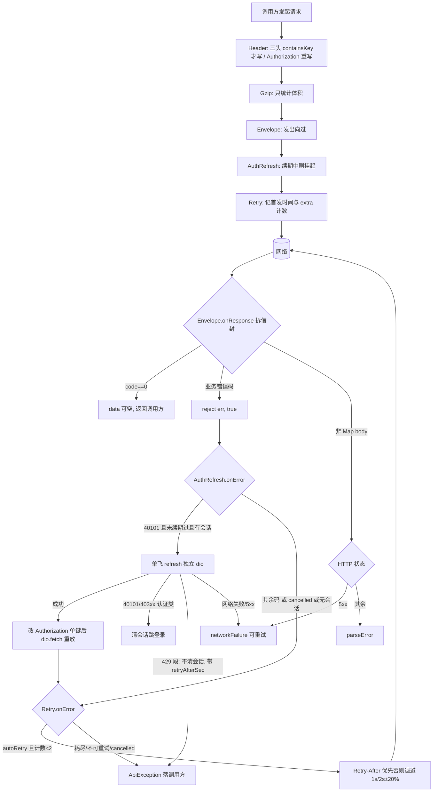
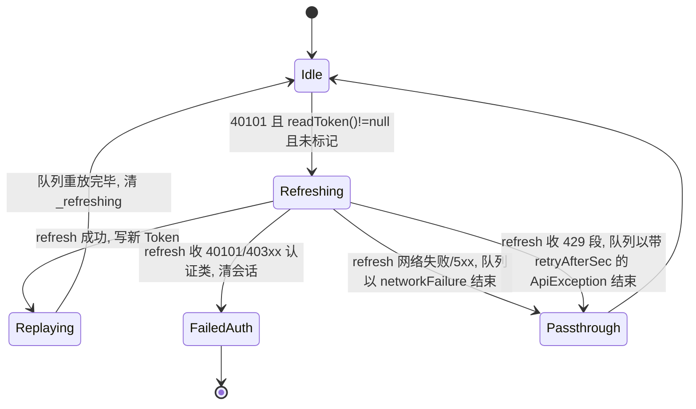

# lib/core 前端网络骨架 - Plan

**Target repo:** `s2s-wt-frontend`（分支 `item/123-frontend-core`，Batch1 条目 [123] 前半）。文中路径相对该仓根；「主仓工作区」指 `s2s` 主 checkout，其未提交批次是本计划的前置输入。

## Goal Capsule

- **Objective:** worktree 具备可编译、全测试覆盖的 `lib/core/network/` 网络底座，后续条目（auth 接线、Pin 缓存、埋点链）只写业务不接底座。
- **Means:** 先合入主仓未提交批次重建基线，再以 dio 5.11.1 五拦截器链落地（KTD2），内存 mock 先行验证协议形态。
- **Authority:** 冲突时依次以编码规范 `.trae/rules/s2s找呀找.md`、详设 §10–§14（主仓 `docs/design/前后端详细设计文档.md`）、本计划为准；本计划与依据源冲突先回写规范再编码。
- **Stop conditions:** 需要改动 features 域页面、需要预建 cache/track、dio 解析偏离 5.11.1 且无法钉住、U4 实测证伪 onError 按添加序执行（则停止并回 ce-plan 重设链序，KTD2/KTD3/KTD4 全部受影响）。
- **Execution profile:** 6 个实施单元 + 1 个门禁单元，执行序 U1 → U2 → U7 → U3 → U4 → U5 → U6，U1 是全部后续单元的前置。
- **Tail ownership:** gzip/执行序实测结论回写详设 §11.5/§11.1（U4）；refresh 失败三分口径同批回写三处依据源：详设 §13.1、契约 `docs/api/openapi.yaml` 全局纪律第 5 节、`docs/architecture/系统总体架构设计文档.md` 续期失败段（U5）；完成后更新 `说明文档.md` 进度。

---

## Product Contract

### Summary

在 worktree 建立条目 [123] 定案的 `lib/core/network/`：dio 封装、五拦截器链（Header → Gzip → Envelope → AuthRefresh → Retry，顺序定死）、`api_error_code` 错误码与行为映射、`api_exception` 统一异常形态。配套 `NfrNetwork` 常量、双轨测试（静态守门 + 内存 mock 行为轨）与反冗余静态扫描。内存 mock 先行，后端就绪后切真服务、断言一行不改。

### Problem Frame

worktree 基线 d26c570 落后于主仓一整个批次：无 dio 依赖、无常量真源 `lib/nfr_constants.dart`、无 `lib/core/api_exception.dart` 起步文件、无 `test/support/` 脚手架、无 `docs/api/openapi.yaml`。在旧基线上直接建 core 会在 main 已推翻的 §10.4 前地基上施工，且三件刚需（dio、`ApiException`、`MockApiServer`）全部缺席。主仓的 `ApiException` 形态（`ApiFailure` 枚举）与详设 §11.3 的构造形状（`code/message/requestId/retryAfterSec`）互相矛盾，且同一 `parseError` 语义有两份口径，合入前必须裁定唯一形态。

### Key Decisions

- **先合入主仓批次再建 core** (session-settled: user-directed — chosen over 复制文件进 worktree：复制会造双份真源，合并即冲突)。Governs R1。
- **骨架范围严格按 [123]，不预建 cache/track 占位** (session-settled: user-approved — chosen over 全骨架占位：占位类替后续条目定死目录与类名，属未评审资产被继承)。Governs Scope Boundaries。
- **内存 mock 先行，切真服务断言一行不改** (session-settled: user-approved — chosen over 一开始连真服务：后端未初始化，mock 可先行锁定协议形态)。Governs R9。

### Requirements

**基线与依赖**

- R1. worktree 合入主仓未提交批次：6+1 项依赖与 lock、`lib/nfr_constants.dart`、`lib/core/api_exception.dart`、§10.4 语义迁移（`lib/domain/`、`lib/features/`）、`test/support/` 与 `test/gates/`、`test/contract/` 脚手架、`docs/api/openapi.yaml`、`docs/design/`。
- R2. dio 精确钉版 `5.11.1`（去 caret，依赖旁注释写明 5.9.x/5.10.x 单飞与取消悬挂缺陷依据）；`pubspec.lock` 入库且解析结果守 5.11.1。

**错误模型**

- R3. `ApiErrorCode` = 24 服务端码 + `ok` + 本地负数码 `networkFailure(-1)` / `parseError(-2)`，与 `TestFixtures.allBusinessCodes` 双向相等（集合完整性，非子集）。
- R4. `ErrBehavior` 映射六值（`autoRetry`/`promptWithRetryAfter`/`silentRequeue`/`forceRefetch`/`deterministicFail`/`refreshToken`）；`40903` 为 `forceRefetch` 唯一码，禁止自动带新 version 重发；映射按 behavior 驱动，不为 `42906` 写特例分支。
- R5. `ApiException` 扩为 `{code, message, requestId?, retryAfterSec?}`，保留 `ApiException.parse` 兼容构造（内部映射 `code=parseError`，KTD1）；lib 侧 3 处既有调用点（`lib/domain/listing_category.dart`、`lib/features/discovery/discovery_filter.dart`）零改动编译通过，测试侧第 4 处消费方 `test/contract_mapping_test.dart` 随 U2 迁移断言；`ApiFailure` 枚举退役删除。`parseError` 的 message 只含截断后的类型/键名/枚举实际值（定长上限），不含原始 body 全文。

**拦截器链**

- R6. dio 实例挂载五拦截器，添加顺序 Header → Gzip → Envelope → AuthRefresh → Retry；`lib/features/` 禁止 `for` 循环重试（RetryInterceptor 为全局唯一重试点）。
- R7. HeaderInterceptor 在 onRequest 注入：`X-Interaction-Id`/`X-Device-Id`/`Idempotency-Key` 三头 containsKey 才写，`Authorization` 每次重写且未登录不注入；幂等键仅 POST/PATCH 注入；隐私同意前不注入 `X-Device-Id`（与未登录不注入 Authorization 同构，同意态经构造回调读取）。设备 ID 生成函数级注释按编码规范 §5.1 标注「不可信、可被重置」。
- R8. EnvelopeInterceptor：`validateStatus: (_) => true` 统一信封入口；先拆 `{code,message,data,request_id}` 再判 code；`data=null`、`request_id=null` 均非错误；`Retry-After` 按 `int.tryParse` 整数秒解析、失败回退默认退避；业务错误码 `reject(err, true)` 分流；非 Map body 按 HTTP 状态分流——5xx 映射 `networkFailure`（可重试），其余映射 `parseError`。
- R9. 全部网络层单测走双轨行为轨：`MockApiServer`（dart:io 真栈）+ 生产同款 dio 实例（经共享 harness 装配，U3），断言只打协议形态；mock 信封四字段 snake_case 保真、失败 `data` 恒 null、`Retry-After` 整数秒形态与契约逐字一致；429 与 401 fixture 分开造。mock/fixture 的测试凭据只允许存在于 `test/` 目录，G-Q2 扫描范围覆盖 `test/`。mock 轨断言范围声明：依赖服务端真实行为的安全断言（42907 未登录判定、Retry-After 真实值、限频维度不外泄）不在 mock 轨验收范围，验收记录按四态记 N/A，待切真服务后由契约守门复测。
- R10. AuthRefreshInterceptor 40101 单飞：并发 40101 只触发 1 次 refresh，其余挂起、续期后重放且两键逐字沿用；不解析 JWT exp；refresh 用独立 dio（仅挂 Header + Envelope 共享实例，KTD3）；重放前 extra 置已续期标记，再次 40101 直接失败；`readToken()==null` 时不触发单飞，直接透传 `ApiException(40101)`。refresh 失败三分：① 40101/403xx 认证类 → 清会话跳登录；② 429 段 → 不清会话，挂起请求以带 `retryAfterSec` 的 `ApiException` 落调用方（`promptWithRetryAfter`）；③ 网络失败/5xx → 不清会话，以 `networkFailure` 结束。refresh 成功后须 await `writeToken` 完成并校验会话代次未变（续期期间登出则丢弃 refresh 结果）再放行队列；cancelled 请求不触发续期，重放前逐项检查 `cancelToken?.isCancelled`。本口径对详设 §13.1 无条件清会话是有意偏离，U5 完成时同批回写三处依据源：详设 §13.1、`docs/api/openapi.yaml` 全局纪律第 5 节、`docs/architecture/系统总体架构设计文档.md` 续期失败段。
- R11. RetryInterceptor：全链路总重试 2 次，退避 1s/2s ±20% 抖动，`Retry-After` 整数秒优先；经 `dio.fetch(requestOptions)` 重走全链，extra 计数器防递归；cancelled 直接放过；可重试集合由 R4 行为表驱动。
- R12. 超时：连接 5s、读 10s、`/map/pins` 读 3s（按请求 Options 覆盖）；重试 2 次与退避参数同批进新增的 `NfrNetwork` 常量类，值从详设 §14.1 抄录并注章节号，常量类同步回写主仓常量真源与详设索引。
- R13. GzipInterceptor 默认不注入 `Accept-Encoding`，只承担体积统计（`content-length` 与解包后 JSON 长度）；编码第一天完成 gzip 行为与拦截器执行序两项实测，结论回写详设 §11.5 与 §11.1 图注。

**测试与门禁**

- R14. 网络层必测断言集全部落地为会失败的自动化（见各单元 Test Scenarios）：三头 containsKey、重试两键逐字同且 `uuid.v4()` 全链路只调 1 次（uuid 生成器可注入）、单飞三断言、码枚举全集对齐、`/map/pins` 3s。
- R15. 反冗余静态扫描随骨架同日上线并接入 CI（analyze → 守门测试 → 全量测试），覆盖：`lib/features/` 无 `for` 重试、`lib/` 无 `values.byName`；每条判据配变异自检——注入违规形态必 FAIL（漏报向），标准 UUID v4 字面量与注释行必不命中（误报向）；判据对象缺失是 FAIL 不是 SKIP。CI 守门步须消费 `test/gates/` 下全部既有判据（G-Q1/G-Q2/G-Q3 与契约守门），不只新增判据。
- R16. 拦截器日志只打 `path`/`code`/`rt_ms` 等元数据，禁打 headers/body/requestOptions 整体（编码规范 §4.11：日志不得出现 `Authorization` 头）；禁止为排障挂载 dio `LogInterceptor`（其默认打印请求头）。

### Scope Boundaries

- 本计划不做：features 域页面接线（登录/发布等，属 [123] 后半及后续条目）、`lib/core/cache/` 与 `lib/core/track/`（属 [126]/[130]）、Provider 链异步化（详设 §15，后续条目）、Token 持久化（读取端 seam 按将来可恢复设计，实现不在此）、TrackReporter 与 `42906` 消费方。
- 后端「数据模型预留」惯例不适用于前端 lib 目录：无真实数据迁移成本，故不预留占位。

### Deferred to Follow-Up Work

- gzip 实测结论若非「不注入」，GzipInterceptor 才补注入逻辑（U4 回写后另行定案）。
- `authSessionProvider` 当前为内存态；持久化恢复随 auth 条目接入同一 `readToken` seam。
- worktree 基线合并流程无历史学习沉淀，完成后走 ce-compound 补录。
- `auth_repository.dart` 的 `888888` 后门当前未做 `kDebugMode` 编译期包裹（存量缺口，编码规范 §5.9 第一层）：随 [123] 后半 auth 接线一并处置并过 G-Q1 登记册双向核对，本计划不扩大 diff 面。
- Token 持久化的落盘介质（shared_preferences 明文 vs 安全存储）未经安全评审：本计划只建 `readToken`/`writeToken` seam，介质选型随 auth 条目评审定案。

---

## Planning Contract

### Key Technical Decisions

- KTD1. **ApiErrorCode 吞并 ApiFailure**：`parseError(-2)` 吸收旧枚举唯一值；`ApiException` 扩四字段并保留 `parse` 兼容构造。依据：同一语义两份口径违反编码规范 §1.1；lib 侧 3 处调用点由兼容构造保零改动。Rejected：直接迁移全部调用点并删除兼容构造——§10.4 批次已冻结，本计划不扩大 diff 面。退役条件：auth 条目接线时迁移全部调用点并删除 `parse` 构造，届时回写规范。
- KTD2. **`validateStatus: (_) => true` + `reject(err, true)`**：所有 HTTP 状态走 onResponse 统一拆信封，避免 error 向补第二份信封解析；`reject` 第二参为 true 时错误才流向后续 error 拦截器（dio 5.x 语义），否则 40101 永远到不了 AuthRefresh。承重前提：onError 按添加序执行（Assumptions 第 2 条，U4 实测兜底）。
- KTD3. **单飞四件套**：共享 `Future? _refreshing`（判空→赋值→await→清空）；refresh 独立 dio 仅挂 Header + Envelope 共享拦截器实例（复用唯一实现处，测试的 uuid 计数器自然覆盖 refresh 链路）；重放前 extra 置已续期标记；refresh 成功后 **await `writeToken` 完成并校验会话代次未变**再放行挂起队列。排除 Retry 的真实理由：refresh 挂 Retry 会形成嵌套重试，放大详设 §14.1 的全链路 2 次预算；排除 AuthRefresh 才是防递归。dio 5.11.0 已修复共享失败 Future 的并发悬挂，故共享 Future 模式安全。
- KTD4. **重试经 `dio.fetch` 重走全链**：extra 计数器防递归是唯一可靠手段；副作用即收益——HeaderInterceptor 的 containsKey 语义使两键逐字不变、`uuid.v4()` 全链路只调 1 次的断言自然成立。重放只改 `Authorization` 单键，禁止整体替换 headers map。
- KTD5. **拦截器与 Riverpod 解耦**：core 只暴露接受 `readToken`/`writeToken`/`onSessionCleared`/`readSessionEpoch` 四回调的未接线 Provider/工厂——`readSessionEpoch` 读取会话代次（续期开始取样、`writeToken` 完成后比对，为 R10 代次校验与 U5 signOut-during-refresh 断言提供取值通道），主仓 `AuthSessionNotifier` 对应补一个单调递增的代次计数、signOut 时递增；焊接代码（watch `authSessionProvider` 并映射为四回调）落在 `lib/features/auth/` 或 main.dart 组装根以 override 注入——依赖方向保持 features → core 单向，`lib/core/` 不 import `lib/features/`。
- KTD6. **新增 `NfrNetwork` 常量类**：超时/重试/退避参数当前只存在于详设 §14.1 文字，按「不复制字面量」纪律入常量真源（`const NfrNetwork._()` + `static const`，逐常量注章节号），并回写主仓真源与详设索引，双端常量对齐由后续对照单测保证。
- KTD7. **dio 精确钉版 5.11.1**：`^5.9.0` 合法区间含单飞/取消/队列悬挂缺陷版本（5.9.1、5.10.0、5.11.0 各有相关修复），lock 当前解析 5.11.1 只是巧合，约束必须钉死。
- KTD8. **baseUrl 以 `--dart-define=API_BASE_URL` 为默认值、运行时注入缝覆盖**：`String.fromEnvironment` 编译期固化，拿不到 MockApiServer 运行时临时端口，故 api_client 配置（baseUrl 与 release 判定）经运行时注入缝读取——生产走 Provider 默认值（`fromEnvironment`），测试经 harness 构造参数或 Riverpod override 注入 mock 实际端口与模拟 release 态；release-https 快速失败守卫同样从注入配置读取，不直接引 `kReleaseMode`。仓库只留占位，满足「切真服务断言一行不改」。
- KTD9. **落点 `lib/core/network/`**（详设 §10.1）：`api_exception.dart` 从主仓 `lib/core/` 迁入该目录，`interceptors/` 子目录承载五拦截器。
- KTD10. **异常归一点与 cancel 例外**：`RetryInterceptor.onError` 入口是唯一的 `DioException`→`ApiException(networkFailure)` 归一点——它是链尾 error 拦截器，唯一能区分「重试中」与「重试耗尽」；无响应传输错误（连接/接收超时、connectionError）在此归一，其余拦截器不做映射。cancel 是显式例外：cancelled 请求以裸 `DioExceptionType.cancel` 穿透到调用方，不穿 `ApiException` 外衣；repository 层吞掉该异常但 `result=cancelled` 埋点照常上报（编码规范 §5.6）。

### High-Level Technical Design

五拦截器链的请求生命周期与错误分流：

单飞续期状态：

### Assumptions

- 设备 ID 惰性生成：首次被读取时才写入 shared_preferences；自生成 UUID 属应用私有随机数。隐私门不靠「首个请求必在同意之后」的时序假设兜底——R7 已强制同意态经构造回调读取、同意前不注入 `X-Device-Id`；生成逻辑与「不可信、可被重置」标注写入函数级注释（编码规范 §5.1）。
- dio 5.x 三个方向均按拦截器添加顺序执行（源码 `dio_mixin.dart` 已核）——此假设是 KTD2/KTD3/KTD4 的承重前提：任一方向证伪，Gzip 落点、`reject(err, true)` 分流、`dio.fetch` 重走全链全部失效，且失败模式可能不响亮（如 Envelope 在 error 向吞掉原始响应）；U4 实测必须三方向分别覆盖，不能只测被利用的方向。与详设 §11.1 时序图「返回向自下而上」的文字出入以实测为准，U4 同批回写图注。
- 拦截器统一 `extends Interceptor` / `QueuedInterceptorsWrapper`（5.11.1 修复了 `implements Interceptor` 的 `NoSuchMethodError`）。
- headers map 在到达 adapter 前大小写敏感：三头键名全工程统一字面量 `'X-Interaction-Id'`/`'X-Device-Id'`/`'Idempotency-Key'`。

### Risks & Dependencies

| 风险 | 影响 | 缓解 |
| --- | --- | --- |
| 主仓批次合入时与 worktree 旧基线冲突（§10.4 改了 domain/features 9+ 文件） | U1 阻塞 | U1 独立成单元，冲突解决完才放行后续 |
| lock 被重解析到 5.9.x/5.10.x | 单飞/取消悬挂，静默回归 | R2 钉版 + 守门断言 lock 解析值 |
| refresh 网络失败误清会话 | 弱网用户被踢下线 | R10 分流口径 + 必测断言（U5） |
| mock 信封形态失真 | 拆包断言测的是假象 | R9 保真边界写入测试约定 |
| `42907` 依赖登录态判定 | 未登录请求误判 | R7 未登录不注入 Authorization，行为表按码驱动无需特例 |
| 拦截器日志误打 Token/请求头 | 凭证泄露进日志落盘 | R16 元数据白名单 + U4/U5 日志字面量断言；禁 LogInterceptor |
| 设备 ID 早于隐私同意外发 | 隐私门形同虚设 | R7 同意态构造回调硬门；U3 断言同意前无 `X-Device-Id` 键 |
| refresh 写回竞态：续期期间登出，旧会话被 refresh 结果覆盖写回 | 已登出会话复活 | R10 await writeToken + 会话代次校验；U5 signOut-during-refresh 断言 |

---

## Implementation Units

### U1. 基线同步：主仓批次提交并合入 worktree

- **Goal:** worktree 具备 lib/core 工作的全部前置依赖，CI 三件套可跑。
- **Requirements:** R1, R2
- **Dependencies:** 无
- **Files:** `pubspec.yaml`、`pubspec.lock`、`lib/nfr_constants.dart`、`lib/domain/`（§10.4 批次）、`lib/features/`（§10.4 批次）、`test/support/`、`test/gates/`、`test/contract/`、`test/contract_mapping_test.dart`（ApiFailure 第 4 消费方，随批次合入，U2 迁移断言）、`docs/api/openapi.yaml`、`docs/design/`、`lib/core/api_exception.dart`（过渡态，U2 迁移）、`.github/workflows/ci.yml`（CI 三件套消费方）
- **Approach:**
  1. 主仓工作区将未提交批次按逻辑分组提交（依赖与常量 / 语义迁移 / 测试脚手架与文档）。
  2. `item/123-frontend-core` 合入该提交，解决与旧基线的冲突。
  3. dio 约束改为精确 `5.11.1`，依赖旁注释写明 5.9.x/5.10.x 悬挂缺陷依据；重新解析并核对 lock。
  4. 在 `说明文档.md` 记录 worktree 与主仓的基线差已消除。
- **Test scenarios:**
  - `flutter pub get` 成功且 lock 中 dio 版本 == 5.11.1。
  - 合入后既有测试全量跑绿（基线 303 例口径，只增不减）。
  - `test/gates/` 与 `test/contract/` 在 worktree 可运行（`assertRepoLayout` 不再因 `docs/api/openapi.yaml` 缺失抛 StateError）。
  - `.github/workflows/ci.yml` 在 worktree 存在且 analyze → 守门 → 全量三步定义齐全（CI 消费方有形，U7 只确认不新建）。
  - `test/contract_mapping_test.dart` 随批次合入后在其旧断言口径下跑绿（迁移前基线）。
- **Verification:** worktree `flutter analyze` 0 issue、全量测试绿、守门测试绿。

### U2. 常量与错误模型：NfrNetwork、ApiErrorCode、ApiException

- **Goal:** 网络层引用的常量与错误分类唯一化，且与契约 fixtures 机器对齐。
- **Requirements:** R3, R4, R5, R12
- **Dependencies:** U1
- **Files:** `lib/nfr_constants.dart`（新增 `NfrNetwork`）、`lib/core/network/api_error_code.dart`（新建）、`lib/core/network/api_exception.dart`（自 `lib/core/api_exception.dart` 迁移并扩展）、`test/core/api_error_code_test.dart`、`test/core/api_exception_test.dart`、`test/contract_mapping_test.dart`（迁移 `.failure` 断言至 `code` 字段）、主仓常量真源与详设索引（回写）
- **Approach:**
  1. `NfrNetwork` 按 KTD6 承载超时/重试/退避，逐常量注详设章节号。
  2. `ApiErrorCode` 按详设 §12.1 逐字枚举；`ErrBehavior` 映射表按码查 behavior（KTD 见 R4）。
  3. `ApiException` 按 KTD1 扩展并迁移落点（KTD9），旧文件删除。
  4. `test/contract_mapping_test.dart` 的 `.failure` 断言迁移为 `code` 字段断言（import 改新路径），作为 `ApiFailure` 退役的最后消费方收口。
- **Patterns to follow:** `lib/nfr_constants.dart` 既有常量类范式（`const X._();` + `static const` + 章节号注释）；`test/support/test_support.dart` 的 fixtures。
- **Test scenarios:**
  - 码枚举与 `TestFixtures.allBusinessCodes` 双向相等；无重复；`code/100 == httpStatus` 逐条成立。
  - 8 个 Retry-After 码（40105、42901–42907）行为为 `promptWithRetryAfter` 或其定案行为，且集合与 fixtures 一致。
  - 六值行为映射全覆盖：每码查表有且仅有一个 behavior；`40903` == `forceRefetch` 且为唯一；`42906` == `silentRequeue`；`40101` == `refreshToken`。
  - `ApiException.parse` 兼容构造产生 `code=parseError`，主仓 3 处调用点编译零改动。
  - 解析失败路径 message 含实际收到的值（详设 §10.3）。
- **Verification:** 新增测试全绿；`lib/core/api_exception.dart` 旧路径不存在；`grep ApiFailure` 零命中。

### U7. 反冗余静态扫描与 CI 接线

- **Goal:** 反冗余判据机器可判、失败可挡合并，随骨架同日上线。
- **Requirements:** R15
- **Dependencies:** U2（扫描目标存在）
- **Files:** `test/gates/anti_redundancy_gate_test.dart`（新建，或并入既有 quality_gate 结构，实现期定）、`.github/workflows/ci.yml`（接线确认）
- **Approach:**
  1. 判据抽纯函数并配变异自检（R15 双向）。
  2. 确认 CI 消费方：analyze → 守门测试 → 全量测试，新扫描失败会使作业变红；确认守门步消费 `test/gates/` 下全部既有判据（G-Q1/G-Q2/G-Q3 与契约守门），不只新增判据；答不出消费方视为未落地。
  3. 判据对象缺失按 FAIL 处理（不是 SKIP）。
- **Test scenarios:**
  - 注入一段 `for` 循环重试到临时 fixtures 目录 → 判据 FAIL；删除后恢复 PASS。
  - 含标准 UUID v4 字面量（幂等键正则形态）与注释行的合法文件 → 不误报。
  - `values.byName` 注入 → FAIL。
  - 扫描目录不存在 → FAIL（非 SKIP）。
  - G-Q1 后门登记册双向核对在 worktree 跑绿（`888888` 存量登记与源码一致）。
- **Verification:** 守门测试本地绿；CI 链路三步中守门步包含新判据。

### U3. api_client 与 Header/Envelope 拦截器

- **Goal:** dio 实例可发真实请求，请求头纪律与信封拆包可用。
- **Requirements:** R6, R7, R8, R9, R12（超时部分）
- **Dependencies:** U2
- **Files:** `lib/core/network/api_client.dart`、`lib/core/network/interceptors/header_interceptor.dart`、`lib/core/network/interceptors/envelope_interceptor.dart`、`lib/core/network/device_id_provider.dart`（或并入 api_client，实现期定）、`lib/features/auth/auth_network_wiring.dart`（KTD5 焊接点：watch `authSessionProvider` 映射四回调经 override 注入；或落 main.dart 组装根，实现期定）、`test/support/mock_api_server.dart`（扩展 raw bytes / content-type 覆盖 / gzip 响应能力）、`test/support/network_chain_harness.dart`（生产同款 dio + 五拦截器共享装配，429 与 401 fixture 分开造）、`test/core/network/header_interceptor_test.dart`、`test/core/network/envelope_interceptor_test.dart`、`test/core/network/api_client_test.dart`
- **Approach:**
  1. api_client 暴露 dio Provider（KTD5、KTD8），BaseOptions 全局超时引 `NfrNetwork`，`validateStatus: (_) => true`（KTD2）。
  2. HeaderInterceptor 按 R7；设备 ID 惰性生成（Assumptions）。
  3. EnvelopeInterceptor 按 R8，`request_id`/`message` 放 `response.extra` 透传 UI；非 Map body 分流理由（网关不过 Spring）写入 unwrap 函数级注释。
- **Patterns to follow:** `test/contract/api_contract_example_test.dart` 的 MockApiServer 接法（但走完整拦截器链，不裸连）；`test/support/api_envelope.dart` 匹配器。
- **Test scenarios:**
  - 已注入三头时拦截器不覆盖（containsKey 语义）；未注入时由方法参数透传值兜底写入。
  - 登录态变化后 `Authorization` 每次重写为新 Token；未登录请求头中无 `Authorization` 键（非空串）。
  - GET 请求无 `Idempotency-Key`；POST/PATCH 有。
  - 信封 `code==0` 且 `data=null`、`request_id=null` 正常返回不视为错误。
  - 业务错误码经 `reject(err, true)` 后能在调用方 catch 到带 `requestId`/`retryAfterSec` 的 `ApiException`。
  - `Retry-After: abc`（非整数）回退默认退避参数，不抛异常。
  - mock 返 HTML 502 → `ApiException(networkFailure)` 且 message 含 HTTP 状态码；mock 返非信封 200 → `ApiException(parseError)`。
  - `/map/pins` 以 Options 覆盖读超时 3s，其余请求读 10s、连接 5s（mock 延迟响应触发超时断言）。
  - 隐私同意前发出的请求头中无 `X-Device-Id` 键；同意态回调返回 true 后注入（两态各断言一次）。
  - `parseError` 的 message 只含截断后的类型/键名/枚举实际值：mock 返超大非信封 body，断言 message 不含 body 全文且长度不超定长上限（R5）。
  - release 判定为 true（经运行时注入缝模拟）且 baseUrl 非 https → 启动快速失败；判定为 false 时注入 http mock 地址不受此限（KTD8 注入缝两态各断言一次）。
- **Verification:** 新测试全绿；信封形态断言与 `api_envelope.dart` 匹配器口径一致。

### U4. GzipInterceptor 与第一天双实测

- **Goal:** 体积统计就位；gzip 行为与拦截器执行序两个「第一天实测项」出结论并回写真源。
- **Requirements:** R13, R16
- **Dependencies:** U3
- **Files:** `lib/core/network/interceptors/gzip_interceptor.dart`、`test/core/network/gzip_interceptor_test.dart`、详设 §11.5 与 §11.1（主仓，回写）
- **Approach:**
  1. GzipInterceptor 实现为只统计（`content-length` 响应头 + 解包后 JSON 长度），预留注入开关默认关。
  2. 实测一：不注入看 `content-encoding` 与 `data` 运行时类型；注入再看 —— 结论回写 §11.5。
  3. 实测二：mock server + 日志断言五拦截器三方向实际执行序 —— 结论回写 §11.1 图注。
- **Test scenarios:**
  - 默认配置下请求头无手工 `Accept-Encoding`；gzip 响应体被正确解压为 Map（dart:io `autoUncompress` 行为实证）。
  - 体积统计值可从响应 extra 读取，缺 `content-length` 时降级不抛异常。
  - 执行序实测日志只含 `path`/`code`/`rt_ms` 元数据：全量日志输出 grep 无 `Authorization` 与 Token 字面量（R16）。
- **Verification:** 两处详设回写完成；测试全绿。本单元 Done 判据含「结论落在详设」而非任务备注。

### U5. AuthRefreshInterceptor 单飞续期

- **Goal:** 40101 单飞续期全分支可用。
- **Requirements:** R9, R10, R16
- **Dependencies:** U3
- **Files:** `lib/core/network/interceptors/auth_refresh_interceptor.dart`、`test/core/network/auth_refresh_interceptor_test.dart`、详设 §13.1 / `docs/api/openapi.yaml` 全局纪律第 5 节 / `docs/architecture/系统总体架构设计文档.md` 续期失败段（均主仓，回写）
- **Approach:** 按 KTD3、KTD4、R10；refresh 请求走独立 dio（Header + Envelope）；失败分流（40101/403xx 认证类清会话 / 429 段不清 / 网络失败/5xx 不清）按 R10 口径写函数级注释。
- **Test scenarios:**
  - 单飞三断言：并发 5 请求同收 40101，refresh 实际调用 == 1；重放请求 `Idempotency-Key` 与 `X-Interaction-Id` 逐字沿用首发值。
  - 重放请求仅 `Authorization` 键变化，其余头逐字不变。
  - 再次 40101（已置续期标记）直接失败，不二次 refresh。
  - refresh 收 40101/403xx 认证类 → 会话清除回调被调、队列请求以 40101 结束。
  - refresh 连接超时/5xx → 会话清除回调未被调，队列请求以 `networkFailure` 结束。
  - `readToken()` 为 null 时 40101 不触发 refresh，原样透传。
  - 挂起期间取消的请求：refresh 仍成功完成，该请求收 `DioExceptionType.cancel`，其余正常重放，不误判 refresh 失败。
  - cancelled 错误到达本拦截器直接放过，不触发续期。
  - refresh 成功但写回期间会话已登出（代次变更）：refresh 结果丢弃不写回，队列以 40101 结束。
  - `writeToken` 延迟完成（受控 Future）：挂起队列在写回完成前不放行，无并发重放抢跑。
  - refresh 收 42901（带 `Retry-After`）：不清会话，挂起请求以带 `retryAfterSec` 的 `ApiException` 落调用方（R10 失败三分第②类）。
  - refresh 全链路日志 grep 无新旧 Token 字面量（R16）。
- **Verification:** 上述断言全绿；不解析 JWT exp（grep 无 exp 解析）；三处依据源回写完成且口径同 R10（本单元 Done 判据含「结论落在依据源」）。

### U6. RetryInterceptor 全局唯一重试

- **Goal:** 全链路重试唯一收口，参数与保全机制达标。
- **Requirements:** R6, R9, R11, R14
- **Dependencies:** U5
- **Files:** `lib/core/network/interceptors/retry_interceptor.dart`、`test/core/network/retry_interceptor_test.dart`
- **Approach:** 按 KTD4；退避表与抖动引 `NfrNetwork`；可重试集合查 R4 行为表（`autoRetry` 才重试）；uuid 生成器经构造注入（断言全链路调用次数用）。
- **Test scenarios:**
  - mock 前两次 500 后成功：总请求 3 次（首发 + 2 重试），成功返回；两键逐字相同；`uuid.v4()` 全链路只调 1 次。
  - 持续 500：总共 3 次后以 `ApiException(networkFailure)` 落调用方。
  - 响应带 `Retry-After: 2` 时重试间隔取 2s 优先于退避表（注入时钟/假定时器断言）。
  - 42901/42902/42907 不自动重试，直接落调用方。
  - 40903 不自动重试、不自动带新 version 重发。
  - cancelled 直接放过，不计入重试计数。
  - 退避 jitter 在 ±20% 区间内（注入随机源断言分布边界）。
- **Verification:** 断言全绿；`lib/features/` 静态扫描无 `for` 重试（门禁已于 U7 提前就位）。

---

## Verification Contract

| 验证项 | 口径 | 适用 |
| --- | --- | --- |
| 静态分析 | `flutter analyze` 0 issue | 每单元 |
| 全量单测 | `flutter test` 全绿，基线 303 例只增不减 | 每单元 |
| 守门测试 | `flutter test test/gates/` 全绿（含新增反冗余判据） | U1 起 |
| 契约示范测试 | `flutter test test/contract/` 全绿 | U1 起 |
| 网络层必测断言 | R14 全集逐条对应到具体测试用例 | U2–U6 |
| CI 链路 | analyze → 守门 → 全量三步全绿，新判据失败可挡合并 | U7 |
| 详设回写 | §11.5 gzip 结论、§11.1 执行序图注、§13.1 refresh 失败三分口径（含契约全局纪律第 5 节与架构文档续期段同批）、常量索引含 `NfrNetwork` | U2、U4、U5 |
| 文档进度 | `说明文档.md` 标记 [123] 网络层部分完成与结果说明 | 全部完成后 |

## Definition of Done

- 全局：R1–R16 全部满足；Verification Contract 逐项通过；`说明文档.md` 进度已更新。
- U1：worktree 与主仓基线差消除，lock 守 dio 5.11.1，全量测试绿。
- U2：错误模型唯一化，`ApiFailure` 零命中，码枚举与 fixtures 双向相等。
- U3–U6：各单元 Test Scenarios 全绿，五拦截器链按定死顺序挂载。
- U7：新判据接入 CI 且变异自检双向通过。
- 清理：迁移残留（旧 `lib/core/api_exception.dart`）、实验中放弃的 mock 写法、调试日志一律删除，不留在 diff 中。

---

## Appendix

### Sources / Research

- 详设 §10–§14、§19、§21（主仓 `docs/design/前后端详细设计文档.md`）：五拦截器逐字口径、错误码枚举、必测断言清单、缺口 #6。
- dio 5.11.1 官方文档与源码（Context7 + GitHub cfug/dio）：拦截器 FIFO 三方向、`reject(err, true)` 语义、`dio.fetch` 全链重走、5.9.1/5.10.0/5.11.0 悬挂修复、HttpClient `autoUncompress` 默认解压。
- `docs/solutions/workflow-issues/`（主仓）：spec-to-failing-gate-tests（双轨测试与例外通道）、gate-exit-code-needs-a-consumer（CI 消费方）、verification-code-fails-silently-as-pass（变异自检与第三态）、phase-boundary-verification-scaffolding（不预建占位的越界三问）、test-data-fidelity（mock 保真边界）、gap-register-triage（缺口回写唯一口径源）。
- 既有脚手架：`test/support/mock_api_server.dart`（dart:io 真栈、received 请求列表）、`test/support/test_support.dart`（25 码全集、幂等键 fixtures）、`test/contract/api_contract_example_test.dart`（双轨示范形态）。
