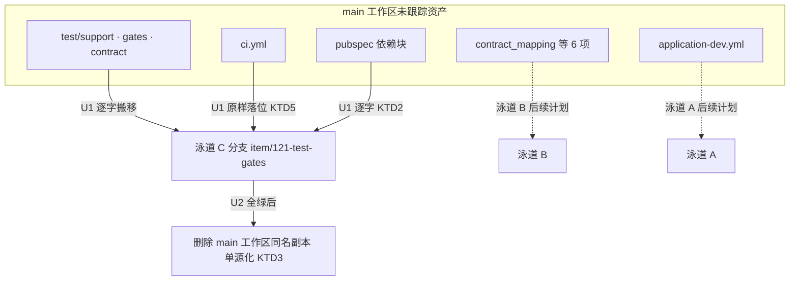
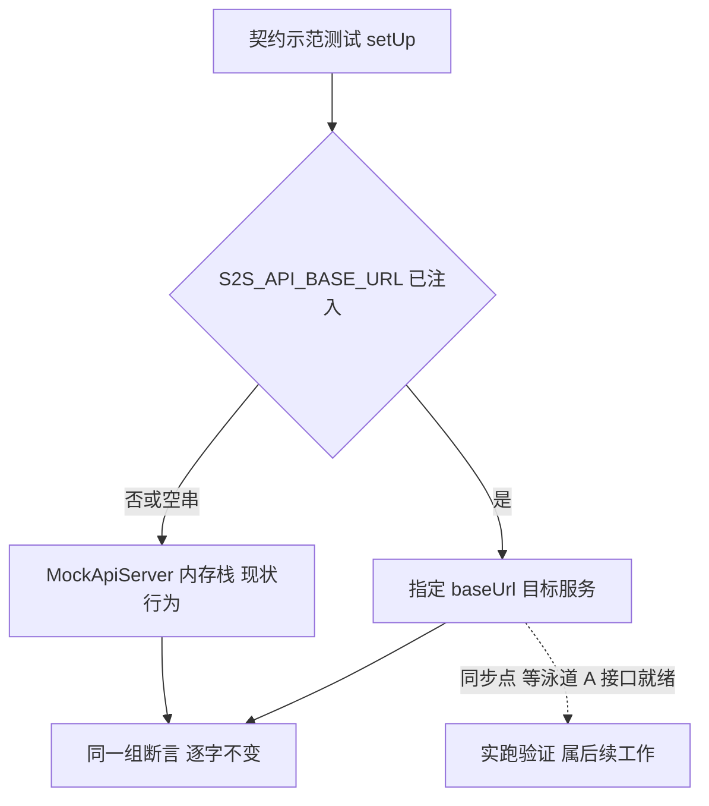

# [121] 测试骨架落位与单源化 - Plan

## Goal Capsule

- **Objective:** 泳道 C 分支 `item/121-test-gates` 承载全部测试骨架资产（test/support、test/gates、test/contract、CI workflow、pubspec 依赖），门禁在分支上可运行且全绿，资产在仓内单源存在，契约示范测试具备不切断言即可指向真服务的开关。
- **Means:** 分支先 FF 合并 main 吸收设计基线，再把 main 工作区的未跟踪资产逐字搬移入库（KTD1、KTD2）。
- **Authority:** `.trae/rules/s2s找呀找.md`（编码规范 v1.1）> `docs/architecture/完成定义DoD.md` > `docs/architecture/分支与版本标记规范.md` §1.3a > 本计划 > `docs/solutions/` 学习沉淀。
- **Stop conditions:** worktree 内 `docs/api/openapi.yaml` 与 main 基线内容不一致；`flutter test` 出现根因在被搬移资产本身的失败；泳道 B 对 pubspec 提出与本计划冲突的并发变更。
- **Execution profile:** solo 串行，U1 → U2 → U3 → U4，泳道内无并行。
- **Tail ownership:** 本计划不含合并回 main；验收后按分支规范 `--no-ff` 并回，属后续动作。

---

## Product Contract

### Summary

把滞留在 main 工作区的测试骨架资产（支撑层 5 文件、质量门禁 10 项、契约守门 14 项、契约示范测试 4 项、CI workflow、pubspec 依赖声明）落位到泳道 C 分支并验证全绿，随后删除 main 工作区副本完成单源化，并给契约示范测试加 baseUrl 环境开关以满足 DoD B5「切真服务断言一行不改」。

### Problem Frame

三个泳道 worktree 从 `d26c570` 检出，而 openapi.yaml、全部 Batch1 设计文档与测试骨架滞留 main 工作区未入库，泳道 C 的契约守门缺判据对象，按「判据对象缺失必须 FAIL」口径会整组 FAIL。方案 A 已把设计基线提交进 main（`dc548c9`），但测试骨架资产仍未入库、仍只在 main 工作区存在，存在双向漂移与误删风险。

### Key Decisions

- KD1. **设计基线一次性入库 main，三泳道共享判据对象**（session-settled: user-directed — chosen over 泳道各自拷贝判据对象: 判据对象单源化避免契约漂移）。Governs R1, R2。
- KD2. **滞留资产按泳道职责切分归属**（session-settled: user-directed — chosen over 全部由泳道 C 接管: 归属与泳道边界对齐，B 泳道资产不被本计划沾染）。Governs R1, R3, R6。

### Requirements

**资产落位**

- R1. test/support（5 文件）、test/gates（2 文件）、test/contract（1 文件）在分支 `item/121-test-gates` 入库，相对路径与 main 工作区现状一致（per KD1, KD2）。
- R2. `.github/workflows/ci.yml` 在分支入库，三道代码面判据顺序不变（analyze → gates → 全量 test），头部 Trial 注释保留（per KD1）。
- R3. `pubspec.yaml`/`pubspec.lock` 入库，六项运行时依赖与 yaml dev 依赖声明与 main 工作区逐字一致（per KD2）。

**验证与切换**

- R4. 分支上 `flutter analyze` 0 issue、`flutter test` 全绿，含 24 项门禁与 4 项契约示范；worktree 全量总数为 main 基线 303 扣除泳道 B 滞留项后的实测值，以 U2 实测为准并登记，合并回 main 后恢复全量、只增不减。
- R5. `test/contract/api_contract_example_test.dart` 支持 `--dart-define=S2S_API_BASE_URL=...` 指定目标服务；不传或传空串时行为与现状完全一致。

**单源与登记**

- R6. 分支验证全绿后删除 main 工作区同名未跟踪副本，并以 `git restore -- pubspec.yaml pubspec.lock` 还原 main 工作区已跟踪修改，资产仅存在于分支（per KD2）。
- R7. `说明文档.md` 登记泳道 C 资产归属、同步点协议、测试数基线变化与 CI Trial 状态。

### Acceptance Examples

- AE1. 环境开关双模
  - **Covers:** R5
  - **Given** 不传 `S2S_API_BASE_URL`，**When** 运行契约示范测试，**Then** 走 MockApiServer 且 4 项断言全绿。
  - **Given** 传入 `S2S_API_BASE_URL`，**When** 运行同一测试文件，**Then** 请求发往该 baseUrl 且全部断言逐字不变。

### Success Criteria

- 泳道 B 后续合并 pubspec 时无需人工冲突解决（KTD2 生效的直接证据）。
- 同一判据对象下，门禁在 worktree 与 main 工作区给出同一结论（U2 删除前对照跑测验证）。

### Scope Boundaries

**Deferred to Follow-Up Work**

- 契约测试指向真服务的实跑验证（同步点：等泳道 A 接口就绪，届时仅传 `S2S_API_BASE_URL`，断言零改动）。
- CI 启用观察（仓库推送远端后 Trial 转正式）。
- 分支验收与 `--no-ff` 合并回 main。

**Outside This Plan**

- Java/后端测试：阶段边界，泳道 C 不写 Java 测试。
- `test/contract_mapping_test.dart` 与 5 个改动既有测试：归泳道 B（per KD2）。
- `application-dev.yml`：归泳道 A（per KD2）。
- `lib/` 下全部资产：归泳道 B（per KD2）。

---

## Planning Contract

### Key Technical Decisions

- KTD1. **分支先 FF 合并 main 再落位资产**（session-settled: user-directed — chosen over 泳道 C 单独入库判据对象: 判据对象单源化避免契约漂移，per KD1 governs R1, R2）。分支无自有提交（已核实在 `d26c570`），`git merge main` 为快进，基线文件随之进入 worktree 供门禁判据，历史保持线性。
- KTD2. **pubspec 逐字搬移，不手工重写依赖声明**。从 main 工作区原样拷贝 R3 六依赖块与 yaml dev 依赖，使泳道 B 后续合并自动消解。
- KTD3. **验证全绿后才删除 main 工作区副本**。删除是不可逆步骤，必须以分支全绿为前置；窗口期 main 工作区测试数回落属预期（搬出 28 项：门禁 24 + 契约示范 4），实测值登记。
- KTD4. **baseUrl 开关用编译期注入，缺省走 mock**。现状 setUp 硬编码 MockApiServer，无开关；加 `S2S_API_BASE_URL` dart-define 读取（空串按未传处理），断言与桩登记逐字不动，满足 DoD B5。
- KTD5. **CI 原样落位并标 Trial**。部署门禁 G1–G11 依规范不进 CI（由发版机 `deploy.sh` 消费退出码），CI 只承载三道代码面判据；仓库未推远端，无消费者，先标 Trial。
- KTD6. **判据自检组样例字符串拼接化（逐字搬移唯一例外）**。`quality_gate_test.dart` 入库后 G-Q2 以 `git ls-files` 扫描会自命中自检组 5 行 32 位 hex 样例而 FAIL；入库前将其改为相邻字符串拼接破坏连续 hex 形态，判据行为不变（评审 P0 裁决：用户选定方案 a）。

### High-Level Technical Design

以下为方向性示意，非实现约束。

资产流向与泳道切分：

baseUrl 开关双模：

### Assumptions

- Flutter 3.41.9 / Dart 3.11.5 在 worktree 环境可用，与 CI 锁版一致。
- main 工作区被搬移文件在 U1 执行前不被其他改动沾染；如有改动以最新内容为准并复核门禁断言。

### Sequencing

U1 → U2 → U3 → U4 严格串行。U2 的删除动作依赖 U1 落位且全绿；U3 修改的文件必须是单源后的唯一副本，故排在 U2 之后；U4 登记的事实以 U1–U3 结果为准。

---

## Implementation Units

### U1. 基线吸收与资产落位

- **Goal:** 分支吸收 main 设计基线，泳道 C 全部资产入库。
- **Requirements:** R1, R2, R3（per KD1, KD2, KTD1, KTD2, KTD5, KTD6）
- **Files:** `test/support/`（repo_paths、test_support、openapi_loader、api_envelope、mock_api_server 共 5 文件）、`test/gates/`（quality_gate_test、openapi_contract_gate_test 共 2 文件）、`test/contract/api_contract_example_test.dart`、`.github/workflows/ci.yml`、`pubspec.yaml`、`pubspec.lock`
- **Approach:** 在泳道 C worktree 执行 `git merge main`（FF）→ 从 main 工作区逐字复制上述资产（UTF-8 无 BOM 保持）→ 按 KTD6 拼接化 `quality_gate_test.dart` 自检组样例（本单元唯一非逐字改动）→ `flutter pub get` → Conventional Commits 提交（`test:` 前缀）。
- **Test Scenarios:**
  - 合并为 FF 成功（`git log` 顶端与 main 当时顶端一致），`docs/api/openapi.yaml` 与 main 基线逐字一致。
  - `flutter pub get` 退出码 0，无版本解析失败。
  - 复制后文件相对路径与 G-Q1 登记册引用路径一致；逐字节比对 main 工作区原件无差异（KTD2；`quality_gate_test.dart` 按 KTD6 例外，差异仅限自检组样例行）。
- **Verification:** `flutter pub get` 成功；文件清单与字节比对留证。

### U2. 全绿验证与 main 副本删除

- **Goal:** 分支门禁全绿，随后删除 main 工作区同名副本完成单源化。
- **Requirements:** R4, R6（per KTD3）
- **Files:** 分支侧无新增；删除 main 工作区 `test/support/`、`test/gates/`、`test/contract/`、`.github/workflows/ci.yml` 的未跟踪副本；`git restore -- pubspec.yaml pubspec.lock` 还原已跟踪修改。
- **Approach:** 在泳道 C worktree 依次跑 analyze、gates、contract、全量 test；四条全绿后，先在 main 工作区对照跑一次 gates 与 contract，结论与分支一致再执行删除与 pubspec 还原；任一失败即停，副本保留（防丢唯一副本）。
- **Test Scenarios:**
  - `flutter analyze` 输出 0 issue。
  - `flutter test test/gates/` 24 项全绿（质量门禁 10 + 契约守门 14），无 FAIL/SKIP。
  - G-Q2 在入库态（`git ls-files` 已含 `test/gates/` 两文件）下通过，自检组样例不再自命中（KTD6 生效证据）。
  - `flutter test test/contract/` 4 项全绿。
  - `flutter test` 全量全绿；总数以实测为准并登记（预期为 main 基线 303 扣除泳道 B 滞留项）。
  - 边界：G-Q1 双向核对在 worktree 路径下通过（`_debugCode`、prototype 登记对象已在位，调研已核实）。
  - 错误路径：任一命令非绿 → 中止，不执行删除，记录失败输出。
- **Verification:** 四条命令输出留证；main 对照跑测结论与分支一致留证；删除与还原后 main 工作区 `git status` 无同名未跟踪项且 pubspec 两文件无修改。

### U3. 契约示范测试 baseUrl 环境开关

- **Goal:** 契约测试不切断言即可指向真服务。
- **Requirements:** R5（per KTD4, AE1）
- **Files:** `test/contract/api_contract_example_test.dart`
- **Approach:** setUp 读取 `S2S_API_BASE_URL` 编译期注入，非空时直指该 baseUrl，否则构造 MockApiServer；断言、桩登记、匹配器逐字不动；函数级注释按规范补齐「为什么」。
- **Test Scenarios:**
  - 不传 define：`flutter test test/contract/` 4 项全绿（回归现状，AE1 第一支）。
  - 传空串 define：行为与不传一致（回退 mock）。
  - 传 define 指向一次性本地探针：探针观察到请求到达，证明已离开 mock（AE1 第二支的开关生效证据；真服务实跑属同步点，见 Scope）。
- **Verification:** 无 define 与空串两条命令全绿；探针观察记录留证；探针脚本不入库。

### U4. 同步点协议与说明文档登记

- **Goal:** 把泳道切分结果与同步点协议写入 `说明文档.md`。
- **Requirements:** R7（per KD2）
- **Files:** `说明文档.md`
- **Approach:** 追加进度记录段，登记四项事实：泳道 C 资产清单与归属（含归 B/A 的部分）；同步点协议——跑测须等泳道 A 接口就绪，届时契约测试仅以 `S2S_API_BASE_URL` 指真服务、断言零改动；窗口期 main 工作区测试数实测值（预期回落 28 项）、合并回 main 后恢复全量、基线只增不减；CI Trial 状态与启用条件。
- **Test expectation:** none -- 纯文档登记，无可执行行为。
- **Verification:** 登记段落内容与分支实际状态逐项核对一致。

---

## Verification Contract

| 门禁 | 命令（泳道 C worktree 内） | 证明 | 单元 |
| --- | --- | --- | --- |
| 静态分析 | `flutter analyze` | 0 issue | U1–U3 |
| 质量与契约守门 | `flutter test test/gates/` | 入库态下 G-Q1/G-Q2/G-Q3 10 项 + 契约守门 14 项全绿（KTD6 生效）| U2 |
| 契约示范 | `flutter test test/contract/` | 4 项全绿，缺省走 mock | U2, U3 |
| 开关空串回退 | `flutter test test/contract/ --dart-define=S2S_API_BASE_URL=` | 空串回退 mock，4 项全绿 | U3 |
| 全量回归 | `flutter test` | worktree 全量全绿，总数实测登记、只增不减 | U2, U3 |

---

## Definition of Done

**全局**

- Verification Contract 五门禁全绿且输出留证。
- 资产单源：main 工作区无同名未跟踪副本且 pubspec 两文件已还原，泳道 C worktree `git status` 干净。
- `说明文档.md` 完成 U4 登记，内容与分支状态一致。
- Conventional Commits；无探针脚本、调试代码等废弃残留入库。

**按单元**

- U1：FF 完成、资产入库、pub get 成功、字节比对无差异（KTD6 例外行除外）。
- U2：四命令全绿；main 对照跑测结论一致；main 副本删除且 pubspec 还原；失败中止路径未触发或已如实记录。
- U3：AE1 两支验证留证；断言 diff 仅限 setUp 开关。
- U4：登记段落与分支状态逐项一致。

---

## Appendix

### Sources & Research

- 规范依据：`.trae/rules/s2s找呀找.md` §7（测试与质量门禁）、`docs/architecture/完成定义DoD.md`（B5 baseUrl 切换）、`docs/architecture/分支与版本标记规范.md` §1.3a（三泳道模型与同步点）。
- 学习沉淀：`docs/solutions/workflow-issues/spec-to-failing-gate-tests-with-self-proving-exemptions.md`（双轨测试、判据对象缺失必须 FAIL、自证豁免）、`docs/solutions/workflow-issues/phase-boundary-verification-scaffolding.md`（泳道 C 不写 Java 测试的边界依据）。
- 资产现状（main 工作区未跟踪，调研已逐一读验）：test/support 5 文件（`assertRepoLayout` 缺失即 FAIL、`TestFixtures` 25 业务码表与非法幂等键样例、`OpenApiSpec.load()`、`MockApiServer` 契约示范测试的运行时依赖，barrel `test_support.dart` 第 14 行导出）、test/gates 2 文件（10 + 14 项）、test/contract 1 文件（4 项，setUp 硬编码 mock 为 KTD4 直接依据）、`.github/workflows/ci.yml`（三道判据、Flutter 3.41.9 锁版、Trial 注释）。
- 外部调研：未执行。判据对象与规范全部在仓内可直接核实，本地证据充分。
